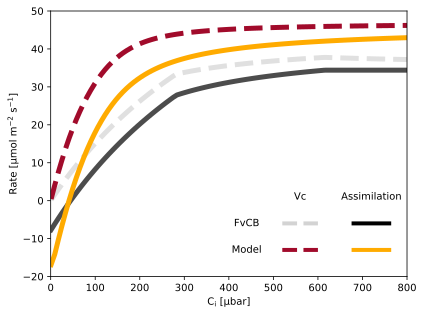
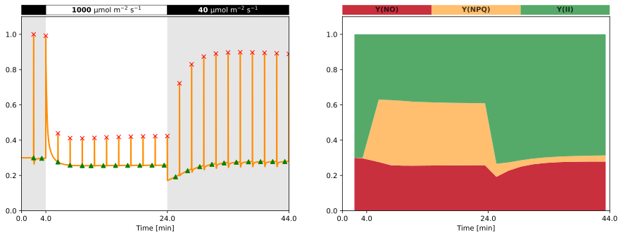

saadat2021 Report Summary
=========================

# Simulations

## Carbon Assimilation via FvCB

Comparison of modelled carbon assimilation ($A$) and carboxylation rate ($v_\mathrm{c}$) against the Farquhar, von Caemmerer and Berry (FvCB) model. The FvCB model is calculated using the min-W approach as described by Lochoki and McGrath (2025) [[1]](https://doi.org/10.1101/2025.03.11.642611). To be able to simulate carbon assimilation, there are two mandatory parameters that need to be present in the model: CO2 concentration and Vc. If one of these parameters is missing, the FvCB model will still be shown, but no comparison with the model will be possible. Other parameters that are required to calculate the FvCB model will be added as parameters with default values if they are not present in the model. The table below summarizes which parameters were found in the model. The carbon assimilation shown does not represent actual values but rather a theoretical curve to compare the kinetic model to the popular FvCB model.
### Assumptions

- Infinite mesophyll conductance, therefore intercellular CO2 partial pressure equals chloroplast partial pressure ($\mathrm{C_i} = \mathrm{C_c}$)
- If no CO2 concentration nor rate of rubisco carboxylation ($v_\mathrm{c}$) is present in the model, no comparison will be shown
- If no $\mathrm{C_i}$ is present in the model, it will be added as a parameter assuming an initial value of CO2 concentration divided by Henry's law constant for CO2 ($H_\mathrm{s}^{cp}$)
- If no $H_\mathrm{s}^{cp}$ is present in the model, it will be added as a parameter with a value of $3.4 \times 10^{-4}\ \mathrm{mmol\ Pa^ {-1}}$ [[2]](https://doi.org/10.5194/acp-23-10901-2023)
- If no CO2 compensation point in the absence of non-photorespiratory CO2 release ($\Gamma ^*$) is present in the model, it will be added as a parameter with a value of $38.6\ \mathrm{\mu bar}$ [[1]](https://doi.org/10.1101/2025.03.11.642611)
- If no $R_\mathrm{light}$ is present in the model, it will be added as a parameter with a value of $1\ \mathrm{\mu mol\ m^{-2}\ s^{-1}}$ [[1]](https://doi.org/10.1101/2025.03.11.642611)
- If no $A$ is present in the model, it will be added as a derived variable following the FvCB equation [[1]](https://doi.org/10.1101/2025.03.11.642611): $v_\mathrm{c} \cdot \left(1 - \frac{\Gamma ^*}{C_i}\right) - R_\mathrm{light}$
- To be able to compare with original FvCB curves, the model needs to have $v_\mathrm{c}$ following the same units as the FvCB model ($\mathrm{\mu mol\ m^{-2}\ s^{-1}}$). The `mM_to_µmol_per_m2` can be used to convert from mM to $\mathrm{\mu mol\ m^{-2}}$ assuming a volume factor of $0.0112\ \mathrm{L\ m^{-2}}$ in the stroma [[3]](https://doi.org/10.1007/s11120-006-9109-1). If the given units are in mM, the conversion will be done automatically, by adding a derived parameter with the converted values.

|Parameter|Exists?|
| :---: | :---: |
|$\mathrm{CO}_2$|&check;|
|$v_\mathrm{c}$|&check;|
|$\mathrm{C_i}$|&#10060;|
|$H_\mathrm{s}^{cp}$|&#10060;|
|$\Gamma ^*$|&#10060;|
|$R_\mathrm{light}$|&#10060;|
|A|&#10060;|

## PAM Fluorescence

Simulation of a PAM flourescence protocol. The simulation is first run for 30 minutes in a dark adapted state (PPFD = 40) and then the PAM protocol starts. Each period consists of 2 minutes of light and then a saturating pulse of 0.8 seconds. The first two periods are in low light (PPFD = 40), followed by 10 periods in actinic light (PPFD = 1000) and then 10 periods in low light again (PPFD = 40). The left plot shows the normalised flourescence yield (orange) with the identified Fm peaks (crosses) and the calculated NPQ (blue). The right plot shows the quantum yields of non-regulated energy loss (Y(NO), red), regulated heat dissipation (Y(NPQ), orange) and photochemical energy conversion (Y(II), green), but only during the light phase. All results here are arbituary by using the proposed initial conditions of the model and using the Flourescence readout calculated through the model. Therefore, the values do not represent actual values but rather a qualitative behaviour of the model. The table below summarizes which parameters were found in the model.

## Day Simulation
