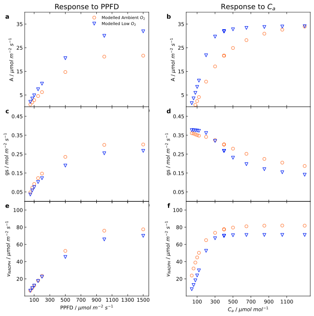

# Bellasio2019


[Bellasio2019](https://doi.org/10.1007/s11120-018-0601-1)

                     
## Installation


All the files needed to run this model are located in [model](./model) folder. To use this model you only need to copy this folder and write the following to import the model in your Python script:

```python
from model import Bellasio2019
```

The packages required to run this model can either be installed by using the `pixi` environment located inside the [pyproject.toml](../pyproject.toml) file or by just installing the `mxlpy` package and all its dependencies.
                     
## Summary

### Compounds

#### Part of ODE system

|Name|Common Abbr.|Paper Abbr.|KEGG ID|Python Var|
| :---: | :---: | :---: | :---: | :---: |
|Carbon Dioxide|$\left[\mathrm{CO_2}\right]$|$\left[\mathrm{CO_2}\right]$|C00011|CO2|
|Bicarbonate|$\left[\mathrm{HCO_3^-}\right]$|$\left[\mathrm{HCO_3^-}\right]$||HCO3|
|Ribulose 1,5-bisphosphate|$\mathrm{RUBP}$|$\left[\mathrm{RuBP}\right]$|C01182|RUBP|
|3-phosphoglyceric acid|$\mathrm{PGA}$|$\left[\mathrm{PGA}\right]$|C00197|PGA|
|Dihydroxyacetone phosphate|$\mathrm{DHAP}$|$\left[\mathrm{DHAP}\right]$|C00111|DHAP|
|Stromal ATP concentration|$\mathrm{ATP_{st}}$|$\left[\mathrm{ATP}\right]$|C00002|ATP_st|
|Stromal NADPH concentration|$\mathrm{NADPH}_\mathrm{st}$|$\left[\mathrm{NADPH}\right]$|C00005|NADPH_st|
|Ribulose 5-phosphate|$\mathrm{RU5P}$|$\left[\mathrm{RuP}\right]$|C00199|RU5P|
|RuBisCO activation state|$R_{\mathrm{act}}$|$R_{\mathrm{act}}$|EC 4.1.1.39|Ract|
|Total NADPH production|$J_\mathrm{NADPH}$|$J_\mathrm{NADPH}$||J_NADPH|
|Total ATP production|$J_\mathrm{ATP}$|$J_\mathrm{ATP}$||J_ATP|
|Intercellular $\mathrm{CO_2}$ concentration|$C_\mathrm{i}$|$C_\mathrm{i}$||Ci|
|Stomatal conductance of water vapour to the atmosphere|$g_\mathrm{S}$|$g_\mathrm{S}$||gs|


<details>
<summary>ODE System</summary>

```math 
\frac{\mathrm{d}R_{\mathrm{act}}}{\mathrm{d}t} = v_{R_\mathrm{act}}
```
```math 
\frac{\mathrm{d}J_\mathrm{NADPH}}{\mathrm{d}t} = v_{J_\mathrm{NADPH}}
```
```math 
\frac{\mathrm{d}J_\mathrm{ATP}}{\mathrm{d}t} = v_{J_\mathrm{ATP}}
```
```math 
\frac{\mathrm{d}g_\mathrm{S}}{\mathrm{d}t} = v_{g_\mathrm{S}}
```
```math 
\frac{\mathrm{d}\left[\mathrm{CO_2}\right]}{\mathrm{d}t} = \frac{-1.0}{V_\mathrm{M}} \cdot v_{\mathrm{RuBisCO|Carboxylase}} + \frac{0.5}{V_\mathrm{M}} \cdot v_{\mathrm{GDC}} + \frac{-1.0}{V_\mathrm{M}} \cdot v_{\mathrm{CAase}} + \frac{1.0}{V_\mathrm{M}} \cdot R_\mathrm{light} + \frac{1.0}{V_\mathrm{M}} \cdot v_{\mathrm{CO_{2|diss}}}
```
```math 
\frac{\mathrm{d}\mathrm{RUBP}}{\mathrm{d}t} = \frac{-1.0}{V_\mathrm{M}} \cdot v_{\mathrm{RuBisCO|Carboxylase}} + \frac{-1.0}{V_\mathrm{M}} \cdot v_{\mathrm{RuBisCO|Oxy}} + \frac{1.0}{V_\mathrm{M}} \cdot v_{\mathrm{PRKase}}
```
```math 
\frac{\mathrm{d}\mathrm{PGA}}{\mathrm{d}t} = \frac{2.0}{V_\mathrm{M}} \cdot v_{\mathrm{RuBisCO|Carboxylase}} + \frac{0.5}{V_\mathrm{M}} \cdot v_{\mathrm{GDC}} - \left( \frac{1}{3} \right) \frac{1}{V_\mathrm{M}} \cdot R_\mathrm{light} + \frac{1.0}{V_\mathrm{M}} \cdot v_{\mathrm{RuBisCO|Oxy}} + \frac{-1.0}{V_\mathrm{M}} \cdot v_{\mathrm{PGAreduc}}
```
```math 
\frac{\mathrm{d}\mathrm{ATP_{st}}}{\mathrm{d}t} = \frac{-1.0}{V_\mathrm{M}} \cdot v_{\mathrm{RuBisCO|Oxy}} + \frac{-1.0}{V_\mathrm{M}} \cdot v_{\mathrm{PRKase}} + \frac{-1.0}{V_\mathrm{M}} \cdot v_{\mathrm{PGAreduc}} + \frac{-0.5}{V_\mathrm{M}} \cdot v_{\mathrm{carbsyn}} + \frac{1.0}{V_\mathrm{M}} \cdot v_{\mathrm{ATPsynthase}}
```
```math 
\frac{\mathrm{d}\mathrm{NADPH}_\mathrm{st}}{\mathrm{d}t} = \frac{-0.5}{V_\mathrm{M}} \cdot v_{\mathrm{RuBisCO|Oxy}} + \frac{-1.0}{V_\mathrm{M}} \cdot v_{\mathrm{PGAreduc}} + \frac{1.0}{V_\mathrm{M}} \cdot v_{\mathrm{FNR}}
```
```math 
\frac{\mathrm{d}\mathrm{DHAP}}{\mathrm{d}t} = - \left( \frac{5}{3} \right) \frac{1}{V_\mathrm{M}} \cdot v_{\mathrm{PRKase}} + \frac{1.0}{V_\mathrm{M}} \cdot v_{\mathrm{PGAreduc}} + \frac{-1.0}{V_\mathrm{M}} \cdot v_{\mathrm{carbsyn}}
```
```math 
\frac{\mathrm{d}\mathrm{RU5P}}{\mathrm{d}t} = \frac{-1.0}{V_\mathrm{M}} \cdot v_{\mathrm{PRKase}} + \frac{1.0}{V_\mathrm{M}} \cdot v_{\mathrm{rpp}}
```
```math 
\frac{\mathrm{d}\left[\mathrm{HCO_3^-}\right]}{\mathrm{d}t} = \frac{1.0}{V_\mathrm{M}} \cdot v_{\mathrm{CAase}}
```
```math 
\frac{\mathrm{d}C_\mathrm{i}}{\mathrm{d}t} = - v_{\mathrm{CO_{2|diss}}} + v_{\mathrm{CO_{2|stomdiff}}}
```

</details>
                     
#### Conserved quantities

|Name|Common Abbr.|Paper Abbr.|KEGG ID|Python Var|
| :---: | :---: | :---: | :---: | :---: |
|Stromal ADP concentration|$\mathrm{ADP_{st}}$|$\mathrm{ADP}$|C00008|ADP_st|
|Stromal NADP concentration|$\mathrm{NADP}_\mathrm{st}$|$\mathrm{NADP}$|C00006|NADP_st|
|Stromal concentration of orthophosphate|$\mathrm{P}_\mathrm{i,\ st}$|$\mathrm{P_i}$|C00009|Pi_st|
|Efficiency of PSII|$\Phi \mathrm{PSII}$|$Y\mathrm{(II)}$||PhiPSII|
|$\mathrm{CO}_2$ assimilation|$A$|$A$||A|
|Oxygen Concentration|$\mathrm{O_2}$|$O_2$||O2|


<details>
<summary> Calculations </summary>

```math
\mathrm{ADP_{st}} =  AP_\mathrm{Tot} - \mathrm{ATP_{st}}
```
```math
\mathrm{NADP}_\mathrm{st} =  \mathrm{NAD_{Tot}} - \mathrm{NADPH}_\mathrm{st}
```
```math
\mathrm{P}_\mathrm{i,\ st} =  \mathrm{P_i} - \mathrm{PGA} - \mathrm{DHAP} - \mathrm{RU5P} - 2 \mathrm{RUBP} - \mathrm{ATP_{st}}
```
```math
\Phi \mathrm{PSII} =  \Phi (\mathrm{II})_0 \cdot \frac{v_{\mathrm{ATPsynthase}}}{J_\mathrm{ATP}} \frac{v_{\mathrm{FNR}}}{J_\mathrm{NADPH}} \cdot \left( 1 - \mathrm{max} \left( 0, \mathrm{non\_rect\_hyperbole} \left( \mathrm{PPFD}, \alpha_\mathrm{PPFD|\Phi (\mathrm{II})}, V_\mathrm{0|PPFD|\Phi (\mathrm{II})}, \theta_\mathrm{PPFD|\Phi (\mathrm{II})} \right) \right) \right)
```
```math
A =  v_{\mathrm{RuBisCO|Carboxylase}} - 0.5 v_{\mathrm{RuBisCO|Oxy}} - R_\mathrm{light}
```
```math
\mathrm{O_2} =  \frac{p(\mathrm{O_2})}{K_\mathrm{h|O_2}}
```

</details>

                     
### Parameters

|Short Description|Common Abbr.|Paper Abbr.|Value|Unit|Python Var|Reference|
| :---: | :---: | :---: | :---: | :---: | :---: | :---: |
|Total adenylates|$AP_\mathrm{Tot}$|$A_\mathrm{Tot}$|$1.5$|$\mathrm{mM}$|AP_tot|Wang et al. 2014|
|Total inorganic phosphorus|$\mathrm{P_i}$|$[P_\mathrm{i}]$|$15$|$\mathrm{mM}$|Pi_tot|Lilley et al. 1977|
|$\mathrm{O_2}$ partial pressure (gas)|$p(\mathrm{O_2})$|$\mathrm{p\ O_2}$|$210000$|$\mathrm{\mu bar}$|p_o2||
|$\mathrm{O_2}$ volatility|$K_\mathrm{h\|O_2}$|$K_\mathrm{h}\ \mathrm{O_2}|$833300$|$\mathrm{\mu bar mM^{-1}}$|Kh_o2|Warneck and Williams 2012|
|Mesophyll volume per $\mathrm{m^2}$ of leaf|$V_\mathrm{M}$|Volume M|$0.03$|$dm^3\ m^{-2}$|V_m||
|Incident radiation|$\mathrm{PPFD}$|$I_\mathrm{inc}$|$1500$|$\mathrm{\mu\ mol\ m^{-2}\ s^{-1}}$|PPFD||
|Respiration in the light|$R_\mathrm{light}$|$R_\mathrm{LIGHT}$|$0.001$|$\mathrm{\mu\ mol\ m^{-2}\ s^{-1}}$|RLight||
|Lumped energy conversion coefficient|$s_\mathrm{ener}$|$s$|$0.43$|$\mathrm{electrons\ quanta^{-1}}$|s|Bellasio et al. 2016|
|Yield of PSII extrapolate under zero PPFD|$\Phi (\mathrm{II})_0$|$Y(II)_\mathrm{LL}$|$0.72$||PhiPSII_LL|Bellasio et al. 2016|
|Yield of PSI extrapolate under zero PPFD|$\Phi (\mathrm{I})_0$|$Y(I)_\mathrm{LL}$|$1$|$\mathrm{electrons\ quanta^{-1}}$|PhiPSI_LL|Yin et al. 2004|
|Initial slope of PPFD hyperbola in regard of $\Phi (\mathrm{II})$|$\alpha_\mathrm{PPFD\|\Phi (\mathrm{II})}$|$\alpha_{Y(II)}$|$0.00125$||alpha_ppfd_PhiPSII||
|Y-intercept of PPFD hyperbola in regard of $\Phi (\mathrm{II})$|$V_\mathrm{0\|PPFD\|\Phi (\mathrm{II})}$|$V_{0Y(II)}$|$-0.8$||V0_ppfd_PhiPSII||
|Curvature of PPFD hyperbola in regard of $\Phi (\mathrm{II})$|$\theta_\mathrm{PPFD\|\Phi (\mathrm{II})}$|$\theta_{Y(II)}$|$0.7$||theta_ppfd_PhiPSII||
|Fraction of electron flow used by nitrate assimilation|$f_\mathrm{PseudocycNR}$|$f_\mathrm{PSEUDO\ NR}$|$0.01$||f_pseudocycNR||
|Fraction of electron flow through the Q-cycle|$f_\mathrm{Q}$|$f_\mathrm{Q}$|$1$||fq|Yin et al. 2004|
|Fraction of electron flow through the NDH complex|$f_\mathrm{NDH}$|$f_\mathrm{NDH}$|$0$||f_ndh|Yamori and Shikanai 2016|
|Number of protons per ATP|$h$|$h$|$4$|$\mathrm{protons ATP^{-1}}$|h|Yin and Struik 2012|
|Atmospheric $\amthrm{CO_2}$ concentration|$C_\mathrm{a}$|$C_\mathrm{a}$|$400$|$\mathrm{\mu bar}$|Ca||
|Initial slope of PPFD hyperbola in regard of RuBisCO|$\alpha_\mathrm{PPFD\|RuBisCO}$|$\alpha_\mathrm{V}$|$0.0018$||alpha_ppfd_rub||
|Y-intercept of PPFD hyperbola in regard of RuBisCO|$V_\mathrm{0\|PPFD\|RuBisCO}$|$V_{0}$|$0.16$||V0_ppfd_rub||
|Curvature of PPFD hyperbola in regard of RuBisCO|$\theta_\mathrm{PPFD\|RuBisCO}$|$\theta_\mathrm{V}$|$0.95$||theta_ppfd_rub||
|Initial slope of $\mathrm{CO_2}$ hyperbola in regard of RuBisCO|$\alpha_\mathrm{CO_2\|RuBisCO}$|$\alpha_\mathrm{C}$|$400$||alpha_co2||
|Y-intercept of $\mathrm{CO_2}$ hyperbola in regard of RuBisCO|$V_\mathrm{0\|CO_2\|RuBisCO}$|$V_{0C}$|$-0.2$||V0_co2||
|Curvature of $\mathrm{CO_2}$ hyperbola in regard of RuBisCO|$\theta_\mathrm{CO_2\|RuBisCO}$|$\theta_\mathrm{C}$|$0.98$||theta_co2||
|Time constant for RuBisCO induction|$\tau_{\mathrm{i}\|R_\mathrm{act}}$|$\tau_\mathrm{i}$|$360$|$\mathrm{s}$|tau_i|Seemann et al. 1988|
|Time constant for RuBisCO deactivation|$\tau_{\mathrm{d}\|R_\mathrm{act}}$|$\tau_\mathrm{d}$|$1200$|$\mathrm{s}$|tau_d|Seemann et al. 1988|
|Michealis-Menten constant for $\mathrm{CO_2}$ in RuBisCO carboxylase|$K_\mathrm{m\|RuBisCO\|CO_2}$|$K_\mathrm{C}$|$0.014$|$\mathrm{mM}$|km_v_RuBisCO_c_CO2|von Caemmerer 2000|
|Michealis-Menten constant for RUBP in RuBisCO carboxylase|$K_\mathrm{m\|RuBisCO\|RUBP}$|$K_\mathrm{m}\ \mathrm{RuBP}$|$0.02$|$\mathrm{mM}$|km_v_RuBisCO_c_RUBP|Zhu et al. 2007|
|Michealis-Menten constant for $\mathrm{O_2}$ in RuBisCO carboxylase|$K_\mathrm{m\|RuBisCO\|O_2}$|$K_\mathrm{O}$|$0.222$|$\mathrm{mM}$|km_v_RuBisCO_c_O2|Zhu et al. 2007|
|Inhibition constant for PGA in RuBisCO carboxylase|$K_\mathrm{i\|RuBisCO\|PGA}$|$K_\mathrm{i}\ \mathrm{PGA}$|$2.52$|$\mathrm{mM}$|ki_v_RuBisCO_c_PGA|Zhu et al. 2007|
|Inhibition constant for NADP in RuBisCO carboxylase|$K_\mathrm{i\|RuBisCO\|NADP}$|$K_\mathrm{i}\ \mathrm{NADP}$|$0.21$|$\mathrm{mM}$|ki_v_RuBisCO_c_NADP_st|Zhu et al. 2007|
|Inhibition constant for ADP in RuBisCO carboxylase|$K_\mathrm{i\|RuBisCO\|ADP}$|$K_\mathrm{i}\ \mathrm{ADP}$|$0.2$|$\mathrm{mM}$|ki_v_RuBisCO_c_ADP_st|Zhu et al. 2007|
|Inhibition constant for Pi in RuBisCO carboxylase|$K_\mathrm{i\|RuBisCO\|ADP}$|$K_\mathrm{i}\ \mathrm{P_i}$|$3.6$|$\mathrm{mM}$|ki_v_RuBisCO_c_Pi_st|Zhu et al. 2007|
|Maximum rate of RuBisCO carboxylation|$V_\mathrm{max\|RuBisCO}$|$V_\mathrm{cmax}$|$0.2$|$\mathrm{mmol\ m^{-2}\ s^{-1}}$|vmax_v_RuBisCO_c||
|Turnover per S1L1|$k_\mathrm{cat\|RuBisCO}$|Cat n°|$4.7$|$\mathrm{s^{-1}}$|kcat_v_RuBisCO_c|Zhu et al. 2007|
|Specificity in the gas phase|$S_\mathrm{C\|O}$|$S_\mathrm{C/O}$|$2200$||S_co_gas|Bellasio et al. 2016|
|Maximum rate of PRKase|$V_\mathrm{max\|PRKase}$|$V_\mathrm{max}\ \mathrm{RuP_{Phosp}}$|$1.17$|$\mathrm{mmol\ m^{-2}\ s^{-1}}$|vmax_v_PRKase|Zhu et al. 2007|
|Equilibirum constant in PRKase|$K_\mathrm{eq\|PRKase}$|$K_\mathrm{e}\ \mathrm{RuP_{Phosp}}$|$6846$|$\mathrm{mM}$|keq_v_PRKase|Zhu et al. 2007|
|Michealis-Menten constant for ATP in PRKase|$K_\mathrm{m\|PRKase\|ATP}$|$K_\mathrm{m}\ \mathrm{ATP}$|$0.625$|$\mathrm{mM}$|km_v_PRKase_ATP_st|Zhu et al. 2007|
|Inhibition constant for ADP in PRKase|$K_\mathrm{i\|PRKase\|ADP}$|$K_\mathrm{i}\ \mathrm{ADP}$|$0.1$|$\mathrm{mM}$|ki_v_PRKase_ADP_st|Zhu et al. 2007|
|Michealis-Menten constant for RU5P in PRKase|$K_\mathrm{m\|PRKase\|RU5P}$|$K_\mathrm{m}\ \mathrm{RuP}$|$0.034$|$\mathrm{mM}$|km_v_PRKase_RU5P|Gardemann et al. 1983|
|Inhibition constant for PGA in PRKase|$K_\mathrm{i\|PRKase\|PGA}$|$K_\mathrm{i}\ \mathrm{PGA}$|$2$|$\mathrm{mM}$|ki_v_PRKase_PGA|Zhu et al. 2007|
|Inhibition constant for RUBP in PRKase|$K_\mathrm{i\|PRKase\|RUBP}$|$K_\mathrm{i}\ \mathrm{RuBP}$|$0.7$|$\mathrm{mM}$|ki_v_PRKase_RUBP|Zhu et al. 2007|
|Inhibition constant for Pi in PRKase|$K_\mathrm{i\|PRKase\|Pi}$|$K_\mathrm{i}\ \mathrm{P_i}$|$4$|$\mathrm{mM}$|ki_v_PRKase_Pi_st|Zhu et al. 2007|
|Maximum rate of PGA reduction|$V_\mathrm{max\|PGAreduc}$|$V_\mathrm{max}\ \mathrm{PR}$|$0.4$|$\mathrm{mmol\ m^{-2}\ s^{-1}}$|vmax_v_pgareduction||
|Michealis-Menten constant for ATP in PGA reduction|$K_\mathrm{m\|PGAreduc\|ATP}$|$K_\mathrm{m}\ \mathrm{ATP}$|$0.3$|$\mathrm{mM}$|km_v_pgareduction_ATP_st|Zhu et al. 2007|
|Michealis-Menten constant for PGA in PGA reduction|$K_\mathrm{m\|PGAreduc\|PGA}$|$K_\mathrm{m}\ \mathrm{PGA}$|$10$|$\mathrm{mM}$|km_v_pgareduction_PGA||
|Michealis-Menten constant for NADPH in PGA reduction|$K_\mathrm{m\|PGAreduc\|NADPH}$|$K_\mathrm{m}\ \mathrm{NADPH}$|$0.05$|$\mathrm{mM}$|km_v_pgareduction_NADPH_st|Zhu et al. 2007|
|Inhibition constant for ADP in PGA reduction|$K_\mathrm{i\|PGAreduc\|ADP}$|$K_\mathrm{i}\ \mathrm{ADP}$|$0.89$|$\mathrm{mM}$|ki_v_pgareduction_ADP_st||
|Maximum rate of Carbohydrate Synthesis|$V_\mathrm{max\|carbsyn}$|$V_\mathrm{max}\ \mathrm{CA}$|$0.2235$|$\mathrm{mmol\ m^{-2}\ s^{-1}}$|vmax_v_carbohydrate_synthesis|Zhu et al. 2007|
|Equilibirum constant in Carbohydrate Synthesis|$K_\mathrm{eq\|carbsyn}$|$K_\mathrm{e}\ \mathrm{CA}$|$0.8$||keq_v_carbohydrate_synthesis|Zhu et al. 2007|
|Michealis-Menten constant for DHAP in Carbohydrate Synthesis|$K_\mathrm{m\|carbsyn\|DHAP}$|$K_\mathrm{m}\ \mathrm{DHAP}$|$22$|$\mathrm{mM}$|km_v_carbohydrate_synthesis_DHAP|Zhu et al. 2007|
|Inhibition constant for ADP in Carbohydrate Synthesis|$K_\mathrm{i\|carbsyn\|ADP}$|$K_\mathrm{i}\ \mathrm{ADP}$|$1$|$\mathrm{mM}$|ki_v_carbohydrate_synthesis_ADP_st|Zhu et al. 2007|
|Maximum rate of reductive pentose phosphate pathway|$V_\mathrm{max\|rpp}$|$V_\mathrm{max}\ \mathrm{RPP}$|$0.0585$|$\mathrm{mmol\ m^{-2}\ s^{-1}}$|vmax_v_rpp|Zhu et al. 2007|
|Equilibirum constant in reductive pentose phosphate pathway|$K_\mathrm{eq\|rpp}$|$K_\mathrm{e}\ \mathrm{RPP}$|$0.06$||keq_v_rpp||
|Michealis-Menten constant for DHAP in reductive pentose phosphate pathway|$K_\mathrm{m\|rpp\|DHAP}$|$K_\mathrm{m}\ \mathrm{DHAP}$|$0.5$|$\mathrm{mM}$|km_v_rpp_DHAP||
|Concentration of Protons|$H^+$|$[H^+]$|$5.012e-05$|$\mathrm{mM}$|H||
|Maximum rate of carbonic anhydrase|$V_\mathrm{max\|CAase}$|$V_\mathrm{max}\ \mathrm{CA}$|$200$|$\mathrm{mmol\ m^{-2}\ s^{-1}}$|vmax_v_co2_hydration|Zhu et al. 2007|
|Equilibirum constant in carbonic anhydrase|$K_\mathrm{eq\|CAase}$|$K_\mathrm{e}\ \mathrm{CA}$|$0.00056$||keq_v_co2_hydration|Zhu et al. 2007|
|Michealis-Menten constant for $\mathrm{CO_2}$ in carbonic anhydrase|$K_\mathrm{m\|CAase\|CO_2}$|$K_\mathrm{m}\ \mathrm{CO_2}$|$2.8$|$\mathrm{mM}$|km_v_co2_hydration_CO2|Zhu et al. 2007|
|Michealis-Menten constant for $\mathrm{HCO_3}$ in carbonic anhydrase|$K_\mathrm{m\|CAase\|HCO_3}$|$K_\mathrm{m}\ \mathrm{HCO_3}$|$34$|$\mathrm{mM}$|km_v_co2_hydration_HCO3|Zhu et al. 2007|
|Equilibirum constant in FNRase|$K_\mathrm{eq\|FNRase}$|$K_\mathrm{e}\ \mathrm{NADPH}$|$502$||keq_v_FNR|Santamarina et al. 2002|
|Michealis-Menten constant for NADP in FNRase|$K_\mathrm{m\|FNRase\|NADP}$|$K_\mathrm{m}\ \mathrm{NADP}$|$0.0072$|$\mathrm{mM}$|km_v_FNR_NADP_st|Santamarina et al. 2002|
|Michealis-Menten constant for NADPH in FNRase|$K_\mathrm{m\|FNRase\|NADPH}$|$K_\mathrm{m}\ \mathrm{NADPH}$|$0.036$|$\mathrm{mM}$|km_v_FNR_NADPH_st|Santamarina et al. 2002|
|Time constant for induction of FNRase|$K_\mathrm{J\|FNRase\|NADPH}$|$K_\mathrm{J}\ \mathrm{NADPH}$|$200$|$\mathrm{s}$|Kj_NADPH|Bellasio et al. 2017|
|Equilibirum constant in ATPsynthase|$K_\mathrm{eq\|ATPsynthase}$|$K_\mathrm{e}$|$5734$||keq_v_ATPsynth|Santamarina et al. 2002|
|Michealis-Menten constant for ADP in ATPsynthase|$K_\mathrm{m\|ATPsynthase\|ADP}$|$K_\mathrm{m}\ \mathrm{ADP}$|$0.014$|$\mathrm{mM}$|km_v_ATPsynth_ADP_st|Santamarina et al. 2002|
|Michealis-Menten constant for Pi in ATPsynthase|$K_\mathrm{m\|ATPsynthase\|Pi}$|$K_\mathrm{m}\ \mathrm{P_i}$|$0.3$|$\mathrm{mM}$|km_v_ATPsynth_Pi_st|Santamarina et al. 2002|
|Michealis-Menten constant for ATP in ATPsynthase|$K_\mathrm{m\|ATPsynthase\|ATP}$|$K_\mathrm{m}\ \mathrm{ATP}$|$0.3$|$\mathrm{mM}$|km_v_ATPsynth_ATP_st|Santamarina et al. 2002|
|Time constant for induction of ATPsynthase|$K_\mathrm{J\|ATPsynthase\|ATP}$|$K_\mathrm{J}\ \mathrm{ATP}$|$200$|$\mathrm{s}$|Kj_ATP|Bellasio et al. 2017|
|Mesophyll conductance to $\mathrm{CO_2}$|$g_\mathrm{M}$|$g_\mathrm{M}$|$0.5$|$\mathrm{mol\ m^{-2}\ s^{-1}$|gm|Flexas et al. 2008|
|$\mathrm{CO_2}$ volatility|$K_\mathrm{h\|CO_2}$|$K_\mathrm{h}\ \mathrm{CO_2}|$30303.0303030303$|$\mathrm{\mu bar mM^{-1}}$|Kh_co2|van der Heijden et al. 2015|
|Time constant for decrease in $g_\mathrm{S}$|$K_{\mathrm{d}\|g_\mathrm{S}}$|$K_\mathrm{d}$|$150$|$\mathrm{s}$|Kd|McAusland et al. 2016|
|Time constant for increase in $g_\mathrm{S}$|$K_{\mathrm{i}\|g_\mathrm{S}}$|$K_\mathrm{i}$|$900$|$\mathrm{s}$|Ki|McAusland et al. 2016|
|Value of $\tau$ in the dark|$\tau_0$|$\tau_0$|$-0.1$|$\mathrm{mM}$|tau0||
|Turgor to conductance factor|$\chi \beta$|$\chi \beta$|$0.5$|$\mathrm{mol air MPa^{-1}}$|chi_beta||
|Soil water potential|$\Phi_\mathrm{soil}$|$\Phi_\mathrm{soil}$|$0$|$\mathrm{MPa}$|phi||
|Epidermal osmotic pressure|$\pi _\mathrm{e}$|$\pi _\mathrm{e}$|$1.2$|$\mathrm{MPa}$|pi_e|Bellasio et al. 2017|
|Root to leaf hydraulic conductance|$K_\mathrm{h}$|$K_\mathrm{h}$|$12$|$\mathrm{mmol\ water\ m^{-2}\ s^{-1}\ Mpa^{-1}}$|Kh|Bellasio et al. 2017|
|Leaf-to-boundary layer $\mathrm{H_2O}$ mole fraction gradient|$D_\mathrm{S}$|$D_\mathrm{S}$|$10$||Ds||
|Basal stomatal conductance|$g_\mathrm{s0}$|$g_\mathrm{s0}$|$0.01$|$\mathrm{mol\ m^{-2}\ s^{-1}}$|gs0|Buckley et al. 2003|
|Total NAD|$\mathrm{NAD_{Tot}}$|$NAD_\mathrm{Tot}$|$0.5$|$\mathrm{mM}$|NADP_tot|Wang et al. 2014|

#### Derived Parameters

|Short Description|Common Abbr.|Paper Abbr.|Python Var|
| :---: | :---: | :---: | :---: |
|Total concentration of RuBisCO catalytic sites|$E_\mathrm{RuBisCO\|Total}$|$E_\mathrm{T}$|Et|
|Light absorbed by PSII when $f_\mathrm{Cyc} = 0$|$I_\mathrm{2\|0}$|$I_\mathrm{2,0}$|I2_0|
|Light absorbed by PSI when $f_\mathrm{Cyc} = 0$|$I_\mathrm{1\|0}$|$I_\mathrm{1,0}$|I1_0|
|Michealis-Menten constant for RuBP in RuBisCO carboxylation|$K_{\mathrm{m\|RuBisCO\|RuBP}}^\'$|$K_{\mathrm{m\ RuBP}}^\'$|km_v_RuBisCO_c_RUBP_extra|
|Function that relatives RuBP concentration to concentration of RuBisCO active sites|$f\left(\mathrm{RUBP}\right)$|$f\left(\mathrm{RuBP}\right)$|f_rubp|
|Steady state value of the RuBisCO activation state ($R_\mathrm{act}$)|$R_\mathrm{act\|steady}$|$R_\mathrm{act\ eq}$|Ract_eq|
|Quantity that reduces PSI when the cyclic electron flow is engaged|$\chi$|$\chi$|chi|
|Light absorbed by PSI|$I_1$|$I_1$|I1|
|Proportion of electron flow at PSI which follows CEF|$f_\mathrm{Cyc}$|$f_\mathrm{Cyc}$|f_cyc|
|Light absorbed by PSII|$I_2$|$I_2$|I2|
|Electron flow through PSII|$J_2$|$J_2$|J2|
|Electron flow through PSI|$J_1$|$J_1$|J1|
|Fraction of $J_1$ used by alternative electron sinks|$f_\mathrm{Pseudocyc}$|$f_\mathrm{Pseudocyc}$|f_pseudocyc|
|Steady state value of the total NADPH production|$J_\mathrm{NADPH\|steady}$|$J_\mathrm{NADPH}$|J_NADPH_steady|
|Steady state value of the total ATP production|$J_\mathrm{ATP\|steady}$|$J_\mathrm{ATP}$|J_ATP_steady|
|Steady state value of the stomatal conductance of water vapour to the atmosphere|$g_\mathrm{S\|steady}$|$g_\mathrm{S}$|gs_steady|


<details>
<summary>Equations of derived parameters</summary>

```math
E_\mathrm{RuBisCO|Total} =  \frac{\frac{V_\mathrm{max|RuBisCO}}{k_\mathrm{cat|RuBisCO}}}{V_\mathrm{M}}
```
```math
I_\mathrm{2|0} =  \mathrm{PPFD} \cdot s_\mathrm{ener}
```
```math
I_\mathrm{1|0} =  \frac{I_\mathrm{2|0} \cdot \Phi (\mathrm{II})_0}{\Phi (\mathrm{I})_0}
```
```math
K_{\mathrm{m|RuBisCO|RuBP}}^\' =  K_\mathrm{m|RuBisCO|RUBP} \cdot \left( 1 + \frac{\mathrm{PGA}}{K_\mathrm{i|RuBisCO|PGA}} + \frac{\mathrm{NADP}_\mathrm{st}}{K_\mathrm{i|RuBisCO|NADP}} + \frac{\mathrm{ADP_{st}}}{K_\mathrm{i|RuBisCO|ADP}} + \frac{\mathrm{P}_\mathrm{i,\ st}}{K_\mathrm{i|RuBisCO|ADP}} \right)
```
```math
f\left(\mathrm{RUBP}\right) =  \frac{E_\mathrm{RuBisCO|Total} + K_{\mathrm{m|RuBisCO|RuBP}}^\' + \mathrm{RUBP} - \sqrt{ \left( E_\mathrm{RuBisCO|Total} + K_{\mathrm{m|RuBisCO|RuBP}}^\' + \mathrm{RUBP} \right)^{2} - 4 \mathrm{RUBP} \cdot E_\mathrm{RuBisCO|Total} }}{2 E_\mathrm{RuBisCO|Total}}
```
```math
R_\mathrm{act|steady} =  \mathrm{non\_rect\_hyperbole} \left( \mathrm{PPFD}, \alpha_\mathrm{PPFD|RuBisCO}, V_\mathrm{0|PPFD|RuBisCO}, \theta_\mathrm{PPFD|RuBisCO} \right) \cdot \mathrm{non\_rect\_hyperbole} \left( \left[\mathrm{CO_2}\right], \alpha_\mathrm{CO_2|RuBisCO}, V_\mathrm{0|CO_2|RuBisCO}, \theta_\mathrm{CO_2|RuBisCO} \right)
```
```math
\chi =  \frac{f_\mathrm{Cyc}}{1 + f_\mathrm{Cyc} + \Phi (\mathrm{II})_0}
```
```math
I_1 =  \left( 1 + \chi \right) I_\mathrm{1|0}
```
```math
f_\mathrm{Cyc} =  \mathrm{max} \left( 0, -1 + 15^{\frac{v_{\mathrm{ATPsynthase}}}{J_\mathrm{ATP}} - \frac{v_{\mathrm{FNR}}}{J_\mathrm{NADPH}}} \right)
```
```math
I_2 =  \left( \frac{1}{\Phi (\mathrm{II})_0} - \chi \right) I_\mathrm{2|0} \cdot \Phi (\mathrm{II})_0
```
```math
J_2 =  I_2 \cdot \Phi \mathrm{PSII}
```
```math
J_1 =  \frac{J_2}{1} - f_\mathrm{Cyc}
```
```math
f_\mathrm{Pseudocyc} =  f_\mathrm{PseudocycNR} + 4 \mathrm{O_2} \cdot \left( 1 - \frac{v_{\mathrm{FNR}}}{J_\mathrm{NADPH}} \right)
```
```math
J_\mathrm{NADPH|steady} =  \frac{\frac{J_1 \cdot \left( 1 - f_\mathrm{Cyc} - f_\mathrm{Pseudocyc} \right)}{2}}{1000}
```
```math
J_\mathrm{ATP|steady} =  \frac{\frac{J_2 + \left( 1 - f_\mathrm{Q} \right) J_1 + 2 f_\mathrm{Q} \cdot J_1 + 2 f_\mathrm{Cyc} \cdot f_\mathrm{NDH} \cdot J_1}{h}}{1000}
```
```math
g_\mathrm{S|steady} =  \mathrm{max} \left( g_\mathrm{s0}, \frac{\chi \beta \cdot \left( \tau_0 + f\left(\mathrm{RUBP}\right) \right) \left( \Phi_\mathrm{soil} + \pi _\mathrm{e} \right)}{1 + \chi \beta \cdot \left( \tau_0 + f\left(\mathrm{RUBP}\right) \right) \frac{1}{K_\mathrm{h}} \cdot D_\mathrm{S}} \right)
```

</details>

                     
### Reaction Rates

|Short Description|Common Abbr.|Paper Abbr.|KEGG ID|Python Var|
| :---: | :---: | :---: | :---: | :---: |
|Rate of RuBisCO activation|$v_{R_\mathrm{act}}$|$R_{\mathrm{act}\ t+\mathrm{d}t}$||Ract_rate|
|Rate of the total ATP production|$v_{J_\mathrm{NADPH}}$|$J_{\mathrm{NADPH}\ t+\mathrm{d}t}$||v_J_NADPH|
|Rate of total ATP production|$v_{J_\mathrm{ATP}}$|$J_{\mathrm{ATP}\ t+\mathrm{d}t}$||v_J_ATP|
|Rate of the stomatal conductance of water vapour to the atmosphere|$v_{g_\mathrm{S}}$|$g_{\mathrm{S}\ t+\mathrm{d}t}$||v_gs|
|Rate of RuBisCo Carboxylase|$v_{\mathrm{RuBisCO\|Carboxylase}}$|$V_C$|R00024|v_RuBisCO_c|
|Rate of RuBisCO Oxygenase|$v_{\mathrm{RuBisCO\|Oxy}}$|$V_O$|R03140|rubisco_oxygenase|
|Rate of glycine decarboxylase|$v_{\mathrm{GDC}}$|$\mathrm{GDC}$|R03425|glycine_decarboxylase|
|Rate of PRKase|$v_{\mathrm{PRKase}}$|$\mathrm{RuP_{Phosp}}$|R01523|v_PRKase|
|Combined rate of PGK1ase (R01523) and GAPDHase (R01603|$v_{\mathrm{PGAreduc}}$|$\mathrm{PR}$||v_pgareduction|
|Simplified rate of Carbohydrate Synthesis|$v_{\mathrm{carbsyn}}$|$\mathrm{CS}$||v_carbohydrate_synthesis|
|Simplified reductive pentose phosphate pathway|$v_{\mathrm{rpp}}$|$\mathrm{RPP}$||v_rpp|
|Rate of carbonic anhydrase|$v_{\mathrm{CAase}}$|$\mathrm{CA}$||v_co2_hydration|
|Respiration in the light|$R_\mathrm{light}$|$R_\mathrm{LIGHT}$||v_RLight|
|Reaction mediated by FNR|$v_{\mathrm{FNR}}$|$v_\mathrm{NADPH}$|R01195|v_FNR|
|Production of ATP by ATPsynthase|$v_{\mathrm{ATPsynthase}}$|$v_\mathrm{ATP}$|R00086|v_ATPsynth|
|Rate of $\mathrm{CO_2}$ dissolution in aqueous media within the leaf|$v_{\mathrm{CO_{2\|diss}}}$|$\mathrm{CO_2 dissolution}$||CO2_dissolution|
|Rate of $\mathrm{CO_2}$ stomatal diffusion|$v_{\mathrm{CO_{2\|stomdiff}}}$|$\mathrm{CO_2 stomatal diffusion}$||CO2_stomatal_diffusion|


<details>
<summary>Rate equations</summary>

```math
v_{R_\mathrm{act}} = \left\{ \begin{array}{cl} \frac{R_\mathrm{act|steady} - R_{\mathrm{act}}}{\tau_{\mathrm{d}|R_\mathrm{act}}} & : \ R_{\mathrm{act}} \geq R_\mathrm{act|steady} \\ \frac{R_\mathrm{act|steady} - R_{\mathrm{act}}}{\tau_{\mathrm{i}|R_\mathrm{act}}} & : \ R_{\mathrm{act}} < R_\mathrm{act|steady} \end{array} \right.
```
```math
v_{J_\mathrm{NADPH}} = \left\{ \begin{array}{cl} \frac{J_\mathrm{NADPH|steady} - J_\mathrm{NADPH}}{0.1 \cdot K_\mathrm{J|FNRase|NADPH}} & : \ J_\mathrm{NADPH} \geq J_\mathrm{NADPH|steady} \\ \frac{J_\mathrm{NADPH|steady} - J_\mathrm{NADPH}}{K_\mathrm{J|FNRase|NADPH}} & : \ J_\mathrm{NADPH} < J_\mathrm{NADPH|steady} \end{array} \right.
```
```math
v_{J_\mathrm{NADPH}} = \left\{ \begin{array}{cl} \frac{J_\mathrm{ATP|steady} - J_\mathrm{ATP}}{0.1 \cdot K_\mathrm{J|ATPsynthase|ATP}} & : \ J_\mathrm{ATP} \geq J_\mathrm{ATP|steady} \\ \frac{J_\mathrm{ATP|steady} - J_\mathrm{ATP}}{K_\mathrm{J|ATPsynthase|ATP}} & : \ J_\mathrm{ATP} < J_\mathrm{NADPH|steady} \end{array} \right.
```
```math
v_{g_\mathrm{S}} = \left\{ \begin{array}{cl} \frac{g_\mathrm{S|steady} - g_\mathrm{S}}{K_{\mathrm{d}|g_\mathrm{S}}} & : \ g_\mathrm{S} \geq g_\mathrm{S|steady} \\ \frac{g_\mathrm{S|steady} - g_\mathrm{S}}{K_{\mathrm{i}|g_\mathrm{S}}} & : \ g_\mathrm{S} < g_\mathrm{S|steady} \end{array} \right.
```
```math
v_{\mathrm{RuBisCO|Carboxylase}} =  \frac{V_\mathrm{max|RuBisCO} \cdot R_{\mathrm{act}} \cdot f\left(\mathrm{RUBP}\right) \cdot \mathrm{RUBP} \cdot \left[\mathrm{CO_2}\right]}{\left( K_\mathrm{m|RuBisCO|CO_2} \cdot \left( 1 + \frac{\mathrm{O_2}}{K_\mathrm{m|RuBisCO|O_2}} \right) + \left[\mathrm{CO_2}\right] \right) \left( K_{\mathrm{m|RuBisCO|RuBP}}^\' + \mathrm{RUBP} \right)}
```
```math
v_{\mathrm{RuBisCO|Oxy}} =  \frac{v_{\mathrm{RuBisCO|Carboxylase}} \cdot 2 \frac{1}{2 \frac{S_\mathrm{C|O}}{K_\mathrm{h|O_2}} \cdot K_\mathrm{h|CO_2}} \cdot \mathrm{O_2}}{\left[\mathrm{CO_2}\right]}
```
```math
v_{\mathrm{GDC}} =  v_{\mathrm{RuBisCO|Oxy}}
```
```math
v_{\mathrm{PRKase}} =  \frac{V_\mathrm{max|PRKase} \cdot \left( \mathrm{ATP_{st}} \cdot \mathrm{RU5P} - \frac{\mathrm{ADP_{st}} \cdot \mathrm{RUBP}}{K_\mathrm{eq|PRKase}} \right)}{\left( \mathrm{ATP_{st}} + K_\mathrm{m|PRKase|ATP} \cdot \left( 1 + \frac{\mathrm{ADP_{st}}}{K_\mathrm{i|RuBisCO|ADP}} \right) \right) \left( \mathrm{RU5P} + K_\mathrm{m|PRKase|RU5P} \cdot \left( 1 + \frac{\mathrm{PGA}}{K_\mathrm{i|RuBisCO|PGA}} + \frac{\mathrm{RUBP}}{K_\mathrm{i|PRKase|RUBP}} + \frac{\mathrm{P}_\mathrm{i,\ st}}{K_\mathrm{i|RuBisCO|ADP}} \right) \right)}
```
```math
v_{\mathrm{PGAreduc}} =  \frac{V_\mathrm{max|PGAreduc} \cdot \mathrm{ATP_{st}} \cdot \mathrm{PGA} \cdot \mathrm{NADPH}_\mathrm{st}}{\left( \mathrm{PGA} + K_\mathrm{m|PGAreduc|PGA} \cdot \left( 1 + \frac{\mathrm{ADP_{st}}}{K_\mathrm{i|RuBisCO|ADP}} \right) \right) \left( \mathrm{ATP_{st}} + K_\mathrm{m|PRKase|ATP} \cdot \left( 1 + \frac{\mathrm{ADP_{st}}}{K_\mathrm{i|RuBisCO|ADP}} \right) \right) \left( \mathrm{NADPH}_\mathrm{st} + K_\mathrm{m|PGAreduc|NADPH} \cdot \left( 1 + \frac{\mathrm{ADP_{st}}}{K_\mathrm{i|RuBisCO|ADP}} \right) \right)}
```
```math
v_{\mathrm{carbsyn}} =  \frac{V_\mathrm{max|carbsyn} \cdot \left( \mathrm{DHAP} - 0.4 \right) \left( 1 - \frac{\left| v_{\mathrm{PGAreduc}} \right| \cdot \mathrm{P}_\mathrm{i,\ st}}{K_\mathrm{eq|carbsyn}} \right)}{\mathrm{DHAP} + K_\mathrm{m|carbsyn|DHAP} \cdot \left( 1 + \frac{\mathrm{ADP_{st}}}{K_\mathrm{i|RuBisCO|ADP}} \right)}
```
```math
v_{\mathrm{rpp}} =  \frac{V_\mathrm{max|rpp} \cdot \left( \mathrm{DHAP} - \frac{\mathrm{RU5P}}{K_\mathrm{eq|rpp}} \right)}{\mathrm{DHAP} + K_\mathrm{m|carbsyn|DHAP}}
```
```math
v_{\mathrm{CAase}} =  \frac{V_\mathrm{max|carbsyn} \cdot \left( \left[\mathrm{CO_2}\right] - \frac{\left[\mathrm{HCO_3^-}\right] \cdot H^+}{K_\mathrm{eq|carbsyn}} \right)}{K_\mathrm{m|CAase|CO_2} \cdot \left( 1 + \frac{\left[\mathrm{CO_2}\right]}{K_\mathrm{m|CAase|CO_2}} + \frac{\left[\mathrm{HCO_3^-}\right]}{K_\mathrm{m|CAase|HCO_3}} \right)}
```
```math
R_\mathrm{light} =  R_\mathrm{light}
```
```math
v_{\mathrm{FNR}} =  \frac{J_\mathrm{NADPH} \cdot \left( \mathrm{NADP}_\mathrm{st} - \frac{\mathrm{NADPH}_\mathrm{st}}{K_\mathrm{eq|FNRase}} \right)}{K_\mathrm{m|FNRase|NADP} \cdot \left( 1 + \frac{\mathrm{NADP}_\mathrm{st}}{K_\mathrm{m|FNRase|NADP}} + \frac{\mathrm{NADPH}_\mathrm{st}}{K_\mathrm{m|PGAreduc|NADPH}} \right)}
```
```math
v_{\mathrm{ATPsynthase}} =  \frac{J_\mathrm{ATP} \cdot \left( \mathrm{ADP_{st}} \cdot \mathrm{P}_\mathrm{i,\ st} - \frac{\mathrm{ATP_{st}}}{K_\mathrm{eq|ATPsynthase}} \right)}{K_\mathrm{m|ATPsynthase|ADP} \cdot K_\mathrm{m|ATPsynthase|Pi} \cdot \left( 1 + \frac{\mathrm{ADP_{st}}}{K_\mathrm{m|ATPsynthase|ADP}} + \frac{\mathrm{ATP_{st}}}{K_\mathrm{m|PRKase|ATP}} + \frac{\mathrm{P}_\mathrm{i,\ st}}{K_\mathrm{m|ATPsynthase|Pi}} + \frac{\mathrm{ADP_{st}} \cdot \mathrm{P}_\mathrm{i,\ st}}{K_\mathrm{m|ATPsynthase|ADP} \cdot K_\mathrm{m|ATPsynthase|Pi}} \right)}
```
```math
v_{\mathrm{CO_{2|diss}}} =  \frac{g_\mathrm{M} \cdot \left( C_\mathrm{i} - \left[\mathrm{CO_2}\right] \cdot K_\mathrm{h|CO_2} \right)}{1000}
```
```math
v_{\mathrm{CO_{2|stomdiff}}} =  \frac{g_\mathrm{S} \cdot \left( C_\mathrm{a} - C_\mathrm{i} \right)}{1000}
```

</details>

                     
### Figures


                     
<details>
<summary>Figure 3</summary>
                     


Simulated $A$-$\mathrm{PPFD}$ (left) and  $A$-$C_\mathrm{a}$ (right) response curves under two different oxygen partial pressures ($\mathrm{O_2}$ = 210000, orange, and = 20000, blue). The simulation was run to a quasi steady-state (1800 s) at each value of $C_\mathrm{a}$ or $\mathrm{PPFD}$. The $C_\mathrm{a}$ response curve was simulated at a $\mathrm{PPFD}$ of 1500 µmol m⁻² s⁻¹, while the $\mathrm{PPFD}$ response curve was simulated at a $C_\mathrm{a}$ of 400 µmol mol⁻¹. Other parameters and initial conditions were not changed from the default values used in the model. The top row shows the assimilation rate $A$, the middle row the stomatal conductance ($g_\mathrm{S}$), and the bottom row the $\mathrm{NADPH}_\mathrm{st}$ production rate $v_{\mathrm{FNR}}$.

The recreation of this figure was done effortlessly with only a few issues. The original figure does not specify how long the simulations were run; therefore, it was assumed to follow the length of simulation detailed in Figure 4. Additionally, the original figure shows an $A$-$C_\mathrm{i}$ response curve on the right; it could be inferred that they either meant $A$-$C_\mathrm{a}$ or assumed $C_\mathrm{i}$ to be equal to $C_\mathrm{a}$. In this recreation, $A$-$C_\mathrm{a}$ was chosen. This causes issues with the x-axis values in the right plots; however, since the lines still follow the same trend, the recreation remains valid.
</details>


                     
<details>
<summary>Figure 4</summary>
                     


Simulated $A$-$\mathrm{PPFD}$ (left) and  $A$-$C_\mathrm{a}$ (right) response curves under two different oxygen partial pressures ($p(\mathrm{O_2}) = 210000 \mathrm{\mu bar}$, orange, and $p(\mathrm{O_2}) = 20000 \mathrm{\mu bar}$, blue). The simulation was run to a quasi steady-state (1800 s) at each value of $C_\mathrm{a}$ or $\mathrm{PPFD}$. The $C_\mathrm{a}$ response curve was simulated at a $\mathrm{PPFD}$ of 1500 µmol m⁻² s⁻¹, while the $\mathrm{PPFD}$ response curve was simulated at a $C_\mathrm{a}$ of 400 µmol mol⁻¹. Other parameters and initial conditions were not changed from the default values used in the model. The top and middle row show the concentrations of $\mathrm{RUBP}$ and $\mathrm{PGA}$, respectively. These concentrations were given in µmol m⁻² by multiplying their volumetric concentrations by the chloroplast volume per leaf area (V_\mathrm{M}). The bottom row shows the relative RuBisCO activity by multiplying $R_{\mathrm{act}}$ and $f\left(\mathrm{RUBP}\right)$.


The recreation of this figure was done effortlessly with only a few issues. The original figure shows an $A$-$C_\mathrm{i}$ response curve on the right; it could be inferred that they either meant $A$-$C_\mathrm{a}$ or assumed $C_\mathrm{i}$ to be equal to $C_\mathrm{a}$. In this recreation, $A$-$C_\mathrm{a}$ was chosen. This causes issues with the x-axis values in the right plots; however, since the lines still follow the same trend, the recreation remains valid.
</details>


                     
<details>
<summary>Figure 5</summary>
                     


Response curves to a transition from low to high light (left) and from high to low light (right). The low light intensity was 50 µmol m⁻² s⁻¹, while the high light intensity was 1500 µmol m⁻² s⁻¹. Acclimation was simulated for 400s at the respective light intensities before switching to the other light intensity. This switch is the zero point on the x-axis. The parameters of the model were changed better to reflect the experimental conditions of a measurement cuvette therefore the following parameters were changed: $C_\mathrm{a} = 350 \mathrm{\mu mol\ mol^{-1}}$, $V_\mathrm{max|RuBisCO} = 0.18 \mathrm{mmol\ m^{-2}\ s^{-1}}$, $\chi \beta = 0.8 \mathrm{mol\ air\ MPa^{-1}}$, $\tau_0 = -0.12$, $K_{\mathrm{i}|g_\mathrm{S}} = 3600 \mathrm{s}$, and $K_{\mathrm{d}|g_\mathrm{S}} = 1200 \mathrm{s}$. All other parameters were not changed from the default values used in the model. The top row shows the assimilation rate $A$ and the rate of \mathrm{ATP_{st}} and \mathrm{NADPH}_\mathrm{st} synthesis ($v_{\mathrm{ATPsynthase}}$ and $v_{\mathrm{FNR}}$ respectively). The middle shows row the stomatal conductance ($g_\mathrm{S}$), the RuBisCO activation state ($R_{\mathrm{act}}), and $f\left(\mathrm{RUBP}\right)$. Lastly, the bottom row shows the ratio of $\mathrm{ATP_{st}}$ and $\mathrm{NADPH}_\mathrm{st}$ to their respective totals.

The recreation of this figure was only partly achieved. Both upper rows show trends very similar to the original figure; however, the right plots show a gradual but stark decrease in the recreation, whereas in the original figure, it is a sudden drop immediately after the light switch. The other four plots show distinct differences in values and trends, especially in the concentrations of $\mathrm{P}_\mathrm{i,\ st}$ and $\mathrm{PGA}$, as well as in the ratio of $\mathrm{NADPH}_\mathrm{st}$. The cause of these discrepancies could not be determined; however, it is speculated that some parameter values or initial conditions were not accurately represented in the original caption, or that the use of different numerical solvers could have affected the results. Even though the recreation is not perfect, it still captures the same information as the original figure; this recreation is still valid.

</details>


                     
<details>
<summary>Figure 5</summary>
                     


Response curves to a transition from low to high light (left) and from high to low light (right). The low light intensity was 50 µmol m⁻² s⁻¹, while the high light intensity was 1500 µmol m⁻² s⁻¹. Acclimation was simulated for $1000 \mathrms_\mathrm{ener}$ at the respective light intensities before switching to the other light intensity. This switch is the zero point on the x-axis. The parameters of the model were changed better to reflect the experimental conditions of a measurement cuvette therefore the following parameters were changed: $C_\mathrm{a} = 350 \mathrm{\mu mol\ mol^{-1}}$, $V_\mathrm{max|RuBisCO} = 0.18 \mathrm{mmol\ m^{-2}\ s^{-1}}$, $\chi \beta = 0.8 \mathrm{mol\ air\ MPa^{-1}}$, $\tau_0 = -0.12$, $K_{\mathrm{i}|g_\mathrm{S}} = 3600 \mathrm{s}$, and $K_{\mathrm{d}|g_\mathrm{S}} = 1200 \mathrm{s}$. All other parameters were not changed from the default values used in the model. The top row shows the assimilation rate $A$ and the rate of \mathrm{ATP_{st}} and \mathrm{NADPH}_\mathrm{st} synthesis ($v_{\mathrm{ATPsynthase}}$ and $v_{\mathrm{FNR}}$ respectively). The middle shows row the stomatal conductance ($g_\mathrm{S}$), the RuBisCO activation state ($R_{\mathrm{act}}), and $f\left(\mathrm{RUBP}\right)$. Lastly, the bottom row shows the ratio of $\mathrm{ATP_{st}}$ and $\mathrm{NADPH}_\mathrm{st}$ to their respective totals.

The recreation of this figure was only partly achieved. Both upper rows show trends very similar to the original figure; however, the right plots show a gradual but stark decrease in the recreation, whereas in the original figure, it is a sudden drop immediately after the light switch. The other four plots show distinct differences in values and trends, especially in the concentrations of $\mathrm{P}_\mathrm{i,\ st}$ and $\mathrm{PGA}$, as well as in the ratio of $\mathrm{NADPH}_\mathrm{st}$. The cause of these discrepancies could not be determined; however, it is speculated that some parameter values or initial conditions were not accurately represented in the original caption, or that the use of different numerical solvers could have affected the results. Furthermore, true steady-state can not be achieved with the recreated version of the model, and so the shortest duration that shows least of change at the end is used. Even though the recreation is not perfect, it still captures the same information as the original figure and therefore is still deemed valid.

</details>


                     
<details>
<summary>Figure 6</summary>
                     


Response curves to a transition from low to high atmospheric $\mathrm{CO_2}$ concentration $C_\mathrm{a}$ (left) and from high to low atmospheric $C_\mathrm{a}$ (right). The low concentration was 350 µmol mol⁻¹, while the high concentration was 1500 µmol mol⁻¹. Acclimation was simulated for $100000\ \mathrm{s}$ at the respective concentration before switching to the other concentration. This switch is the zero point on the x-axis. The parameters of the model were changed better to reflect the experimental conditions of a measurement cuvette therefore the following parameters were changed: $\mathrm{PPFD} = 1500 \mathrm{\mu mol\ m^{-2}\ s^{-1}}$, $V_\mathrm{max|RuBisCO} = 0.18 \mathrm{mmol\ m^{-2}\ s^{-1}}$, $\chi \beta = 0.8 \mathrm{mol\ air\ MPa^{-1}}$, $\tau_0 = -0.12$, $K_{\mathrm{i}|g_\mathrm{S}} = 3600 \mathrm{s}$, and $K_{\mathrm{d}|g_\mathrm{S}} = 1200 \mathrm{s}$. All other parameters were not changed from the default values used in the model. The top row shows the assimilation rate $A$ and the rate of \mathrm{ATP_{st}} and \mathrm{NADPH}_\mathrm{st} synthesis ($v_{\mathrm{ATPsynthase}}$ and $v_{\mathrm{FNR}}$ respectively). The middle shows row the stomatal conductance ($g_\mathrm{S}$), the RuBisCO activation state ($R_{\mathrm{act}}), and $f\left(\mathrm{RUBP}\right)$. Lastly, the bottom row shows the ratio of $\mathrm{ATP_{st}}$ and $\mathrm{NADPH}_\mathrm{st}$ to their respective totals.

The recreation of this figure could be achieved. While the acclimation follows the trends and approximate values of the original figure, there are vast differences in the phase after acclimation. In the recreation, the values remain relatively steady after the switch. In contrast, in the original figure, there is a gradual increase or decrease after the switch. The cause of these discrepancies could not be determined; however, it is speculated that some parameter values or initial conditions were not accurately represented in the original caption, or that the use of different numerical solvers could have affected the results.

</details>


                     
<details>
<summary>Figure 7</summary>
                     


Response to a transition from ambient ($p(\mathrm{O_2}) = 210000 \mathrm{\mu bar}$) to low oxygen partial pressure ($p(\mathrm{O_2}) = 20000 \mathrm{\mu bar}$). The simulation uses the default parameter values, except for $C_\mathrm{a} = 200 \mathrm{\mu mol\ mol^{-1}}$ and $\mathrm{PPFD} = 300 \mathrm{\mu mol\ m^{-2}\ s^{-1}}$. Ambient oxygen was simulated until steady-state was reached. From the zero point on the x-axis only $250\ \mathrm{s_\mathrm{ener}}$ of the atmospheric pressure is shown, then the simulation is run at low pressure for the rest of the plot. The switch point is also indicated by the two different bars at the top of the figure. The two shown lines are the assimilation rate $A$ (green solid) and the efficiency of PSII $\Phi \mathrm{PSII}$ (grey dotted).

</details>
