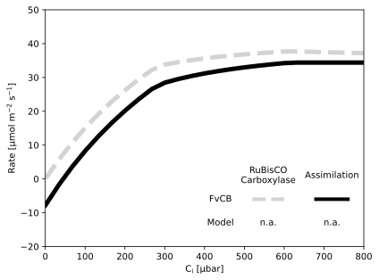
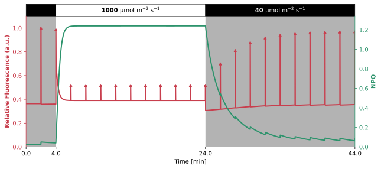
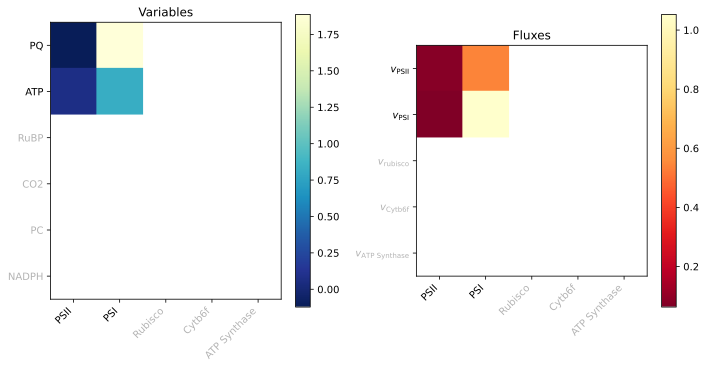
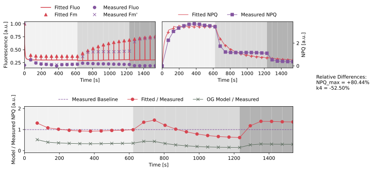

# Fuente2024


The [Fuente2024](https://doi.org/10.1016/j.plaphy.2024.109138) model is a kinetic model of photosynthesis that is based on Occam's razor, aiming to provide the minimal complexity to describe the core processes of this model. In this case, the model focuses on the dynamic light oscillation and its responses on the photosynthetic machinery. It focuses only on the light-dependent reactions, including simplified versions of photosystem II, photosystem I, the Plastoquinone pool, and proton and ATP concentration in the lumen and stroma. On top of that, it shows the activation of non-photochemical quenching (NPQ), the dynamics of chlorophyll fluorescence, and the rate of oxygen evolution.
                     
The model includes the oscillating light intensity as a sinusoidal function, where the amplitude and frequency are adjustable parameters. To allow for easier comparision to other models, that often see light intensity as a constant value, the oscillation is defined around a base light intensity. However, the strength of having light with a specific frequency lies in the additional information and therefore analysis possibilities that can be performed. In this case, the model is used to create Bode plots of the response of fluorescence to light oscillations and comparing these results to experimental data from *Chlamydomonas reinhardtii*.

This simple model stays true to its name and the authors aim to provide a base model that can be easily extended, while still showing a new approach to photosynthesis modelling. Their work shows that even with a simple model, new insights can be gained by using dynamic light protocols, which may have been overlooked in traditional steady-state models. To further extend the usability of the model, the authors provide a detailed notebook written in the Wolfram language, which also shows how to recreate some of the publication's figures.
                     
## Installation


All the files needed to run this model are located in [model](./model) folder. To use this model you only need to copy this folder and write the following to import the model in your Python script:

```python
from model import Fuente2024
```

The packages required to run this model can either be installed by using the `pixi` environment located inside the [pyproject.toml](../pyproject.toml) file or by just installing the `mxlpy` package and all its dependencies.
                     
### Compounds

#### Part of ODE system

|Name|Common Abbr.|Paper Abbr.|KEGG ID|Python Var|
| :---: | :---: | :---: | :---: | :---: |
|Activated PSII quencher|$Q_\mathrm{act}$|$FQ_{act}$||Q_active|
|Plastoquinone|$\mathrm{PQ}$|$PQ$|C02061|PQ|
|The fraction of PSI donors per RCII that are available for the linear electron transport|$\mathrm{PSI}_\mathrm{ox}$|$PI_{ox}$||PSI_ox|
|Lumenal Proton concentration|$\mathrm{H_{lu}}$|$H_L$|C00080|H_lumen|
|Stromal ATP concentration|$\mathrm{ATP_{st}}$|$ATP$|C00002|ATP_st|


<details>
<summary>ODE System</summary>

```math 
\frac{\mathrm{d}\mathrm{H_{lu}}}{\mathrm{d}t} = \frac{b_\mathrm{H}}{\mathrm{V_{lu}} \mathrm{N_A}} \cdot v_\mathrm{PSII \vert O_2} + \frac{b_\mathrm{H}}{\mathrm{V_{lu}} \mathrm{N_A}} \cdot v_\mathrm{PQH_2 \vert PSI} + \frac{\frac{-14}{3} \cdot \mathrm{V_{st}}}{\mathrm{V_{lu}}} \cdot b_\mathrm{H} \cdot v_{\mathrm{ATPsynthase}} - v_{\mathrm{Leak}}
```
```math 
\frac{\mathrm{d}\mathrm{PSI}_\mathrm{ox}}{\mathrm{d}t} = - v_\mathrm{PQH_2 \vert PSI} + v_{\mathrm{PSI}}
```
```math 
\frac{\mathrm{d}\mathrm{PQ}}{\mathrm{d}t} = 0.5 \cdot v_\mathrm{PQH_2 \vert PSI} - 0.5 \cdot v_\mathrm{PSII \vert PQ} + v_{\mathrm{PQ}_{\mathrm{ox}}}
```
```math 
\frac{\mathrm{d}Q_\mathrm{act}}{\mathrm{d}t} = v_\mathrm{Q \vert act} - v_\mathrm{Q \vert inact}
```
```math 
\frac{\mathrm{d}\mathrm{ATP_{st}}}{\mathrm{d}t} = v_{\mathrm{ATPsynthase}} - v_{\mathrm{ATP}_{\mathrm{consumption}}}
```

</details>
                     
#### Conserved quantities

|Name|Common Abbr.|Paper Abbr.|KEGG ID|Python Var|
| :---: | :---: | :---: | :---: | :---: |
|Inactive PSII quencher|$Q_\mathrm{inact}$|$FQ_{inact}$||Q_inactive|
|Plastoquinol|$\mathrm{PQH}_2$|$PQH_2$|C16693|PQH_2|
|Fraction of PSI donors per PCII that are not available for the linear electron transport|$\mathrm{PSI_{red}}$|$PI_{red}$||PSI_red|
|Stromal ADP concentration|$\mathrm{ADP_{st}}$|$ADP$|C00008|ADP_st|
|Reaction centers of PSII that are closed|$\mathrm{RCII_{closed}}$|$RCII_{closed}$||RCII_closed|
|Reaction centers of PSII that are open|$\mathrm{RCII_{open}}$|$RCII_{open}$||RCII_open|
|Flourescence|$\mathrm{Fluo}$|$ChlF$||Fluo|
|Nonphotochemical quenching|$\mathrm{NPQ}$|$NPQ$||NPQ|
|Oxygen Concentration|$\mathrm{O_2}$|$O_2$||O2|


<details>
<summary> Calculations </summary>

```math
Q_\mathrm{inact} =  \mathrm{Q_{tot}} - Q_\mathrm{act}
```
```math
\mathrm{PQH}_2 =  \mathrm{PQ_{tot}} - \mathrm{PQ}
```
```math
\mathrm{PSI_{red}} =  \mathrm{PSI_{tot}} - \mathrm{PSI}_\mathrm{ox}
```
```math
\mathrm{ADP_{st}} =  \mathrm{AP_{tot}} - \mathrm{ATP_{st}}
```
```math
\mathrm{RCII_{closed}} =  \frac{1}{1 + \frac{k_1^+ \cdot \mathrm{PQ}}{\sigma _\mathrm{PSII} \cdot \mathrm{PPFD_{osc}} + k_1^- \cdot \mathrm{PQH}_2}}
```
```math
\mathrm{RCII_{open}} =  \frac{k_1^+ \cdot \mathrm{PQ}}{\sigma _\mathrm{PSII} + k_1^- \cdot \mathrm{PQH}_2 + k_1^+ \cdot \mathrm{PQ}}
```
```math
\mathrm{Fluo} =  \mathrm{Fluo_0} + \mathrm{RCII_{closed}} \cdot \sigma _\mathrm{PSII}
```
```math
\mathrm{NPQ} =  \frac{\mathrm{NPQ_{max}} \cdot Q_\mathrm{act}}{1 - \mathrm{NPQ_{max}} \cdot Q_\mathrm{act}}
```
```math
\mathrm{O_2} =  \frac{\mathrm{PSI_{tot}} \cdot \left( k_1^+ \cdot \mathrm{RCII_{closed}} \cdot \mathrm{PQ} - k_1^- \cdot \left( 1 - \mathrm{RCII_{closed}} \right) \mathrm{PQH}_2 \right)}{4}
```

</details>

                     
### Parameters

|Short Description|Common Abbr.|Paper Abbr.|Value|Unit|Python Var|Reference|
| :---: | :---: | :---: | :---: | :---: | :---: | :---: |
|Stoichiometry of PSII|$\mathrm{stoic_{PSII}}$|$nPSII$|$1$||stoic_PSII|Chow et al. (1990); Fan et al. (2007|
|Stoichiometry of PSI|$\mathrm{stoic_{PSI}}$|$nPSI$|$1$||stoic_PSI|Chow et al. (1990); Fan et al. (2007|
|Total PQ|$\mathrm{PQ_{tot}}$|$PQ_{tot}$|$7$||PQ_tot|Ivanov (2011)|
|Stromal H concentration|$\mathrm{H_{st}}$|$[H^+]_{stroma}$|$10^{-1.8}$|$\mathrm{\mu M}$|H_stroma|Wu and Berkowitz (1992)|
|Adenylate stromal concentration|$\mathrm{AP_{tot}}$|$A_{tot}$|$1000$|$\mathrm{\mu M}$|AP_tot|Robinson (1985)|
|Lumen volume corresponding to one RCII|$\mathrm{V_{lu}}$|$V_L$|$2.62e-21$|$\mathrm{L RCII^{-1}}$|V_lumen||
|Stroma volume corresponding to one RCII|$\mathrm{V_{st}}$|$V_S$|$2.09e-20$|$\mathrm{L RCII^{-1}}$|V_stroma||
|Effective antenna size of PSI|$\sigma _\mathrm{PSI}$|$\sigma _I$|$1$|$\mathrm{\mu mol\ photons\ m^{-2}}$|sigma_PSI_0|Lazár and Pospísil (1999)|
|Effectively representing reactions involved in the electron transfer RCIIClosed|$k_1^+$|$k_1^+$|$25000$|$\mathrm{s^{-1}}$|k1p||
|The rate-limiting step in all reactions involved in PQH2 → RCIIopen (QA)|$k_1^-$|$k_1^-$|$2500$|$\mathrm{s^{-1}}$|k1m||
|The rate-limiting step in all reactions involved in PQH2 → Piox|$k_2^+$|$k_2^+$|$100$|$\mathrm{s^{-1}}$|k2p|Lazár and Jablonský (2009)|
|The rate-limiting step in all reactions involved in Pired → PQ|$k_2^-$|$k_2^-$|$10$|$\mathrm{s^{-1}}$|k2m|Lazár and Jablonský (2009)|
|NPQ mechanism activation|$k_3$|$k_3$|$0.05$|$\mathrm{s^{-1}}$|k3|Ebenhöh et al. (2011)|
|NPQ mechanism deactivation|$k_4$|$k_4$|$0.004$|$\mathrm{s^{-1}}$|k4|Ebenhöh et al. (2011)|
|ATP formation|$k_5$|$k_5$|$100$|$\mathrm{s^{-1}}$|k5||
|ATP consumption|$k_6$|$k_6$|$10$|$\mathrm{s^{-1}}$|k6||
|H+ leakage and other mechanisms dissipating $\Delta \mathrm{H^+}$|$k_7$|$k_7$|$500$|$\mathrm{s^{-1}}$|k7||
|Oxidation of plastoquinol molecules by the plastid terminal oxidase|$k_\mathrm{PQ}$|$k_X$|$1$|$\mathrm{s^{-1}}$|k_X||
|Half-saturation of PSI|$L_\mathrm{PSI}$|$L_{1/2}$|$10000$|$\mathrm{\mu mol\ photons\ m^{-2}\ s^{-1}}$|L_PSI||
|pH buffer in the lumen|$b_\mathrm{H}$|$b_H$|$0.01$||bH||
|Maximal extent of NPQ|$\mathrm{NPQ_{max}}$|$FQ_{max}$|$0.6$||NPQ_max||
|Proportionality constant|$\mathrm{cEqP}$|$cEqP$|$4.3e-08$||cEqP||
|pK of the NPQ activation corresponding to pH = 6|$K_\mathrm{eq\|NPQ}$|$K_Q$|$1$|$\mathrm{\mu M}$|keq_NPQ|Pfündel and Dilley (1993)|
|Hill coefficient characterizing the NPQ activation|$n_\mathrm{NPQ}$|$n$|$5.3$||n_NPQ|Pfündel and Dilley (1993)|
|Avogadro constant|$\mathrm{N_A}$|$\mathrm{N_A}$|$6.02214076e+17$|$\mathrm{\mu mol^{-1}}$|N_A||
|Base Photosynthetic Photon Flux Density|$\mathrm{PPFD}$|$u_0$|$50$|$\mathrm{\mu mol\ photons\ m^{-2}\ s^{-1}}$|PPFD||
|Amplitude difference of PPFD for oscillating light|$\mathrm{PPFD_{add}}$|$u_1$|$0$|$\mathrm{\mu mol\ photons\ m^{-2}\ s^{-1}}$|PPFD_add||
|Frequency of oscillating light|$f$|$f$|$1$||f||
|Total PSI|$\mathrm{PSI_{tot}}$|$PSI_{tot}$|$1$||PSI_total||
|$\frac{F_0}{F_\mathrm{v}}$ Ratio|$\mathrm{Fluo_0}$|$\frac{F_0}{F_\mathrm{v}}$|$0.25$||Fluo_0||
|Total Quencher|$\mathrm{Q_{tot}}$|$FQ_{tot}$|$1$||Q_total||

#### Derived Parameters

|Short Description|Common Abbr.|Paper Abbr.|Python Var|
| :---: | :---: | :---: | :---: |
|Light modulation|$\mathrm{PPFD_{osc}}$|$Light$|osc_light|
|Effective antenna size of PSII|$\sigma _\mathrm{PSII}$|$\sigma _{II}$|sigma_PSII|


<details>
<summary>Equations of derived parameters</summary>

```math
\mathrm{PPFD_{osc}} =  \mathrm{PPFD} + \mathrm{PPFD_{add}} \cdot \cos \left( 2 \cdot \pi \cdot f \cdot \mathrm{time} \right)
```
```math
\sigma _\mathrm{PSII} =  1 - \mathrm{NPQ_{max}} \cdot Q_\mathrm{act}
```

</details>

                     
### Reaction Rates

|Short Description|Common Abbr.|Paper Abbr.|KEGG ID|Python Var|
| :---: | :---: | :---: | :---: | :---: |
|Part of the PSII rate that reduces O2|$v_\mathrm{PSII\|O_2}$|$v_\mathrm{PSII}$|R09503|v_PSII_O2|
||$v_{\mathrm{PSI}}$|$v_\mathrm{PSI}$|R09542|v_PSI|
|Part of the PSII rate that reduces PQ|$v_\mathrm{PSII\|PQ}$|$v_1$|R09503|v_PSII_PQ|
|Rate at which electrons are transported from PQH2 to the available donors of PSI|$v_\mathrm{PQH_2\|PSI}$|$v_2$||v_PQH2_PSI|
|Rate of quencher activation|$v_\mathrm{Q\|act}$|$v_3$||v3|
|Rate of quencher inactivation|$v_\mathrm{Q\|inact}$|$v_4$||v4|
|Production of ATP by ATPsynthase|$v_{\mathrm{ATPsynthase}}$|$v_5$|R00086|v_ATPsynth|
|ATP consuming reaction|$v_{\mathrm{ATP}_{\mathrm{consumption}}}$|$v_6$||v_ATPcons|
|Transmembrane Proton Leak|$v_{\mathrm{Leak}}$|$v_7$||v_Leak|
|Oxidation of the PQ pool through cytochrome and PTOX|$v_{\mathrm{PQ}_{\mathrm{ox}}}$|$v_\mathrm{X}$||v_PQ|


<details>
<summary>Rate equations</summary>

```math
v_\mathrm{PSII \vert O_2} =  \mathrm{stoic_{PSII}} \cdot \sigma _\mathrm{PSII} \cdot \mathrm{PPFD_{osc}} \cdot \left( 1 - \mathrm{RCII_{closed}} \right)
```
```math
v_{\mathrm{PSI}} =  \frac{\mathrm{stoic_{PSI}} \cdot \sigma _\mathrm{PSI} \cdot L_\mathrm{PSI} \cdot \mathrm{PPFD_{osc}}}{L_\mathrm{PSI} + \mathrm{PPFD_{osc}}} \cdot \left( \mathrm{stoic_{PSI}} - \mathrm{PSI}_\mathrm{ox} \right)
```
```math
v_\mathrm{PSII \vert PQ} =  k_1^+ \cdot \mathrm{RCII_{closed}} \cdot \mathrm{PQ} - k_1^- \cdot \mathrm{RCII_{open}} \cdot \mathrm{PQH}_2
```
```math
v_\mathrm{PQH_2 \vert PSI} =  k_2^+ \cdot \mathrm{PQH}_2 \cdot \mathrm{PSI}_\mathrm{ox} - k_2^- \cdot \mathrm{PQ} \cdot \mathrm{PSI_{red}}
```
```math
v_\mathrm{Q \vert act} =  \frac{k_3 \cdot \left( 1 - Q_\mathrm{act} \right)}{1 + \left( \frac{K_\mathrm{eq \vert NPQ}}{\mathrm{H_{lu}}} \right)^{n_\mathrm{NPQ}}}
```
```math
v_\mathrm{Q \vert inact} =  k_4 \cdot Q_\mathrm{act}
```
```math
v_{\mathrm{ATPsynthase}} =  k_5 \cdot \left( \mathrm{ADP_{st}} - \frac{\mathrm{ATP_{st}} \cdot \left( \frac{\mathrm{H_{st}}}{\mathrm{H_{lu}}} \right)^{\frac{14}{3}}}{\mathrm{cEqP}} \right)
```
```math
v_{\mathrm{ATP}_{\mathrm{consumption}}} =  k_6 \cdot \mathrm{ATP_{st}}
```
```math
v_{\mathrm{Leak}} =  k_7 \cdot \left( \mathrm{H_{lu}} - \mathrm{H_{st}} \right)
```
```math
v_{\mathrm{PQ}_{\mathrm{ox}}} =  k_\mathrm{PQ} \cdot \mathrm{PQH}_2
```

</details>

### Figures


You can find the recreation of the figures from the original publication below. Due to differing copyright reasons the original figures cannot be included in this README file. Instead, the comparision has to be made using the original publication.
### Demonstrations


                     
<details>
<summary>Day Simulation</summary>
                     


Sample simulation of a day cycle using real Photosynthetic Photon Flux Density (PPFD) data from Kansas, USA on June 19, 2023. The data was obtained from the National Ecological Observatory Network (NEON) data portal and is used to create a protocol for the light intensity PPFD over the course of the day, in a minute interval. The data used is filtered to only show a PPFD that equals or is higher than $40 \mathrm{µmol\ m^{−2}\ s^{−1}}$. This threshold is chosen as it has shown to allow most models to still simulate the photosynthetic machinery, while still being a decent representation of the actual daylight conditions. The simulation is run using the default parameters and initial conditions of each model, and the RuBisCO carboxylation rate (vRuBisCO), Adenosine Triphosphate (ATP) and Nicotinamide Adenine Dinucleotide Phosphate (NADPH) ratio, and fluorescence (F) results is plotted over the course of the day, if possible. The results do not represent actual plant behavior, but show the capabilities of the model to simulate complex and more realistic light protocols.

**Notes:**

</details>


                     
<details>
<summary>FvCB Submodule</summary>
                     


Comparison of modelled carbon assimilation (A) and RuBisCO carboxylation rate (vRuBisCO) against the Farquhar, von Caemmerer, and Berry (FvCB) model. The FvCB model is calculated using the min-W approach as described by Lochoki and McGrath (2025). To be able to simulate A, there are two mandatory quantities that need to be present in the model: carbon dioxide (CO2) concentration and vRuBisCO. If one of these parameters is missing, the FvCB model will still be shown, but no comparison with the model will be possible. Other parameters that are required to calculate the FvCB model will be added as parameters with default values if they are not present in the model. The simulation is then run until steady-state, or quasi-steady-state if not otherwise possible, for different intercellular CO2 concentration (Ci) partial pressure. The carbon assimilation shown does not represent actual values but rather a theoretical curve to compare the kinetic model to the popular FvCB model.

**Assumptions:**

- If no CO<sub>2</sub> concentration nor rate of rubisco carboxylation ($v_\mathrm{c}$) is present in the model, no comparison will be shown
- Infinite mesophyll conductance, therefore intercellular CO<sub>2</sub> partial pressure equals chloroplast partial pressure ($\mathrm{C_i} = \mathrm{C_c}$)
- If no $\mathrm{C_i}$ is present in the model, it will be added as a parameter assuming an initial value of CO<sub>2</sub> concentration divided by Henry's law constant for CO<sub>2</sub> ($H_\mathrm{s}^{cp}$)
- If no $H_\mathrm{s}^{cp}$ is present in the model, it will be added as a parameter with a value of $3.4 \times 10^{-4}\ \mathrm{mmol\ Pa^ {-1}}$ [[2]](https://doi.org/10.5194/acp-23-10901-2023)
- If no CO<sub>2</sub> compensation point in the absence of non-photorespiratory CO<sub>2</sub> release ($\Gamma ^*$) is present in the model, it will be added as a parameter with a value of $38.6\ \mathrm{\mu bar}$ [[1]](https://doi.org/10.1101/2025.03.11.642611)
- If no $R_\mathrm{light}$ is present in the model, it will be added as a parameter with a value of $1\ \mathrm{\mu mol\ m^{-2}\ s^{-1}}$ [[1]](https://doi.org/10.1101/2025.03.11.642611)
- If no $A$ is present in the model, it will be added as a derived variable following the FvCB equation [[1]](https://doi.org/10.1101/2025.03.11.642611): $v_\mathrm{c} \cdot \left(1 - \frac{\Gamma ^*}{C_i}\right) - R_\mathrm{light}$
- To be able to compare with original FvCB curves, the model needs to have $v_\mathrm{c}$ following the same units as the FvCB model ($\mathrm{\mu mol\ m^{-2}\ s^{-1}}$). The `mM_to_µmol_per_m2` can be used to convert from mM to $\mathrm{\mu mol\ m^{-2}}$ assuming a volume factor of $0.0112\ \mathrm{L\ m^{-2}}$ in the stroma [[3]](https://doi.org/10.1007/s11120-006-9109-1). If the given units are in mM, the conversion will be done automatically, by adding a derived parameter with the converted values.

**Notes:**

| Parameter                 | In Model          |
| -----------               | -----------       |
| $\mathrm{CO}_2$         | None          |
| $v_\mathrm{c}$          | None  |
| $\mathrm{C_i}$          | None          |
| $H_\mathrm{s}^{cp}$   | None              |
| $\Gamma ^*$               | None              |
| $R_\mathrm{light}$      | None        |
| $A$                       | None            |


</details>


                     
<details>
<summary>PAM Simulation</summary>
                     


Sample simulation of a common Pulse Amplitude Modulation (PAM) protocol to show fluctuations of fluorescence (F) and Non-Photochemical Quenching (NPQ) using saturating pulses. The simulation protocol is as follows: A dark adaptation period that simulates for 30 minutes at a dark light intensity ($40 \mathrm{µmol\ m^{−2}\ s^{−1}}$), then the actual protocol starts. The protocol consists of 22 periods with each being 2 minutes of length. That period consists of a specific light intensity of the respective type of period and ends with a saturating pulse with a length of 0.8 s and a light intensity of $3000 \mathrm{µmol\ m^{−2}\ s^{−1}}$. First, two dark periods with light intensity of $40 \mathrm{µmol\ m^{−2}\ s^{−1}}$, followed by ten light periods with light intensity of 1000 µmol m−2 s−1, then ten dark periods again. The simulation is run using the default parameters and initial conditions of each model.

**Assumptions:**

- If no Flourescence and NPQ output is present in the model, it can not be shown in the results.
- If Flourescence is present, $F_\mathrm{m}$ is found by using the protocol used in the simulation to find each saturating pulse. A period between each pulse is taken and the maximum Flourescence value during the pulse is taken as $F_\mathrm{m}$.
- If $F_\mathrm{m}$ is found and NPQ is not present, NPQ is calculated using the formula: $NPQ_t = \frac{F_{\mathrm{m}\vert t=0} - F_{\mathrm{m} \vert t}}{F_{\mathrm{m} \vert t}}$

**Notes:**

</details>


                     
<details>
<summary>Photosynthesis MCA</summary>
                     


A sample Metabolic Control Analysis (MCA) of typical photosynthesis variables and fluxes. A control coefficient analysis is to be performed, therefore each parameter represents a single coefficient of the photosynthesis rate. The rates chosen should represent  RuBisCO carboxylation rate (vRuBisCO), PSII rate (vPSII), PSI rate (vPSI), Cytb6f rate (vb6f) and ATP synthase rate (vATPSynth). The variables chosen should represent  carbon dioxide (CO2) concentration, Ribulose-1,5-bisphosphate (RuBP), oxidised plastoquinone (PQox), oxidised plastocyanin (PCox), denosine Triphosphate (ATP), and Nicotinamide Adenine Dinucleotide Phosphate (NADPH). For each parameter to be scanned, the model is simulated to steady-state, with a displacement of $\pm 0.01\%$ of each respective parameter. The control coefficients are then calculated for each variable and flux by the following formula: $C_{p}^{x} = \frac{x_\mathrm{upper} - x_\mathrm{lower}}{2 \cdot \mathrm{disp} \cdot p}$, where $C_{p}^{x}$ is the control coefficient of parameter $p$ on variable or flux $x$, and $\mathrm{disp}$ is the displacement value. $x_\mathrm{upper}$ and $x_\mathrm{lower}$ are the steady-state result of $x$ at either $+\mathrm{disp}$ and $-\mathrm{disp}$ respectively. It has to be noted that the (MCA) results can be very dependent on the other values of the parameters in the model, therefore the results shown here are only representative of the default parameter set of the model.

**Assumptions:**

- Steady-State needs to be achievable for the model to perform the MCA.
- The parameters for each coefficient, rates, and variables chosen need to be representative of the respective process.
- If a parameter, rate, or variable is not present in the model, the respective coefficient will be greyed out in the Heatmap.

**Notes:**

| Coefficient                   | In Model          |
| -----------                   | -----------       |
| $\mathrm{PSII}$             | None|
| $\mathrm{PSI}$              | None |
| $\mathrm{RuBisCO \vert C}$  | None |
| $\mathrm{cytb6f}$           | None              |
| $\mathrm{ATPsynthase}$      | None              |

| Flux                          | In Model          |
| -----------                   | -----------       |
| $\mathrm{PSII}$             | None |
| $\mathrm{PSI}$              | None |
| $\mathrm{RuBisCO \vert C}$  | None |
| $\mathrm{cytb6f}$           | None              |
| $\mathrm{ATPsynthase}$      | None              |

| Variable                  | In Model      |
| -----------               | -----------   |
| $\mathrm{CO_2}$         | None       |
| $\mathrm{RUBP}$         | None      |
| $\mathrm{PQ_{ox}}$    | None          |
| $\mathrm{PC_{ox}}$    | None          |
| $\mathrm{ATP}$          | None    |
| $\mathrm{NADPH}$        | None  |

</details>


                     
<details>
<summary>PAM Fitting</summary>
                     


Sample fitting to experimental Non-Photochemical Quenching (NPQ) data. The NPQ data used is taken from experimental work published in von Bismarck (2022) and was acquired using Maxi Imaging-PAM (Walz, Germany) using Col-0 Arabidopsis thaliana (A. thaliana) plants. It is assumed that the experiment follows the default PAM protocol of the machine, as no other experimental protocol has been given. Therefore, the protocol of each simulation follows the data given, where the length of one saturating pulse is set to 720 µs at a light intensity of $5000 \mathrm{µmol\ m^{−2}\ s^{−1}}$. The light protocol consists of a dark adaptation period of 30 minutes to acclimate the simulation conditions. Then the actual protocol starts with a longer phase of high actinic light ($903 \mathrm{µmol\ m^{−2}\ s^{−1}}$) for approximately 10 minutes, followed by a lower actinic light of ($90 \mathrm{µmol\ m^{−2}\ s^{−1}}$) for 10 minutes, and then 5 minutes of a dark period. During each phase, saturating pulses are given approximately every 60 seconds. As the experimental data also provides exact time points for each pulse, these were taken as reference for the protocol and not the general time intervals. In the experimental work, the dark period consists of actual darkness, whereas in the simulation a low light intensity of $40 \mathrm{µmol\ m^{−2}\ s^{−1}}$ is used to avoid numerical issues. The fitting is performed using the lmfit package in Python with the leastsquare method. On top of that, a standard scaling towards the experimental data is done, to keep the fitting results in the same order of magnitude. To help the fitting converge, weights are applied to the data points, which are defined as the reciprocal of the standard deviation. These settings set are not to be taken as set in stone, as fitting is a highly experimental process and differing settings might be required depending on the model and data used. These settings are a basic starting point for fitting data to a model. The hardest and most impactful decision while fitting is the choice of parameters to fit. There are many ways to find which parameters may be most impactful to fit, such as sensitivity analysis or metabolic control analysis. However, either way experimenting with different parameter sets is always required to find the best fitting practice, which differs for each model and also data to fit to.

**Assumptions:**

- If no Flourescence and NPQ output is present in the model, it can not be shown in the results.
- If Flourescence is present, $F_\mathrm{m}$ is found by using the protocol used in the simulation to find each saturating pulse. A period between each pulse is taken and the maximum Flourescence value during the pulse is taken as $F_\mathrm{m}$.
- If $F_\mathrm{m}$ is found and NPQ is not present, NPQ is calculated using the formula: $NPQ_t = \frac{F_{\mathrm{m}\vert t=0} - F_{\mathrm{m} \vert t}}{F_{\mathrm{m} \vert t}}$

**Notes:**

</details>
