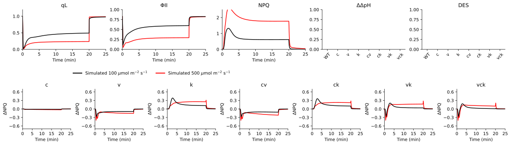
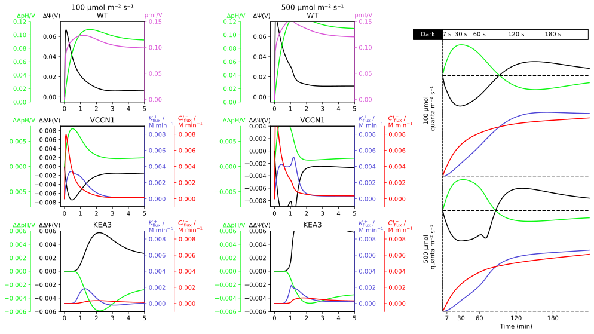
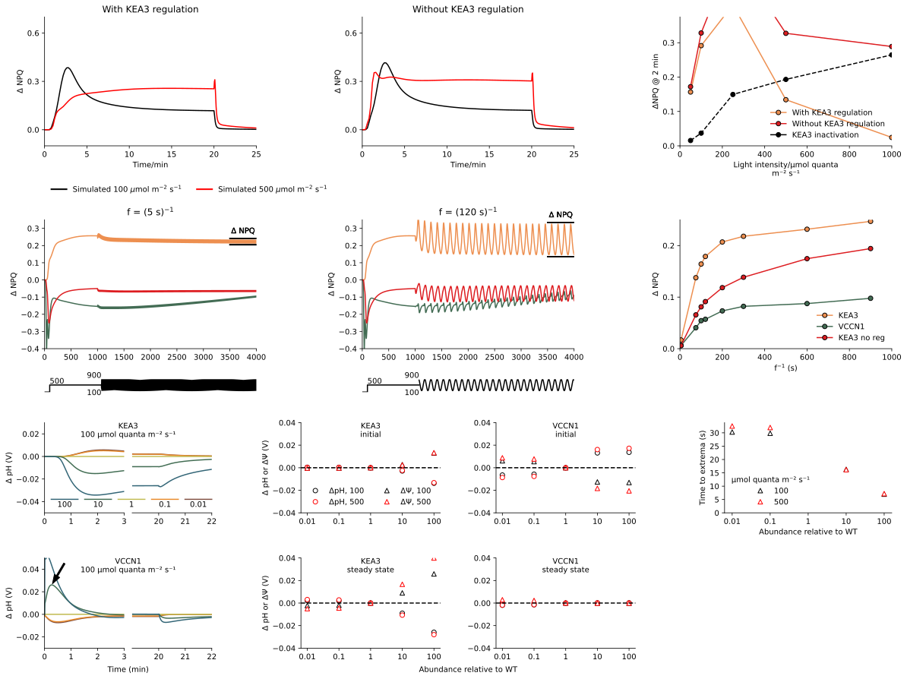
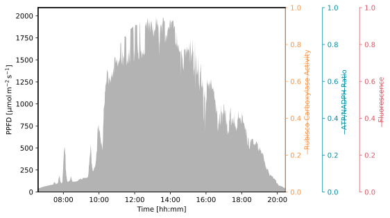
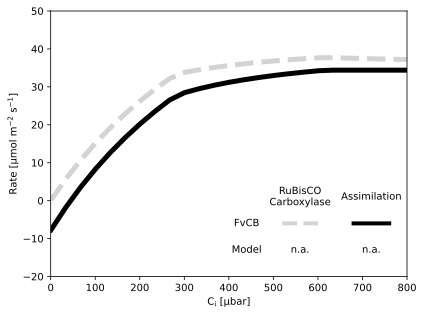
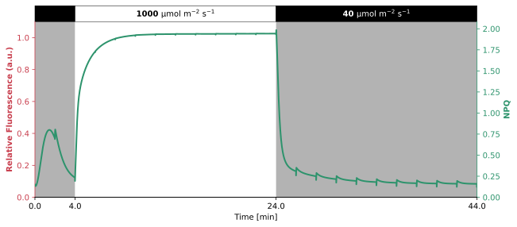
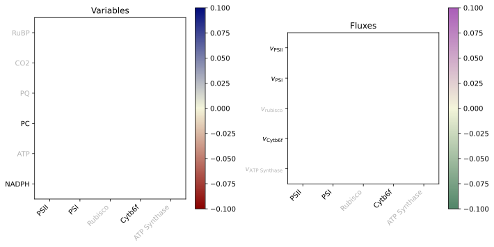
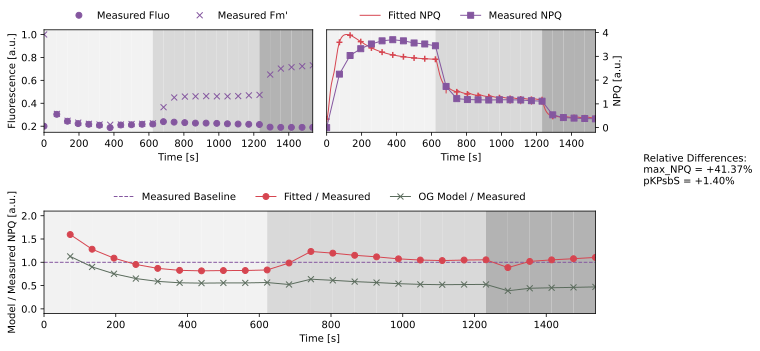

# Li2021


The [Li2021](https://doi.org/10.1038/s41477-021-00947-5) model is a kinetic model of photosynthesis that focuses more on the ion fluxes across the thylakoid membrane and their effect on the proton motive force (PMF). It was built on the Davis2017 model, focuses more on the photosynthetic reactions that are directly linked to the PMF, such as the water splitting at PSII, the plastoquinone oxidation at the Cytochrome b6f complex (Cyt b6f) complex, and more. Other photosynthetic reactions are kept as simple as possible. The Li2021 model adds two potassium ion (K+) and two chloride ion (Cl<sup>-</sup>) ion transport channels to the thylakoid membrane, to investigate their effects on the PMF. To validate the model, the authors compare their simulated results to experimental data from several different experiments. They show that the model can reproduce not only wild type (WT) behavior, but also the behavior of several knockout mutants. The mutants chosen, were the VCCN1, Cl<sup>-</sup> channel (CLCE) and K<sup>+</sup>/H+ antiporter 3 (KEA3) knockouts and any combination thereof. After the validation, the model is then used to investigate the impact these ion channels have on the PMF and the resulting photosynthetic efficiency. Several interesting simulation protocols are used, to showcase the model’s capabilities, such as a light oscillation protocol, a scan of enzyme abundance and more. Overall, this model was created to answer an already existing question in the field of photosynthesis, which is the role of ion fluxes across the thylakoid membrane.

The model itself is not well presented in the publication, but the authors do provide a link to a public GitHub repository where the model is available. It is written in Python, with many comments added to the code. The script includes many different parts of the model and simulation protocols, therefore it is not clear, what is part of the model used in the publication. The script was summarized as much as possible, to only include the parts relevant to the model, but it is not clear if this interpretation is that of the publication. Between the code and the minimal information given in the publication and its supplementary materials, there are still discrepancies, which makes it hard to fully establish the model and its parameters. However, the model shows a good example of why models of photosynthesis are important and versatile, which is why it was included in GreenSloth.

                     
## Installation


All the files needed to run this model are located in [model](./model) folder. To use this model you only need to copy this folder and write the following to import the model in your Python script:

```python
from model import Li2021
```

The packages required to run this model can either be installed by using the `pixi` environment located inside the [pyproject.toml](../pyproject.toml) file or by just installing the `mxlpy` package and all its dependencies.
                     
### Compounds

#### Part of ODE system

|Name|Common Abbr.|Paper Abbr.|KEGG ID|Python Var|
| :---: | :---: | :---: | :---: | :---: |
|Reduced primary quinone of PSII|$\mathrm{Q_{A\|red}}$|$\mathrm{Q_{A}}^{-}$||QA_red|
|Plastoquinol|$\mathrm{PQH}_2$|$\mathrm{PQH_2}$|C16693|PQH_2|
|Lumen pH|$\mathrm{pH}_\mathrm{lu}$|$\mathrm{pH_{lumen}}$|C00080|pH_lumen|
|Transthylakoid electric field|$\Delta \Psi _{\mathrm{thylakoid}}$|$\Delta \Psi$||Dpsi|
|Lumenal K+ concentration|$\mathrm{K}^{+}_{\mathrm{lu}}$|$\mathrm{K}^{+}_{\mathrm{lumen}}$|C00238|K_lu|
|Oxidized Plastocyanine|$\mathrm{PC}_\mathrm{ox}$|$\mathrm{PC}^+$|C03162|PC_ox|
|Oxidised state of PSI (P700+)|$\mathrm{Y_2}$|$\mathrm{P_{700}}^+$|M00163|Y2|
|Zeaxanthin concentration|$\mathrm{Zx}$|$\mathrm{Zx}$|C06098|Zx|
|Number of $^1\mathrm{O_2}$|$^1\mathrm{O_2}$|$\mathrm{sing}^{O2}$|C00007|singO2|
|Reduced Ferrodoxin|$\mathrm{Fd}_\mathrm{red}$|$\mathrm{Fd_{red}}$|C00138|Fd_red|
|Stromal NADPH concentration|$\mathrm{NADPH}_\mathrm{st}$|$\mathrm{NADPH}$|C00005|NADPH_st|
|Lumenal Cl- concentration|$\mathrm{Cl}^{-}_{\mathrm{lu}}$|$\mathrm{Cl}^{-}_{\mathrm{lumen}}$|C00698|Cl_lu|
|Stromal Cl- concentration|$\mathrm{Cl}^{-}_{\mathrm{st}}$|$\mathrm{Cl}^{-}_{\mathrm{stroma}}$|C00698|Cl_st|


<details>
<summary>ODE System</summary>

```math 
\frac{\mathrm{d}^1\mathrm{O_2}}{\mathrm{d}t} = \Phi _{\mathrm{triplet}} \Phi _{\mathrm{^1O_2}} \cdot v_\mathrm{PSII \vert recomb}
```
```math 
\frac{\mathrm{d}\mathrm{Q_{A \vert red}}}{\mathrm{d}t} = - v_\mathrm{PSII \vert recomb} + \mathrm{PSII_{ChSep}} - v_{\mathrm{PSII}} + v_{\mathrm{PQ}_{\mathrm{ox}}}
```
```math 
\frac{\mathrm{d}\mathrm{pH}_\mathrm{lu}}{\mathrm{d}t} = \frac{ipt_\mathrm{lu}}{b_\mathrm{H}} \cdot v_\mathrm{PSII \vert recomb} + \frac{-ipt_\mathrm{lu}}{b_\mathrm{H}} \cdot \mathrm{PSII_{ChSep}} + \frac{-2 ipt_\mathrm{lu}}{b_\mathrm{H}} \cdot v_{\mathrm{b6f}} + \frac{-2 ipt_\mathrm{lu}}{b_\mathrm{H}} \cdot v_{\mathrm{NDH}} + \frac{ipt_\mathrm{lu}}{b_\mathrm{H}} \cdot v_\mathrm{KEA3} + \frac{ipt_\mathrm{lu}}{b_\mathrm{H}} \cdot v_\mathrm{ClCe} + \frac{ipt_\mathrm{lu}}{b_\mathrm{H}} \cdot v_{\mathrm{Leak}} + \frac{ipt_\mathrm{lu}}{b_\mathrm{H}} \cdot 
```
```math 
\frac{\mathrm{d}\Delta \Psi _{\mathrm{thylakoid}}}{\mathrm{d}t} = - vpc \cdot v_\mathrm{PSII \vert recomb} + vpc \cdot \mathrm{PSII_{ChSep}} + vpc \cdot v_{\mathrm{b6f}} + vpc \cdot 2 \cdot v_{\mathrm{NDH}} + vpc \cdot -3 \cdot v_\mathrm{ClCe} - vpc \cdot v_{\mathrm{Leak}} - vpc \cdot  + vpc \cdot \mathrm{PSI_{ChSep}} - vpc \cdot v_\mathrm{VKC} - vpc \cdot v_\mathrm{VCCN1}
```
```math 
\frac{\mathrm{d}\mathrm{PQH}_2}{\mathrm{d}t} = 0.5 \cdot v_{\mathrm{PSII}} - 0.5 \cdot v_{\mathrm{PQ}_{\mathrm{ox}}} - 0.5 \cdot v_{\mathrm{b6f}} + 0.5 \cdot v_{\mathrm{NDH}} + 0.5 \cdot v_\mathrm{PRG5}
```
```math 
\frac{\mathrm{d}\mathrm{PC}_\mathrm{ox}}{\mathrm{d}t} = - v_{\mathrm{b6f}} + v_\mathrm{PSI \vert PCoxid}
```
```math 
\frac{\mathrm{d}\mathrm{Fd}_\mathrm{red}}{\mathrm{d}t} = - v_{\mathrm{NDH}} + \mathrm{PSI_{ChSep}} - v_\mathrm{PRG5} - v_{\mathrm{FNR}} - v_{\mathrm{Mehler}}
```
```math 
\frac{\mathrm{d}\mathrm{Y_2}}{\mathrm{d}t} = \mathrm{PSI_{ChSep}} - v_\mathrm{PSI \vert PCoxid}
```
```math 
\frac{\mathrm{d}\mathrm{NADPH}_\mathrm{st}}{\mathrm{d}t} = 0.5 \cdot v_{\mathrm{FNR}} - v_\mathrm{CBB}
```
```math 
\frac{\mathrm{d}\mathrm{K}^{+}_{\mathrm{lu}}}{\mathrm{d}t} = ipt_\mathrm{lu} \cdot v_\mathrm{KEA3} - ipt_\mathrm{lu} \cdot v_\mathrm{VKC}
```
```math 
\frac{\mathrm{d}\mathrm{Cl}^{-}_{\mathrm{lu}}}{\mathrm{d}t} = ipt_\mathrm{lu} \cdot 2 \cdot v_\mathrm{ClCe} + ipt_\mathrm{lu} \cdot v_\mathrm{VCCN1}
```
```math 
\frac{\mathrm{d}\mathrm{Cl}^{-}_{\mathrm{st}}}{\mathrm{d}t} = - 0.2 ipt_\mathrm{lu} \cdot v_\mathrm{ClCe} - 0.1 ipt_\mathrm{lu} \cdot v_\mathrm{VCCN1}
```
```math 
\frac{\mathrm{d}\mathrm{Zx}}{\mathrm{d}t} = - v_{\mathrm{Epox}} + v_{\mathrm{Deepox}}
```

</details>
                     
#### Conserved quantities

|Name|Common Abbr.|Paper Abbr.|KEGG ID|Python Var|
| :---: | :---: | :---: | :---: | :---: |
|Oxidised primary quinone of PSII|$\mathrm{Q_{A\|ox}}$|$qL$||QA|
|Ground state of PSI (P700)|$\mathrm{Y_0}$|$P700$|M00163|Y0|
|Plastoquinone|$\mathrm{PQ}$|$\mathrm{PQ}$|C02061|PQ|
|Reduced Plastocyanine|$\mathrm{PC}_\mathrm{red}$|$\mathrm{PC}$|C03025|PC_red|
|Oxidized Ferrodoxin|$\mathrm{Fd}_\mathrm{ox}$|$\mathrm{Fd_{ox}}$|C00139|Fd_ox|
|Stromal NADP concentration|$\mathrm{NADP}_\mathrm{st}$|$\mathrm{NADP}^+$|C00006|NADP_st|
|Violaxanthin|$\mathrm{Vx}$|$\mathrm{Vx}$|C08614|Vx|
|Concentration of protonated psbS protein|$\mathrm{psbS^P}$|$PsbS\_H$|K03542|PsbSP|
|Nonphotochemical quenching|$\mathrm{NPQ}$|$NPQ$||NPQ|
|Efficiency of PSII|$\Phi \mathrm{PSII}$|$\Phi \mathrm{PSII}$||PhiPSII|
|Lumenal Proton concentration|$\mathrm{H_{lu}}$|$H_{lumen}$|C00080|H_lumen|
|The total proton motive force|$\mathrm{pmf}$|$pmf$||pmf|
|Stromal Proton concentration|$\mathrm{H_{st}}$|$H_{stroma}$|C00080|H_st|


<details>
<summary> Calculations </summary>

```math
\mathrm{Q_{A \vert ox}} =  \mathrm{QA}^{\mathrm{tot}} - \mathrm{Q_{A \vert red}}
```
```math
\mathrm{Y_0} =  \mathrm{P700}^{\mathrm{tot}} - \mathrm{Y_2}
```
```math
\mathrm{PQ} =  \mathrm{PQ}^{\mathrm{tot}} - \mathrm{PQH}_2
```
```math
\mathrm{PC}_\mathrm{red} =  \mathrm{PC}^{\mathrm{tot}} - \mathrm{PC}_\mathrm{ox}
```
```math
\mathrm{Fd}_\mathrm{ox} =  \mathrm{Fd}^{\mathrm{tot}} - \mathrm{Fd}_\mathrm{red}
```
```math
\mathrm{NADP}_\mathrm{st} =  \mathrm{NADP}^{\mathrm{tot}} - \mathrm{NADPH}_\mathrm{st}
```
```math
\mathrm{Vx} =  \mathrm{X}^{\mathrm{tot}} - \mathrm{Zx}
```
```math
\mathrm{psbS^P} =  \frac{1}{10^{3 \left( \mathrm{pH}_\mathrm{lu} - \mathrm{pK_{a \vert PsbS}} \right)} + 1}
```
```math
\mathrm{NPQ} =  0.4 \mathrm{NPQ_{max}} \cdot \mathrm{psbS^P} \mathrm{Zx} + 0.5 \mathrm{NPQ_{max}} \cdot \mathrm{psbS^P} + 0.1 \mathrm{NPQ_{max}} \mathrm{Zx}
```
```math
\Phi \mathrm{PSII} =  \frac{1}{1 + \frac{1 + \mathrm{NPQ}}{4.88 \mathrm{Q_{A \vert ox}}}}
```
```math
\mathrm{H_{lu}} =  10^{-1 \mathrm{pH}_\mathrm{lu}}
```
```math
\mathrm{pmf} =  \Delta \Psi _{\mathrm{thylakoid}} + 0.06 \left( \mathrm{pH}_\mathrm{st} - \mathrm{pH}_\mathrm{lu} \right)
```
```math
\mathrm{H_{st}} =  10^{-1 \mathrm{pH}_\mathrm{st}}
```

</details>

                     
### Parameters

|Short Description|Common Abbr.|Paper Abbr.|Value|Unit|Python Var|Reference|
| :---: | :---: | :---: | :---: | :---: | :---: | :---: |
|Photosynthetically active radiation|$\mathrm{PAR}$|$\mathrm{PAR}$|$10$|$\mathrm{photons\ m^{-2}}$|PPFD||
|The average recombination rate for S2QA- and S3QA-|$k_\mathrm{recomb}$|$k_{recomb}$|$0.33$|$\mathrm{s}^{-1}$|k_recomb||
|The yield of triplets from each recombination event|$\Phi _{\mathrm{triplet}}$|$\Phi _{triplet}$|$0.45$||phi_triplet||
|The yield of 1O2 for each triplet formed|$\Phi _{\mathrm{^1O_2}}$|$\Phi _{O_2}^1$|$1$||phi_1O2||
|The relative antenna size of PSII|$\sigma _\mathrm{II} ^0$|$\mathrm{PSII_{antenna_size}}$|$0.5$||sigma0_II||
|Relative content of cytochrome b6f to PSII|$c_{\mathrm{b6f}}$|$\mathrm{cytochrome b_6f content}$|$0.433$|$\mathrm{PSII}^{-1}$|c_b6f||
|The regulatory pKa at which the cytochrome b6f complex is slowed by lumen pH|$\mathrm{pK_{a\|reg}}$|$\mathrm{pK_{reg}}$|$6.2$||pKa_reg||
|The midpoint potential of the plastocyanin couple at pH=7|$E_\mathrm{m\|PC\|pH7}$|$Em_\mathrm{PC\_pH7}$|$0.37$|$\mathrm{V}$|Em_PC_pH7||
|The midpoint potential of the PQ/PQH2 couple at pH=7|$E_\mathrm{m\|PQH2\|pH7}$|$Em_\mathrm{PQH2\_pH7}$|$0.11$|$\mathrm{V}$|Em_PQH2_pH7||
|The maximum turnover rate for oxidation of PQH2 by the b6f complex at high pH|$V_\mathrm{max\|b6f}$|$V_{max}\left( \mathrm{b6f} \right)$|$300$|$\mathrm{s}^{-1}$|Vmax_b6f||
|The pKa for protonation and activation of PsbS|$\mathrm{pK_{a\|PsbS}}$|$\mathrm{pK_{PsbS}}$|$6.2$||pKa_PsbS||
|Maximum NPQ|$\mathrm{NPQ_{max}}$|$NPQ_{max}$|$3$||NPQ_max||
|Stroma pH|$\mathrm{pH}_\mathrm{st}$|$\mathrm{pH_{stroma}}$|$7.8$||pH_st||
|The midpoint potential of ferredoxin|$E_\mathrm{m\|Fd}$|$Em_{Fd}$|$-0.42$|$\mathrm{V}$|Em_Fd||
|The rate constant for NDH|$k_\mathrm{NDH1}$|$k_\mathrm{{NDH}}$|$1000$|$\mathrm{s}^{-1}$|k_NDH1||
|The maximal turnover of the PGR5/PGRL1|$V_\mathrm{max\|PGR}$|$V_{max}\left( \mathrm{PGR} \right)$|$0$||Vmax_PGR||
|The relative cross section of PSI antenna|$\sigma _\mathrm{I} ^0$|$\mathrm{PSI_{antenna_size}}$|$0.5$||sigma0_I||
|The averate rate constant of oxidation of QA- by QB and PQ|$k_\mathrm{QA}$|$k_\mathrm{{QA}}$|$1000$|$\mathrm{s}^{-1}$|k_QA||
|Equilibrium constant of QA- by QB and PQ|$K_\mathrm{QA}$|$Keq_{QA \rightarrow PQ}$S|$200$||Keq_QA||
|The rate constant for transfer of electrons from PC to P700+|$k_\mathrm{PC\|P700}$|$k_{PC\_to\_P700}$|$5000$|$\mathrm{M}$|k_PCtoP700||
|The second order rate constant for oxidation of Fd by NADP+|$k_\mathrm{Fd\|NADP}$|$k_\mathrm{Fd\_to\_NADP}$|$1000$||k_FdtoNADP||
|Stromal K+ concentration|$\mathrm{K}^{+}_{\mathrm{st}}$|$\mathrm{K}^{+}_{\mathrm{stroma}}$|$0.1$||K_st||
|The rate constant for the KEA H+/H+ antiporter|$k_\mathrm{KEA3}$|$k_{KEA3}$|$2500000$|$\mathrm{s}^{-1}\ \mathrm{M}^{-2}$|k_KEA3||
|The relative permeability of the thylakoid to counterions|$\mathrm{P_{K^+}}$|$\mathrm{Perm_K}$|$150$|$\mathrm{s}^{-1}\ \mathrm{V}^{-1}$|P_K||
|Lumenal concentration change of ion per turnover|$ipt_\mathrm{lu}$|$\mathrm{lumen\_protons\_per\_turnover}$|$0.000587$|$\mathrm{M}$|ipt_lu||
|The rate constant for VCCN1 moving Cl- from stroma to lumen|$k_\mathrm{VCCN1}$|$k_{VCCN1}$|$12$|$\mathrm{s}^{-1}\ \mathrm{M}^{-1}$|k_VCCN1||
|The rate constant for CLCE2 moving Cl- from lumen to stroma, driving by H+ gradient|$k_\mathrm{ClCe}$|$k_{CLCE}$|$80000$|$\mathrm{s}^{-1}\ \mathrm{M}^{-2}\ \mathrm{V}^{-1}$|k_ClCe||
|Ratio of protons to ATP in ATP synthase|$\mathrm{HPR}$|$\mathrm{HPR}$|$\frac{14}{3}$||HPR||
|Normalized maximal rate of ATP synthase|$V_\mathrm{max\|ATPsynth}$|$V_\mathrm{max\|ATPsynth}$|$200$|$\mathrm{s}^{-1}$|Vmax_ATPsynth||
|The proton buffering capacity of the lumen in M/pH unit|$b_\mathrm{H}$|$\mathrm{Buffering\ capacity}$|$0.014$|$\mathrm{M}\ \left( \mathrm{pH\ unit} \right)^{-1}$|b_H||
|The capcitance of the thylakoid expressed as V/charge/PSII|$vpc$|$\mathrm{Volts\_per\_charge}$|$0.047$|$\mathrm{V}$|vpc||
|The rate constant for ZE (zeaxanthin epoxidase)|$k_\mathrm{kEpoxZ}$|$k_\mathrm{ZE}$|$0.004$|$\mathrm{s}^{-1}$|k_EZ||
|The Hill coefficient for protonation of VDE|$nh_\mathrm{VDE}$|$\mathrm{Hill_{VDE}}$|$4$||nh_VDE||
|The pKa for protonation and activation of VDE|$\mathrm{pK_{a\|VDE}}$|$\mathrm{pK_{VDE}}$|$5.65$||pKa_VDE||
|The maximal turnover of the fully protonated VDE enzyme|$V_\mathrm{max\|VDE}$|$V_{max}\left( \mathrm{VDE} \right)$|$0.08$|$\mathrm{s}^{-1}$|Vmax_VDE||
|Rate constant of Proton leak|$k_\mathrm{Leak}$|$k_{leak}$|$30000000$|$\mathrm{s}^{-1}\ \mathrm{M}^{-1}\ \mathrm{V}^{-1}$|k_leak||
|Total QA pool|$\mathrm{QA}^{\mathrm{tot}}$|$\mathrm{QA}^{\mathrm{tot}}$|$1$||QA_total||
|Total plastoquinone pool|$\mathrm{PQ}^{\mathrm{tot}}$|$\mathrm{PQ}^{\mathrm{tot}}$|$7$||PQ_tot||
|Total P700 pool|$\mathrm{P700}^{\mathrm{tot}}$|$\mathrm{P700}^{\mathrm{tot}}$|$0.667$||P700_total||
|Total plastocyanine pool|$\mathrm{PC}^{\mathrm{tot}}$|$\mathrm{PC}^{\mathrm{tot}}$|$2$||PC_tot||
|Total ferrodoxin pool|$\mathrm{Fd}^{\mathrm{tot}}$|$\mathrm{Fd}^{\mathrm{tot}}$|$1$||Fd_tot||
|Total NADP pool|$\mathrm{NADP}^{\mathrm{tot}}$|$\mathrm{NADP}^{\mathrm{tot}}$|$5$||NADP_tot||
|Relative pool of xanthophylls|$\mathrm{X}^{\mathrm{tot}}$|$\mathrm{X}^{\mathrm{tot}}$|$1$||Carotenoids_tot||

#### Derived Parameters

|Short Description|Common Abbr.|Paper Abbr.|Python Var|
| :---: | :---: | :---: | :---: |
|PAR photons per PSII|$\mathrm{light\_per\_L}$|$\mathrm{light\_per\_L}$|light_per_L|
|Simplified rate constant of CBB cycle|$k_\mathrm{CBB}$|$k_{CBC}$|kCBB|
|Driving force of $\mathrm{Cl^-}$ across the thylakoid membrane|$\mathrm{Cl_{df}}$|$v$|driving_force_Cl|
|Difference between pH in lumen and stroma|$\mathrm{\Delta pH}$|$\mathrm{\Delta pH}$|delta_pH|
|pH Difference in Volts|$\mathrm{\Delta pH / V}$|$\mathrm{\Delta pH / V}$|delta_pH_inVolts|
|KEA3 regulation by NADPH|$\mathrm{qL_{act}}$|$qL_{act}$|qL_act|
|KEA3 regulation by lumen pH|$\mathrm{pH_{lu\|act}}$|$pH_{act}$|pH_act|


<details>
<summary>Equations of derived parameters</summary>

```math
\mathrm{light\_per\_L} =  \frac{0.84 \mathrm{PAR}}{0.7}
```
```math
k_\mathrm{CBB} =  60 \frac{\mathrm{PAR}}{\mathrm{PAR} + 250}
```
```math
\mathrm{Cl_{df}} =  0.06 \log_{10} \left( \frac{\mathrm{Cl}^{-}_{\mathrm{st}}}{\mathrm{Cl}^{-}_{\mathrm{lu}}} \right) + \Delta \Psi _{\mathrm{thylakoid}}
```
```math
\mathrm{\Delta pH} =  \mathrm{pH}_\mathrm{st} - \mathrm{pH}_\mathrm{lu}
```
```math
\mathrm{\Delta pH / V} =  0.06 \mathrm{\Delta pH}
```
```math
\mathrm{qL_{act}} =  \frac{\mathrm{Q_{A \vert ox}}^{3}}{\mathrm{Q_{A \vert ox}}^{3} + 0.15^{3}}
```
```math
\mathrm{pH_{lu \vert act}} =  \frac{1}{10^{1 \left( \mathrm{pH}_\mathrm{lu} - 6.0 \right)} + 1}
```

</details>

                     
### Reaction Rates

|Short Description|Common Abbr.|Paper Abbr.|KEGG ID|Python Var|
| :---: | :---: | :---: | :---: | :---: |
|Rate of PSII recombination|$v_\mathrm{PSII\|recomb}$|$PSII_{recom}$||vPSII_recomb|
|Number of charge seperations in PSII per second|$\mathrm{PSII_{ChSep}}$|$PSII_{charge}$||vPSII_ChSep|
|Reduction of PQ due to PSII|$v_{\mathrm{PSII}}$|$v_{PSII}$|R09503|v_PSII|
|Oxidation of the PQ pool through cytochrome and PTOX|$v_{\mathrm{PQ}_{\mathrm{ox}}}$|$v_{PQ}$||v_PQ|
|Rate of the b6f complex|$v_{\mathrm{b6f}}$|$v_{b6f}$|R03817|v_b6f|
|Reduction of PQ pool by NADH reductase|$v_{\mathrm{NDH}}$|$v_{NDH}$||v_NDH|
|Rate of PRG5|$v_\mathrm{PRG5}$|$v_{PGR}$||v_PGR|
|Number of charge seperations in PSII per second|$\mathrm{PSI_{ChSep}}$|$PSI_{charge}$||PSI_ChSep|
|Rate of PC oxidiation by PSI|$v_\mathrm{PSI\|PCoxid}$|$PSI_{PC\_oxidiation}$||v_PSI_PCoxid|
|Reaction mediated by FNR|$v_{\mathrm{FNR}}$|$v_{NADPH}$|R01195|v_FNR|
|Mehler reaction lumping the reduction of O2 instead of Fd|$v_{\mathrm{Mehler}}$|$v_{Mehler}$||v_Mehler|
|The rate for a simplified Calvin-Benson Cycle|$v_\mathrm{CBB}$|$v_{CBB}$||v_CBB|
|Rate of K+/H+ anitporter KEA3|$v_\mathrm{KEA3}$|$v_{KEA3}$||v_KEA3|
|Rate of voltage-gated K+ channel|$v_\mathrm{VKC}$|$v_{K\_channel}$||v_VKC|
|Rate of main voltage-gated chloride channel (VCCN1)|$v_\mathrm{VCCN1}$|$v_{VCCN1}$||v_VCCN1|
|Rate of ClCe|$v_\mathrm{ClCe}$|$v_{ClCe}$||v_ClCe|
|Transmembrane Proton Leak|$v_{\mathrm{Leak}}$|$v_{leak}$||v_Leak|
|||$v_{pmf}$||v_pmf_protons_activity|
|Epoxidation of violaxanthin|$v_{\mathrm{Epox}}$|$v_{ZE}$|R10070|v_Epox|
|De-epoxidation of violaxanthin|$v_{\mathrm{Deepox}}$|$v_{VDE}$|R10070|v_Deepox|


<details>
<summary>Rate equations</summary>

```math
v_\mathrm{PSII \vert recomb} =  k_\mathrm{recomb} \cdot \mathrm{Q_{A \vert red}} \cdot 10^{\frac{\Delta \Psi _{\mathrm{thylakoid}} + 0.06 \left( 7.0 - \mathrm{pH}_\mathrm{lu} \right)}{0.06}}
```
```math
\mathrm{PSII_{ChSep}} =  \sigma _\mathrm{II} ^0 \cdot \mathrm{light\_per\_L} \cdot \Phi \mathrm{PSII}
```
```math
v_{\mathrm{PSII}} =  \mathrm{Q_{A \vert red}} \cdot \mathrm{PQ} \cdot k_\mathrm{QA}
```
```math
v_{\mathrm{PQ}_{\mathrm{ox}}} =  \frac{\mathrm{PQH}_2 \cdot \mathrm{Q_{A \vert ox}} \cdot k_\mathrm{QA}}{K_\mathrm{QA}}
```
```math
v_{\mathrm{b6f}} =  \frac{\mathrm{PQH}_2}{\mathrm{PQH}_2 + \mathrm{PQ}} \cdot \mathrm{PC}_\mathrm{ox} \cdot \left( 1 - \frac{1}{10^{\mathrm{pH}_\mathrm{lu} - \mathrm{pK_{a \vert reg}}} + 1} \right) c_{\mathrm{b6f}} \cdot V_\mathrm{max \vert b6f} - \left( 1 - \frac{\mathrm{PQH}_2}{\mathrm{PQH}_2 + \mathrm{PQ}} \right) \mathrm{PC}_\mathrm{red} \frac{\left( 1 - \frac{1}{10^{\mathrm{pH}_\mathrm{lu} - \mathrm{pK_{a \vert reg}}} + 1} \right) c_{\mathrm{b6f}} \cdot V_\mathrm{max \vert b6f}}{10^{\frac{E_\mathrm{m \vert PC \vert pH7} - \left( E_\mathrm{m \vert PQH2 \vert pH7} - 0.06 \left( \mathrm{pH}_\mathrm{lu} - 7.0 \right) \right) - \mathrm{pmf}}{0.06}}}
```
```math
v_{\mathrm{NDH}} =  k_\mathrm{NDH1} \cdot \mathrm{Fd}_\mathrm{red} \cdot \mathrm{PQ} - \frac{k_\mathrm{NDH1}}{10^{\frac{E_\mathrm{m \vert PQH2 \vert pH7} - 0.06 \left( \mathrm{pH}_\mathrm{st} - 7.0 \right) - E_\mathrm{m \vert Fd} - \mathrm{pmf} \cdot 2}{0.06}}} \cdot \mathrm{Fd}_\mathrm{ox} \cdot \mathrm{PQH}_2
```
```math
v_\mathrm{PRG5} =  \frac{V_\mathrm{max \vert PGR} \cdot \frac{\mathrm{Fd}_\mathrm{red}^{4}}{\mathrm{Fd}_\mathrm{red}^{4} + 0.1^{4}} \cdot \mathrm{PQ}}{\mathrm{PQ} + \mathrm{PQH}_2}
```
```math
\mathrm{PSI_{ChSep}} =  \mathrm{Y_0} \cdot \mathrm{light\_per\_L} \cdot \sigma _\mathrm{I} ^0 \cdot \mathrm{Fd}_\mathrm{ox}
```
```math
v_\mathrm{PSI \vert PCoxid} =  \mathrm{PC}_\mathrm{red} \cdot k_\mathrm{PC \vert P700} \cdot \mathrm{Y_2}
```
```math
v_{\mathrm{FNR}} =  k_\mathrm{Fd \vert NADP} \cdot \mathrm{NADP}_\mathrm{st} \cdot \mathrm{Fd}_\mathrm{red}
```
```math
v_{\mathrm{Mehler}} =  \frac{4 \cdot 0.000265 \mathrm{Fd}_\mathrm{red}}{\mathrm{Fd}_\mathrm{red} + \mathrm{Fd}_\mathrm{ox}}
```
```math
v_\mathrm{CBB} =  \frac{\mathrm{kCBB} \cdot \left( 1.0 - \exp \left( \frac{-t}{600} \right) \right) \left( \log \left( \frac{\mathrm{NADPH}_\mathrm{st}}{\mathrm{NADP}_\mathrm{st}} \right) - \log 1.25 \right) }{\log \left( \frac{3.5}{1.25} \right) }
```
```math
v_\mathrm{KEA3} =  k_\mathrm{KEA3} \cdot \left( \mathrm{H_{lu}} \cdot \mathrm{K}^{+}_{\mathrm{st}} - \mathrm{H_{st}} \cdot \mathrm{K}^{+}_{\mathrm{lu}} \right) \mathrm{qL_{act}} \cdot \mathrm{pH_{lu \vert act}}
```
```math
v_\mathrm{VKC} =  \frac{\mathrm{P_{K^+}} \cdot \left( -0.06 \log_{10} \left( \frac{\mathrm{K}^{+}_{\mathrm{st}}}{\mathrm{K}^{+}_{\mathrm{lu}}} \right) + \Delta \Psi _{\mathrm{thylakoid}} \right) \left( \mathrm{K}^{+}_{\mathrm{lu}} + \mathrm{K}^{+}_{\mathrm{st}} \right)}{2}
```
```math
v_\mathrm{VCCN1} =  \frac{k_\mathrm{VCCN1} \cdot \left( 332 \mathrm{Cl_{df}}^{3} + 30.8 \mathrm{Cl_{df}}^{2} + 3.6 \mathrm{Cl_{df}} \right) \left( \mathrm{Cl}^{-}_{\mathrm{st}} + \mathrm{Cl}^{-}_{\mathrm{lu}} \right)}{2}
```
```math
v_\mathrm{ClCe} =  \frac{k_\mathrm{ClCe} \cdot \left( \mathrm{Cl_{df}} \cdot 2 + \mathrm{pmf} \right) \left( \mathrm{Cl}^{-}_{\mathrm{st}} + \mathrm{Cl}^{-}_{\mathrm{lu}} \right) \left( \mathrm{H_{lu}} + \mathrm{H_{st}} \right)}{4}
```
```math
v_{\mathrm{Leak}} =  \mathrm{pmf} \cdot k_\mathrm{Leak} \cdot \mathrm{H_{lu}}
```
```math
 = ERROR because of function "_v_pmf_protons_activity"
```
```math
v_{\mathrm{Epox}} =  \mathrm{Zx} \cdot \mathrm{k\_E\mathrm{Zx}}
```
```math
v_{\mathrm{Deepox}} =  \mathrm{Vx} \cdot \mathrm{\mathrm{Vx}max\_\mathrm{Vx}DE} \frac{1}{10^{\mathrm{nh\_\mathrm{Vx}DE} \cdot \left( \mathrm{pH}_\mathrm{lu} - \mathrm{pKa\_\mathrm{Vx}DE} \right)} + 1}
```

</details>

                     
### Figures


You can find the recreation of the figures from the original publication below. Due to differing copyright reasons the original figures cannot be included in this README file. Instead, the comparision has to be made using the original publication.


                     
<details>
<summary>Figure 3</summary>
                     


A simple light protocol consisting of a light period of 20 min, with a light intensity of $100 \mathrm{\mu mol\ m^{-2}\ s^{-1}}$ (black) or $500 \mathrm{\mu mol\ m^{-2}\ s^{-1}}$ (red), and then a dark period of 5 min was used. This protocol was simulated for several genotypes of Arabidopsis thaliana, including the wild type (WT), and the knockout mutants of the Cl– channel (CLCE) (c), voltage-gated Cl– channel 1 (VCCN1) (v), K+ /H+ antiporter 3 (KEA3) (k), and every variation thereof (cv, ck, vk, vck). The results shown in the top row are qL, efficiency of photosystem II (ΦPSII), and the Non-Photochemical Quenching (NPQ) of the WT simulation, for each light intensity. Additionally, there are two empty plots left to make the figure more comparable to the publication, but they could not be reproduced. The bottom row shows the difference of NPQ between the mutant and the WT simulations, for both light intensities. The mutant depicted in the plot is shown in the title of each subplot. The simulations were run using the default parameters, while changing the Photosynthetic Photon Flux Density (PPFD) to match the light intensities. To create each mutant model, the corresponding rate constant of the rate being knocked out was set to zero, for example, the rate constant of KEA3 (kKEA). This figure is recreated from figure 3 of the original publication of the Li2021 model.

</details>


                     
<details>
<summary>Figure 4</summary>
                     


The models of the wild type (WT) (top row), voltage-gated Cl – channel 1 (VCCN1) knockout mutant (middle row), K+ /H+ antiporter 3 (KEA3) knockout mutant (bottom row), and the combination of both with the additional Cl – channel (CLCE) knockout (right column) were simulated under a light intensity of $100 \mathrm{\mu mol\ m^{-2}\ s^{-1}}$ (left column, and top row of right column), $500 \mathrm{\mu mol\ m^{-2}\ s^{-1}}$ (middle column and bottom row of right column). The results shown in the top row of the two left columns are the proton motive force (PMF) (pink), the proton gradient between lumen and stroma (∆pH) (green), and the electric potential difference between lumen and stroma (∆Ψ) (black), all in Volts, for the WT. In the last two rows of the left columns, all curves are differences between the WT and the corresponding mutant. These results are the proton gradient between lumen and stroma (∆pH) (green) and the electric potential difference between lumen and stroma (∆Ψ) (black), and the fluxes of the concentration of K+ in the lumen (Klu+) (blue) and concentration of Cl– in the lumen (Cl–lu) (red). The fluxes are obtained from the model by evaluating the right-hand side at each time point of the corresponding Ordinary Differential Equation (ODE) and multiplying by 60 to convert from per second to per minute. The same results are plotted in the right column. The simulations were run using the default parameters, while changing the Photosynthetic Photon Flux Density (PPFD) to match the light intensities. To create each mutant model, the corresponding rate constant of the rate being knocked out was set to zero, for example, the rate constant of KEA3 (kKEA). This figure is recreated from figure 4 of the original publication of the Li2021 model.

</details>


                     
<details>
<summary>Figure 5</summary>
                     


Three different types of simulation were performed here. The top row shows results of simulationsthat show the effect of K+ /H+ antiporter 3 (KEA3) regulation. The first two plots show the results of a simulation following a simple light protocol, with a light period of 20 min and a dark period of 5 min. Each plot consists of two simulations, each showing a simulation at either a light intensity of $100 \mathrm{\mu mol\ m^{-2}\ s^{-1}}$ (black) or $500 \mathrm{\mu mol\ m^{-2}\ s^{-1}}$ (red). The left plot describes the difference between theKEA3 knockout mutant and the WT simulation. In contrast, the right plot shows the difference betweena simulation without the K+ /H+ antiporter 3 (KEA3) regulation mechanism and the WT simulation.To remove the regulation of KEA3, the regulation of KEA3 activity by NADPH (qLact ) was set to aconstant value of one. These plots show the Non-Photochemical Quenching (NPQ) over time, which isalso shown in the right plot, however, as a scan of light intensities at the 2 min mark. Additionally, adifference curve is drawn in the plot (black, dashed). The middle row shows the model’s response tooscillating light. To simulate this new form of light, a simple sinus curve was used, with the followingequation: PPFD = PPFDbase + PPFDamp · sin (2π · f · t). In this equation, the PPFDbase shows the valuewhere the oscillation should happen, the PPFDamp shows the amplitude of the oscillation, and the fshows the frequency of the oscillation. The first two plots show the difference of NPQ to the WT of theKEA3, voltage-gated Cl – channel 1 (VCCN1), and without KEA3 regulation mutants, at two different1frequencies. The left at a frequency of 1/5 s−1 , and the right at a frequency of 1/120s−1 . The simulations were first run to 1000 s at a light intensity of $500 \mathrm{\mu mol\ m^{-2}\ s^{-1}}$ without any oscillation, and then until 4000s with an oscillation between $100 \mathrm{\mu mol\ m^{-2}\ s^{-1}}$ and $900 \mathrm{\mu mol\ m^{-2}\ s^{-1}}$ . The last plot shows the differencebetween the extrema of the last wave at varying frequencies of all three mutants. The last row shows theeffect of different abundances of KEA3 and VCCN1 on the proton gradient between lumen and stroma(∆pH) and electric potential difference between lumen and stroma (∆Ψ). The abundance of either KEA3 or VCCN1 was changed by a factor of 100, 10, 1, 0.1, and 0.01 by multiplying the factor by the respectiverate constant of the transporter. The simulations follow the same light protocol as the first row andshow the difference in ∆pH from the normal abundance (1) as a time series at $100 \mathrm{\mu mol\ m^{-2}\ s^{-1}}$ . Thefour plots in the middle show the initial and steady-state values of ∆pH (circles) and ∆Ψ (triangles) at $100 \mathrm{\mu mol\ m^{-2}\ s^{-1}}$ (black) and $500 \mathrm{\mu mol\ m^{-2}\ s^{-1}}$ (red), for each abundance, also as a difference to thenormal abundance. The initial values were taken as the difference between the value at 50 s and the value at the start of the respective simulation. In contrast, the steady-state values were taken at 20 min.The last plot on the right shows the time it took to reach the extrema of the VCCN1 abundance timeseries. An example is marked with an arrow in the bottom-left plot. The time points of the extrema forboth light intensities are then plotted. All simulations listed here were run with the default parameters,unless otherwise stated. To create each mutant model, the corresponding rate constant of the rate being knocked out was set to zero, for example, the rate constant of KEA3 (kKEA). This figure is recreatedfrom figure 5 of the original publication of the Li2021 model.

</details>

### Demonstrations


                     
<details>
<summary>Day Simulation</summary>
                     


Sample simulation of a day cycle using real Photosynthetic Photon Flux Density (PPFD) data from Kansas, USA on June 19, 2023. The data was obtained from the National Ecological Observatory Network (NEON) data portal and is used to create a protocol for the light intensity PPFD over the course of the day, in a minute interval. The data used is filtered to only show a PPFD that equals or is higher than $40 \mathrm{µmol\ m^{−2}\ s^{−1}}$. This threshold is chosen as it has shown to allow most models to still simulate the photosynthetic machinery, while still being a decent representation of the actual daylight conditions. The simulation is run using the default parameters and initial conditions of each model, and the RuBisCO carboxylation rate (vRuBisCO), Adenosine Triphosphate (ATP) and Nicotinamide Adenine Dinucleotide Phosphate (NADPH) ratio, and fluorescence (F) results is plotted over the course of the day, if possible. The results do not represent actual plant behavior, but show the capabilities of the model to simulate complex and more realistic light protocols.

**Notes:**

Model does not contain any of the quantities plotted

</details>


                     
<details>
<summary>FvCB Submodule</summary>
                     


Comparison of modelled carbon assimilation (A) and RuBisCO carboxylation rate (vRuBisCO) against the Farquhar, von Caemmerer, and Berry (FvCB) model. The FvCB model is calculated using the min-W approach as described by Lochoki and McGrath (2025). To be able to simulate A, there are two mandatory quantities that need to be present in the model: carbon dioxide (CO2) concentration and vRuBisCO. If one of these parameters is missing, the FvCB model will still be shown, but no comparison with the model will be possible. Other parameters that are required to calculate the FvCB model will be added as parameters with default values if they are not present in the model. The simulation is then run until steady-state, or quasi-steady-state if not otherwise possible, for different intercellular CO2 concentration (Ci) partial pressure. The carbon assimilation shown does not represent actual values but rather a theoretical curve to compare the kinetic model to the popular FvCB model.

**Assumptions:**

- If no CO<sub>2</sub> concentration nor rate of rubisco carboxylation ($v_\mathrm{c}$) is present in the model, no comparison will be shown
- Infinite mesophyll conductance, therefore intercellular CO<sub>2</sub> partial pressure equals chloroplast partial pressure ($\mathrm{C_i} = \mathrm{C_c}$)
- If no $\mathrm{C_i}$ is present in the model, it will be added as a parameter assuming an initial value of CO<sub>2</sub> concentration divided by Henry's law constant for CO<sub>2</sub> ($H_\mathrm{s}^{cp}$)
- If no $H_\mathrm{s}^{cp}$ is present in the model, it will be added as a parameter with a value of $3.4 \times 10^{-4}\ \mathrm{mmol\ Pa^ {-1}}$ [[2]](https://doi.org/10.5194/acp-23-10901-2023)
- If no CO<sub>2</sub> compensation point in the absence of non-photorespiratory CO<sub>2</sub> release ($\Gamma ^*$) is present in the model, it will be added as a parameter with a value of $38.6\ \mathrm{\mu bar}$ [[1]](https://doi.org/10.1101/2025.03.11.642611)
- If no $R_\mathrm{light}$ is present in the model, it will be added as a parameter with a value of $1\ \mathrm{\mu mol\ m^{-2}\ s^{-1}}$ [[1]](https://doi.org/10.1101/2025.03.11.642611)
- If no $A$ is present in the model, it will be added as a derived variable following the FvCB equation [[1]](https://doi.org/10.1101/2025.03.11.642611): $v_\mathrm{c} \cdot \left(1 - \frac{\Gamma ^*}{C_i}\right) - R_\mathrm{light}$
- To be able to compare with original FvCB curves, the model needs to have $v_\mathrm{c}$ following the same units as the FvCB model ($\mathrm{\mu mol\ m^{-2}\ s^{-1}}$). The `mM_to_µmol_per_m2` can be used to convert from mM to $\mathrm{\mu mol\ m^{-2}}$ assuming a volume factor of $0.0112\ \mathrm{L\ m^{-2}}$ in the stroma [[3]](https://doi.org/10.1007/s11120-006-9109-1). If the given units are in mM, the conversion will be done automatically, by adding a derived parameter with the converted values.

**Notes:**

| Parameter                 | In Model          |
| -----------               | -----------       |
| $\mathrm{CO}_2$         | None          |
| $v_\mathrm{c}$          | None  |
| $\mathrm{C_i}$          | None          |
| $H_\mathrm{s}^{cp}$   | None              |
| $\Gamma ^*$               | None              |
| $R_\mathrm{light}$      | None        |
| $A$                       | None            |


</details>


                     
<details>
<summary>PAM Simulation</summary>
                     


Sample simulation of a common Pulse Amplitude Modulation (PAM) protocol to show fluctuations of fluorescence (F) and Non-Photochemical Quenching (NPQ) using saturating pulses. The simulation protocol is as follows: A dark adaptation period that simulates for 30 minutes at a dark light intensity ($40 \mathrm{µmol\ m^{−2}\ s^{−1}}$), then the actual protocol starts. The protocol consists of 22 periods with each being 2 minutes of length. That period consists of a specific light intensity of the respective type of period and ends with a saturating pulse with a length of 0.8 s and a light intensity of $3000 \mathrm{µmol\ m^{−2}\ s^{−1}}$. First, two dark periods with light intensity of $40 \mathrm{µmol\ m^{−2}\ s^{−1}}$, followed by ten light periods with light intensity of 1000 µmol m−2 s−1, then ten dark periods again. The simulation is run using the default parameters and initial conditions of each model.

**Assumptions:**

- If no Flourescence and NPQ output is present in the model, it can not be shown in the results.
- If Flourescence is present, $F_\mathrm{m}$ is found by using the protocol used in the simulation to find each saturating pulse. A period between each pulse is taken and the maximum Flourescence value during the pulse is taken as $F_\mathrm{m}$.
- If $F_\mathrm{m}$ is found and NPQ is not present, NPQ is calculated using the formula: $NPQ_t = \frac{F_{\mathrm{m}\vert t=0} - F_{\mathrm{m} \vert t}}{F_{\mathrm{m} \vert t}}$

**Notes:**

No fluorescence, but NPQ available

</details>


                     
<details>
<summary>Photosynthesis MCA</summary>
                     


A sample Metabolic Control Analysis (MCA) of typical photosynthesis variables and fluxes. A control coefficient analysis is to be performed, therefore each parameter represents a single coefficient of the photosynthesis rate. The rates chosen should represent  RuBisCO carboxylation rate (vRuBisCO), PSII rate (vPSII), PSI rate (vPSI), Cytb6f rate (vb6f) and ATP synthase rate (vATPSynth). The variables chosen should represent  carbon dioxide (CO2) concentration, Ribulose-1,5-bisphosphate (RuBP), oxidised plastoquinone (PQox), oxidised plastocyanin (PCox), denosine Triphosphate (ATP), and Nicotinamide Adenine Dinucleotide Phosphate (NADPH). For each parameter to be scanned, the model is simulated to steady-state, with a displacement of $\pm 0.01\%$ of each respective parameter. The control coefficients are then calculated for each variable and flux by the following formula: $C_{p}^{x} = \frac{x_\mathrm{upper} - x_\mathrm{lower}}{2 \cdot \mathrm{disp} \cdot p}$, where $C_{p}^{x}$ is the control coefficient of parameter $p$ on variable or flux $x$, and $\mathrm{disp}$ is the displacement value. $x_\mathrm{upper}$ and $x_\mathrm{lower}$ are the steady-state result of $x$ at either $+\mathrm{disp}$ and $-\mathrm{disp}$ respectively. It has to be noted that the (MCA) results can be very dependent on the other values of the parameters in the model, therefore the results shown here are only representative of the default parameter set of the model.

**Assumptions:**

- Steady-State needs to be achievable for the model to perform the MCA.
- The parameters for each coefficient, rates, and variables chosen need to be representative of the respective process.
- If a parameter, rate, or variable is not present in the model, the respective coefficient will be greyed out in the Heatmap.

**Notes:**

| Coefficient                   | In Model          |
| -----------                   | -----------       |
| $\mathrm{PSII}$             | k_\mathrm{recomb}|
| $\mathrm{PSI}$              | \sigma _\mathrm{I} ^0 |
| $\mathrm{RuBisCO \vert C}$  | None |
| $\mathrm{cytb6f}$           | c_{\mathrm{b6f}}              |
| $\mathrm{ATPsynthase}$      | None              |

| Flux                          | In Model          |
| -----------                   | -----------       |
| $\mathrm{PSII}$             | v_\mathrm{PSII \vert recomb} |
| $\mathrm{PSI}$              | \mathrm{PSII_{ChSep}} |
| $\mathrm{RuBisCO \vert C}$  | None |
| $\mathrm{cytb6f}$           | v_{\mathrm{b6f}}              |
| $\mathrm{ATPsynthase}$      | None              |

| Variable                  | In Model      |
| -----------               | -----------   |
| $\mathrm{CO_2}$         | None       |
| $\mathrm{RUBP}$         | None      |
| $\mathrm{PQ_{ox}}$    | \mathrm{PQ}          |
| $\mathrm{PC_{ox}}$    | \mathrm{PC}_\mathrm{ox}          |
| $\mathrm{ATP}$          | None    |
| $\mathrm{NADPH}$        | \mathrm{NADPH}_\mathrm{st}  |

</details>


                     
<details>
<summary>PAM Fitting</summary>
                     


Sample fitting to experimental Non-Photochemical Quenching (NPQ) data. The NPQ data used is taken from experimental work published in von Bismarck (2022) and was acquired using Maxi Imaging-PAM (Walz, Germany) using Col-0 Arabidopsis thaliana (A. thaliana) plants. It is assumed that the experiment follows the default PAM protocol of the machine, as no other experimental protocol has been given. Therefore, the protocol of each simulation follows the data given, where the length of one saturating pulse is set to 720 µs at a light intensity of $5000 \mathrm{µmol\ m^{−2}\ s^{−1}}$. The light protocol consists of a dark adaptation period of 30 minutes to acclimate the simulation conditions. Then the actual protocol starts with a longer phase of high actinic light ($903 \mathrm{µmol\ m^{−2}\ s^{−1}}$) for approximately 10 minutes, followed by a lower actinic light of ($90 \mathrm{µmol\ m^{−2}\ s^{−1}}$) for 10 minutes, and then 5 minutes of a dark period. During each phase, saturating pulses are given approximately every 60 seconds. As the experimental data also provides exact time points for each pulse, these were taken as reference for the protocol and not the general time intervals. In the experimental work, the dark period consists of actual darkness, whereas in the simulation a low light intensity of $40 \mathrm{µmol\ m^{−2}\ s^{−1}}$ is used to avoid numerical issues. The fitting is performed using the lmfit package in Python with the leastsquare method. On top of that, a standard scaling towards the experimental data is done, to keep the fitting results in the same order of magnitude. To help the fitting converge, weights are applied to the data points, which are defined as the reciprocal of the standard deviation. These settings set are not to be taken as set in stone, as fitting is a highly experimental process and differing settings might be required depending on the model and data used. These settings are a basic starting point for fitting data to a model. The hardest and most impactful decision while fitting is the choice of parameters to fit. There are many ways to find which parameters may be most impactful to fit, such as sensitivity analysis or metabolic control analysis. However, either way experimenting with different parameter sets is always required to find the best fitting practice, which differs for each model and also data to fit to.

**Assumptions:**

- If no Flourescence and NPQ output is present in the model, it can not be shown in the results.
- If Flourescence is present, $F_\mathrm{m}$ is found by using the protocol used in the simulation to find each saturating pulse. A period between each pulse is taken and the maximum Flourescence value during the pulse is taken as $F_\mathrm{m}$.
- If $F_\mathrm{m}$ is found and NPQ is not present, NPQ is calculated using the formula: $NPQ_t = \frac{F_{\mathrm{m}\vert t=0} - F_{\mathrm{m} \vert t}}{F_{\mathrm{m} \vert t}}$

**Notes:**
\mathrm{NPQ_{max}} and \mathrm{pK_{a \vert PsbS}} are the parameters fitted.

</details>
