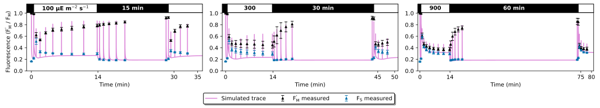
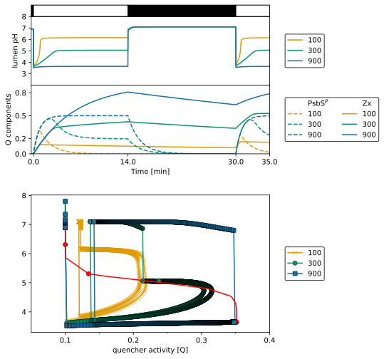
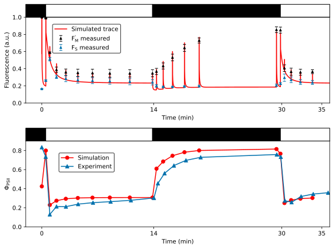
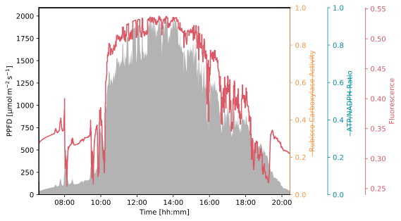
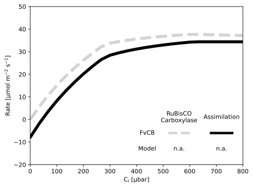
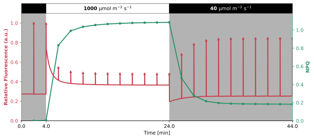
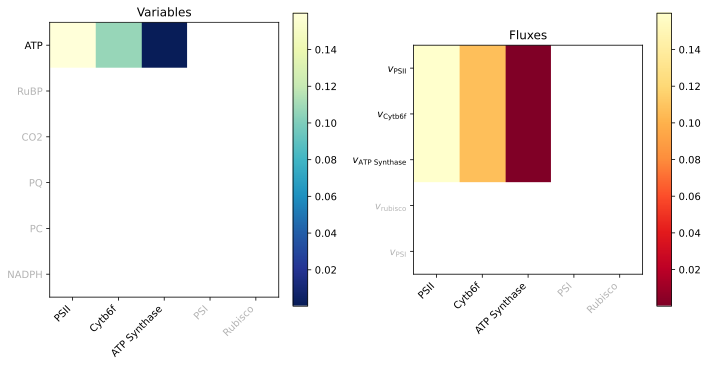
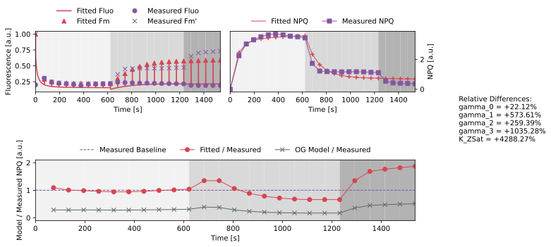

# Matuszynska2016


The [Matuszynska2016](https://doi.org/10.1016/j.bbabio.2016.09.003) model, a small kinetic model, was developed to delve deeper into the effect of light memory caused by non-photochemical quenching. The systematic investigation of the Xanthophyll cycle, a combination of the pigments of violaxanthin, antheraxanthin, and zeaxanthin, sparked a series of experiments to determine whether plant light memory can be detected in a time-scale of minutes to hours through pulse amplitude modulated chlorophyll fluorescence. The model was then created based on these experimental results, providing a comprehensive description of NPQ dynamics and the short-term memory of the *Arabidopsis thaliana* plant.

To keep the model as simple as possible, several processes not directly linked to NPQ have been simplified to create a dynamic ODE system consisting only of 6 different compounds. With these simplifications, the authors could fulfil an additional goal: to make a general framework that is not specific to one model organism.

To demonstrate the adaptability of their model, the authors took their calibrated *Arabidopsis thaliana* model and successfully applied it to the non-model organism *Epipremnum aureum*. This adaptation allowed them to simulate realistic fluorescence measurements and replicate all the key features of chlorophyll induction, showcasing the model's versatility and potential for use in a variety of organisms.

                     
## Installation


All the files needed to run this model are located in [model](./model) folder. To use this model you only need to copy this folder and write the following to import the model in your Python script:

```python
from model import Matuszynska2016
```

The packages required to run this model can either be installed by using the `pixi` environment located inside the [pyproject.toml](../pyproject.toml) file or by just installing the `mxlpy` package and all its dependencies.
                     
### Compounds

#### Part of ODE system

|Name|Common Abbr.|Paper Abbr.|KEGG ID|Python Var|
| :---: | :---: | :---: | :---: | :---: |
|Plastoquinol|$\mathrm{PQH}_2$|$\mathrm{PQH}_2$|C16693|PQH_2|
|Lumenal Proton concentration|$\mathrm{H_{lu}}$|$\mathrm{H}$|C00080|H_lu|
|Concentration of active ATPase protein|$\mathrm{ATPase}^*$|$\mathrm{ATPase}^*$|M00157|ATPase_ac|
|Stromal ATP concentration|$\mathrm{ATP_{st}}$|$\mathrm{ATP}$|C00002|ATP_st|
|Concentration of psbS protein|$\mathrm{psbS}$|$\mathrm{PsbS}$|K03542 |psbS|
|Violaxanthin|$\mathrm{Vx}$|$\mathrm{Vx}$|C08614|Vx|


<details>
<summary>ODE System</summary>

```math 
\frac{\mathrm{d}\mathrm{PQH}_2}{\mathrm{d}t} = v_{\mathrm{PSII}} - v_{\mathrm{PQ}_{\mathrm{ox}}}
```
```math 
\frac{\mathrm{d}\mathrm{H_{lu}}}{\mathrm{d}t} = \frac{2}{b_\mathrm{H}} \cdot v_{\mathrm{PSII}} + \frac{4}{b_\mathrm{H}} \cdot v_{\mathrm{PQ}_{\mathrm{ox}}} + \frac{-\left( \frac{14}{3} \right)}{b_\mathrm{H}} \cdot v_{\mathrm{ATPsynthase}} + \frac{-1}{b_\mathrm{H}} \cdot v_{\mathrm{Leak}}
```
```math 
\frac{\mathrm{d}\mathrm{ATP_{st}}}{\mathrm{d}t} = v_{\mathrm{ATPsynthase}} - v_{\mathrm{ATP}_{\mathrm{consumption}}}
```
```math 
\frac{\mathrm{d}\mathrm{ATPase}^*}{\mathrm{d}t} = v_{\mathrm{ATPactivity}}
```
```math 
\frac{\mathrm{d}\mathrm{Vx}}{\mathrm{d}t} = - v_{\mathrm{Xcyc}}
```
```math 
\frac{\mathrm{d}\mathrm{psbS}}{\mathrm{d}t} = - v_{\mathrm{Psbs^P}}
```

</details>
                     
#### Conserved quantities

|Name|Common Abbr.|Paper Abbr.|KEGG ID|Python Var|old|
| :---: | :---: | :---: | :---: | :---: | :---: |
|Lumen pH|$\mathrm{pH}_\mathrm{lu}$|$\mathrm{pH}$|C00080|pH_lu|pH|
|Plastoquinone|$\mathrm{PQ}$|$\mathrm{PQ}$|C02061|PQ|Pox|
|Stromal ADP concentration|$\mathrm{ADP_{st}}$|$\mathrm{ADP}$|C00008|ADP_st|ADP|
|Concentration of protonated psbS protein|$\mathrm{psbS^P}$|$\mathrm{PsbS^P}$|K03542|PsbSP|Pnr|
|Zeaxanthin concentration|$\mathrm{Zx}$|$\mathrm{Zx}$|C06098|Zx|Z|
|Co-operative 4-state quenching mechanism|$\mathrm{Q}$|$Q$||Q|Q|
|Initial state of PSII|$\mathrm{B_0}$|$\mathrm{B_0}$|M00161|B0|B0|
|Excited state of PSII|$\mathrm{B_1}$|$\mathrm{B_1}$|M00161|B1|B1|
|Charge seperation state of PSII|$\mathrm{B_2}$|$\mathrm{B_2}$|M00161|B2|B2|
|Photoinhibited state of PSII|$\mathrm{B_3}$|$\mathrm{B_3}$|M00161|B3|B3|
|Flourescence|$\mathrm{Fluo}$|$\mathrm{Fluo}$||Fluo|Fluo|


<details>
<summary> Calculations </summary>

```math
\mathrm{pH}_\mathrm{lu} =  -\log_{10} \left( \mathrm{H_{lu}} \cdot 0.00025 \right)
```
```math
\mathrm{PQ} = \mathrm{PQ^{tot}} - \mathrm{PQH}_2
```
```math
\mathrm{ADP_{st}} = \mathrm{AP^{tot}} - \mathrm{ATP_{st}}
```
```math
\mathrm{psbS^P} = \mathrm{PsbS^{tot}} - \mathrm{psbS}
```
```math
\mathrm{Zx} = \mathrm{X^{tot}} - \mathrm{Vx}
```
```math
\mathrm{Q} =  \gamma_0 \cdot \left( 1 - \frac{\mathrm{Zx}}{\mathrm{Zx} + K_\mathrm{ZSat}} \right) \mathrm{psbS} + \gamma_1 \cdot \left( 1 - \frac{\mathrm{Zx}}{\mathrm{Zx} + K_\mathrm{ZSat}} \right) \mathrm{psbS^P} + \gamma_2 \cdot \frac{\mathrm{Zx}}{\mathrm{Zx} + K_\mathrm{ZSat}} \cdot \mathrm{psbS^P} + \gamma_3 \cdot \frac{\mathrm{Zx}}{\mathrm{Zx} + K_\mathrm{ZSat}} \cdot \mathrm{psbS}
```
```math
\mathrm{Fluo} =  \frac{k_F}{k_H \cdot \mathrm{Q} + k_F + k_P} \cdot \mathrm{B_0} + \frac{k_F}{k_H \cdot \mathrm{Q} + k_F} \cdot \mathrm{B_2}
```

<details>
<summary>Quasi steady-state approximation to calculate the rate of PSII</summary>

```math
    \begin{align}
        0 &= - \left( \mathrm{PFD} + \frac{k_{\mathrm{PQH_2}}}{K_\mathrm{QAPQ}} \cdot \mathrm{PQ} \right) \cdot \mathrm{B_0} + \left( k_H \cdot Q + k_F \right) \cdot \mathrm{B_1} + k_{\mathrm{PQH_2}} \cdot \mathrm{PQH}_2 \cdot \mathrm{B_3} \\
        0 &= \mathrm{PFD} \cdot \mathrm{B_0} - \left( k_H \cdot Q + k_F + k_P \right) \cdot \mathrm{B_1} \\
        0 &= \mathrm{PFD} \cdot \mathrm{B_2} - \left( k_H \cdot Q + k_F \right) \cdot \mathrm{B_3} \\
        \mathrm{PSII^{tot}} &= \mathrm{B_0} + \mathrm{B_1} + \mathrm{B_2} + \mathrm{B_3} 
    \end{align}
```
</details>
</details>

                     
### Parameters

|Short Description|Common Abbr.|Paper Abbr.|Value|Unit|Python Var|Reference|
| :---: | :---: | :---: | :---: | :---: | :---: | :---: |
|PSII reaction centres pool|$\mathrm{PSII^{tot}}$|$\mathrm{PSII^{tot}}$|$2.5$|$\mathrm{mmol(mol\ Chl)^{-1}}$|PSII_tot|[[1]](https://doi.org/10.1104/pp.104.052324)|
|Plastoquinone pool|$\mathrm{PQ^{tot}}$|$\mathrm{PQ^{tot}}$|$20$|$\mathrm{mmol(mol\ Chl)^{-1}}$|PQ_tot|[[2]](https://doi.org/10.1021/bi011650y)|
|Total adenosine phosphate pool|$\mathrm{AP^{tot}}$|$\mathrm{AP^{tot}}$|$50$|$\mathrm{mmol(mol\ Chl)^{-1}}$|AP_tot|[[3]](https://doi.org/10.1104/pp.95.4.1131)|
|Total PsbS protein pool, LHCII normalized|$\mathrm{PsbS^{tot}}$|$\mathrm{PsbS^{tot}}$|$1$||PsbS_tot||
|Total xanthophyll pool normalized|$\mathrm{X^{tot}}$|$\mathrm{X^{tot}}$|$1$||X_tot||
|External oxygen pool, corresponds to $250\ \mathrm{µM}$|$\mathrm{O_2^{ex}}$|$\mathrm{O_2^{ex}}$|$8$|$\mathrm{mmol(mol\ Chl)^{-1}}$|O2_ex|[[4]](https://doi.org/10.1098/rstb.2013.0223)|
|Internal phosphates pool|$\mathrm{Pi^{mol}}$|$\mathrm{Pi^{mol}}$|$0.01$||Pi||
||$k_{\mathrm{Cytb6f}}$|$k_{\mathrm{Cytb6f}}$|$0.104$|$\mathrm{mmol^{-2}(mol\ Chl)^{2}s^{-1}}$|k_Cytb6f||
|Rate constant of ATPase activation in the light|$k_{\mathrm{ActATPase}}$|$k_{\mathrm{ActATPase}}$|$0.01$|$\mathrm{s}^{-1}$|k_ActATPase||
|Parameter of ATPase deactivation in the night|$k_{\mathrm{DeactATPase}}$|$k_{\mathrm{DeactATPase}}$|$0.002$|$\mathrm{s}^{-1}$|k_DeactATPase||
||$k_{\mathrm{ATPsynthase}}$|$k_{\mathrm{ATPsynthase}}$|$20$|$\mathrm{s}^{-1}$|k_ATPsynth|[[4]](https://doi.org/10.1098/rstb.2013.0223)|
||$k_{\mathrm{ATPconsumption}}$|$k_{\mathrm{ATPconsumption}}$|$10$|$\mathrm{s}^{-1}$|k_ATPconsum|[[4]](https://doi.org/10.1098/rstb.2013.0223)|
||$k_{\mathrm{PQH_2}}$|$k_{\mathrm{PQred}}$|$250$|$\mathrm{mmol^{-1}(mol\ Chl)s^{-1}}$|k_PQH2|[[4]](https://doi.org/10.1098/rstb.2013.0223)|
|Rate of non-radiative decay|$k_H$|$k_H$|$5 \cdot 10^9$|$\mathrm{s}^{-1}$|k_H|[[4]](https://doi.org/10.1098/rstb.2013.0223)|
|Rate of flourescence|$k_F$|$k_F$|$6.25 \cdot 10^8$|$\mathrm{s}^{-1}$|k_F||
|Rate of photochemistry|$k_P$|$k_P$|$5 \cdot 10^9$|$\mathrm{s}^{-1}$|k_P|[[4]](https://doi.org/10.1098/rstb.2013.0223)|
||$k_\mathrm{PTOX}$|$k_\mathrm{PTOX}$|$0.01$|$\mathrm{mmol^{-1}(mol\ Chl)s^{-1}}$|k_PTOX|[[4]](https://doi.org/10.1098/rstb.2013.0223)|
|Stroma pH of a dark adapted state|$\mathrm{pH}_{\mathrm{st}}$|$\mathrm{pH}_\mathrm{stroma}$|$7.8$||pH_st||
||$k_\mathrm{leak}$|$k_\mathrm{leak}$|$1000$|$\mathrm{s}^{-1}$|k_leak||
|Proton buffering constant|$b_\mathrm{H}$|$b_\mathrm{H}$|$100$||b_H|[[5]](https://doi.org/10.1007/s11120-006-9109-1)|
|Ratio of protons to ATP in ATP synthase|$\mathrm{HPR}$|$\mathrm{HPR}$|$\frac{14}{3}$||hpr||
|Rate constant of de-epoxidation of violaxanthin|$k_\mathrm{kDeepoxV}$|$k_\mathrm{DeepoxV}$|$0.0024$|$\mathrm{s}^{-1}$|k_DV|[[6]](https://doi.org/10.1016/j.jplph.2014.03.004)|
|Rate constant of epoxidation of violaxanthin|$k_\mathrm{kEpoxZ}$|$k_\mathrm{EpoxZ}$|$0.00024$|$\mathrm{s}^{-1}$|k_EZ||
|Half-saturation pH for de-epoxidase activity, highest activity at pH 5.8|$K_\mathrm{pHSat}$|$K_\mathrm{pHSat}$|$5.8$||K_pHSat||
|Hill-coefficient for de-epoxidase acitivity|$\mathrm{nH}_\mathrm{X}$|$\mathrm{nH}_\mathrm{X}$|$5$||nhx||
|Half-saturation constant (relative conc. of Zx) for quenching|$K_\mathrm{ZSat}$|$K_\mathrm{ZSat}$|$0.12$||K_ZSat||
|Hill-coefficient for de.protonation activity|$\mathrm{nH}_\mathrm{L}$|$\mathrm{nH}_\mathrm{L}$|$3$||nhl||
|Rate of PsbS deprotonation|$k_\mathrm{Deprotonation}$|$k_\mathrm{Deprotonation}$|$0.0096$|$\mathrm{s}^{-1}$|k_deprot||
|Rate of PsbS protonation|$k_\mathrm{Protonation}$|$k_\mathrm{Protonation}$|$0.0096$|$\mathrm{s}^{-1}$|k_prot||
|pKa of PsbS activation, kept the same as for VDA|$K_\mathrm{pHSatLHC}$|$K_\mathrm{pHSatLHC}$|$5.8$||K_pHSatLHC||
|Fitted quencher factor corresponding to base quenching not associated with protonation or zeaxanthin|$\gamma_0$|$\gamma_0$|$0.1$||gamma_0||
|Fitted quencher factor corresponding to fast quenching due to protonation|$\gamma_1$|$\gamma_1$|$0.25$||gamma_1||
|Fitted quencher factor corresponding to fastest possible quenching|$\gamma_2$|$\gamma_2$|$0.6$||gamma_2||
|Fitted quencher factor corresponding to slow quenching of Zx present despite lack of protonation|$\gamma_3$|$\gamma_3$|$0.15$||gamma_3||
|Faraday constant|$F$|$F$|$96.485$|$\mathrm{kJ}$|F||
|Universal gas constant|$R$|$R$|$8.3$|$\mathrm{J\ K^{-1} \ mol^{-1}}$|R||
|Temperature|$T$|$T$|$298$|$\mathrm{K}$|T||
||$E^0\mathrm{(QA/QA^-)}$|$E^0\mathrm{(QA/QA^-)}$|$-0.140$|$\mathrm{V}$|E0_QA|[[7]](https://doi.org/10.1073/pnas.1100173108)|
||$E^0\mathrm{(PQ/PQH_2)}$|$E^0\mathrm{(PQ/PQH_2)}$|$0.354$|$\mathrm{V}$|E0_PQ|[[8]](https://doi.org/10.1016/0005-2728(76)90067-0)|
||$E^0\mathrm{(PC/PC^-)}$|$E^0\mathrm{(PC/PC^-)}$|$0.380$|$\mathrm{V}$|E0_PC|[[9]](https://doi.org/10.1093/oxfordjournals.pcp.a077363)|
|Standard Gibbs free energy change of ATP formation|$\Delta G_{0_{\mathrm{ATP}}}$|$\Delta G_{0_{\mathrm{ATP}}}$|$30.6$|$\mathrm{kJ mol^{-1}}$|DG_ATP|[[10]](https://doi.org/10.1016/B978-012518121-1/50000-2)|
|Photon Flux Density|$\mathrm{PFD}$|$\mathrm{PFD}$|$100$|$\mathrm{µE\ m^{-2}\ s^{-1}}$|pfd||

#### Derived Parameters

|Short Description|Common Abbr.|Paper Abbr.|Python Var|old|
| :---: | :---: | :---: | :---: | :---: |
|Stroma proton concentration of a dark adapted state|$\mathrm{H}_\mathrm{st}$|$\mathrm{H}_\mathrm{st}$|H_st|H_st|
|Inversion of $K_\mathrm{pHSat}$|$K_\mathrm{pHSat\|inv}$|$K_{\mathrm{pHSat}_\mathrm{inv}}$|K_pHSat_inv|KphSatZ_inv|
|Inversion of $K_\mathrm{pHSatLHC}$|$K_\mathrm{pHSatLHC\|inv}$|$K_{\mathrm{pHSatLHC}_\mathrm{inv}}$|K_pHSatLHC_inv|KphSatLHC_inv|
|Equilibrium constant of |$K_\mathrm{QAPQ}$|$K_\mathrm{eq, QAPQ}$|K_QAPQ|KeqQAPQ|
|Equilibrium constant of ATPsynthase|$K_\mathrm{ATPsynthase}$|$K_\mathrm{eq, ATPsynthase}$|K_cytb6f|Keqcytb6f|
|Equilibrium constant of Cytb6f|$K_\mathrm{cytb6f}$|$K_\mathrm{eq, cytb6f}$|K_ATPsynth|KeqATPsyn|


<details>
<summary>Equations of derived parameters</summary>

```math
\mathrm{H}_\mathrm{st} =  32000.0 \cdot 10^{-\mathrm{pH}_{\mathrm{st}}}
```
```math
K_\mathrm{pHSat \vert inv} =  32000.0 \cdot 10^{-K_\mathrm{pHSat}}
```
```math
K_\mathrm{pHSatLHC \vert inv} =  32000.0 \cdot 10^{-K_\mathrm{pHSatLHC}}
```
```math
K_\mathrm{QAPQ} =  \exp \left( \frac{-\left( -2 \cdot -F \cdot E^0\mathrm{(QA/QA^-)} + -2 \cdot F \cdot E^0\mathrm{(PQ/PQH_2)} + 2 \cdot \mathrm{pH}_{\mathrm{st}} \cdot \ln 10 \cdot R \cdot T \right)}{R \cdot T} \right)
```
```math
K_\mathrm{ATPsynthase} =  \exp \left( \frac{-\left( -\left( -2 F \cdot E^0\mathrm{(PQ/PQH_2)} + 2 \cdot R \cdot T \cdot \ln 10 \cdot \mathrm{pH}_\mathrm{lu} \right) + 2 \cdot -F \cdot E^0\mathrm{(PC/PC^-)} + 2 \cdot R \cdot T \cdot \ln 10 \cdot \left( \mathrm{pH}_{\mathrm{st}} - \mathrm{pH}_\mathrm{lu} \right) \right)}{R \cdot T} \right)
```
```math
K_\mathrm{cytb6f} =  \mathrm{Pi^{mol}} \cdot \exp \left( \frac{-\left( \Delta G_{0_{\mathrm{ATP}}} - \ln 10 \cdot \left( \mathrm{pH}_{\mathrm{st}} - \mathrm{pH}_\mathrm{lu} \right) \frac{14}{3} \cdot R \cdot T \right)}{R \cdot T} \right)
```

</details>

                     
### Reaction Rates

|Short Description|Common Abbr.|Paper Abbr.|KEGG ID|Python Var|
| :---: | :---: | :---: | :---: | :---: |
|Reduction of PQ due to PSII|$v_{\mathrm{PSII}}$|$v_{\mathrm{PSII}}$|R09503|v_PSII|
|Oxidation of the PQ pool through cytochrome and PTOX|$v_{\mathrm{PQ}_{\mathrm{ox}}}$|$v_{\mathrm{PQ}_{\mathrm{ox}}}$||v_PQ|
|Production of ATP by ATPsynthase|$v_{\mathrm{ATPsynthase}}$|$v_{\mathrm{ATPsynthase}}$|R00086|v_ATPsynth|
|Activation of ATPsynthase by light|$v_{\mathrm{ATPactivity}}$|$v_{\mathrm{ATPactivity}}$||v_ATPact|
|Transmembrane Proton Leak|$v_{\mathrm{Leak}}$|$v_{\mathrm{Leak}}$||v_Leak|
|ATP consuming reaction|$v_{\mathrm{ATP}_{\mathrm{consumption}}}$|$v_{\mathrm{ATP}_{\mathrm{consumption}}}$||v_ATPcons|
|Xanthophyll cycle|$v_{\mathrm{Xcyc}}$|$v_{\mathrm{Xcyc}}$|R10070|v_Xcyc|
|Protonation of psbS protein|$v_{\mathrm{Psbs^P}}$|$v_{\mathrm{Psbs^P}}$||v_PsbSP|


<details>
<summary>Rate equations</summary>

```math
v_{\mathrm{PSII}} =  k_P \cdot 0.5 \mathrm{B_1}
```
```math
v_{\mathrm{PQ}_{\mathrm{ox}}} =  \left( \frac{k_{\mathrm{Cytb6f}} \cdot \mathrm{PFD} \cdot K_\mathrm{ATPsynthase}}{K_\mathrm{ATPsynthase} + 1} + k_\mathrm{PTOX} \cdot \mathrm{O_2^{ex}} \right) \mathrm{PQH}_2 - \frac{k_{\mathrm{Cytb6f}} \cdot \mathrm{PFD}}{K_\mathrm{ATPsynthase} + 1} \cdot \left( \mathrm{PQ^{tot}} - \mathrm{PQH}_2 \right)
```
```math
v_{\mathrm{ATPsynthase}} =  \mathrm{ATPase}^* \cdot k_{\mathrm{ATPsynthase}} \cdot \left( \mathrm{AP^{tot}} - \mathrm{ATP_{st}} - \frac{\mathrm{ATP_{st}}}{K_\mathrm{cytb6f}} \right)
```
```math
v_{\mathrm{ATPactivity}} =  k_{\mathrm{ActATPase}} \cdot \left( \mathrm{PFD} > 0 \right) \left( 1 - \mathrm{ATPase}^* \right) - k_{\mathrm{DeactATPase}} \cdot \left( 1 - \left( \mathrm{PFD} > 0 \right) \right) \mathrm{ATPase}^*
```
```math
v_{\mathrm{Leak}} =  k_\mathrm{leak} \cdot \left( \mathrm{H_{lu}} - \mathrm{H}_\mathrm{st} \right)
```
```math
v_{\mathrm{ATP}_{\mathrm{consumption}}} =  k_{\mathrm{ATPconsumption}} \cdot \mathrm{ATP_{st}}
```
```math
v_{\mathrm{Xcyc}} =  k_\mathrm{kDeepoxV} \cdot \frac{\mathrm{H_{lu}}^{\mathrm{nH}_\mathrm{X}}}{\mathrm{H_{lu}}^{\mathrm{nH}_\mathrm{X}} + K_\mathrm{pHSat \vert inv}^{\mathrm{nH}_\mathrm{X}}} \cdot \mathrm{Vx} - k_\mathrm{kEpoxZ} \cdot \left( \mathrm{X^{tot}} - \mathrm{Vx} \right)
```
```math
v_{\mathrm{Psbs^P}} =  k_\mathrm{Protonation} \cdot \frac{\mathrm{H_{lu}}^{\mathrm{nH}_\mathrm{L}}}{\mathrm{H_{lu}}^{\mathrm{nH}_\mathrm{L}} + K_\mathrm{pHSatLHC \vert inv}^{\mathrm{nH}_\mathrm{L}}} \cdot \mathrm{psbS} - k_\mathrm{Deprotonation} \cdot \left( \mathrm{PsbS^{tot}} - \mathrm{psbS} \right)
```

</details>

                     
### Figures


You can find the recreation of the figures from the original publication below. Due to differing copyright reasons the original figures cannot be included in this README file. Instead, the comparision has to be made using the original publication.


                     
<details>
<summary>Figure 4</summary>
                     

           
A Pulse Amplitude Modulation (PAM) protocol was done using *Arabidopsis thaliana* plants, with three different light levels and durations. The protocols start with a saturating pulse, followed by a dark period of 30 s, then a light period of 14 min that starts with a saturating pulse and continues with 7 additional ones, all an accumulative 20 seconds apart (+30 s, +50 s, +70 s, etc. from the start of the period). Then another dark period of differing lengths, also starting with a saturating pulse and going along with 5 additional ones, also an accumulative 20 seconds apart. To end the protocol, a final light period of 5 min, with a saturating pulse to start and 4 additional ones, also an accumulative 20 seconds apart. The three different protocols only differ in the light intensities of the light periods and the duration of the second dark period. The first protocol, shown on the left, has a light intensity of $100 \mathrm{\mu mol\ m^{-2}\ s^{-1}}$ and a second dark period of 15 min. The second protocol, shown in the middle, has a light intensity of $300 \mathrm{\mu mol\ m^{-2}\ s^{-1}}$ and a second dark period of 30 min. The third protocol, shown on the right, has a light intensity of $900 \mathrm{\mu mol\ m^{-2}\ s^{-1}}$ and a second dark period of 60 min. The experimental values shown, are the base fluorescence (F) (blue) and the maximal fluorescence (Fm) (black). Three replicates for each measurement were done, but only the mean values and standard deviation are shown. The data was taken from the original publication, therefore all the other meta-information is to be read there. The simulation (pink) was done using the default parameters and changing the Photosynthetic Photon Flux Density (PPFD) to match the light intensities of the protocols and saturating pulses of $2000 \mathrm{\mu mol\ m^{-2}\ s^{-1}}$. Additionally, the PPFD was converted to an internal activation rate, that was calibrated to three light intensities of *A. thaliana*. This was done by following equation: Light = 0.0005833 · PPFD2 + 0.2667 · PPFD + 187.

This figure could easily be recreated, including the experimental data. However, The data had to be moved along the x-axis to fit the peaks, which is believed was also done in the original publication.

</details>


                     
<details>
<summary>Figure 5</summary>
                     


A protocol of dark and light periods was used to simulate the model at three different light intensities. The protocol starts with a dark period of 30 s, followed by a light period of 14 min, then another dark period of 16 min, and ending with a final light period of 5 min. The three different light intensities used in the light periods were $100 \mathrm{\mu mol\ m^{-2}\ s^{-1}}$ (yellow), $300 \mathrm{\mu mol\ m^{-2}\ s^{-1}}$ (green), and $900 \mathrm{\mu mol\ m^{-2}\ s^{-1}}$ (blue). The time series of each simulation is shown in the top plot, for the lumenal pH and the concentration of the quencher components protonated PsbS protein (PsbSP) and zeaxanthin (Zx). The bottom plot shows a phase plane trajectory of the co-operative 4-state quenching mechanism (Q) and the lumenal pH for each light intensity. Each simulation was done with the default parameters of the model, whereas the light intensities were inputted using the conversion of Photosynthetic Photon Flux Density (PPFD) to an internal activation rate for Arabidopsis thaliana by following equation: Light = 0.0005833 · PPFD2 + 0.2667 · PPFD + 187.5.

The top figure shows a striking similarity to the publication except for the lumenal pH curve of $300 \mathrm{\mu mol\ m^{-2}\ s^{-1}}$ and $900 \mathrm{\mu mol\ m^{-2}\ s^{-1}}$ light intensity, both shifted slightly downwards in the recreation. However, both show the same trend through the time series. The phase plane trajectory on the other hand, shows only a slight similarity. The highest lumenal pH reaches at higher co-operative 4-state quenching mechanism (Q) activity is that of 7, while in the publication it is near to 8. Overall, the trajectories are all shifted downwards in the recreation, except for the trajectory of $100 \mathrm{\mu mol\ m^{-2}\ s^{-1}}$, which shows the most similarity to the publication. On top of that, the steady-state values are also all shifted downwards and the points attributed to the light intensities, are not in the same places as in the publication.

</details>


                     
<details>
<summary>Figure 6</summary>
                     


A Pulse Amplitude Modulation (PAM) protocol was done using Epipremnum aureum plants that starts with a saturating pulse, followed by a dark period of 30 s, then a light period of 14 min of a light intensity of that starts with a saturating pulse and continues with 7 additional ones, all an accumulative 20 seconds apart (+30 s, +50 s, +70 s, etc. from the start of the period). Then another dark period of 16 min, also starting with a saturating pulse and going along with 5 additional ones, also an accumulative 20 seconds apart, except for the last that occurs 30 s. To end the protocol, a final light period of 5 min, with a saturating pulse to start and 4 additional ones, also an accumulative 20 seconds apart. The light intensity used for the light periods is $100 \mathrm{\mu mol\ m^{-2}\ s^{-1}}$, while the dark is $0 \mathrm{\mu mol\ m^{-2}\ s^{-1}}$. The experimental values shown, are the base fluorescence (F ) (blue) and the maximal fluorescence (Fm) (black) at the top and the efficiency of photosystem II (ΦPSII) at the bottom. Three replicates for each measurement were done, but only the mean values are shown and also the standard deviation for the F . The data was taken from the original publication [5], therefore all the other meta-information is to be read there. To change the model to the E. aureum version, only the Fitted quencher factor corresponding to fastest possible quenching ($\gamma$2) was changed (= 1). However, the conversion of the PPFD to an internal activation rate was done using the following equation: Light = 0.0004167 · PPFD2 + 0.3333 · PPFD + 862.5. With these changes the model was simulated using the same PAM protocol and the same results were plotted to the corresponding experimental data (red).

This figure could also be successfully recreated, with only two small discrepancies. The first is that the first value of the ΦPSII curve in the recreation is much lower than in the publication and the second is that the recreation misses the last value of the ΦPSII curve. Other than that, both simulation results and experimental data show a very good match to the publication. Here it should also be noted that the experimental data was shifted on the x-axis to fit the peaks of the simulation, as was done for the prior figure.

</details>

### Demonstrations


                     
<details>
<summary>Day Simulation</summary>
                     


Sample simulation of a day cycle using real Photosynthetic Photon Flux Density (PPFD) data from Kansas, USA on June 19, 2023. The data was obtained from the National Ecological Observatory Network (NEON) data portal and is used to create a protocol for the light intensity PPFD over the course of the day, in a minute interval. The data used is filtered to only show a PPFD that equals or is higher than $40 \mathrm{µmol\ m^{−2}\ s^{−1}}$. This threshold is chosen as it has shown to allow most models to still simulate the photosynthetic machinery, while still being a decent representation of the actual daylight conditions. The simulation is run using the default parameters and initial conditions of each model, and the RuBisCO carboxylation rate (vRuBisCO), Adenosine Triphosphate (ATP) and Nicotinamide Adenine Dinucleotide Phosphate (NADPH) ratio, and fluorescence (F) results is plotted over the course of the day, if possible. The results do not represent actual plant behavior, but show the capabilities of the model to simulate complex and more realistic light protocols.

**Notes:**

The model only includes the Fluorescence.

</details>


                     
<details>
<summary>FvCB Submodule</summary>
                     


Comparison of modelled carbon assimilation (A) and RuBisCO carboxylation rate (vRuBisCO) against the Farquhar, von Caemmerer, and Berry (FvCB) model. The FvCB model is calculated using the min-W approach as described by Lochoki and McGrath (2025). To be able to simulate A, there are two mandatory quantities that need to be present in the model: carbon dioxide (CO2) concentration and vRuBisCO. If one of these parameters is missing, the FvCB model will still be shown, but no comparison with the model will be possible. Other parameters that are required to calculate the FvCB model will be added as parameters with default values if they are not present in the model. The simulation is then run until steady-state, or quasi-steady-state if not otherwise possible, for different intercellular CO2 concentration (Ci) partial pressure. The carbon assimilation shown does not represent actual values but rather a theoretical curve to compare the kinetic model to the popular FvCB model.

**Assumptions:**

- If no CO<sub>2</sub> concentration nor rate of rubisco carboxylation ($v_\mathrm{c}$) is present in the model, no comparison will be shown
- Infinite mesophyll conductance, therefore intercellular CO<sub>2</sub> partial pressure equals chloroplast partial pressure ($\mathrm{C_i} = \mathrm{C_c}$)
- If no $\mathrm{C_i}$ is present in the model, it will be added as a parameter assuming an initial value of CO<sub>2</sub> concentration divided by Henry's law constant for CO<sub>2</sub> ($H_\mathrm{s}^{cp}$)
- If no $H_\mathrm{s}^{cp}$ is present in the model, it will be added as a parameter with a value of $3.4 \times 10^{-4}\ \mathrm{mmol\ Pa^ {-1}}$ [[2]](https://doi.org/10.5194/acp-23-10901-2023)
- If no CO<sub>2</sub> compensation point in the absence of non-photorespiratory CO<sub>2</sub> release ($\Gamma ^*$) is present in the model, it will be added as a parameter with a value of $38.6\ \mathrm{\mu bar}$ [[1]](https://doi.org/10.1101/2025.03.11.642611)
- If no $R_\mathrm{light}$ is present in the model, it will be added as a parameter with a value of $1\ \mathrm{\mu mol\ m^{-2}\ s^{-1}}$ [[1]](https://doi.org/10.1101/2025.03.11.642611)
- If no $A$ is present in the model, it will be added as a derived variable following the FvCB equation [[1]](https://doi.org/10.1101/2025.03.11.642611): $v_\mathrm{c} \cdot \left(1 - \frac{\Gamma ^*}{C_i}\right) - R_\mathrm{light}$
- To be able to compare with original FvCB curves, the model needs to have $v_\mathrm{c}$ following the same units as the FvCB model ($\mathrm{\mu mol\ m^{-2}\ s^{-1}}$). The `mM_to_µmol_per_m2` can be used to convert from mM to $\mathrm{\mu mol\ m^{-2}}$ assuming a volume factor of $0.0112\ \mathrm{L\ m^{-2}}$ in the stroma [[3]](https://doi.org/10.1007/s11120-006-9109-1). If the given units are in mM, the conversion will be done automatically, by adding a derived parameter with the converted values.

**Notes:**

| Parameter                 | In Model          |
| -----------               | -----------       |
| $\mathrm{CO}_2$         | None          |
| $v_\mathrm{c}$          | None  |
| $\mathrm{C_i}$          | None          |
| $H_\mathrm{s}^{cp}$   | None              |
| $\Gamma ^*$               | None              |
| $R_\mathrm{light}$      | None        |
| $A$                       | None            |


</details>


                     
<details>
<summary>PAM Simulation</summary>
                     


Sample simulation of a common Pulse Amplitude Modulation (PAM) protocol to show fluctuations of fluorescence (F) and Non-Photochemical Quenching (NPQ) using saturating pulses. The simulation protocol is as follows: A dark adaptation period that simulates for 30 minutes at a dark light intensity ($40 \mathrm{µmol\ m^{−2}\ s^{−1}}$), then the actual protocol starts. The protocol consists of 22 periods with each being 2 minutes of length. That period consists of a specific light intensity of the respective type of period and ends with a saturating pulse with a length of 0.8 s and a light intensity of $3000 \mathrm{µmol\ m^{−2}\ s^{−1}}$. First, two dark periods with light intensity of $40 \mathrm{µmol\ m^{−2}\ s^{−1}}$, followed by ten light periods with light intensity of 1000 µmol m−2 s−1, then ten dark periods again. The simulation is run using the default parameters and initial conditions of each model.

**Assumptions:**

- If no Flourescence and NPQ output is present in the model, it can not be shown in the results.
- If Flourescence is present, $F_\mathrm{m}$ is found by using the protocol used in the simulation to find each saturating pulse. A period between each pulse is taken and the maximum Flourescence value during the pulse is taken as $F_\mathrm{m}$.
- If $F_\mathrm{m}$ is found and NPQ is not present, NPQ is calculated using the formula: $NPQ_t = \frac{F_{\mathrm{m}\vert t=0} - F_{\mathrm{m} \vert t}}{F_{\mathrm{m} \vert t}}$

**Notes:**

No NPQ, therefore calculated from fluorescnece

</details>


                     
<details>
<summary>Photosynthesis MCA</summary>
                     


A sample Metabolic Control Analysis (MCA) of typical photosynthesis variables and fluxes. A control coefficient analysis is to be performed, therefore each parameter represents a single coefficient of the photosynthesis rate. The rates chosen should represent  RuBisCO carboxylation rate (vRuBisCO), PSII rate (vPSII), PSI rate (vPSI), Cytb6f rate (vb6f) and ATP synthase rate (vATPSynth). The variables chosen should represent  carbon dioxide (CO2) concentration, Ribulose-1,5-bisphosphate (RuBP), oxidised plastoquinone (PQox), oxidised plastocyanin (PCox), denosine Triphosphate (ATP), and Nicotinamide Adenine Dinucleotide Phosphate (NADPH). For each parameter to be scanned, the model is simulated to steady-state, with a displacement of $\pm 0.01\%$ of each respective parameter. The control coefficients are then calculated for each variable and flux by the following formula: $C_{p}^{x} = \frac{x_\mathrm{upper} - x_\mathrm{lower}}{2 \cdot \mathrm{disp} \cdot p}$, where $C_{p}^{x}$ is the control coefficient of parameter $p$ on variable or flux $x$, and $\mathrm{disp}$ is the displacement value. $x_\mathrm{upper}$ and $x_\mathrm{lower}$ are the steady-state result of $x$ at either $+\mathrm{disp}$ and $-\mathrm{disp}$ respectively. It has to be noted that the (MCA) results can be very dependent on the other values of the parameters in the model, therefore the results shown here are only representative of the default parameter set of the model.

**Assumptions:**

- Steady-State needs to be achievable for the model to perform the MCA.
- The parameters for each coefficient, rates, and variables chosen need to be representative of the respective process.
- If a parameter, rate, or variable is not present in the model, the respective coefficient will be greyed out in the Heatmap.

**Notes:**

| Coefficient                   | In Model          |
| -----------                   | -----------       |
| $\mathrm{PSII}$             | k_P|
| $\mathrm{PSI}$              | None |
| $\mathrm{RuBisCO \vert C}$  | None |
| $\mathrm{cytb6f}$           | k_{\mathrm{Cytb6f}}              |
| $\mathrm{ATPsynthase}$      | k_{\mathrm{ATPsynthase}}              |

| Flux                          | In Model          |
| -----------                   | -----------       |
| $\mathrm{PSII}$             | v_{\mathrm{PSII}} |
| $\mathrm{PSI}$              | None |
| $\mathrm{RuBisCO \vert C}$  | None |
| $\mathrm{cytb6f}$           | v_{\mathrm{PQ}_{\mathrm{ox}}}              |
| $\mathrm{ATPsynthase}$      | v_{\mathrm{ATPsynthase}}              |

| Variable                  | In Model      |
| -----------               | -----------   |
| $\mathrm{CO_2}$         | None       |
| $\mathrm{RUBP}$         | None      |
| $\mathrm{PQ_{ox}}$    | \mathrm{PQ}          |
| $\mathrm{PC_{ox}}$    | None          |
| $\mathrm{ATP}$          | \mathrm{ATP_{st}}    |
| $\mathrm{NADPH}$        | None  |

</details>


                     
<details>
<summary>PAM Fitting</summary>
                     


Sample fitting to experimental Non-Photochemical Quenching (NPQ) data. The NPQ data used is taken from experimental work published in von Bismarck (2022) and was acquired using Maxi Imaging-PAM (Walz, Germany) using Col-0 Arabidopsis thaliana (A. thaliana) plants. It is assumed that the experiment follows the default PAM protocol of the machine, as no other experimental protocol has been given. Therefore, the protocol of each simulation follows the data given, where the length of one saturating pulse is set to 720 µs at a light intensity of $5000 \mathrm{µmol\ m^{−2}\ s^{−1}}$. The light protocol consists of a dark adaptation period of 30 minutes to acclimate the simulation conditions. Then the actual protocol starts with a longer phase of high actinic light ($903 \mathrm{µmol\ m^{−2}\ s^{−1}}$) for approximately 10 minutes, followed by a lower actinic light of ($90 \mathrm{µmol\ m^{−2}\ s^{−1}}$) for 10 minutes, and then 5 minutes of a dark period. During each phase, saturating pulses are given approximately every 60 seconds. As the experimental data also provides exact time points for each pulse, these were taken as reference for the protocol and not the general time intervals. In the experimental work, the dark period consists of actual darkness, whereas in the simulation a low light intensity of $40 \mathrm{µmol\ m^{−2}\ s^{−1}}$ is used to avoid numerical issues. The fitting is performed using the lmfit package in Python with the leastsquare method. On top of that, a standard scaling towards the experimental data is done, to keep the fitting results in the same order of magnitude. To help the fitting converge, weights are applied to the data points, which are defined as the reciprocal of the standard deviation. These settings set are not to be taken as set in stone, as fitting is a highly experimental process and differing settings might be required depending on the model and data used. These settings are a basic starting point for fitting data to a model. The hardest and most impactful decision while fitting is the choice of parameters to fit. There are many ways to find which parameters may be most impactful to fit, such as sensitivity analysis or metabolic control analysis. However, either way experimenting with different parameter sets is always required to find the best fitting practice, which differs for each model and also data to fit to.

**Assumptions:**

- If no Flourescence and NPQ output is present in the model, it can not be shown in the results.
- If Flourescence is present, $F_\mathrm{m}$ is found by using the protocol used in the simulation to find each saturating pulse. A period between each pulse is taken and the maximum Flourescence value during the pulse is taken as $F_\mathrm{m}$.
- If $F_\mathrm{m}$ is found and NPQ is not present, NPQ is calculated using the formula: $NPQ_t = \frac{F_{\mathrm{m}\vert t=0} - F_{\mathrm{m} \vert t}}{F_{\mathrm{m} \vert t}}$

**Notes:**

The \gamma_0, \gamma_1, \gamma_2, \gamma_3, and K_\mathrm{ZSat} parameters were fitted

</details>
