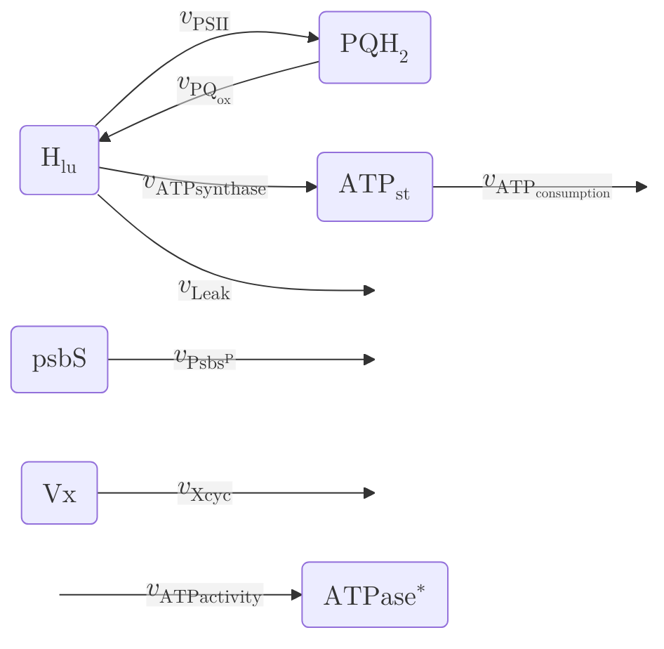

# Matuszynska2016


The [Matuszynska2016](https://doi.org/10.1016/j.bbabio.2016.09.003) model, a small kinetic model, was developed to delve deeper into the effect of light memory caused by non-photochemical quenching. The systematic investigation of the Xanthophyll cycle, a combination of the pigments of violaxanthin, antheraxanthin, and zeaxanthin, sparked a series of experiments to determine whether plant light memory can be detected in a time-scale of minutes to hours through pulse amplitude modulated chlorophyll fluorescence. The model was then created based on these experimental results, providing a comprehensive description of NPQ dynamics and the short-term memory of the *Arabidopsis thaliana* plant.

To keep the model as simple as possible, several processes not directly linked to NPQ have been simplified to create a dynamic ODE system consisting only of 6 different compounds. With these simplifications, the authors could fulfil an additional goal: to make a general framework that is not specific to one model organism.

To demonstrate the adaptability of their model, the authors took their calibrated *Arabidopsis thaliana* model and successfully applied it to the non-model organism *Epipremnum aureum*. This adaptation allowed them to simulate realistic fluorescence measurements and replicate all the key features of chlorophyll induction, showcasing the model's versatility and potential for use in a variety of organisms.


## Installation

## Summary

### Compounds

#### Part of ODE system

|Name|Common Abbr.|Paper Abbr.|MetaCyc ID|Python Var|
| :---: | :---: | :---: | :---: | :---: |
|Plastoquinol|$\mathrm{PQH}_2$|$\mathrm{PQH}_2$|Plastoquinols|PQH_2|
|Stromal ATP concentration|$\mathrm{ATP_{st}}$|$\mathrm{ATP}$|ATP|ATP_st|
|Lumenal Proton concentration|$\mathrm{H_{lu}}$|$\mathrm{H}$|PROTON|H_lu|
|Concentration of psBS protein|$\mathrm{psbS}$|$\mathrm{PsbS}$|AT1G44575|psbS|
|Violaxanthin|$\mathrm{Vx}$|$\mathrm{Vx}$|CPD1F-133|Vx|
|Concentration of active ATPase protein|$\mathrm{ATPase}^*$|$\mathrm{ATPase}^*$||ATPase_ac|


<details>
<summary>ODE System</summary>

```math
    \begin{align}
        \frac{\mathrm{d}\mathrm{PQH}_2}{\mathrm{d}t} &= v_{\mathrm{PSII}} - v_{\mathrm{PQ}_{\mathrm{ox}}}\\
        \frac{\mathrm{d}\mathrm{ATP_{st}}}{\mathrm{d}t} &= v_{\mathrm{ATPsynthase}} - v_{\mathrm{ATP}_{\mathrm{consumption}}}\\
        \frac{\mathrm{d}\mathrm{H_{lu}}}{\mathrm{d}t} &= \frac{1}{b_{\mathrm{H}}} \cdot \left( 2 \cdot v_{\mathrm{PSII}} + 4 \cdot v_{\mathrm{PQ}_{\mathrm{ox}}} - \frac{14}{3} \cdot v_{\mathrm{ATPsynthase}} - v_{\mathrm{Leak}} \right) \\
        \frac{\mathrm{d}\mathrm{psbS}}{\mathrm{d}t} &= -v_{\mathrm{Psbs^P}}\\
        \frac{\mathrm{d}\mathrm{Vx}}{\mathrm{d}t} &= - v_{\mathrm{Xcyc}}\\
        \frac{\mathrm{d}\mathrm{ATPase}^*}{\mathrm{d}t} &= v_{\mathrm{ATPactivity}}
    \end{align}
```

</details>

#### Conserved quantities

|Name|Common Abbr.|Paper Abbr.|MetaCyc ID|Python Var|
| :---: | :---: | :---: | :---: | :---: |
|Plastoquinone|$\mathrm{PQ}$|$\mathrm{PQ}$||PQ|
|Stromal ADP concentration|$\mathrm{ADP_{st}}$|$\mathrm{ADP}$||ADP_st|
|Concentration of protonated PsBS protein|$\mathrm{PsbS^P}$|$\mathrm{PsbS^P}$||PsbSP|
|Zeaxanthin concentration|$\mathrm{Zx}$|$\mathrm{Zx}$||Zx|
|Concentration of inactive ATPase protein|$\mathrm{ATPase}$|$\mathrm{ATPase}$||ATPase_inac|
|Initial state of PSII|$\mathrm{B_0}$|$\mathrm{B_0}$||B_0|
|Excited state of PSII|$\mathrm{B_1}$|$\mathrm{B_1}$||B_1|
|Charge seperation state of PSII|$\mathrm{B_2}$|$\mathrm{B_2}$||B_2|
|Photoinhibited state of PSII|$\mathrm{B_3}$|$\mathrm{B_3}$||B_3|
|Lumen pH|$\mathrm{pH}_\mathrm{lu}$|$\mathrm{pH}$||pH_lu|


<details>
<summary>Open me for the calculations of the conserved quantities!</summary>

```math
    \begin{align}
        \mathrm{PSII^{tot}} &= \mathrm{B_0} + \mathrm{B_1} + \mathrm{B_2} + \mathrm{B_3} \\
        \mathrm{PQ^{tot}} &= \mathrm{PQ} + \mathrm{PQH}_2 \\
        \mathrm{AP^{tot}} &= \mathrm{ATP_{st}} + \mathrm{ADP_{st}} \\
        \mathrm{PsbS^{tot}} &= \mathrm{psbS} + \mathrm{PsbS^P} \\
        \mathrm{X^{tot}} &= \mathrm{Vx} + \mathrm{Zx} \\
        \mathrm{pH}_\mathrm{lu} &= - \mathrm{log}_{10}\left( \mathrm{H_{lu}} \cdot 2.5 \times 10^{-4} \right)
    \end{align}
```

<details>
<summary>Calculation of Quencher</summary>

```math
    \begin{align}
        Q &= \gamma_0 \cdot \left( 1 - \frac{\mathrm{Zx}}{\mathrm{Zx} + K_\mathrm{ZSat}} \right) \cdot \mathrm{psbS} + \gamma_1 \cdot \left( 1 - \frac{\mathrm{Zx}}{\mathrm{Zx} + K_\mathrm{ZSat}} \right) \cdot \mathrm{PsbS^P} + \gamma_2 \cdot \frac{\mathrm{Zx}}{\mathrm{Zx} + K_\mathrm{ZSat}} \cdot \mathrm{PsbS^P} + \gamma_3 \cdot \frac{\mathrm{Zx}}{\mathrm{Zx} + K_\mathrm{ZSat}} \cdot \mathrm{psbS} \\
    \end{align}
```

</details>

<details>
<summary>Quasi steady-state approximation to calculate the rate of PSII</summary>

```math
    \begin{align}
        0 &= - \left( \mathrm{PFD} + \frac{k_{\mathrm{PQH_2}}}{K_\mathrm{eq, QAPQ}} \cdot \mathrm{PQ} \right) \cdot \mathrm{B_0} + \left( k_H \cdot Q + k_F \right) \cdot \mathrm{B_1} + k_{\mathrm{PQH_2}} \cdot \mathrm{PQH}_2 \cdot \mathrm{B_3} \\
        0 &= \mathrm{PFD} \cdot \mathrm{B_0} - \left( k_H \cdot Q + k_F + k_P \right) \cdot \mathrm{B_1} \\
        0 &= \mathrm{PFD} \cdot \mathrm{B_2} - \left( k_H \cdot Q + k_F \right) \cdot \mathrm{B_3}
    \end{align}
```

</details>

</details>


### Parameters

|Short Description|Common Abbr.|Paper Abbr.|Value|Unit|MetaCyc ID|Python Var|Reference|
| :---: | :---: | :---: | :---: | :---: | :---: | :---: | :---: |
|Photon Flux Density|$\mathrm{PFD}$|$\mathrm{PFD}$|$100$|$\mathrm{µE\ m^{-2}\ s^{-1}}$||pfd||
|PSII reaction centres pool|$\mathrm{PSII^{tot}}$|$\mathrm{PSII^{tot}}$|$2.5$|$\mathrm{mmol(mol\ Chl)^{-1}}$||PSII_tot|[[1]](https://doi.org/10.1104/pp.104.052324)|
|Plastoquinone pool|$\mathrm{PQ^{tot}}$|$\mathrm{PQ^{tot}}$|$20$|$\mathrm{mmol(mol\ Chl)^{-1}}$||PQ_tot|[[2]](https://doi.org/10.1021/bi011650y)|
|Total adenosine phosphate pool|$\mathrm{AP^{tot}}$|$\mathrm{AP^{tot}}$|$50$|$\mathrm{mmol(mol\ Chl)^{-1}}$||AP_tot|[[3]](https://doi.org/10.1104/pp.95.4.1131)|
|Total PsbS protein pool, LHCII normalized|$\mathrm{PsbS^{tot}}$|$\mathrm{PsbS^{tot}}$|$1$|||PsbS_tot||
|Total xanthophyll pool normalized|$\mathrm{X^{tot}}$|$\mathrm{X^{tot}}$|$1$|||X_tot||
|External oxygen pool, corresponds to $250\ \mathrm{µM}$|$\mathrm{O_2^{ex}}$|$\mathrm{O_2^{ex}}$|$8$|$\mathrm{mmol(mol\ Chl)^{-1}}$||O2_ex|[[4]](https://doi.org/10.1098/rstb.2013.0223)|
|Internal phosphates pool|$\mathrm{Pi^{mol}}$|$\mathrm{Pi^{mol}}$|$0.01$|||Pi||
||$k_{\mathrm{Cytb6f}}$|$k_{\mathrm{Cytb6f}}$|$0.104$|$\mathrm{mmol^{-2}(mol\ Chl)^{2}s^{-1}}$||k_Cytb6f||
|Rate constant of ATPase activation in the light|$k_{\mathrm{ActATPase}}$|$k_{\mathrm{ActATPase}}$|$0.01$|$\mathrm{s}^{-1}$||k_ActATPase||
|Parameter of ATPase deactivation in the night|$k_{\mathrm{DeactATPase}}$|$k_{\mathrm{DeactATPase}}$|$0.002$|$\mathrm{s}^{-1}$||k_DeactATPase||
||$k_{\mathrm{ATPsynthase}}$|$k_{\mathrm{ATPsynthase}}$|$20$|$\mathrm{s}^{-1}$||k_ATPsynth|[[4]](https://doi.org/10.1098/rstb.2013.0223)|
||$k_{\mathrm{ATPconsumption}}$|$k_{\mathrm{ATPconsumption}}$|$10$|$\mathrm{s}^{-1}$||k_ATPconsum|[[4]](https://doi.org/10.1098/rstb.2013.0223)|
||$k_{\mathrm{PQH_2}}$|$k_{\mathrm{PQred}}$|$250$|$\mathrm{mmol^{-1}(mol\ Chl)s^{-1}}$||k_PQH2|[[4]](https://doi.org/10.1098/rstb.2013.0223)|
|Rate of non-radiative decay|$k_H$|$k_H$|$5 \cdot 10^9$|$\mathrm{s}^{-1}$||k_H|[[4]](https://doi.org/10.1098/rstb.2013.0223)|
|Rate of flourescence|$k_F$|$k_F$|$6.25 \cdot 10^8$|$\mathrm{s}^{-1}$||k_F||
|Rate of photochemistry|$k_P$|$k_P$|$5 \cdot 10^9$|$\mathrm{s}^{-1}$||k_P|[[4]](https://doi.org/10.1098/rstb.2013.0223)|
||$k_\mathrm{PTOX}$|$k_\mathrm{PTOX}$|$0.01$|$\mathrm{mmol^{-1}(mol\ Chl)s^{-1}}$||k_PTOX|[[4]](https://doi.org/10.1098/rstb.2013.0223)|
|Stroma pH of a dark adapted state|$\mathrm{pH}_{\mathrm{st}}$|$\mathrm{pH}_\mathrm{stroma}$|$7.8$|||pH_st||
||$k_\mathrm{leak}$|$k_\mathrm{leak}$|$1000$|$\mathrm{s}^{-1}$||k_leak||
|Proton buffering constant|$b_\mathrm{H}$|$b_\mathrm{H}$|$100$|||b_H|[[5]](https://doi.org/10.1007/s11120-006-9109-1)|
|Ratio of protons to ATP in ATP synthase|$\mathrm{HPR}$|$\mathrm{HPR}$|$\frac{14}{3}$|||hpr||
||$k_\mathrm{kDeepoxV}$|$k_\mathrm{DeepoxV}$|$0.0024$|$\mathrm{s}^{-1}$||k_DV|[[6]](https://doi.org/10.1016/j.jplph.2014.03.004)|
||$k_\mathrm{kEpoxZ}$|$k_\mathrm{EpoxZ}$|$0.00024$|$\mathrm{s}^{-1}$||k_EZ||
|Half-saturation pH for de-epoxidase activity, highest activity at pH 5.8|$K_\mathrm{pHSat}$|$K_\mathrm{pHSat}$|$5.8$|||K_pHSat||
|Hill-coefficient for de-epoxidase acitivity|$\mathrm{nH}_\mathrm{X}$|$\mathrm{nH}_\mathrm{X}$|$5$|||nhx||
|Half-saturation constant (relative conc. of Zx) for quenching|$K_\mathrm{ZSat}$|$K_\mathrm{ZSat}$|$0.12$|||K_ZSat||
|Hill-coefficient for de.protonation activity|$\mathrm{nH}_\mathrm{L}$|$\mathrm{nH}_\mathrm{L}$|$3$|||nhl||
|Rate of PsbS deprotonation|$k_\mathrm{Deprotonation}$|$k_\mathrm{Deprotonation}$|$0.0096$|$\mathrm{s}^{-1}$||k_deprot||
|Rate of PsbS protonation|$k_\mathrm{Protonation}$|$k_\mathrm{Protonation}$|$0.0096$|$\mathrm{s}^{-1}$||k_prot||
|pKa of PsbS activation, kept the same as for VDA|$K_\mathrm{pHSatLHC}$|$K_\mathrm{pHSatLHC}$|$5.8$|||K_pHSatLHC||
|Fitted quencher factor corresponding to base quenching not associated with protonation or zeaxanthin|$\gamma_0$|$\gamma_0$|$0.1$|||gamma_0||
|Fitted quencher factor corresponding to fast quenching due to protonation|$\gamma_1$|$\gamma_1$|$0.25$|||gamma_1||
|Fitted quencher factor corresponding to fastest possible quenching|$\gamma_2$|$\gamma_2$|$0.6$|||gamma_2||
|Fitted quencher factor corresponding to slow quenching of Zx present despite lack of protonation|$\gamma_3$|$\gamma_3$|$0.15$|||gamma_3||
|Faraday constant|$F$|$F$|$96.485$|$\mathrm{kJ}$||F||
|Universal gas constant|$R$|$R$|$8.3$|$\mathrm{J\ K^{-1} \ mol^{-1}}$||R||
|Temperature|$T$|$T$|$298$|$\mathrm{K}$||T||
||$E^0\mathrm{(QA/QA^-)}$|$E^0\mathrm{(QA/QA^-)}$|$-0.140$|$\mathrm{V}$||E_QA|[[7]](https://doi.org/10.1073/pnas.1100173108)|
||$E^0\mathrm{(PQ/PQH_2)}$|$E^0\mathrm{(PQ/PQH_2)}$|$0.354$|$\mathrm{V}$||E_PQ|[[8]](https://doi.org/10.1016/0005-2728(76)90067-0)|
||$E^0\mathrm{(PC/PC^-)}$|$E^0\mathrm{(PC/PC^-)}$|$0.380$|$\mathrm{V}$||E_PC|[[9]](https://doi.org/10.1093/oxfordjournals.pcp.a077363)|
|Standard Gibbs free energy change of ATP formation|$\Delta G_{0_{\mathrm{ATP}}}$|$\Delta G_{0_{\mathrm{ATP}}}$|$30.6$|$\mathrm{kJ mol^{-1}}$||DG_ATP|[[10]](https://doi.org/10.1016/B978-012518121-1/50000-2)|

#### Derived Parameters

|Short Description|Common Abbr.|Paper Abbr.|MetaCyc ID|Python Var|Reference|
| :---: | :---: | :---: | :---: | :---: | :---: |
|Equilibrium constant of |$K_\mathrm{eq, QAPQ}$|$K_\mathrm{eq, QAPQ}$||K_eqQAPQ||
|Equilibrium constant of ATPsynthase|$K_\mathrm{eq, ATPsynthase}$|$K_\mathrm{eq, ATPsynthase}$||K_eqATPsynthase||
|Equilibrium constant of Cytb6f|$K_\mathrm{eq, cytb6f}$|$K_\mathrm{eq, cytb6f}$||K_eqcytb6f||
|Stroma proton concentration of a dark adapted state|$\mathrm{H}_\mathrm{st}$|$\mathrm{H}_\mathrm{st}$||H_st||


<details>
<summary>Equations of derived parameters</summary>

```math
    \begin{align}
        K_\mathrm{eq, QAPQ} &= e^{\frac{-\left( -2 \cdot E^0\mathrm{(QA/QA^-)} \cdot F - 2 \cdot E^0\mathrm{(PQ/PQH_2)} \cdot F + 2 \cdot \mathrm{pH}_{\mathrm{st}} \cdot \mathrm{ln}(10) \cdot R \cdot T \right)}{R \cdot T}} \\
        K_\mathrm{eq, ATPsynthase} &= \mathrm{Pi^{mol}} \cdot e^{\frac{-\Delta G_{0_{\mathrm{ATP}}} - \mathrm{ln}\left( 10 \right) \cdot \mathrm{HPR} \cdot \left( \mathrm{pH}_{\mathrm{st}} - \mathrm{pH}_\mathrm{lu} \right)}{R \cdot T}} \\
        K_\mathrm{eq, cytb6f} &= e^{\frac{-\left( \left( 2 \cdot F \cdot E^0\mathrm{(PQ/PQH_2)} - 2 \cdot \mathrm{ln}\left( 10 \right) \cdot R \cdot T \cdot \mathrm{pH}_\mathrm{lu} \right) - 2 \cdot F \cdot E^0\mathrm{(PC/PC^-)} + 2 \cdot \mathrm{ln}\left( 10 \right) \cdot R \cdot T \cdot \left( \mathrm{pH}_{\mathrm{st}} - \mathrm{pH}_\mathrm{lu} \right) \right)}{R \cdot T}} \\
        \mathrm{H}_\mathrm{st} &= 4 \times 10^3 \cdot 10^{\mathrm{pH}_{\mathrm{st}}}
    \end{align}
```

</details>


### Reaction Rates

|Short Description|Common Abbr.|Paper Abbr.|MetaCyc ID|Python Var|
| :---: | :---: | :---: | :---: | :---: |
|Reduction of PQ due to PSII|$v_{\mathrm{PSII}}$|$v_{\mathrm{PSII}}$||v_PSII|
|Oxidation of the PQ pool through cytochrome and PTOX|$v_{\mathrm{PQ}_{\mathrm{ox}}}$|$v_{\mathrm{PQ}_{\mathrm{ox}}}$||v_PQ|
|Production of ATP by ATPsynthase|$v_{\mathrm{ATPsynthase}}$|$v_{\mathrm{ATPsynthase}}$||v_ATPsynth|
|Activation of ATPsynthase by light|$v_{\mathrm{ATPactivity}}$|$v_{\mathrm{ATPactivity}}$||v_ATPact|
|Transmembrane Proton Leak|$v_{\mathrm{Leak}}$|$v_{\mathrm{Leak}}$||v_Leak|
|ATP consuming reaction|$v_{\mathrm{ATP}_{\mathrm{consumption}}}$|$v_{\mathrm{ATP}_{\mathrm{consumption}}}$||v_ATPcons|
|Xanthophyll cycle|$v_{\mathrm{Xcyc}}$|$v_{\mathrm{Xcyc}}$||v_Xcyc|
|Protonation of psbS protein|$v_{\mathrm{Psbs^P}}$|$v_{\mathrm{Psbs^P}}$||v_PsbSP|


<details>
<summary>Rate equations</summary>

```math
    \begin{align}
        v_{\mathrm{PSII}} &= k_P \cdot 0.5 \cdot \mathrm{B_1} \\
        v_{\mathrm{PQ}_{\mathrm{ox}}} &= \left( \frac{k_{\mathrm{Cytb6f}} \cdot \mathrm{PFD} \cdot K_\mathrm{eq, cytb6f}}{K_\mathrm{eq, cytb6f} + 1} + k_\mathrm{PTOX} \right) \cdot \mathrm{PQH}_2 - \frac{k_{\mathrm{Cytb6f}} \cdot \mathrm{PFD}}{K_\mathrm{eq, cytb6f} + 1} \cdot \mathrm{PQ} \\
        v_{\mathrm{ATPsynthase}} &= \mathrm{ATPase}^* \cdot k_{\mathrm{ATPsynthase}} \cdot \left( \mathrm{AP^{tot}} - \mathrm{ATP_{st}} - \frac{\mathrm{ATP_{st}}}{K_\mathrm{eq, ATPsynthase}} \right) \\
        v_{\mathrm{ATPactivity}} &= k_{\mathrm{ActATPase}} \cdot \mathrm{PFD} \cdot \mathrm{ATPase} - k_{\mathrm{DeactATPase}} \cdot \left( 1 - \mathrm{PFD} \right) \cdot \mathrm{ATPase}^* \\
        v_{\mathrm{Leak}} &= k_\mathrm{leak} \cdot \left( \mathrm{H_{lu}} - \mathrm{H}_\mathrm{st} \right) \\
        v_{\mathrm{ATP}_{\mathrm{consumption}}} &= k_{\mathrm{ATPconsumption}} \cdot \mathrm{ATP_{st}} \\
        v_{\mathrm{Xcyc}} &= k_\mathrm{kDeepoxV} \cdot \frac{\mathrm{H_{lu}}^{\mathrm{nH}_\mathrm{X}}}{\mathrm{H_{lu}}^{\mathrm{nH}_\mathrm{X}} + \left( 4 \times 10^3 \cdot 10^K_\mathrm{pHSat} \right)^{\mathrm{nH}_\mathrm{X}}} \cdot \mathrm{Vx} - k_\mathrm{kEpoxZ} \cdot \left( \mathrm{X^{tot}} - \mathrm{Vx} \right) \\
        v_{\mathrm{Psbs^P}} &= k_\mathrm{Protonation} \cdot \frac{\mathrm{H_{lu}}^{\mathrm{nH}_\mathrm{L}}}{\mathrm{H_{lu}}^{\mathrm{nH}_\mathrm{L}} + \left( 4 \times 10^3 \cdot 10^K_\mathrm{pHSatLHC} \right)^{\mathrm{nH}_\mathrm{L}}} \cdot \mathrm{psbS} - k_\mathrm{Deprotonation} \cdot \mathrm{PsbS^P}
    \end{align}
```

</details>


### Tags



