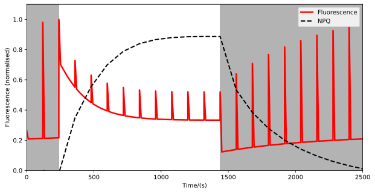
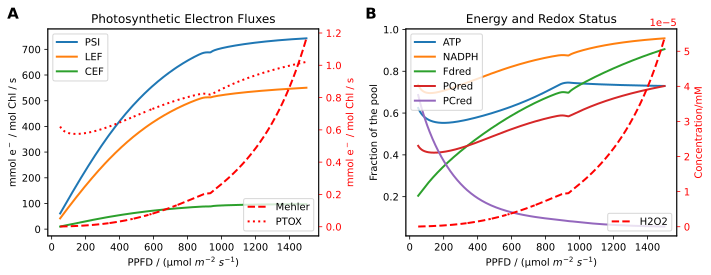
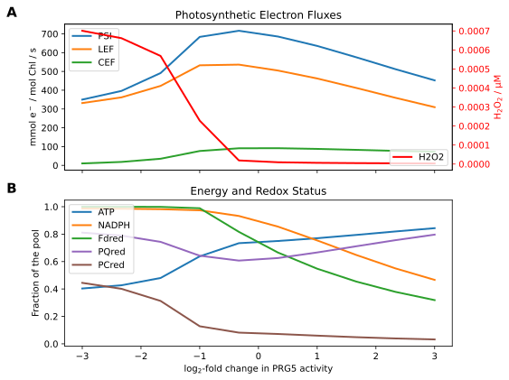
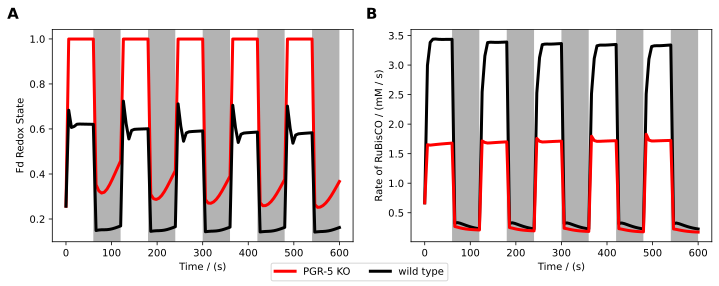
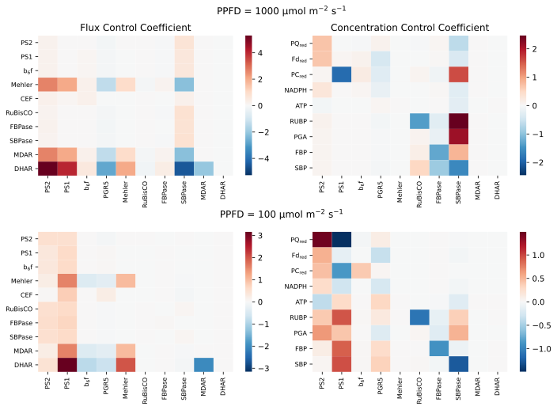
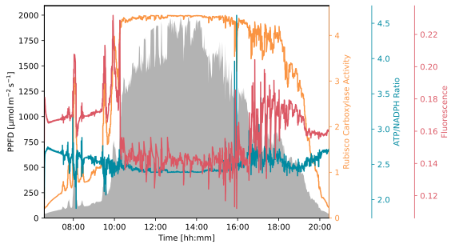
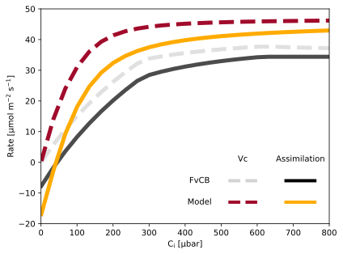
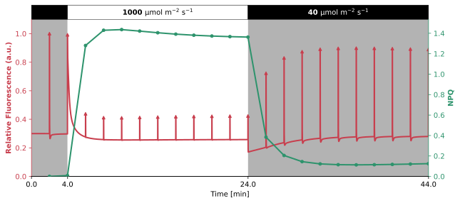
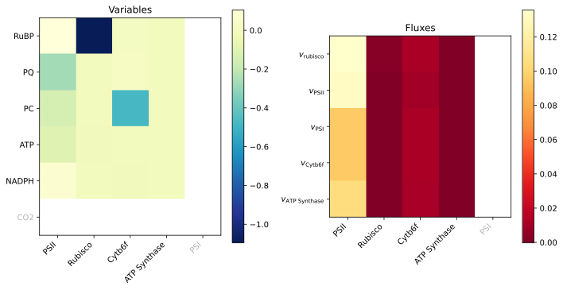
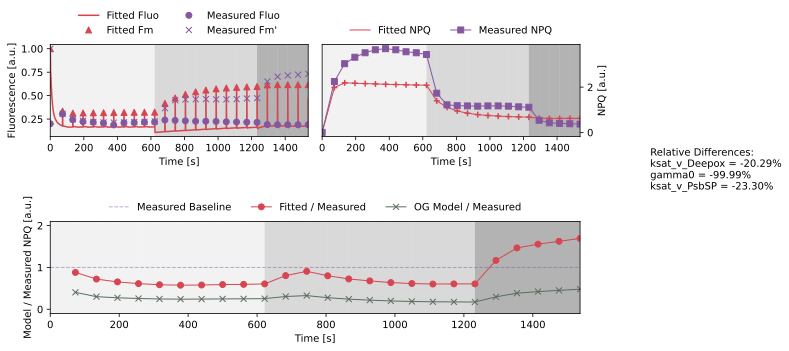

# Saadat2021


The [Saadat2021](https://doi.org/10.3389/fpls.2021.750580) model builds upon previous models, particularly the Matuszynska2019 model, by incorporating and modifying various reactions and aspects of photosynthesis. Overall, the model can be divided into three modules: the ascorbate-glutathione cycle, the Calvin-Benson-Bassham (CBB) cycle and thioredoxin reductase-regulated reactions, and the photosynthetic electron transport chain (PETC).
                     
The model is primarily used to investigate the electron flows around PSI and their relevance to photosynthetic efficiency. Several different analyses have been conducted to validate the model in both steady-state and dynamic environment conditions. The most interesting is the direct comparison of a knockout mutant of the protein PGR5. This protein is known to catalyse the reduction of plastoquinone by ferredoxin. The results of this comparison align with experimental values, which are, however, not presented in the publication but are referenced. Additionally, it is noted that the results should not be interpreted as accurate quantitative data, but rather as a proof of concept for the model.

Overall, the model has one advantage over other photosynthesis models, as it also highlights the importance of other electron flows, not just the PETC. Additionally, not only are the authors open about the model's flaws, but they are also insistent on making their code and analyses available on GitHub. Therefore, this model serves as a good stepping stone for more complex models that aim to incorporate aspects of photosynthesis, which are often simplified in other models.
                     
## Installation


All the files needed to run this model are located in [model](./model) folder. To use this model you only need to copy this folder and write the following to import the model in your Python script:

```python
from model import Saadat2021
```

The packages required to run this model can either be installed by using the `pixi` environment located inside the [pyproject.toml](../pyproject.toml) file or by just installing the `mxlpy` package and all its dependencies.
                     
### Compounds

#### Part of ODE system

|Name|Common Abbr.|Paper Abbr.|KEGG ID|Python Var|
| :---: | :---: | :---: | :---: | :---: |
|3-phosphoglyceric acid|$\mathrm{PGA}$|$\mathrm{PGA}$|C00197|PGA|
|2,3-biphosphoglyceric acid|$\mathrm{BPGA}$|$\mathrm{BPGA}$|C01159|BPGA|
|Glyceraldehyde 3-phosphate|$\mathrm{GAP}$|$\mathrm{GAP}$|C00118|GAP|
|Dihydroxyacetone phosphate|$\mathrm{DHAP}$|$\mathrm{DHAP}$|C00111|DHAP|
|Fructose 1,6-bisphosphate|$\mathrm{FBP}$|$\mathrm{FBP}$|C00354|FBP|
|Fructose 6-phosphate|$\mathrm{F6P}$|$\mathrm{F6P}$|C00085|F6P|
|Glucose 6-phosphate|$\mathrm{G6P}$|$\mathrm{G6P}$|C00092|G6P|
|Glucose 1-phosphate|$\mathrm{G1P}$|$\mathrm{G1P}$|C00103|G1P|
|Sedoheptulose 1,7-bisphosphate|$\mathrm{SBP}$|$\mathrm{SBP}$|C00447|SBP|
|Sedoheptulose 7-phosphate|$\mathrm{S7P}$|$\mathrm{S7P}$|C05382|S7P|
|Erythrose 4-phosphate|$\mathrm{E4P}$|$\mathrm{E4P}$|C00279|E4P|
|Xylulose 5-phosphate|$\mathrm{X5P}$|$\mathrm{X5P}$|C00231|X5P|
|Ribose 5-phosphate|$\mathrm{R5P}$|$\mathrm{R5P}$|C00117|R5P|
|Ribulose 1,5-bisphosphate|$\mathrm{RUBP}$|$\mathrm{RUBP}$|C01182|RUBP|
|Ribulose 5-phosphate|$\mathrm{RU5P}$|$\mathrm{RU5P}$|C00199|RU5P|
|Stromal ATP concentration|$\mathrm{ATP_{st}}$|$\mathrm{ATP}$|C00002|ATP_st|
|Oxidized Ferrodoxin|$\mathrm{Fd}_\mathrm{ox}$|$\mathrm{Fd}_\mathrm{ox}$|C00139|Fd_ox|
|Lumenal Proton concentration|$\mathrm{H_{lu}}$|$\mathrm{H}^+$|C00080|H_lumen|
|Phosphorylated fraction of light harvesting complexes|$\mathrm{LHC}$|$\mathrm{LHC}$|map00196|LHC|
|Stromal NADPH concentration|$\mathrm{NADPH}_\mathrm{st}$|$\mathrm{NADPH}$|C00005|NADPH_st|
|Oxidized Plastocyanine|$\mathrm{PC}_\mathrm{ox}$|$\mathrm{PC}_\mathrm{ox}$|C03162|PC_ox|
|Plastoquinone|$\mathrm{PQ}$|$\mathrm{PQ}_\mathrm{ox}$|C02061|PQ|
|Concentration of psbS protein|$\mathrm{psbS}$|$\mathrm{Psbs}$|K03542 |psbS|
|Violaxanthin|$\mathrm{Vx}$|$\mathrm{Vx}$|C08614|Vx|
|Monodehydroascorbate radicals|$\mathrm{MDA}$|$\mathrm{MDA}$|C01041|MDA|
|Hydrogen Peroxide|$\mathrm{H_2O_2}$|$\mathrm{H_2O_2}$|C00027|H2O2|
|Dehydroacorbate|$\mathrm{DHA}$|$\mathrm{DHA}$|C05422|DHA|
|Glutathione disulfide|$\mathrm{GSSG}$|$\mathrm{GSSG}$|C00127|GSSG|
|Oxidised thioredoxin|$\mathrm{Trx_{ox}}$|$\mathrm{Trx_{ox}}$|C00343|TRX_ox|
|Inactive CBB proteins|$\mathrm{E}_\mathrm{CBB,\ inact}$|$\mathrm{E}_\mathrm{inactive}$|map00710|E_CBB_inactive|


<details>
<summary>ODE System</summary>

```math 
\frac{\mathrm{d}\mathrm{Trx_{ox}}}{\mathrm{d}t} = - v_{\mathrm{FdTrReductase}} + 5 \cdot v_{\mathrm{Eact}}
```
```math 
\frac{\mathrm{d}\mathrm{Fd}_\mathrm{ox}}{\mathrm{d}t} = v_{\mathrm{FdTrReductase}} + 2 \cdot v_{\mathrm{Cyc}} + 2 \cdot v_{\mathrm{FNR}} - v_{\mathrm{Fd}_{\mathrm{red}}}
```
```math 
\frac{\mathrm{d}\mathrm{E}_\mathrm{CBB,\ inact}}{\mathrm{d}t} = - 5 \cdot v_{\mathrm{Eact}} + 5 \cdot v_{\mathrm{Einact}}
```
```math 
\frac{\mathrm{d}\mathrm{H_{lu}}}{\mathrm{d}t} = \frac{-\mathrm{HPR}}{b_\mathrm{H}} \cdot v_{\mathrm{ATPsynthase}} + \frac{4.0}{b_\mathrm{H}} \cdot v_{\mathrm{b6f}} + \frac{2.0}{b_\mathrm{H}} \cdot v_{\mathrm{PSII}} + \frac{-1.0}{b_\mathrm{H}} \cdot v_{\mathrm{Leak}}
```
```math 
\frac{\mathrm{d}\mathrm{ATP_{st}}}{\mathrm{d}t} = \mathrm{convf} \cdot v_{\mathrm{ATPsynthase}} - 1.0 \cdot v_{\mathrm{PGK1ase}} - 1.0 \cdot v_{\mathrm{PRKase}} - 1.0 \cdot v_{\mathrm{Starch}} - v_{\mathrm{ATP}_{\mathrm{consumption}}}
```
```math 
\frac{\mathrm{d}\mathrm{PC}_\mathrm{ox}}{\mathrm{d}t} = - 2 \cdot v_{\mathrm{b6f}} + v_{\mathrm{PSI}}
```
```math 
\frac{\mathrm{d}\mathrm{PQ}}{\mathrm{d}t} = - v_{\mathrm{Cyc}} + v_{\mathrm{b6f}} - v_{\mathrm{PSII}} - v_{\mathrm{NDH}} + v_{\mathrm{PQ}_{\mathrm{ox}}}
```
```math 
\frac{\mathrm{d}\mathrm{psbS}}{\mathrm{d}t} = - v_{\mathrm{Psbs^P}} + v_{\mathrm{Psbs^D}}
```
```math 
\frac{\mathrm{d}\mathrm{Vx}}{\mathrm{d}t} = - v_{\mathrm{Deepox}} + v_{\mathrm{Epox}}
```
```math 
\frac{\mathrm{d}\mathrm{NADPH}_\mathrm{st}}{\mathrm{d}t} = \mathrm{convf} \cdot v_{\mathrm{FNR}} - 1.0 \cdot v_{\mathrm{BPGAdehynase}} - v_{\mathrm{MDAreduct}} - v_{\mathrm{GR}} - v_{\mathrm{NADPH}_\mathrm{consumption}}
```
```math 
\frac{\mathrm{d}\mathrm{H_2O_2}}{\mathrm{d}t} = \mathrm{convf} \cdot v_{\mathrm{Mehler}} - v_{\mathrm{APXase}}
```
```math 
\frac{\mathrm{d}\mathrm{LHC}}{\mathrm{d}t} = - v_{\mathrm{St12}} + v_{\mathrm{St21}}
```
```math 
\frac{\mathrm{d}\mathrm{RUBP}}{\mathrm{d}t} = 1.0 \cdot v_{\mathrm{PRKase}} - 1.0 \cdot v_{\mathrm{RuBisCO \vert Carboxylase}}
```
```math 
\frac{\mathrm{d}\mathrm{PGA}}{\mathrm{d}t} = - 1.0 \cdot v_{\mathrm{PGK1ase}} + 2.0 \cdot v_{\mathrm{RuBisCO \vert Carboxylase}} - v_{\mathrm{PGA,\ ex}}
```
```math 
\frac{\mathrm{d}\mathrm{BPGA}}{\mathrm{d}t} = 1.0 \cdot v_{\mathrm{PGK1ase}} - 1.0 \cdot v_{\mathrm{BPGAdehynase}}
```
```math 
\frac{\mathrm{d}\mathrm{GAP}}{\mathrm{d}t} = 1.0 \cdot v_{\mathrm{BPGAdehynase}} - v_{\mathrm{TPIase}} - v_{\mathrm{Aldolase_{FBP}}} - v_{\mathrm{TKase_{E4P}}} - v_{\mathrm{TKase_{R5P}}} - v_{\mathrm{GAP,\ ex}}
```
```math 
\frac{\mathrm{d}\mathrm{DHAP}}{\mathrm{d}t} = v_{\mathrm{TPIase}} - v_{\mathrm{Aldolase_{FBP}}} - v_{\mathrm{Aldolase_{SBP}}} - v_{\mathrm{DHAP,\ ex}}
```
```math 
\frac{\mathrm{d}\mathrm{FBP}}{\mathrm{d}t} = v_{\mathrm{Aldolase_{FBP}}} - v_{\mathrm{FBPase}}
```
```math 
\frac{\mathrm{d}\mathrm{E4P}}{\mathrm{d}t} = v_{\mathrm{TKase_{E4P}}} - v_{\mathrm{Aldolase_{SBP}}}
```
```math 
\frac{\mathrm{d}\mathrm{SBP}}{\mathrm{d}t} = v_{\mathrm{Aldolase_{SBP}}} - v_{\mathrm{SBPase}}
```
```math 
\frac{\mathrm{d}\mathrm{F6P}}{\mathrm{d}t} = - v_{\mathrm{TKase_{E4P}}} + v_{\mathrm{FBPase}} - v_{\mathrm{PGIase}}
```
```math 
\frac{\mathrm{d}\mathrm{X5P}}{\mathrm{d}t} = v_{\mathrm{TKase_{E4P}}} + v_{\mathrm{TKase_{R5P}}} - v_{\mathrm{RPEase}}
```
```math 
\frac{\mathrm{d}\mathrm{S7P}}{\mathrm{d}t} = - v_{\mathrm{TKase_{R5P}}} + v_{\mathrm{SBPase}}
```
```math 
\frac{\mathrm{d}\mathrm{R5P}}{\mathrm{d}t} = v_{\mathrm{TKase_{R5P}}} - v_{\mathrm{Rpiase}}
```
```math 
\frac{\mathrm{d}\mathrm{RU5P}}{\mathrm{d}t} = - 1.0 \cdot v_{\mathrm{PRKase}} + v_{\mathrm{RPEase}} + v_{\mathrm{Rpiase}}
```
```math 
\frac{\mathrm{d}\mathrm{G6P}}{\mathrm{d}t} = v_{\mathrm{PGIase}} - v_{\mathrm{PGMase}}
```
```math 
\frac{\mathrm{d}\mathrm{G1P}}{\mathrm{d}t} = - 1.0 \cdot v_{\mathrm{Starch}} + v_{\mathrm{PGMase}}
```
```math 
\frac{\mathrm{d}\mathrm{MDA}}{\mathrm{d}t} = - 2 \cdot v_{\mathrm{MDAreduct}} + 2 \cdot v_{\mathrm{APXase}} - 2 \cdot v_{\mathrm{3ASC}}
```
```math 
\frac{\mathrm{d}\mathrm{DHA}}{\mathrm{d}t} = v_{\mathrm{3ASC}} - v_{\mathrm{DHAR}}
```
```math 
\frac{\mathrm{d}\mathrm{GSSG}}{\mathrm{d}t} = - v_{\mathrm{GR}} + v_{\mathrm{DHAR}}
```

</details>
                     
#### Conserved quantities

|Name|Common Abbr.|Paper Abbr.|KEGG ID|Python Var|
| :---: | :---: | :---: | :---: | :---: |
|Lumen pH|$\mathrm{pH}_\mathrm{lu}$|$\mathrm{pH}_\mathrm{lumen}$|C00080|pH_lumen|
|Zeaxanthin concentration|$\mathrm{Zx}$|$\mathrm{Zx}$|C06098|Zx|
|Reduced Ferrodoxin|$\mathrm{Fd}_\mathrm{red}$|$\mathrm{Fd}^-$|C00138|Fd_red|
|Reduced Plastocyanine|$\mathrm{PC}_\mathrm{red}$|$\mathrm{PC}^-$|C03025|PC_red|
|Concentration of protonated psbS protein|$\mathrm{psbS^P}$|$\mathrm{PsbS^P}$|K03542|PsbSP|
|Phosphorylated fraction of light harvesting complexes|$\mathrm{LHCp}$|$\mathrm{LHCp}$|map00196|LHCp|
|Co-operative 4-state quenching mechanism|$\mathrm{Q}$|$\mathrm{Q}$||Q|
|Plastoquinol|$\mathrm{PQH}_2$|$\mathrm{PQH}_2$|C16693|PQH_2|
|Cross section of PSII|$\mathrm{PSII_{cross}}$|$\mathrm{PSII_{cross}}$|M00161|psIIcross|
|Reduced thioredoxin|$\mathrm{TRX_{red}}$|$\mathrm{Trx_{red}}$|C00342|TRX_red|
|Active CBB proteins|$\mathrm{E}_\mathrm{CBB,\ inact}$|$\mathrm{E}_\mathrm{cbb,\ inactive}$|map00710|E_CBB_active|
|Stromal NADP concentration|$\mathrm{NADP}_\mathrm{st}$|$\mathrm{NADP}^+$|C00006|NADP_st|
|Stromal ADP concentration|$\mathrm{ADP_{st}}$|$\mathrm{ADP}$|C00008|ADP_st|
|Stromal concentration of orthophosphate|$\mathrm{P}_\mathrm{i,\ st}$|$\mathrm{P}_\mathrm{i}$|C00009|Pi_st|
|Reduced ascorbate|$\mathrm{ASC}$|$\mathrm{ASC}$||ASC|
|Reduced glutathione|$\mathrm{GSH}$|$\mathrm{GSH}$|C00051|GSH|
|Inhibition factor of the triose phosphate translocators|$\mathrm{IF}_\mathrm{3P}$|$\mathrm{N}$|K01803|IF_3P|
|Initial state of PSII|$\mathrm{B_0}$|$\mathrm{B_0}$|M00161|B0|
|Excited state of PSII|$\mathrm{B_1}$|$\mathrm{B_1}$|M00161|B1|
|Charge seperation state of PSII|$\mathrm{B_2}$|$\mathrm{B_2}$|M00161|B2|
|Photoinhibited state of PSII|$\mathrm{B_3}$|$\mathrm{B_3}$|M00161|B3|
|Ground state of PSI (P700)|$\mathrm{Y_0}$|$\mathrm{Y_0}$|M00163|Y0|
|Activated state of PSI (P700*)|$\mathrm{Y_1}$|$\mathrm{Y_1}$|M00163|Y1|
|Oxidised state of PSI (P700+)|$\mathrm{Y_2}$|$\mathrm{Y_2}$|M00163|Y2|
|Flourescence|$\mathrm{Fluo}$|$\mathrm{Fluo}$||Fluo|


<details>
<summary> Calculations </summary>

```math
\mathrm{pH}_\mathrm{lu} =  -\log_{10} \left( \mathrm{H_{lu}} \cdot 0.00025 \right)
```
```math
\mathrm{Zx} =  \mathrm{X}^{\mathrm{tot}} - \mathrm{Vx}
```
```math
\mathrm{Fd}_\mathrm{red} =  \mathrm{Fd}^{\mathrm{tot}} - \mathrm{Fd}_\mathrm{ox}
```
```math
\mathrm{PC}_\mathrm{red} =  \mathrm{PC}^{\mathrm{tot}} - \mathrm{PC}_\mathrm{ox}
```
```math
\mathrm{psbS^P} =  \mathrm{PsbS}^{\mathrm{tot}} - \mathrm{psbS}
```
```math
\mathrm{LHCp} =   - \mathrm{LHC}
```
```math
\mathrm{Q} =  \gamma_0 \cdot \mathrm{Vx} \cdot \mathrm{psbS} + \gamma_1 \cdot \mathrm{Vx} \cdot \mathrm{psbS^P} + \gamma_2 \cdot \frac{\mathrm{Zx}}{\mathrm{Zx} + K_\mathrm{ZSat}} \cdot \mathrm{psbS^P} + \gamma_3 \cdot \frac{\mathrm{Zx}}{\mathrm{Zx} + K_\mathrm{ZSat}} \cdot \mathrm{psbS}
```
```math
\mathrm{PQH}_2 =  \mathrm{PQ}^{\mathrm{tot}} - \mathrm{PQ}
```
```math
\mathrm{PSII_{cross}} =  \sigma _\mathrm{II} ^0 + \left( 1 - \sigma _\mathrm{II} ^0 - \sigma _\mathrm{I} ^0 \right) \mathrm{LHC}
```
```math
\mathrm{TRX_{red}} =  \mathrm{Thioredoxin}^{\mathrm{tot}} - \mathrm{Trx_{ox}}
```
```math
\mathrm{E}_\mathrm{CBB,\ inact} =  \mathrm{Enz}_{\mathrm{cbb}_\mathrm{tot}} - \mathrm{E}_\mathrm{CBB,\ inact}
```
```math
\mathrm{NADP}_\mathrm{st} =  \mathrm{NADP}^{\mathrm{tot}} - \mathrm{NADPH}_\mathrm{st}
```
```math
\mathrm{ADP_{st}} =  \mathrm{AP}^{\mathrm{tot}} - \mathrm{ATP_{st}}
```
```math
\mathrm{P}_\mathrm{i,\ st} =  \mathrm{P}^{\mathrm{tot}} - \left( \mathrm{PGA} + 2 \mathrm{BPGA} + \mathrm{GAP} + \mathrm{DHAP} + 2 \mathrm{FBP} + \mathrm{F6P} + \mathrm{G6P} + \mathrm{G1P} + 2 \mathrm{SBP} + \mathrm{S7P} + \mathrm{E4P} + \mathrm{X5P} + \mathrm{R5P} + 2 \mathrm{RUBP} + \mathrm{RU5P} + \mathrm{ATP_{st}} \right)
```
```math
\mathrm{ASC} =  \mathrm{Ascorbate}^{\mathrm{tot}} - \mathrm{MDA} - \mathrm{DHA}
```
```math
\mathrm{GSH} =  \mathrm{Gluthation}^{\mathrm{tot}} - 2 \mathrm{GSSG}
```
```math
\mathrm{IF}_\mathrm{3P} =  1 + \left( 1 + \frac{K_{\mathrm{diss} \vert \mathrm{P_{ext}}} }{\mathrm{P}_\mathrm{ext}} \right) \left( \frac{\mathrm{P}_\mathrm{i,\ st}}{K_{\mathrm{diss} \vert \mathrm{Pi}} } + \frac{\mathrm{PGA}}{K_{\mathrm{diss} \vert \mathrm{PGA}} } + \frac{\mathrm{GAP}}{K_{\mathrm{diss} \vert \mathrm{GAP}} } + \frac{\mathrm{DHAP}}{K_{\mathrm{diss} \vert \mathrm{DHAP}} } \right)
```
```math
\mathrm{Fluo} =  \frac{\mathrm{PSII_{cross}} \cdot k_F \cdot \mathrm{B_0}}{k_F + k_2 + k_H \cdot \mathrm{Q}} + \frac{\mathrm{PSII_{cross}} \cdot k_F \cdot \mathrm{B_2}}{k_F + k_H \cdot \mathrm{Q}}
```

<details>
<summary> Quasi-steady state approximation used to calculate the rate of PSII </summary>

```math
\begin{align}
\left( - \left( \mathrm{PSII_{cross}} \cdot \mathrm{PFD}  \right) - \left(k_{\mathrm{PQ}_\mathrm{red}} \cdot \frac{\mathrm{PQH}_2}{K_\mathrm{QAPQ}} \right) \right) \cdot \mathrm{B_0} + \left( k_{H_0} + k_H \cdot \mathrm{Q} + k_F \right) \cdot \mathrm{B_1} + k_{\mathrm{PQ}_\mathrm{red}} \cdot \mathrm{PQ} \cdot \mathrm{B_2} &= 0 \\
\mathrm{PSII_{cross}} \cdot \mathrm{PFD} \cdot \mathrm{B_0} - \left( k_{H_0} + k_H \cdot \mathrm{Q} + k_F + k_2 \right) \cdot \mathrm{B_1} &= 0 \\
\mathrm{PSII_{cross}} \cdot \mathrm{PFD} \cdot \mathrm{B_2} - \left( k_{H_0} + k_H \cdot \mathrm{Q} + k_F \right) \cdot \mathrm{B_3} &= 0 \\
\mathrm{B_0} + \mathrm{B_1} + \mathrm{B_2} + \mathrm{B_3} &= \mathrm{PSII}^{\mathrm{tot}}
\end{align}
```

</details>

<details>
<summary> Quasi-steady state approximation used to calculate the rate of PSI </summary>

```math
\begin{align}
- \left( \left( 1 - \mathrm{PSII_{cross}} \right) \cdot \mathrm{PFD} + \left( \frac{k_\mathrm{PCox}}{K_\mathrm{PCP700}} \right) \cdot \mathrm{PC}_\mathrm{ox} \right) \cdot \mathrm{Y_0} + k_\mathrm{PCox} \cdot \mathrm{PC}_\mathrm{red} \cdot \mathrm{Y_2} &= 0 \\
\left( 1 - \mathrm{PSII_{cross}} \right) \cdot \mathrm{PFD} \cdot \mathrm{Y_0} - \left( k_{\mathrm{Fd}_\mathrm{red}} \cdot \mathrm{Fd}_\mathrm{ox} + \mathrm{O}_{2_\mathrm{ext}} \cdot k_{\mathrm{Mehler}} \right) \cdot \mathrm{Y_1} + \frac{k_{\mathrm{Fd}_\mathrm{red}}}{K_\mathrm{FAFd}} \cdot \mathrm{Fd}_\mathrm{red} \cdot \mathrm{Y_2}  &= 0 \\
\mathrm{Y_0} + \mathrm{Y_1} + \mathrm{Y_2} &= \mathrm{PSI}^{\mathrm{tot}}
\end{align}
```

</details>

</details>

                     
### Parameters

|Short Description|Common Abbr.|Paper Abbr.|Value|Unit|Python Var|Reference|
| :---: | :---: | :---: | :---: | :---: | :---: | :---: |
|Photon Flux Density|$\mathrm{PFD}$|$\mathrm{PFD}$|$100.0$|$\mathrm{\mu mol}\ \mathrm{m}^{-2}\ \mathrm{s}^{-1}$|PPFD||
||$\mathrm{CO}_2$|$\mathrm{CO}_2$|$0.2$|$\mathrm{mM}$|CO2|[[1]](https://doi.org/10.1111/j.1432-1033.1988.tb14242.x)|
|External oxygen pool, corresponds to 250μM.|$\mathrm{O}_{2_\mathrm{ext}}$|$\mathrm{O}_2^\mathrm{ex}$|$8.0$|$\mathrm{mmol} \left(\mathrm{mol\ Chl}\right)^{-1}$|O2_lumen|[[2]](https://doi.org/10.1098/rstb.2013.0223)|
|Stromal pH of a dark adapted state|$\mathrm{pH}_\mathrm{st}$|$\mathrm{pH}_\mathrm{stroma}$|$7.9$||pH_stroma|[[2]](https://doi.org/10.1098/rstb.2013.0223)|
|||$\mathrm{H}_\mathrm{stroma}$|||H_stroma||
|Buffering protons constant of lumen|$b_\mathrm{H}$|$b_\mathrm{H}$|$100.0$||bH|[[2]](https://doi.org/10.1098/rstb.2013.0223)|
|Faraday constant|$F$|$F$|$96.485$|$\mathrm{kJ}$|F||
||$E^0\mathrm{(PC/PC^-)}$|$E^0\mathrm{(PC/PC^-)}$|$0.380$|$\mathrm{V}$|E0_PC|[[2]](https://doi.org/10.1098/rstb.2013.0223)|
||$E^0\mathrm{(P_{700}^+/P_{700})}$|$E^0\mathrm{(P_{700}^+/P_{700})}$|$0.48$|$\mathrm{V}$|E0_P700|[[2]](https://doi.org/10.1098/rstb.2013.0223)|
||$E^0\mathrm{(FA/FA^-)}$|$E^0\mathrm{(FA/FA^-)}$|$-0.55$|$\mathrm{V}$|E0_FA|[[2]](https://doi.org/10.1098/rstb.2013.0223)|
||$E^0\mathrm{(Fd/Fd^-)}$|$E^0\mathrm{(Fd/Fd^-)}$|$-0.43$|$\mathrm{V}$|E0_Fd|[[2]](https://doi.org/10.1098/rstb.2013.0223)|
||$E^0\mathrm{(NADP^+/NADPH)}$|$E^0\mathrm{(NADP^+/NADPH)}$|$-0.113$|$\mathrm{V}$|E0_NADP|[[2]](https://doi.org/10.1098/rstb.2013.0223)|
|Conversion factor of ATP and NADPH|$\mathrm{convf}$|$\mathrm{convf}$|$3.2 \times 10^{-3}$||convf||
|Universal gas constant|$R$|$R$|$0.0083$|$\mathrm{J}\ \mathrm{K}^{-1}\ \mathrm{mol}^{-1}$|R||
|Temperature|$T$|$T$|$298.0$|$\mathrm{K}$|T||
|Relative pool of xanthophylls|$\mathrm{X}^{\mathrm{tot}}$|$\mathrm{X}^{\mathrm{tot}}$|$1.0$|$\mathrm{mmol} \left(\mathrm{mol\ Chl}\right)^{-1}$|Carotenoids_tot|[[3]](https://doi.org/10.1016/j.bbabio.2016.09.003)|
|Total ferrodoxin pool|$\mathrm{Fd}^{\mathrm{tot}}$|$\mathrm{Fd}^{\mathrm{tot}}$|$5.0$|$\mathrm{mmol} \left(\mathrm{mol\ Chl}\right)^{-1}$|Fd_tot||
|Total plastocyanine pool|$\mathrm{PC}^{\mathrm{tot}}$|$\mathrm{PC}^{\mathrm{tot}}$|$4.0$|$\mathrm{mmol} \left(\mathrm{mol\ Chl}\right)^{-1}$|PC_tot|[[2]](https://doi.org/10.1098/rstb.2013.0223)|
|Relative pool of PsbS|$\mathrm{PsbS}^{\mathrm{tot}}$|$\mathrm{PsbS}^{\mathrm{tot}}$|$1.0$|$\mathrm{mmol} \left(\mathrm{mol\ Chl}\right)^{-1}$|PSBS_tot|[[3]](https://doi.org/10.1016/j.bbabio.2016.09.003)|
||||||LHC_tot||
|Fitted quencher factor corresponding to base quenching not associated with protonation or zeaxanthin|$\gamma_0$|$\gamma_0$|$0.1$||gamma0|[[3]](https://doi.org/10.1016/j.bbabio.2016.09.003)|
|Fitted quencher factor corresponding to fast quenching due to protonation|$\gamma_1$|$\gamma_1$|$0.25$||gamma1|[[3]](https://doi.org/10.1016/j.bbabio.2016.09.003)|
|Fitted quencher factor corresponding to fastest possible quenching|$\gamma_2$|$\gamma_2$|$0.6$||gamma2|[[3]](https://doi.org/10.1016/j.bbabio.2016.09.003)|
|Fitted quencher factor corresponding to slow quenching of Zx present despite lack of protonation|$\gamma_3$|$\gamma_3$|$0.15$||gamma3|[[3]](https://doi.org/10.1016/j.bbabio.2016.09.003)|
|Half-saturation constant (relative conc. of Zx) for quenching|$K_\mathrm{ZSat}$|$K_\mathrm{ZSat}$|$0.12$||kZSat|[[3]](https://doi.org/10.1016/j.bbabio.2016.09.003)|
||$E^0\mathrm{(QA/QA^-)}$|$E^0\mathrm{(QA/QA^-)}$|$-0.140$|$\mathrm{V}$|E0_QA|[[2]](https://doi.org/10.1098/rstb.2013.0223)|
||$E^0\mathrm{(PQ/PQH_2)}$|$E^0\mathrm{(PQ/PQH_2)}$|$0.354$|$\mathrm{V}$|E0_PQ|[[2]](https://doi.org/10.1098/rstb.2013.0223)|
|Total plastoquinone pool|$\mathrm{PQ}^{\mathrm{tot}}$|$\mathrm{PQ}^{\mathrm{tot}}$|$17.5$|$\mathrm{mmol} \left(\mathrm{mol\ Chl}\right)^{-1}$|PQ_tot|[[2]](https://doi.org/10.1098/rstb.2013.0223)|
|Relative cross section of PSII|$\sigma _\mathrm{II} ^0$|$\sigma _\mathrm{II} ^0$|$0.1$||staticAntII|[[4]](https://doi.org/10.1073/pnas.1319164111)|
|Relative cross section of PSI-LHCl supercomplex|$\sigma _\mathrm{I} ^0$|$\sigma _\mathrm{I} ^0$|$0.37$||staticAntI|[[4]](https://doi.org/10.1073/pnas.1319164111)|
|Relative total concentration of thioredoxin|$\mathrm{Thioredoxin}^{\mathrm{tot}}$|$\mathrm{thioredoxin}_\mathrm{tot}$|$1$||Thioredoxin_tot||
|Estimated maximal concentration of CBB enzymes|$\mathrm{Enz}_{\mathrm{cbb}_\mathrm{tot}}$|$e_{\mathrm{cbb}_\mathrm{tot}}$|$6$|$\mathrm{mM}$|E_total||
|Total NADP pool|$\mathrm{NADP}^{\mathrm{tot}}$|$\mathrm{NADP}^{\mathrm{tot}}$|$0.8$|$\mathrm{mM}$|NADP_tot|[[1]](https://doi.org/10.1111/j.1432-1033.1988.tb14242.x)|
|Total adenosine phosphate pool|$\mathrm{AP}^{\mathrm{tot}}$|$\mathrm{AP}^{\mathrm{tot}}$|$2.55$|$\mathrm{mM}$|AP_tot|Increased from Bionumbers|
|Total Phosphate pool|$\mathrm{P}^{\mathrm{tot}}$|$\mathrm{P}^{\mathrm{tot}}$|$17.05$|$\mathrm{mmol} \left(\mathrm{mol\ Chl}\right)^{-1}$|Pi_tot||
|Rate constant of ferrodoxin thioredoxin reductase|$k_{\mathrm{fdtrredase}}$|$k_{\mathrm{fd}_{\mathrm{tr}_\mathrm{reductase}}}$|$1$|$\mathrm{s}^{-1}$|kf_v_FdTrReduc|Estimated|
|Rate constant of CBB activation|$k_{\mathrm{ecbb\|act}}$|$k_{\mathrm{e}_{\mathrm{cbb}_\mathrm{activation}}}$|$1$||kf_v_Eact|Estimated|
|Rate constant of CBB relaxation|$k_{\mathrm{ecbb\|rel}}$|$k_{\mathrm{e}_{\mathrm{cbb}_\mathrm{relaxation}}}$|$0.1$|$\mathrm{s}^{-1}$|kf_v_Einact|Estimated|
|Total concentration of reduced and oxidized ascorbate|$\mathrm{Ascorbate}^{\mathrm{tot}}$|$\mathrm{Ascorbate}_{\mathrm{total}}$|$10$|$\mathrm{mM}$|ASC_tot||
|Total concentration of reduced and oxidized glutathione|$\mathrm{Gluthation}^{\mathrm{tot}}$|$\mathrm{Gluthation}_{\mathrm{total}}$|$10$|$\mathrm{mM}$|Glutathion_tot||
|Rate constant of ATP synthase|$k_\mathrm{ATPsynth}$|$k_\mathrm{ATPsynthase}$|$20.0$|$\mathrm{s}^{-1}$|kf_v_ATPsynth|[[2]](https://doi.org/10.1098/rstb.2013.0223)|
|Ratio of protons to ATP in ATP synthase|$\mathrm{HPR}$|$\mathrm{HPR}$|$\frac{14}{3}$||HPR|[[2]](https://doi.org/10.1098/rstb.2013.0223)|
|Internal pool of phosphates, required to calculate ATP equilibrium|$\mathrm{Pi}_\mathrm{mol}$|$\mathrm{Pi}_\mathrm{mol}$|$0.01$|$\mathrm{mmol} \left(\mathrm{mol\ Chl}\right)^{-1}$|Pi_mol||
|Standard Gibbs free energy change of ATP formation|$\Delta _\mathrm{f} G^\circ_\mathrm{ATP}$|$\Delta G_{0_{ATP}}$|$30.6$|$\mathrm{kJ}\ \mathrm{mol}^{-1}$|DeltaG0_ATP|[[2]](https://doi.org/10.1098/rstb.2013.0223)|
||$k_\mathrm{Cytb6f}$|$k_\mathrm{Cytb6f}$|$2.5$|$\left(\mathrm{mol\ Chl}\right)^2 \ \mathrm{mmol}^{-2}\ \mathrm{s}^{-1}$ |kcat_v_b6f|[[2]](https://doi.org/10.1098/rstb.2013.0223)|
|Hill-coefficient for PsbS protonation|${\mathrm{nH}_\mathrm{PsbS}}$|$\mathrm{k}_{\mathrm{Hill}_\mathrm{L}}$|$3.0$||kh_v_PsbSP|[[3]](https://doi.org/10.1016/j.bbabio.2016.09.003)|
|Rate of PsbS protonation|$k_\mathrm{Protonation}$|$k_\mathrm{Protonation}$|$0.0096$|$\mathrm{s}^{-1}$|kf_v_PsbSP|[[3]](https://doi.org/10.1016/j.bbabio.2016.09.003)|
|pKa of PsbS activation, kept the same as for VDA|$K_\mathrm{pHSatLHC}$|$K_\mathrm{pHSatLHC}$|$5.8$||ksat_v_PsbSP|[[3]](https://doi.org/10.1016/j.bbabio.2016.09.003)|
|Rate of PsbS deprotonation|$k_\mathrm{Deprotonation}$|$k_\mathrm{Deprotonation}$|$0.0096$|$\mathrm{s}^{-1}$|kf_v_PsbSD|[[3]](https://doi.org/10.1016/j.bbabio.2016.09.003)|
|Reaction rate constant of cyclic electron flow|$k_\mathrm{cyc}$|$k_\mathrm{cyc}$|$1.0$|$\mathrm{s}^{-1}$|kf_v_Cyc||
|Rate constant of de-epoxidation of violaxanthin|$k_\mathrm{kDeepoxV}$|$k_\mathrm{DeepoxV}$|$0.0024$|$\mathrm{s}^{-1}$|kf_v_Deepox|[[3]](https://doi.org/10.1016/j.bbabio.2016.09.003)|
|Hill-coefficient for de-epoxidase acitivity|${\mathrm{nH}_\mathrm{X}}$|$\mathrm{k}_{\mathrm{Hill}_\mathrm{X}}$|$5$||kh_v_Deepox|[[3]](https://doi.org/10.1016/j.bbabio.2016.09.003)|
|Half-saturation pH for de-epoxidase activity, highest activity at pH 5.8|$K_\mathrm{pHSat}$|$K_\mathrm{pHSat}$|$5.8$||ksat_v_Deepox|[[3]](https://doi.org/10.1016/j.bbabio.2016.09.003)|
|Rate constant of epoxidation of violaxanthin|$k_\mathrm{kEpoxZ}$|$k_\mathrm{EpoxZ}$|$0.00024$|$\mathrm{s}^{-1}$|kf_v_Epox|[[3]](https://doi.org/10.1016/j.bbabio.2016.09.003)|
||$K_{\mathrm{M}_{\mathrm{FNR}_\mathrm{F}}}$|$K_{\mathrm{M}_{\mathrm{FNR}_\mathrm{F}}}$|$1.56$|$\mathrm{mmol} \left(\mathrm{mol\ Chl}\right)^{-1}$|km_v_FNR_Fd_red|[[2]](https://doi.org/10.1098/rstb.2013.0223)|
||$K_{\mathrm{M}_{\mathrm{FNR}_\mathrm{N}}}$|$K_{\mathrm{M}_{\mathrm{FNR}_\mathrm{N}}}$|$0.22$|$\mathrm{mmol} \left(\mathrm{mol\ Chl}\right)^{-1}$|km_v_FNR_NADP_st|[[2]](https://doi.org/10.1098/rstb.2013.0223)|
||$\mathrm{EFNR}$|$\mathrm{EFNR}$|$3.0$||Enz0_v_FNR||
|Catalytic constant of FNRase|$k_{\mathrm{cat}\|\mathrm{FNRase}}$|$k_{\mathrm{cat}_\mathrm{FNR}}$|$500.0$|$\mathrm{s}^{-1}$|kcat_v_FNR|[[5]](https://doi.org/10.1046/j.1432-1033.2003.03566.x)|
||$k_\mathrm{NDH}$|$k_\mathrm{NDH}$|$0.002$|$\mathrm{s}^{-1}$|kf_v_NDH|[[2]](https://doi.org/10.1098/rstb.2013.0223)|
|PSII reaction centres|$\mathrm{PSII}^{\mathrm{tot}}$|$\mathrm{PSII}^{\mathrm{tot}}$|$2.5$|$\mathrm{mmol} \left(\mathrm{mol\ Chl}\right)^{-1}$|PSII_total|[[2]](https://doi.org/10.1098/rstb.2013.0223)|
|PSI reaction centres|$\mathrm{PSI}^{\mathrm{tot}}$|$\mathrm{PSI}^{\mathrm{tot}}$|$2.5$|$\mathrm{mmol} \left(\mathrm{mol\ Chl}\right)^{-1}$|PSI_total|[[2]](https://doi.org/10.1098/rstb.2013.0223)|
|Base rate of non-radiative decay|$k_{H_0}$|$k_{H_0}$|$5 \times 10^8$|$\mathrm{s}^{-1}$|kH0||
||$k_{\mathrm{PQ}_\mathrm{red}}$|$k_{\mathrm{PQ}_\mathrm{red}}$|$250.0$|$\left(\mathrm{mol\ Chl}\right)\ \mathrm{mmol}^{-1}\ \mathrm{s}^{-1}$ |kPQred|[[2]](https://doi.org/10.1098/rstb.2013.0223)|
||$k_\mathrm{PCox}$|$k_\mathrm{PCox}$|$2500.0$|$\left(\mathrm{mol\ Chl}\right)\ \mathrm{mmol}^{-1}\ \mathrm{s}^{-1}$ |kPCox|[[2]](https://doi.org/10.1098/rstb.2013.0223)|
||$k_{\mathrm{Fd}_\mathrm{red}}$|$k_{\mathrm{Fd}_\mathrm{red}}$|$2.5 \times 10^5$|$\left(\mathrm{mol\ Chl}\right)\ \mathrm{mmol}^{-1}\ \mathrm{s}^{-1}$ |kFdred|[[2]](https://doi.org/10.1098/rstb.2013.0223)|
|Rate constant for photochemistry|$k_2$|$k_2$|$5 \times 10^9$|$\mathrm{s}^{-1}$|k2||
|Rate of non-radiative decay|$k_H$|$k_H$|$5 \times 10^9$|$\mathrm{s}^{-1}$|kH|[[2]](https://doi.org/10.1098/rstb.2013.0223)|
|Rate of fluorescence|$k_F$|$k_F$|$6.25 \times 10^8$|$\mathrm{s}^{-1}$|kF||
|Estimated rate constant for summarized hydrogen peroxide production|$k_{\mathrm{Mehler}}$|$k_{\mathrm{Mehler}}$|$1.0$|$\mathrm{mM}^{-1}\ \mathrm{s}^{-1}$|kMehler||
||$\mathrm{E_{Fdred}}$|$\mathrm{E_{Fdred}}$|||Enz0_v_Fdred||
||$k_{\mathrm{cat}\|\mathrm{Fdred}}$|$k_{\mathrm{cat}_\mathrm{Fdred}}$|||kcat_v_Fdred||
|Rate constant of proton leak|$k_\mathrm{Leak}$|$k_\mathrm{leak}$|$10.0$|$\mathrm{s}^{-1}$|kf_v_Leak|[[2]](https://doi.org/10.1098/rstb.2013.0223)|
||$k_\mathrm{PTOX}$|$k_\mathrm{PTOX}$|$0.01$|$\left(\mathrm{mol\ Chl}\right)\ \mathrm{mmol}^{-1}\ \mathrm{s}^{-1}$ |kPTOX|[[2]](https://doi.org/10.1098/rstb.2013.0223)|
|Rate of phosphorylation of state transition from PSII to PSI|$k_\mathrm{Stt7}$|$k_\mathrm{Stt7}$|$0.0035$|$\mathrm{s}^{-1}$|kStt7|[[2]](https://doi.org/10.1098/rstb.2013.0223)|
|Switch point (half-activity of Stt7) for 20% PQ oxidised|$K_{\mathrm{M}_\mathrm{ST}}$|$K_{\mathrm{M}_\mathrm{ST}}$|$0.2$||km_v_St12|[[2]](https://doi.org/10.1098/rstb.2013.0223)|
|Hill coefficient of State transtion from PSII to PSI|$n_\mathrm{ST}$|$n_\mathrm{ST}$|$2.0$||n_ST|[[2]](https://doi.org/10.1098/rstb.2013.0223)|
|Rate of dephosphorylation of state transition from PSI to PSII|$k_\mathrm{Pph1}$|$k_\mathrm{Pph1}$|$0.0013$|$\mathrm{s}^{-1}$|kPph1|[[2]](https://doi.org/10.1098/rstb.2013.0223)|
||$\mathrm{E_{RuBisCO}}$|$\mathrm{E_{Rubisco}}$|||Enz0_rubisco||
|Base $V_\mathrm{max}$ of RuBisCO|$V_{\mathrm{max,\ base}_{\mathrm{RuBisCO}}}$|$V_{1_{\mathrm{base}}}$|$0.34 \cdot 8$|$\mathrm{mM}\ s^{-1}$|kcat_v_RuBisCO_c||
|Michaelis Menten constant of RuBisCO for RUBP|$K_{\mathrm{m}\|\mathrm{RuBisCO}\|\mathrm{RUBP}}$|$K_{\mathrm{m}1}$|$0.02$|$\mathrm{mM}$|km_v_RuBisCO_c_RUBP|[[1]](https://doi.org/10.1111/j.1432-1033.1988.tb14242.x)|
|Michaelis Menten constant of RuBisCO for CO2|$K_{\mathrm{m}\|\mathrm{RuBisCO}\|\mathrm{CO_2}}$|$K_{\mathrm{mCO2}}$|$0.0107$|$\mathrm{mM}$|km_v_RuBisCO_c_CO2|[[1]](https://doi.org/10.1111/j.1432-1033.1988.tb14242.x)|
|Inhibition constant of RuBisCO by PGA|$K_{i\|\mathrm{RuBisCO}\|\mathrm{PGA}}$|$K_{\mathrm{i}11}$|$0.04$|$\mathrm{mM}$|ki_v_RuBisCO_c_PGA|[[1]](https://doi.org/10.1111/j.1432-1033.1988.tb14242.x)|
|Inhibition constant of RuBisCO by FBP|$K_{i\|\mathrm{RuBisCO}\|\mathrm{FBP}}$|$K_{\mathrm{i}12}$|$0.04$|$\mathrm{mM}$|ki_v_RuBisCO_c_FBP|[[1]](https://doi.org/10.1111/j.1432-1033.1988.tb14242.x)|
|Inhibition constant of RuBisCO by SBP|$K_{i\|\mathrm{RuBisCO}\|\mathrm{SBP}}$|$K_{\mathrm{i}13}$|$0.075$|$\mathrm{mM}$|ki_v_RuBisCO_c_SBP|[[1]](https://doi.org/10.1111/j.1432-1033.1988.tb14242.x)|
|Inhibition constant of RuBisCO by Pi|$K_{i\|\mathrm{RuBisCO}\|\mathrm{Pi}}$|$K_{\mathrm{i}14}$|$0.9$|$\mathrm{mM}$|ki_v_RuBisCO_c_Pi_st|[[1]](https://doi.org/10.1111/j.1432-1033.1988.tb14242.x)|
|Inhibition constant of RuBisCO by NADPH|$K_{i\|\mathrm{RuBisCO}\|\mathrm{NADPH}}$|$K_{\mathrm{i}15}$|$0.07$|$\mathrm{mM}$|ki_v_RuBisCO_c_NADPH_st|[[1]](https://doi.org/10.1111/j.1432-1033.1988.tb14242.x)|
|Arbituary fast rate constant|$k_\mathrm{fast}$|$k$|$8 \times 10^8$|$\mathrm{mM}$|kre_v_PGK1ase|[[6]](https://doi.org/10.1093/jexbot/51.suppl_1.319)|
|Equilibrium constant of PGK1ase|$K_\mathrm{PGK1ase}$|$q_2$|$3.1 \times 10^{-4}$||keq_v_PGK1ase|[[1]](https://doi.org/10.1111/j.1432-1033.1988.tb14242.x)|
|Arbituary fast rate constant|$k_\mathrm{fast}$|$k$|$8 \times 10^8$|$\mathrm{mM}$|kre_v_BPGAdehynase|[[6]](https://doi.org/10.1093/jexbot/51.suppl_1.319)|
|Equilibrium constant of BPGA dehydrogenase|$K_\mathrm{BPGAdehynase}$|$q_3$|$1.6 \times 10^{7}$||keq_v_BPGAdehynase|[[1]](https://doi.org/10.1111/j.1432-1033.1988.tb14242.x)|
|Arbituary fast rate constant|$k_\mathrm{fast}$|$k$|$8 \times 10^8$|$\mathrm{mM}$|kre_v_TPIase|[[6]](https://doi.org/10.1093/jexbot/51.suppl_1.319)|
|Equilibrium constant of TPIase|$K_\mathrm{TPIase}$|$q_4$|$22.0$||keq_v_TPIase|[[1]](https://doi.org/10.1111/j.1432-1033.1988.tb14242.x)|
|Arbituary fast rate constant|$k_\mathrm{fast}$|$k$|$8 \times 10^8$|$\mathrm{mM}$|kre_v_Aldolase_FBP|[[6]](https://doi.org/10.1093/jexbot/51.suppl_1.319)|
|Equilibrium constant of Aldolase of GAP and DHAP to FBP|$K_\mathrm{Aldolase_{FBP}}$|$q_5$|$7.1$|$\mathrm{mM}^{-1}$|keq_v_Aldolase_FBP|[[1]](https://doi.org/10.1111/j.1432-1033.1988.tb14242.x)|
|Arbituary fast rate constant|$k_\mathrm{fast}$|$k$|$8 \times 10^8$|$\mathrm{mM}$|kre_v_Aldolase_SBP|[[6]](https://doi.org/10.1093/jexbot/51.suppl_1.319)|
|Equilibrium constant of Aldolase of E4P and DHAP to SBP|$K_\mathrm{Aldolase_{SBP}}$|$q_8$|$13.0$|$\mathrm{mM}^{-1}$|keq_v_Aldolase_SBP|[[1]](https://doi.org/10.1111/j.1432-1033.1988.tb14242.x)|
||||||Enz0_v_FBPase||
|Base $V_\mathrm{max}$ of FBPase|$V_{\mathrm{max,\ base}_{\mathrm{FBPase}}}$|$V_{6_{\mathrm{base}}}$|$1.6$|$\mathrm{mM}\ s^{-1}$|kcat_v_FBPase||
|Michaelis Menten constant of FBPase|$K_{\mathrm{m}\|\mathrm{FBPase}}$ |$K_{\mathrm{m}6}$|$0.03$|$\mathrm{mM}$|km_v_FBPase_s|[[1]](https://doi.org/10.1111/j.1432-1033.1988.tb14242.x)|
|Inhibition constant of FBPase by F6P|$K_{i\|\mathrm{FBPase}\|\mathrm{F6P}}$|$K_{\mathrm{i}61}$|$0.7$|$\mathrm{mM}$|ki_v_FBPase_F6P|[[1]](https://doi.org/10.1111/j.1432-1033.1988.tb14242.x)|
|Inhibition constant of FBPase by Pi|$K_{i\|\mathrm{FBPase}\|\mathrm{Pi}}$|$K_{\mathrm{i}62}$|$12.0$|$\mathrm{mM}$|ki_v_FBPase_Pi_st|[[1]](https://doi.org/10.1111/j.1432-1033.1988.tb14242.x)|
|Arbituary fast rate constant|$k_\mathrm{fast}$|$k$|$8 \times 10^8$|$\mathrm{mM}$|kre_v_TKase_E4P|[[6]](https://doi.org/10.1093/jexbot/51.suppl_1.319)|
|Equilibrium constant of TKase of GAP and F6P to X5P and E4P|$K_\mathrm{TKase_{E4P}}$|$q_7$|$0.084$||keq_v_TKase_E4P|[[1]](https://doi.org/10.1111/j.1432-1033.1988.tb14242.x)|
|Arbituary fast rate constant|$k_\mathrm{fast}$|$k$|$8 \times 10^8$|$\mathrm{mM}$|kre_v_TKase_R5P|[[6]](https://doi.org/10.1093/jexbot/51.suppl_1.319)|
|Equilibrium constant of TKase of GAP and S7P to X5P and R5P|$K_\mathrm{TKase_{R5P}}$|$q_{10}$|$0.85$||keq_v_TKase_R5P|[[1]](https://doi.org/10.1111/j.1432-1033.1988.tb14242.x)|
||||||Enz0_v_SBPase||
|Base $V_\mathrm{max}$ of SBPase|$V_{\mathrm{max,\ base}_{\mathrm{SBPase}}}$|$V_{9_{\mathrm{base}}}$|$0.32$|$\mathrm{mM}\ s^{-1}$|kcat_v_SBPase||
|Michaelis Menten constant of SBPase|$K_{\mathrm{m}\|\mathrm{SBPase}}$ |$K_{\mathrm{m}9}$|$0.013$|$\mathrm{mM}$|km_v_SBPase_s|[[1]](https://doi.org/10.1111/j.1432-1033.1988.tb14242.x)|
|Inhibition constant of SBPase by Pi|$K_{i\|\mathrm{SBPase}\|\mathrm{Pi}}$|$K_{\mathrm{i}9}$|$12.0$|$\mathrm{mM}$|ki_v_SBPase_Pi_st|[[1]](https://doi.org/10.1111/j.1432-1033.1988.tb14242.x)|
|Arbituary fast rate constant|$k_\mathrm{fast}$|$k$|$8 \times 10^8$|$\mathrm{mM}$|kre_v_Rpiase|[[6]](https://doi.org/10.1093/jexbot/51.suppl_1.319)|
|Equilibrium constant of Rpiase|$K_\mathrm{Rpiase}$|$q_{11}$|$0.4$||keq_v_Rpiase|[[1]](https://doi.org/10.1111/j.1432-1033.1988.tb14242.x)|
|Arbituary fast rate constant|$k_\mathrm{fast}$|$k$|$8 \times 10^8$|$\mathrm{mM}$|kre_v_RPEase|[[6]](https://doi.org/10.1093/jexbot/51.suppl_1.319)|
|Equilibrium constant of RPEase|$K_\mathrm{RPEase}$|$q_{12}$|$0.67$||keq_v_RPEase|[[1]](https://doi.org/10.1111/j.1432-1033.1988.tb14242.x)|
||||||Enz0_v_PRKase||
|Base $V_\mathrm{max}$ of PRKase|$V_{\mathrm{max,\ base}_{\mathrm{PRKase}}}$|$V_{13_{\mathrm{base}}}$|$7.9992$|$\mathrm{mM}\ s^{-1}$|kcat_v_PRKase||
|Michaelis Menten constant of PRKase for RU5P|$K_{\mathrm{m}\|\mathrm{PRKase}\|\mathrm{RU5P}}$|$K_{\mathrm{m}131}$|$0.05$|$\mathrm{mM}$|km_v_PRKase_RU5P|[[1]](https://doi.org/10.1111/j.1432-1033.1988.tb14242.x)|
|Michaelis Menten constant of PRKase for ATP|$K_{\mathrm{m}\|\mathrm{PRKase}\|\mathrm{ATP}}$|$K_{\mathrm{m}132}$|$0.05$|$\mathrm{mM}$|km_v_PRKase_ATP_st|[[1]](https://doi.org/10.1111/j.1432-1033.1988.tb14242.x)|
|Inhibition constant of Ru5P of PRKase by PGA|$K_{i\|\mathrm{PRKase}\|\mathrm{PGA}}$|$K_{\mathrm{i}131}$|$2.0$|$\mathrm{mM}$|ki_v_PRKase_PGA|[[1]](https://doi.org/10.1111/j.1432-1033.1988.tb14242.x)|
|Inhibition constant of Ru5P of PRKase by RuBP|$K_{i\|\mathrm{PRKase}\|\mathrm{RuBP}}$|$K_{\mathrm{i}132}$|$0.7$|$\mathrm{mM}$|ki_v_PRKase_RUBP|[[1]](https://doi.org/10.1111/j.1432-1033.1988.tb14242.x)|
|Inhibition constant of Ru5P of PRKase by Pi|$K_{i\|\mathrm{PRKase}\|\mathrm{Pi}}$|$K_{\mathrm{i}133}$|$4.0$|$\mathrm{mM}$|ki_v_PRKase_Pi_st|[[1]](https://doi.org/10.1111/j.1432-1033.1988.tb14242.x)|
|Uncompetitive inhibition constant of ATP of PRKase by ADP|$K_{i\|\mathrm{unc}\|\mathrm{PRKase}\|\mathrm{Pi}}$|$K_{\mathrm{i}134}$|$2.5$|$\mathrm{mM}$|ki_v_PRKase_4|[[1]](https://doi.org/10.1111/j.1432-1033.1988.tb14242.x)|
|Competitive inhibition constant of ATP of PRKase by ADP|$K_{i\|\mathrm{com}\|\mathrm{PRKase}\|\mathrm{Pi}}$|$K_{\mathrm{i}135}$|$0.4$|$\mathrm{mM}$|ki_v_PRKase_5|[[1]](https://doi.org/10.1111/j.1432-1033.1988.tb14242.x)|
|Arbituary fast rate constant|$k_\mathrm{fast}$|$k$|$8 \times 10^8$|$\mathrm{mM}$|kre_v_PGIase|[[6]](https://doi.org/10.1093/jexbot/51.suppl_1.319)|
|Equilibrium constant of PGIase|$K_\mathrm{PGIase}$|$q_{14}$|$2.3$||keq_v_PGIase|[[1]](https://doi.org/10.1111/j.1432-1033.1988.tb14242.x)|
|Arbituary fast rate constant|$k_\mathrm{fast}$|$k$|$8 \times 10^8$|$\mathrm{mM}$|kre_v_PGMase|[[6]](https://doi.org/10.1093/jexbot/51.suppl_1.319)|
|Equilibrium constant of PGMase|$K_\mathrm{PGMase}$|$q_{15}$|$0.058$||keq_v_PGMase|[[1]](https://doi.org/10.1111/j.1432-1033.1988.tb14242.x)|
|External phosphate|$\mathrm{P}_\mathrm{ext}$|$\mathrm{P}_\mathrm{ext}$|$0.5$|$\mathrm{mM}$|Pi_ext|[[1]](https://doi.org/10.1111/j.1432-1033.1988.tb14242.x)|
|Dissociation constant for the complex formed by phosphate translocator and PGA|$K_{\mathrm{diss}\|\mathrm{PGA}}$ |$K_{\mathrm{pga}}$|$0.25$|$\mathrm{mM}$|km_v_pga_ex|[[1]](https://doi.org/10.1111/j.1432-1033.1988.tb14242.x)|
|Dissociation constant for the complex formed by phosphate translocator and GAP|$K_{\mathrm{diss}\|\mathrm{GAP}}$ |$K_{\mathrm{gap}}$|$0.075$|$\mathrm{mM}$|km_v_gap_ex|[[1]](https://doi.org/10.1111/j.1432-1033.1988.tb14242.x)|
|Dissociation constant for the complex formed by phosphate translocator and DHAP|$K_{\mathrm{diss}\|\mathrm{DHAP}}$ |$K_{\mathrm{dhap}}$|$0.077$|$\mathrm{mM}$|km_v_dhap_ex|[[1]](https://doi.org/10.1111/j.1432-1033.1988.tb14242.x)|
|Dissociation constant for the complex formed by phosphate translocator and external orthophosphate|$K_{\mathrm{diss}\|\mathrm{P_{ext}}}$ |$K_{\mathrm{pxt}}$|$0.74$|$\mathrm{mM}$|km_IF_3P_Pi_ext|[[1]](https://doi.org/10.1111/j.1432-1033.1988.tb14242.x)|
|Dissociation constant for the complex formed by phosphate translocator and Pi|$K_{\mathrm{diss}\|\mathrm{Pi}}$ |$K_{\mathrm{pi}}$|$0.63$|$\mathrm{mM}$|km_IF_3P_Pi_st|[[1]](https://doi.org/10.1111/j.1432-1033.1988.tb14242.x)|
|$V_\mathrm{max}$ of Export|$V_{\mathrm{max}_{\mathrm{ex}}}$|$V_{\mathrm{ex}}$|$2.0$|$\mathrm{mM}\ s^{-1}$|kcat_IF_3P||
||||||Enz0_IF_3P||
||||||Enz0_v_starch||
|Michaelis Menten constant of Starch production for G1P|$K_{\mathrm{m}\|\mathrm{Starch}\|\mathrm{G1P}}$|$K_{\mathrm{mst}1}$|$0.08$|$\mathrm{mM}$|km_v_starch_G1P|[[1]](https://doi.org/10.1111/j.1432-1033.1988.tb14242.x)|
|Michaelis Menten constant of Starch production for ATP|$K_{\mathrm{m}\|\mathrm{Starch}\|\mathrm{ATP}}$|$K_{\mathrm{mst}2}$|$0.08$|$\mathrm{mM}$|km_v_starch_ATP_st|[[1]](https://doi.org/10.1111/j.1432-1033.1988.tb14242.x)|
|Inhibition constant of ATP of Starch production by ADP|$K_{i\|\mathrm{Starch}\|\mathrm{ADP}}$|$K_{\mathrm{ist}}$|$10.0$|$\mathrm{mM}$|ki_v_starch|[[1]](https://doi.org/10.1111/j.1432-1033.1988.tb14242.x)|
|Activation factor of Starch production by PGA|$K_{\mathrm{act}\|\mathrm{Starch}\|\mathrm{PGA}}$|$K_{\mathrm{ast1}}$|$0.1$||ki_v_starch_PGA|[[1]](https://doi.org/10.1111/j.1432-1033.1988.tb14242.x)|
|Activation factor of Starch production by F6P|$K_{\mathrm{act}\|\mathrm{Starch}\|\mathrm{F6P}}$|$K_{\mathrm{ast2}}$|$0.02$||ki_v_starch_F6P|[[1]](https://doi.org/10.1111/j.1432-1033.1988.tb14242.x)|
|Activation factor of Starch production by FBP|$K_{\mathrm{act}\|\mathrm{Starch}\|\mathrm{FBP}}$|$K_{\mathrm{ast3}}$|$0.02$||ki_v_starch_FBP|[[1]](https://doi.org/10.1111/j.1432-1033.1988.tb14242.x)|
|Base $V_\mathrm{max}$ of Starch Synthase|$V_{\mathrm{max,\ base}_{\mathrm{Starch}}}$|$V_{\mathrm{st}_{\mathrm{base}}}$|$0.32$|$\mathrm{mM}\ s^{-1}$|kcat_v_starch||
|Rate constant for the spontaneous disproportion of MDA|$k_3$|$k3$|$500.0$|$\mathrm{mM}^{-1}\ \mathrm{s}^{-1}$|kf_v_3ASC|[[7]](https://doi.org/10.1104/pp.108.133223)|
|Concentration of monodehydroascorbate reductase|$\mathrm{MDAR}_0$|$\mathrm{MDAR}_0$|$2 \times 10^{-3}$|$\mathrm{mM}$|Enz0_v_MDAreduct|[[8]](https://doi.org/10.1186/s12918-015-0239-y)|
|Turnover rate of monodehydroascorbate reductase|$k_{\mathrm{cat\|MDAR}}$|$k_{\mathrm{cat}_{\mathrm{MDAR}}}$|$300.0$|$\mathrm{s}^{-1}$|kcat_v_MDAreduct|[[8]](https://doi.org/10.1186/s12918-015-0239-y)|
|Michaelis-menten constant of monodehydroascorbate for the conversion to NADPH|$K_{\mathrm{m\|MDAR\|NADPH}}$|$K_{\mathrm{m}_{\mathrm{MDAR-NADPH}}}$|$23 \times 10^{-3}$|$\mathrm{mM}$|km_v_MDAreduct_NADPH_st|[[8]](https://doi.org/10.1186/s12918-015-0239-y)|
|Michaelis-menten constant of monodehydroascorbate for the conversion to MDA|$K_{\mathrm{m\|MDAR\|MDA}}$|$K_{\mathrm{m}_{\mathrm{MDAR-MDA}}}$|$1.4 \times 10^{-3}$|$\mathrm{mM}$|km_v_MDAreduct_MDA|[[8]](https://doi.org/10.1186/s12918-015-0239-y)|
||$kf_1$|$kf1$|$10000.0$||kf1|Estimated|
||$kr_1$|$kr1$|$220.0$||kr1|BRENDA database|
||$kf_2$|$kf2$|$10000.0$||kf2|Estimated|
||$kr_2$|$kr2$|$4000.0$||kr2|BRENDA database|
||$kf_3$|$kf3$|$2510.0$||kf3|BRENDA database|
||$kf_4$|$kf4$|$10000.0$||kf4|Estimated|
||$kr_4$|$kr4$|$4000.0$||kr4|BRENDA database|
||$kf_5$|$kf5$|$2510.0$||kf5|BRENDA database|
|Concentration of ascorbate peroxidase|$XT$|$XT$|$0.07$||XT|[[7]](https://doi.org/10.1104/pp.108.133223)|
|Concentration of gluthatione reductase|$\mathrm{GR}_0$|$\mathrm{GR}_0$|$1.4 \times 10^{-3}$|$\mathrm{mM}$|Enz0_v_GR|[[7]](https://doi.org/10.1104/pp.108.133223)|
|Turnover rate of gluthation reductase|$k_{\mathrm{cat\|GR}}$|$k_{\mathrm{cat}_{\mathrm{GR}}}$|$595$|$\mathrm{s}^{-1}$|kcat_v_GR|[[7]](https://doi.org/10.1104/pp.108.133223)|
|Michaelis Menten constant of NADPH|$K_{\mathrm{m\|NADPH}}$|$K_{\mathrm{m}_{\mathrm{NADPH}}}$|$3 \times 10^{-3}$|$\mathrm{mM}$|km_v_GR_NADPH_st|[[7]](https://doi.org/10.1104/pp.108.133223)|
|Michaelis Menten constant of oxidized gluthation|$K_{\mathrm{m\|GSSG}}$|$K_{\mathrm{m}_{\mathrm{GSSG}}}$|$0.2$|$\mathrm{mM}$|km_v_GR_GSSG|[[7]](https://doi.org/10.1104/pp.108.133223)|
|Michaelis Menten constant of dehydroascorbate|$K_{\mathrm{m\|DHA}}$|$K_{\mathrm{m}_{\mathrm{DHA}}}$|$70 \times 10^{-3}$|$\mathrm{mM}$|km_v_DHAR_DHA|[[7]](https://doi.org/10.1104/pp.108.133223)|
|Michaelis Menten constant of reduced gluthation|$K_{\mathrm{m\|GSH}}$|$K_{\mathrm{m}_{\mathrm{GSH}}}$|$2.5$|$\mathrm{mM}$|km_v_DHAR_GSH|[[7]](https://doi.org/10.1104/pp.108.133223)|
|Dissociation constant of dehydroascorbate reductase|$K_{\mathrm{diss\|DHAR}}$|$K$|$0.5$|$\mathrm{mM}^2$|K|[[7]](https://doi.org/10.1104/pp.108.133223)|
|Concentration of dehydroascorbate reductase|$\mathrm{DHAR}_0$|$\mathrm{DHAR}_0$|$1.7 \times 10^{-3}$|$\mathrm{mM}$|Enz0_v_DHAR|[[7]](https://doi.org/10.1104/pp.108.133223)|
|Turnover rate of dehydroascorbate reductase|$k_{\mathrm{cat\|DHAR}}$|$k_{\mathrm{cat}_{\mathrm{DHAR}}}$|$142$|$\mathrm{s}^{-1}$|kcat_v_DHAR|[[7]](https://doi.org/10.1104/pp.108.133223)|
|General consumption rate of ATP|$k_{\mathrm{ex}_{\mathrm{ATP}}}$|$k_{\mathrm{ex}_{\mathrm{atp}}}$|$0.2$|$\mathrm{s}^{-1}$|kf_v_ATPcons|Estimated|
|General consumption rate of NADPH|$k_{\mathrm{ex}_{\mathrm{NADPH}}}$|$k_{\mathrm{ex}_{\mathrm{nadph}}}$|$0.2$|$\mathrm{s}^{-1}$|kf_v_NADPHcons|Estimated|

#### Derived Parameters

|Short Description|Common Abbr.|Paper Abbr.|Python Var|
| :---: | :---: | :---: | :---: |
|Proportional combination of R and T|$RT$|$RT$|RT|
|Shortened term for ease of access|$\Delta G _\mathrm{pH}$|$\Delta G _\mathrm{pH}$|dG_pH|
|Equilibrium constant of |$K_\mathrm{QAPQ}$|$K_\mathrm{eq, QAPQ}$|keq_PQH_2|
|Equilibrium constant of|$K_\mathrm{FNR}$|$K_\mathrm{eq, FNR}$|keq_v_FNR|
|Vmax of FNR|$V_{\mathrm{max}\|\mathrm{FNR}}$ |$V_{FNR}$|vmax_v_FNR|
|Equilibrium constant of|$K_\mathrm{PCP700}$|$K_\mathrm{eq, PCP700}$|keq_PCP700|
|Equilibrium constant of |$K_\mathrm{FAFd}$|$K_\mathrm{eq, FAFd}$|keq_v_Fdred|
|Vmax of Fdred|$V_{\mathrm{max}\|\mathrm{Fd_{red}}}$ |$V_{Fdred}$|vmax_v_Fdred|
|Vmax of PGA export|$V_{\mathrm{max}\|\mathrm{PGA,\ ex}}$ |$V_{pga\_ex}$|vmax_v_pga_ex|
|Vmax of MDAreduct|$V_{\mathrm{max}\|\mathrm{MDAreduct}}$ |$V_{mdared}$|vmax_v_MDAreduct|
|Vmax of GR|$V_{\mathrm{max}\|\mathrm{GR}}$ |$V_{GR}$|vmax_v_GR|
|Vmax of DHAR|$V_{\mathrm{max}\|\mathrm{DHAR}}$ |$V_{DHAR}$|vmax_v_DHAR|
|Equilibrium constant of ATPsynthase|$K_\mathrm{ATPsynthase}$|$K_\mathrm{eq, ATPsynthase}$|keq_v_ATPsynth|
|Equilibrium constant of Cytb6f|$K_\mathrm{cytb6f}$|$K_\mathrm{eq, cytb6f}$|keq_v_b6f|
|Amount of active Enzyme of RuBisCO|$E_\mathrm{0\|RuBisCO}$|$Enz_{rubisco}$|Enz0_rubisco_active|
|Vmax of RuBisCO|$V_{\mathrm{max}\|\mathrm{RuBisCO}}$ |$V_1$|vmax_v_RuBisCO_c|
|Amount of active Enzyme of FBPase|$E_\mathrm{0\|FBPase}$|$Enz_{fbpase}$|Enz0_v_FBPase_active|
|Vmax of FBPase|$V_{\mathrm{max}\|\mathrm{FBPase}}$ |$V_6$|vmax_v_FBPase|
|Amount of active Enzyme of SBPase|$E_\mathrm{0\|SBPase}$|$Enz_{sbpase}$|Enz0_v_SBPase_active|
|Vmax of SBPase|$V_{\mathrm{max}\|\mathrm{SBPase}}$ |$V_9$|vmax_v_SBPase|
|Amount of active Enzyme of PRKase|$E_\mathrm{0\|PRKase}$|$Enz_{prkase}$|Enz0_v_PRKase_active|
|Vmax of PRKase|$V_{\mathrm{max}\|\mathrm{PRKase}}$ |$V_13$|vmax_v_PRKase|
|Amount of active Enzyme of Starch|$E_\mathrm{0\|Starch}$|$Enz_{starch}$|Enz0_v_starch_active|
|Vmax of Starch|$V_{\mathrm{max}\|\mathrm{Starch}}$ |$V_\mathrm{st}$|vmax_v_starch|


<details>
<summary>Equations of derived parameters</summary>

```math
RT =  T \cdot R
```
```math
\Delta G _\mathrm{pH} =  \log 10 \cdot R T
```
```math
K_\mathrm{QAPQ} =  \exp \left( \frac{-\left( -2 \cdot -E^0\mathrm{(QA/QA^-)} F + -2 E^0\mathrm{(PQ/PQH_2)} F + 2 \mathrm{pH}_\mathrm{st} \cdot \Delta G _\mathrm{pH} \right)}{RT} \right)
```
```math
K_\mathrm{FNR} =  \exp \left( \frac{-\left( -2 \cdot -E^0\mathrm{(Fd/Fd^-)} F + -2 E^0\mathrm{(NADP^+/NADPH)} F + \Delta G _\mathrm{pH} \cdot \mathrm{pH}_\mathrm{st} \right)}{RT} \right)
```
```math
V_{\mathrm{max} \vert \mathrm{FNR}}  =  \mathrm{EFNR} \cdot k_{\mathrm{cat} \vert \mathrm{FNRase}}
```
```math
K_\mathrm{PCP700} =  \exp \left( \frac{-\left( -E^0\mathrm{(PC/PC^-)} F + -E^0\mathrm{(P_{700}^+/P_{700})} F \right)}{RT} \right)
```
```math
K_\mathrm{FAFd} =  \exp \left( \frac{-\left( -E^0\mathrm{(FA/FA^-)} F + -E^0\mathrm{(Fd/Fd^-)} F \right)}{RT} \right)
```
```math
V_{\mathrm{max} \vert \mathrm{Fd_{red}}}  =  \mathrm{E_{Fdred}} \cdot k_{\mathrm{cat} \vert \mathrm{Fdred}}
```
```math
V_{\mathrm{max} \vert \mathrm{PGA,\ ex}}  =   \cdot V_{\mathrm{max}_{\mathrm{ex}}}
```
```math
V_{\mathrm{max} \vert \mathrm{MDAreduct}}  =  \mathrm{MDAR}_0 \cdot k_{\mathrm{cat \vert MDAR}}
```
```math
V_{\mathrm{max} \vert \mathrm{GR}}  =  \mathrm{GR}_0 \cdot k_{\mathrm{cat \vert GR}}
```
```math
V_{\mathrm{max} \vert \mathrm{DHAR}}  =  \mathrm{DHAR}_0 \cdot k_{\mathrm{cat \vert DHAR}}
```
```math
K_\mathrm{ATPsynthase} =  \mathrm{Pi}_\mathrm{mol} \cdot \exp \left( \frac{-\left( \Delta _\mathrm{f} G^\circ_\mathrm{ATP} - \Delta G _\mathrm{pH} \cdot \mathrm{HPR} \cdot \left( \mathrm{pH}_\mathrm{st} - \mathrm{pH}_\mathrm{lu} \right) \right)}{RT} \right)
```
```math
K_\mathrm{cytb6f} =  \mathrm{cast} \left( \mathrm{float}, \exp \left( \frac{-\left( -\left( -2 F \cdot E^0\mathrm{(PQ/PQH_2)} + 2 \Delta G _\mathrm{pH} \cdot \mathrm{pH}_\mathrm{lu} \right) + 2 \cdot -F \cdot E^0\mathrm{(PC/PC^-)} + 2 \Delta G _\mathrm{pH} \cdot \left( \mathrm{pH}_\mathrm{st} - \mathrm{pH}_\mathrm{lu} \right) \right)}{RT} \right) \right)
```
```math
E_\mathrm{0 \vert RuBisCO} =  \mathrm{E_{RuBisCO}} \mathrm{E}_\mathrm{CBB,\ inact}
```
```math
V_{\mathrm{max} \vert \mathrm{RuBisCO}}  =  E_\mathrm{0 \vert RuBisCO} \cdot V_{\mathrm{max,\ base}_{\mathrm{RuBisCO}}}
```
```math
E_\mathrm{0 \vert FBPase} =   \mathrm{E}_\mathrm{CBB,\ inact}
```
```math
V_{\mathrm{max} \vert \mathrm{FBPase}}  =  E_\mathrm{0 \vert FBPase} \cdot V_{\mathrm{max,\ base}_{\mathrm{FBPase}}}
```
```math
E_\mathrm{0 \vert SBPase} =   \mathrm{E}_\mathrm{CBB,\ inact}
```
```math
V_{\mathrm{max} \vert \mathrm{SBPase}}  =  E_\mathrm{0 \vert SBPase} \cdot V_{\mathrm{max,\ base}_{\mathrm{SBPase}}}
```
```math
E_\mathrm{0 \vert PRKase} =   \mathrm{E}_\mathrm{CBB,\ inact}
```
```math
V_{\mathrm{max} \vert \mathrm{PRKase}}  =  E_\mathrm{0 \vert PRKase} \cdot V_{\mathrm{max,\ base}_{\mathrm{PRKase}}}
```
```math
E_\mathrm{0 \vert Starch} =   \mathrm{E}_\mathrm{CBB,\ inact}
```
```math
V_{\mathrm{max} \vert \mathrm{Starch}}  =  E_\mathrm{0 \vert Starch} \cdot V_{\mathrm{max,\ base}_{\mathrm{Starch}}}
```

</details>

                     
### Reaction Rates

|Short Description|Common Abbr.|Paper Abbr.|KEGG ID|Python Var|
| :---: | :---: | :---: | :---: | :---: |
|Enzyme inactivation|$v_{\mathrm{Einact}}$|$v_{\mathrm{Einact}}$||v_Einact|
|Enzyme Activation|$v_{\mathrm{Eact}}$|$v_{\mathrm{Eact}}$||v_Eact|
||$v_{\mathrm{3ASC}}$|$v_{\mathrm{3ASC}}$||v_3ASC|
||$v_{\mathrm{DHAR}}$|$v_{\mathrm{DHAR}}$||v_DHAR|
|Mehler reaction lumping the reduction of O2 instead of Fd|$v_{\mathrm{Mehler}}$|$v_{\mathrm{Mehler}}$||v_Mehler|
|Rate of APXase|$v_{\mathrm{APXase}}$|$v_{\mathrm{Ascorbate}}$|R09540|v_APXase|
||$v_{\mathrm{GR}}$|$v_{\mathrm{GR}}$|R00115|v_GR|
||$v_{\mathrm{MDAreduct}}$|$v_{\mathrm{MDAreduct}}$|R00095|v_MDAreduct|
||$v_{\mathrm{FdTrReductase}}$|$v_{\mathrm{FdTrReductase}}$|R09502|v_FdTrReduc|
|Rate of reduction of Fd by the activity of PSI|$v_{\mathrm{Fd}_{\mathrm{red}}}$|$v_{\mathrm{Fd,\ red}}$|R09542|v_Fdred|
|Consumption of NADPH|$v_{\mathrm{NADPH}_\mathrm{consumption}}$|$v_{\mathrm{EX\_ NADPH}}$||v_NADPHcons|
||$v_{\mathrm{PSI}}$|$v_{\mathrm{PSI}}$|R09542|v_PSI|
|Rate of PGMase|$v_{\mathrm{PGMase}}$|$v_{\mathrm{Phosphoglucomutase}}$|R08639|v_PGMase|
|Rate of PGIase|$v_{\mathrm{PGIase}}$|$v_{G6P\_ isomerase}$|R00771|v_PGIase|
|Rate of RPEase|$v_{\mathrm{RPEase}}$|$v_{12}$|R01529|v_RPEase|
|Rate of Rpiase|$v_{\mathrm{Rpiase}}$|$v_{11}$|R01056|v_Rpiase|
|Rate of TKase of GAP and S7P to X5P and R5P|$v_{\mathrm{TKase_{R5P}}}$|$v_{10}$|R01641|v_TKase_R5P|
|Rate of Aldolase of E4P and DHAP to SBP|$v_{\mathrm{Aldolase_{SBP}}}$|$v_{8}$|R01829|v_Aldolase_SBP|
|Rate of TKase of GAP and F6P to X5P and E4P|$v_{\mathrm{TKase_{E4P}}}$|$v_{\mathrm{F6P\_ Transketolase}}$|R01067|v_TKase_E4P|
|Rate of Aldolase of GAP and DHAP to FBP|$v_{\mathrm{Aldolase_{FBP}}}$|$v_{\mathrm{Aldolase}}$|R01068|v_Aldolase_FBP|
|Rate of TPIase|$v_{\mathrm{TPIase}}$|$v_{\mathrm{TPI}}$|R01015|v_TPIase|
|Rate of BPGA dehydrogenase|$v_{\mathrm{BPGAdehynase}}$|$v_{\mathrm{BPGA\_dehydrogenase}}$|R01063|v_BPGAdehynase|
|Rate of PGK1ase|$v_{\mathrm{PGK1ase}}$|$v_{\mathrm{PGA\_kinase}}$|R01512|v_PGK1ase|
|Starch production|$v_{\mathrm{Starch}}$|$v_{\mathrm{Starch}}$||v_starch|
|Export of GAP|$v_{\mathrm{GAP,\ ex}}$|$v_{gap}$||v_gap_ex|
|Export of DHAP|$v_{\mathrm{DHAP,\ ex}}$|$v_{DHAP}$||v_dhap_ex|
|Export of PGA|$v_{\mathrm{PGA,\ ex}}$|$v_{pga}$||v_pga_ex|
|Rate of PRKase|$v_{\mathrm{PRKase}}$|$v_{13}$|R01523|v_PRKase|
|Rate of SBPase|$v_{\mathrm{SBPase}}$|$v_9$|R01845|v_SBPase|
|Rate of FBPase|$v_{\mathrm{FBPase}}$|$v_{\mathrm{FBPase}}$|R00762|v_FBPase|
|Rate of RuBisCo Carboxylase|$v_{\mathrm{RuBisCO\|Carboxylase}}$|$v_{\mathrm{RuBisCo}}$|R00024|v_RuBisCO_c|
|Deprotonation of psbS protein|$v_{\mathrm{Psbs^D}}$|$v_{\mathrm{LHCdeprotonation}}$||v_PsbSD|
|Epoxidation of violaxanthin|$v_{\mathrm{Epox}}$|$v_{\mathrm{Epox}}$|R10070|v_Epox|
|De-epoxidation of violaxanthin|$v_{\mathrm{Deepox}}$|$v_{\mathrm{Deepox}}$|R10070|v_Deepox|
|State transitions from PSI to PSII|$v_{\mathrm{St12}}$|$v_{\mathrm{St21}}$||v_St12|
|State transitions from PSII to PSI|$v_{\mathrm{St21}}$|$v_{\mathrm{St12}}$||v_St21|
|Cyclic electron flow|$v_{\mathrm{Cyc}}$|$v_{\mathrm{Cyc}}$|EC 7.1.1.10|v_Cyc|
|Reduction of PQ pool by NADH reductase|$v_{\mathrm{NDH}}$|$v_{\mathrm{NDH}}$||v_NDH|
|Reaction mediated by FNR|$v_{\mathrm{FNR}}$|$v_{\mathrm{FNR}}$|R01195|v_FNR|
|Rate of the b6f complex|$v_{\mathrm{b6f}}$|$v_{\mathrm{b6f}}$|R03817|v_b6f|
|Protonation of psbS protein|$v_{\mathrm{Psbs^P}}$|$v_{\mathrm{LHCprotonation}}$||v_PsbSP|
|ATP consuming reaction|$v_{\mathrm{ATP}_{\mathrm{consumption}}}$|$v_{\mathrm{EX\_ ATP}}$||v_ATPcons|
|Transmembrane Proton Leak|$v_{\mathrm{Leak}}$|$v_{\mathrm{Leak}}$||v_Leak|
|Production of ATP by ATPsynthase|$v_{\mathrm{ATPsynthase}}$|$v_{\mathrm{ATPsynthase}}$|R00086|v_ATPsynth|
|Oxidation of the PQ pool through cytochrome and PTOX|$v_{\mathrm{PQ}_{\mathrm{ox}}}$|$v_{\mathrm{PTOX}}$||v_PQ|
|Reduction of PQ due to PSII|$v_{\mathrm{PSII}}$|$v_{\mathrm{PSII}}$|R09503|v_PSII|


<details>
<summary>Rate equations</summary>

```math
v_{\mathrm{Einact}} =  k_{\mathrm{ecbb \vert rel}} \cdot \mathrm{E}_\mathrm{CBB,\ inact}
```
```math
v_{\mathrm{Eact}} =  k_{\mathrm{ecbb \vert act}} \cdot \mathrm{E}_\mathrm{CBB,\ inact} \cdot \mathrm{TRX_{red}}
```
```math
v_{\mathrm{3ASC}} =  k_3 \cdot \mathrm{MDA}^{2}
```
```math
v_{\mathrm{DHAR}} =  \frac{V_{\mathrm{max} \vert \mathrm{DHAR}}  \cdot \mathrm{DHA} \cdot \mathrm{GSH}}{K_{\mathrm{diss \vert DHAR}} + K_{\mathrm{m \vert DHA}} \cdot \mathrm{GSH} + K_{\mathrm{m \vert GSH}} \cdot \mathrm{DHA} + \mathrm{DHA} \cdot \mathrm{GSH}}
```
```math
v_{\mathrm{Mehler}} =  k_{\mathrm{Mehler}} \cdot \mathrm{Y_1} \cdot \mathrm{O}_{2_\mathrm{ext}}
```
```math
v_{\mathrm{APXase}} =  \frac{\mathrm{ASC} \mathrm{H_2O_2} \cdot XT}{\mathrm{ASC} \mathrm{H_2O_2} \cdot \left( \frac{1}{kf_3} + \frac{1}{kf_5} \right) + \frac{\mathrm{ASC}}{kf_1} + \frac{\mathrm{H_2O_2}}{kf_4} + \frac{\mathrm{H_2O_2} \cdot kr_4}{kf_4 \cdot kf_5} + \frac{\mathrm{H_2O_2}}{kf_2} + \frac{\mathrm{H_2O_2} \cdot kr_2}{kf_2 \cdot kf_3} + \frac{kr_1}{kf_1 \cdot kf_2} + \frac{kr_1 \cdot kr_2}{kf_1 \cdot kf_2 \cdot kf_3}}
```
```math
v_{\mathrm{GR}} =  \frac{V_{\mathrm{max} \vert \mathrm{GR}}  \cdot \mathrm{NADPH}_\mathrm{st} \cdot \mathrm{GSSG}}{K_{\mathrm{m \vert NADPH}} \cdot \mathrm{GSSG} + K_{\mathrm{m \vert GSSG}} \cdot \mathrm{NADPH}_\mathrm{st} + \mathrm{NADPH}_\mathrm{st} \cdot \mathrm{GSSG} + K_{\mathrm{m \vert NADPH}} \cdot K_{\mathrm{m \vert GSSG}}}
```
```math
v_{\mathrm{MDAreduct}} =  \frac{V_{\mathrm{max} \vert \mathrm{MDAreduct}}  \cdot \mathrm{NADPH}_\mathrm{st} \cdot \mathrm{MDA}}{K_{\mathrm{m \vert MDAR \vert NADPH}} \cdot \mathrm{MDA} + K_{\mathrm{m \vert MDAR \vert MDA}} \cdot \mathrm{NADPH}_\mathrm{st} + \mathrm{NADPH}_\mathrm{st} \cdot \mathrm{MDA} + K_{\mathrm{m \vert MDAR \vert NADPH}} \cdot K_{\mathrm{m \vert MDAR \vert MDA}}}
```
```math
v_{\mathrm{FdTrReductase}} =  k_{\mathrm{fdtrredase}} \cdot \mathrm{Trx_{ox}} \cdot \mathrm{Fd}_\mathrm{red}
```
```math
v_{\mathrm{Fd}_{\mathrm{red}}} =  V_{\mathrm{max} \vert \mathrm{Fd_{red}}}  \cdot \mathrm{Fd}_\mathrm{ox} \cdot \mathrm{Y_1} - \frac{V_{\mathrm{max} \vert \mathrm{Fd_{red}}} }{K_\mathrm{FAFd}} \cdot \mathrm{Fd}_\mathrm{red} \cdot \mathrm{Y_2}
```
```math
v_{\mathrm{NADPH}_\mathrm{consumption}} =  k_{\mathrm{ex}_{\mathrm{NADPH}}} \cdot \mathrm{NADPH}_\mathrm{st}
```
```math
v_{\mathrm{PSI}} =  \left( 1 - \mathrm{ps2cs} \right) \mathrm{pfd} \cdot \mathrm{Y_0}
```
```math
v_{\mathrm{PGMase}} =  k_\mathrm{fast} \cdot \left( \mathrm{G6P} - \frac{\mathrm{G1P}}{K_\mathrm{PGMase}} \right)
```
```math
v_{\mathrm{PGIase}} =  k_\mathrm{fast} \cdot \left( \mathrm{F6P} - \frac{\mathrm{G6P}}{K_\mathrm{PGIase}} \right)
```
```math
v_{\mathrm{RPEase}} =  k_\mathrm{fast} \cdot \left( \mathrm{X5P} - \frac{\mathrm{RU5P}}{K_\mathrm{RPEase}} \right)
```
```math
v_{\mathrm{Rpiase}} =  k_\mathrm{fast} \cdot \left( \mathrm{R5P} - \frac{\mathrm{RU5P}}{K_\mathrm{Rpiase}} \right)
```
```math
v_{\mathrm{TKase_{R5P}}} =  k_\mathrm{fast} \cdot \left( \mathrm{GAP} \cdot \mathrm{S7P} - \frac{\mathrm{R5P} \cdot \mathrm{X5P}}{K_\mathrm{TKase_{R5P}}} \right)
```
```math
v_{\mathrm{Aldolase_{SBP}}} =  k_\mathrm{fast} \cdot \left( \mathrm{DHAP} \cdot \mathrm{E4P} - \frac{\mathrm{SBP}}{K_\mathrm{Aldolase_{SBP}}} \right)
```
```math
v_{\mathrm{TKase_{E4P}}} =  k_\mathrm{fast} \cdot \left( \mathrm{GAP} \cdot \mathrm{F6P} - \frac{\mathrm{E4P} \cdot \mathrm{X5P}}{K_\mathrm{TKase_{E4P}}} \right)
```
```math
v_{\mathrm{Aldolase_{FBP}}} =  k_\mathrm{fast} \cdot \left( \mathrm{GAP} \cdot \mathrm{DHAP} - \frac{\mathrm{FBP}}{K_\mathrm{Aldolase_{FBP}}} \right)
```
```math
v_{\mathrm{TPIase}} =  k_\mathrm{fast} \cdot \left( \mathrm{GAP} - \frac{\mathrm{DHAP}}{K_\mathrm{TPIase}} \right)
```
```math
v_{\mathrm{BPGAdehynase}} =  k_\mathrm{fast} \cdot \left( \mathrm{BPGA} \cdot \mathrm{NADPH}_\mathrm{st} \cdot  - \frac{\mathrm{GAP} \cdot \mathrm{NADP}_\mathrm{st} \cdot \mathrm{P}_\mathrm{i,\ st}}{K_\mathrm{BPGAdehynase}} \right)
```
```math
v_{\mathrm{PGK1ase}} =  k_\mathrm{fast} \cdot \left( \mathrm{PGA} \cdot \mathrm{ATP_{st}} - \frac{\mathrm{BPGA} \cdot \mathrm{ADP_{st}}}{K_\mathrm{PGK1ase}} \right)
```
```math
v_{\mathrm{Starch}} =  \frac{V_{\mathrm{max} \vert \mathrm{Starch}}  \cdot \mathrm{G1P} \cdot \mathrm{ATP_{st}}}{\left( \mathrm{G1P} + K_{\mathrm{m} \vert \mathrm{Starch} \vert \mathrm{G1P}} \right) \left( \left( 1 + \frac{\mathrm{ADP_{st}}}{K_{i \vert \mathrm{Starch} \vert \mathrm{ADP}}} \right) \left( \mathrm{ATP_{st}} + K_{\mathrm{m} \vert \mathrm{Starch} \vert \mathrm{ATP}} \right) + \frac{K_{\mathrm{m} \vert \mathrm{Starch} \vert \mathrm{ATP}} \cdot \mathrm{P}_\mathrm{i,\ st}}{K_{\mathrm{act} \vert \mathrm{Starch} \vert \mathrm{PGA}} \cdot \mathrm{PGA} + K_{\mathrm{act} \vert \mathrm{Starch} \vert \mathrm{F6P}} \cdot \mathrm{F6P} + K_{\mathrm{act} \vert \mathrm{Starch} \vert \mathrm{FBP}} \cdot \mathrm{FBP}} \right)}
```
```math
v_{\mathrm{GAP,\ ex}} =  \frac{V_{\mathrm{max} \vert \mathrm{PGA,\ ex}}  \cdot \mathrm{GAP}}{\mathrm{IF}_\mathrm{3P} \cdot K_{\mathrm{diss} \vert \mathrm{GAP}} }
```
```math
v_{\mathrm{DHAP,\ ex}} =  \frac{V_{\mathrm{max} \vert \mathrm{PGA,\ ex}}  \cdot \mathrm{DHAP}}{\mathrm{IF}_\mathrm{3P} \cdot K_{\mathrm{diss} \vert \mathrm{DHAP}} }
```
```math
v_{\mathrm{PGA,\ ex}} =  \frac{V_{\mathrm{max} \vert \mathrm{PGA,\ ex}}  \cdot \mathrm{PGA}}{\mathrm{IF}_\mathrm{3P} \cdot K_{\mathrm{diss} \vert \mathrm{PGA}} }
```
```math
v_{\mathrm{PRKase}} =  \frac{V_{\mathrm{max} \vert \mathrm{PRKase}}  \cdot \mathrm{RU5P} \cdot \mathrm{ATP_{st}}}{\left( \mathrm{RU5P} + K_{\mathrm{m} \vert \mathrm{PRKase} \vert \mathrm{RU5P}} \cdot \left( 1 + \frac{\mathrm{PGA}}{K_{i \vert \mathrm{PRKase} \vert \mathrm{PGA}}} + \frac{\mathrm{RUBP}}{K_{i \vert \mathrm{PRKase} \vert \mathrm{RuBP}}} + \frac{\mathrm{P}_\mathrm{i,\ st}}{K_{i \vert \mathrm{PRKase} \vert \mathrm{Pi}}} \right) \right) \left( \mathrm{ATP_{st}} \cdot \left( 1 + \frac{\mathrm{ADP_{st}}}{K_{i \vert \mathrm{unc} \vert \mathrm{PRKase} \vert \mathrm{Pi}}} \right) + K_{\mathrm{m} \vert \mathrm{PRKase} \vert \mathrm{ATP}} \cdot \left( 1 + \frac{\mathrm{ADP_{st}}}{K_{i \vert \mathrm{com} \vert \mathrm{PRKase} \vert \mathrm{Pi}}} \right) \right)}
```
```math
v_{\mathrm{SBPase}} =  \frac{V_{\mathrm{max} \vert \mathrm{SBPase}}  \cdot \mathrm{SBP}}{\mathrm{SBP} + K_{\mathrm{m} \vert \mathrm{SBPase}}  \cdot \left( 1 + \frac{\mathrm{P}_\mathrm{i,\ st}}{\mathrmK_{i \vert \mathrm{SBPase} \vert \mathrm{Pi}}} \right)}
```
```math
v_{\mathrm{FBPase}} =  \frac{V_{\mathrm{max} \vert \mathrm{FBPase}}  \cdot \mathrm{FBP}}{\mathrm{FBP} + K_{\mathrm{m} \vert \mathrm{FBPase}}  \cdot \left( 1 + \frac{\mathrm{F6P}}{K_{i \vert \mathrm{FBPase} \vert \mathrm{F6P}}} + \frac{\mathrm{P}_\mathrm{i,\ st}}{K_{i \vert \mathrm{FBPase} \vert \mathrm{Pi}}} \right)}
```
```math
v_{\mathrm{RuBisCO \vert Carboxylase}} =  \frac{V_{\mathrm{max} \vert \mathrm{RuBisCO}}  \cdot \mathrm{RUBP} \cdot \mathrm{CO}_2}{\left( \mathrm{RUBP} + K_{\mathrm{m} \vert \mathrm{RuBisCO} \vert \mathrm{RUBP}} \cdot \left( 1 + \frac{\mathrm{PGA}}{K_{i \vert \mathrm{RuBisCO} \vert \mathrm{PGA}}} + \frac{\mathrm{FBP}}{K_{i \vert \mathrm{RuBisCO} \vert \mathrm{FBP}}} + \frac{\mathrm{SBP}}{K_{i \vert \mathrm{RuBisCO} \vert \mathrm{SBP}}} + \frac{\mathrm{P}_\mathrm{i,\ st}}{K_{i \vert \mathrm{RuBisCO} \vert \mathrm{Pi}}} + \frac{\mathrm{NADPH}_\mathrm{st}}{K_{i \vert \mathrm{RuBisCO} \vert \mathrm{NADPH}}} \right) \right) \left( \mathrm{CO}_2 + K_{\mathrm{m} \vert \mathrm{RuBisCO} \vert \mathrm{CO_2}} \right)}
```
```math
v_{\mathrm{Psbs^D}} =  k_\mathrm{Deprotonation} \cdot \mathrm{psbS^P}
```
```math
v_{\mathrm{Epox}} =  k_\mathrm{kEpoxZ} \cdot \mathrm{Zx}
```
```math
v_{\mathrm{Deepox}} =  k_\mathrm{kDeepoxV} \cdot \frac{\mathrm{H_{lu}}^{\mathrm{n\mathrm{H_{lu}}}}}{\mathrm{H_{lu}}^{\mathrm{n\mathrm{H_{lu}}}} + \left( \mathrm{protons\_stroma} \left( K_\mathrm{pHSat} \right) \right)^{\mathrm{n\mathrm{H_{lu}}}}} \mathrm{Vx}
```
```math
v_{\mathrm{St12}} =  k_\mathrm{Stt7} \cdot \frac{1}{1 + \left( \frac{\frac{\mathrm{PQ}}{\mathrm{PQ}^{\mathrm{tot}}}}{K_{\mathrm{M}_\mathrm{ST}}} \right)^{n_\mathrm{ST}}} \mathrm{LHC}
```
```math
v_{\mathrm{St21}} =  k_\mathrm{Pph1} \cdot \mathrm{LHCp}
```
```math
v_{\mathrm{Cyc}} =  k_\mathrm{cyc} \cdot \mathrm{Fd}_\mathrm{red}^{2} \cdot \mathrm{PQ}
```
```math
v_{\mathrm{NDH}} =  k_\mathrm{NDH} \cdot \mathrm{PQ}
```
```math
v_{\mathrm{FNR}} =  \frac{V_{\mathrm{max} \vert \mathrm{FNR}}  \cdot \left( \left( \frac{\mathrm{Fd}_\mathrm{red}}{K_{\mathrm{M}_{\mathrm{FNR}_\mathrm{F}}}} \right)^{2} \frac{\frac{\mathrm{NADP}_\mathrm{st}}{\mathrm{convf}}}{K_{\mathrm{M}_{\mathrm{FNR}_\mathrm{N}}}} - \frac{\left( \frac{\mathrm{Fd}_\mathrm{ox}}{K_{\mathrm{M}_{\mathrm{FNR}_\mathrm{F}}}} \right)^{2} \frac{\frac{\mathrm{NADPH}_\mathrm{st}}{\mathrm{convf}}}{K_{\mathrm{M}_{\mathrm{FNR}_\mathrm{N}}}}}{K_\mathrm{FNR}} \right)}{\left( 1 + \frac{\mathrm{Fd}_\mathrm{red}}{K_{\mathrm{M}_{\mathrm{FNR}_\mathrm{F}}}} + \left( \frac{\mathrm{Fd}_\mathrm{red}}{K_{\mathrm{M}_{\mathrm{FNR}_\mathrm{F}}}} \right)^{2} \right) \left( 1 + \frac{\frac{\mathrm{NADP}_\mathrm{st}}{\mathrm{convf}}}{K_{\mathrm{M}_{\mathrm{FNR}_\mathrm{N}}}} \right) + \left( 1 + \frac{\mathrm{Fd}_\mathrm{ox}}{K_{\mathrm{M}_{\mathrm{FNR}_\mathrm{F}}}} + \left( \frac{\mathrm{Fd}_\mathrm{ox}}{K_{\mathrm{M}_{\mathrm{FNR}_\mathrm{F}}}} \right)^{2} \right) \left( 1 + \frac{\frac{\mathrm{NADPH}_\mathrm{st}}{\mathrm{convf}}}{K_{\mathrm{M}_{\mathrm{FNR}_\mathrm{N}}}} \right) - 1}
```
```math
v_{\mathrm{b6f}} =  \mathrm{cast} \left( \mathrm{float}, \mathrm{np}.\mathrm{maximum} \left( k_\mathrm{Cytb6f} \cdot \left( \mathrm{PQH}_2 \cdot \mathrm{PC}_\mathrm{ox}^{2} - \frac{\mathrm{PQ} \cdot \mathrm{PC}_\mathrm{red}^{2}}{K_\mathrm{cytb6f}} \right), -k_\mathrm{Cytb6f} \right) \right)
```
```math
v_{\mathrm{Psbs^P}} =  \mathrm{k\_fwd} \cdot \frac{\mathrm{H_{lu}}^{\mathrm{n\mathrm{H_{lu}}}}}{\mathrm{H_{lu}}^{\mathrm{n\mathrm{H_{lu}}}} + \left( \mathrm{protons\_stroma} \left( K_\mathrm{pHSatLHC} \right) \right)^{\mathrm{{\mathrm{nH}_\mathrm{PsbS}}}}} \mathrm{psbS}
```
```math
v_{\mathrm{ATP}_{\mathrm{consumption}}} =  k_{\mathrm{ex}_{\mathrm{ATP}}} \cdot \mathrm{ATP_{st}}
```
```math
v_{\mathrm{Leak}} =  k_\mathrm{Leak} \cdot \left( \mathrm{H_{lu}} - \mathrm{protons\_stroma} \left( \mathrm{pH}_\mathrm{st} \right) \right)
```
```math
v_{\mathrm{ATPsynthase}} =  k_\mathrm{ATPsynth} \cdot \left( \frac{\mathrm{ADP_{st}}}{\mathrm{convf}} - \frac{\frac{\mathrm{ATP_{st}}}{\mathrm{convf}}}{K_\mathrm{ATPsynthase}} \right)
```
```math
v_{\mathrm{PQ}_{\mathrm{ox}}} =  k_\mathrm{PTOX} \cdot \mathrm{PQH}_2 \cdot \mathrm{O}_{2_\mathrm{ext}}
```
```math
v_{\mathrm{PSII}} =  0.5 k_2 \cdot \mathrm{B_1}
```

</details>

                     
### Figures


You can find the recreation of the figures from the original publication below. Due to differing copyright reasons the original figures cannot be included in this README file. Instead, the comparision has to be made using the original publication.


                     
<details>
<summary>Figure 2</summary>
                     


The generic Pulse Amplitude Modulation (PAM) protocol starts with a 4 min dark period with a saturating pulse at the 2 min mark. At the end of the dark period, another saturating pulse indicates the start of an actinic light period that goes on for 10 min, with saturating pulses every 2 min. Then another dark period of 18 min starts, again with a saturating pulse at the start and at each 2 min mark. The light intensity used for the actinic light period is $1000 \mathrm{\mu mol\ m^{-2}\ s^{-1}}$, while the dark periods are $40 \mathrm{\mu mol\ m^{-2}\ s^{-1}}$. Each saturating pulse was simulated for 0.8 s at a light intensity of $5000 \mathrm{\mu mol\ m^{-2}\ s^{-1}}$. The simulation is run using the default parameters and initial conditions of the model, except for the reaction rate constant of cyclic electron flow (kcyc) (= 0) to match an organism with no cyclic electron flow. The values of light intensity were inputted directly to the Photosynthetic Photon Flux Density (PPFD) parameter of the model. The results shown are the fluorescence (F) which was normalized to the maximum value of that series (red), and the Non-Photochemical Quenching (NPQ) (black), which was calculated by using the F and maximal fluorescence (Fm).

This figure could successfully be recreated.
</details>


                     
<details>
<summary>Figure 3</summary>
                     


The model was simulated to steady-state under different Photosynthetic Photon Flux Density (PPFD) values, ranging from $50 \mathrm{\mu mol\ m^{-2}\ s^{-1}}$ to $1500 \mathrm{\mu mol\ m^{-2}\ s^{-1}}$. The results are separated in two different plots, differentiating between photosynthetic electron fluxes and the energy and redox status. The left side shows the PSI rate (vPSI) (blue), the Linear Electron Flow (LEF) (orange, and calculated by doubling the PSII rate (vPSII)), the rate of the cyclic electron flow (vcyc) (green), the mehler reaction lumping the reduction of O2 instead of Fd (vmehler) (red and dashed), and the oxidation of the PQ pool through cytochrome and PTOX (vPQox ) (red and dotted). On the right side the ratios of Adenosine Triphosphate (ATP) (blue), Nicotinamide Adenine Dinucleotide Phosphate (NADPH) (orange), reduced ferredoxin (Fdred) (green), reduced plastoquinone (PQred) (red), and reduced plastocyanin (PCred) (purple) to their total pools are shown. Additionally the concentration of hydrogen peroxide (H2O2) (red, dashed) is also plotted. The simulation is run using the default parameters and initial conditions of the model, while changing only the Photosynthetic Photon Flux Density (PPFD) to the desired value for each simulation.

This figure could successfully be recreated.

</details>


                     
<details>
<summary>Figure 4</summary>
                     


The model was simulated to steady-state under different reaction rate constant of cyclic electron flow (kcyc) values representing log2-fold changes ranging from negative three to three. The results are separated in two different plots, differentiating between photosynthetic electron fluxes and the energy and redox status. The top plot shows the PSI rate (vPSI) (blue), the Linear Electron Flow (LEF) (orange, and calculated by doubling the PSII rate (vPSII)), the rate of the cyclic electron flow (vcyc) (green), and the concentration of hydrogen peroxide (H2O2) (red). In the bottom plot the ratios of Adenosine Triphosphate (ATP) (blue), Nicotinamide Adenine Dinucleotide Phosphate (NADPH) (orange), reduced ferredoxin (Fdred) (green), reduced plastoquinone (PQred) (red), and reduced plastocyanin (PCred) (purple) to their total pools are shown. The simulation is run at a Photosynthetic Photon Flux Density (PPFD) of $1000 \mathrm{\mu mol\ m^{-2}\ s^{-1}}$, otherwise using the default parameters and initial conditions of the model, while changing only the kcyc to the desired value for each simulation. Due to issues of singular ranges of kcyc not being able to be simulated to steady-state, only a few values could actually be plotted, to bee seen by the jaggedness of the lines.

This figure shows the correct trends, but the parameter range, where limit cycle oscillations of the reaction rate constant of cyclic electron flow (kcyc) parameter were observed, could not be recreated. This issue made it therefore impossible to fully recreate the figure, which is why the lines in the recreation are much more jagged than in the publication.

</details>


                     
<details>
<summary>Figure 5</summary>
                     


A simple fluctuating light protocol was used to simulate a wildtype (black) and a knockout mutant (red) of the model. The protocol undergoes a total of 10 periods, each of them lasting 1 min. The light intensities of the periods alternate between light and dark, using a light intensity of $600 \mathrm{\mu mol\ m^{-2}\ s^{-1}}$ and $40 \mathrm{\mu mol\ m^{-2}\ s^{-1}}$, respectively. The wildtype simulation was run using the default parameters and initial conditions of the model, while the knockout mutant was simulated by setting the reaction rate constant of cyclic electron flow (kcyc) to zero. Each light intensity was inputted into the Photosynthetic Photon Flux Density (PPFD) parameter of the models. The results shown are the ratio of reduced ferredoxin (Fdred) to its total pool on the left, and the RuBisCO carboxylation rate (vRuBisCO) on the right.

This figure could successfully be recreated.

</details>


                     
<details>
<summary>Figure 6</summary>
                     


A Metabolic Control Analysis (MCA) was done to the model under two different light intensities, $100 \mathrm{\mu mol\ m^{-2}\ s^{-1}}$ (top) and $1000 \mathrm{\mu mol\ m^{-2}\ s^{-1}}$ (bottom). The results of the fluxes can be found on the left, while on the right are the variables. The parameters that were used for the MCA are the control coefficients of the fluxes with the same names. The following were used, given from left to right on the x-axis of each heatmap: total PSII reaction centers (PSIItot), total PSI (PSItot), rate constant of the cytochrome b6f complex reaction (kCytb6f), reaction rate constant of cyclic electron flow (kcyc), estimated rate constant for summarized hydrogen peroxide production (kMehler), catalytic rate constant of RuBisCO for carboxylation (kRuBisCO), catalytic rate constant of FBPase (kFBPase), catalytic rate constant of SBPase (kSBPase), turnover rate of monodehydroascorbate reductase (kMDAR), and turnover rate of dehydroascorbate reductase (kDHAR). These parameters were displaced by ±1%. The simulations were otherwise done using the default parameters and initial conditions of the model, while changing only the Photosynthetic Photon Flux Density (PPFD) to the desired value for each simulation.

This figure could successfully be recreated.

</details>


                     
<details>
<summary>Figure 7</summary>
                     
The seventh figure of the publication includes the same parameter range as the fourth figure, therefore the same issue is observed in the recreation. However in this case, the recreation could not be completed at all, as the specific range of the rate constant of the cyclic electron flow parameter where these oscillations are found is not well documented.

</details>

### Demonstrations


                     
<details>
<summary>Day Simulation</summary>
                     


Sample simulation of a day cycle using real Photosynthetic Photon Flux Density (PPFD) data from Kansas, USA on June 19, 2023. The data was obtained from the National Ecological Observatory Network (NEON) data portal and is used to create a protocol for the light intensity PPFD over the course of the day, in a minute interval. The data used is filtered to only show a PPFD that equals or is higher than $40 \mathrm{µmol\ m^{−2}\ s^{−1}}$. This threshold is chosen as it has shown to allow most models to still simulate the photosynthetic machinery, while still being a decent representation of the actual daylight conditions. The simulation is run using the default parameters and initial conditions of each model, and the RuBisCO carboxylation rate (vRuBisCO), Adenosine Triphosphate (ATP) and Nicotinamide Adenine Dinucleotide Phosphate (NADPH) ratio, and fluorescence (F) results is plotted over the course of the day, if possible. The results do not represent actual plant behavior, but show the capabilities of the model to simulate complex and more realistic light protocols.

**Notes:**

</details>


                     
<details>
<summary>FvCB Submodule</summary>
                     


Comparison of modelled carbon assimilation (A) and RuBisCO carboxylation rate (vRuBisCO) against the Farquhar, von Caemmerer, and Berry (FvCB) model. The FvCB model is calculated using the min-W approach as described by Lochoki and McGrath (2025). To be able to simulate A, there are two mandatory quantities that need to be present in the model: carbon dioxide (CO2) concentration and vRuBisCO. If one of these parameters is missing, the FvCB model will still be shown, but no comparison with the model will be possible. Other parameters that are required to calculate the FvCB model will be added as parameters with default values if they are not present in the model. The simulation is then run until steady-state, or quasi-steady-state if not otherwise possible, for different intercellular CO2 concentration (Ci) partial pressure. The carbon assimilation shown does not represent actual values but rather a theoretical curve to compare the kinetic model to the popular FvCB model.

**Assumptions:**

- If no CO<sub>2</sub> concentration nor rate of rubisco carboxylation ($v_\mathrm{c}$) is present in the model, no comparison will be shown
- Infinite mesophyll conductance, therefore intercellular CO<sub>2</sub> partial pressure equals chloroplast partial pressure ($\mathrm{C_i} = \mathrm{C_c}$)
- If no $\mathrm{C_i}$ is present in the model, it will be added as a parameter assuming an initial value of CO<sub>2</sub> concentration divided by Henry's law constant for CO<sub>2</sub> ($H_\mathrm{s}^{cp}$)
- If no $H_\mathrm{s}^{cp}$ is present in the model, it will be added as a parameter with a value of $3.4 \times 10^{-4}\ \mathrm{mmol\ Pa^ {-1}}$ [[2]](https://doi.org/10.5194/acp-23-10901-2023)
- If no CO<sub>2</sub> compensation point in the absence of non-photorespiratory CO<sub>2</sub> release ($\Gamma ^*$) is present in the model, it will be added as a parameter with a value of $38.6\ \mathrm{\mu bar}$ [[1]](https://doi.org/10.1101/2025.03.11.642611)
- If no $R_\mathrm{light}$ is present in the model, it will be added as a parameter with a value of $1\ \mathrm{\mu mol\ m^{-2}\ s^{-1}}$ [[1]](https://doi.org/10.1101/2025.03.11.642611)
- If no $A$ is present in the model, it will be added as a derived variable following the FvCB equation [[1]](https://doi.org/10.1101/2025.03.11.642611): $v_\mathrm{c} \cdot \left(1 - \frac{\Gamma ^*}{C_i}\right) - R_\mathrm{light}$
- To be able to compare with original FvCB curves, the model needs to have $v_\mathrm{c}$ following the same units as the FvCB model ($\mathrm{\mu mol\ m^{-2}\ s^{-1}}$). The `mM_to_µmol_per_m2` can be used to convert from mM to $\mathrm{\mu mol\ m^{-2}}$ assuming a volume factor of $0.0112\ \mathrm{L\ m^{-2}}$ in the stroma [[3]](https://doi.org/10.1007/s11120-006-9109-1). If the given units are in mM, the conversion will be done automatically, by adding a derived parameter with the converted values.

**Notes:**

| Parameter                 | In Model          |
| -----------               | -----------       |
| $\mathrm{CO}_2$         | \mathrm{CO}_2          |
| $v_\mathrm{c}$          | v_{\mathrm{RuBisCO \vert Carboxylase}}  |
| $\mathrm{C_i}$          | None          |
| $H_\mathrm{s}^{cp}$   | None              |
| $\Gamma ^*$               | None              |
| $R_\mathrm{light}$      | None        |
| $A$                       | None            |


</details>


                     
<details>
<summary>PAM Simulation</summary>
                     


A sample Metabolic Control Analysis (MCA) of typical photosynthesis variables and fluxes. A control coefficient analysis is to be performed, therefore each parameter represents a single coefficient of the photosynthesis rate. The rates chosen should represent  RuBisCO carboxylation rate (vRuBisCO), PSII rate (vPSII), PSI rate (vPSI), Cytb6f rate (vb6f) and ATP synthase rate (vATPSynth). The variables chosen should represent  carbon dioxide (CO2) concentration, Ribulose-1,5-bisphosphate (RuBP), oxidised plastoquinone (PQox), oxidised plastocyanin (PCox), denosine Triphosphate (ATP), and Nicotinamide Adenine Dinucleotide Phosphate (NADPH). For each parameter to be scanned, the model is simulated to steady-state, with a displacement of $\pm 0.01\%$ of each respective parameter. The control coefficients are then calculated for each variable and flux by the following formula: $C_{p}^{x} = \frac{x_\mathrm{upper} - x_\mathrm{lower}}{2 \cdot \mathrm{disp} \cdot p}$, where $C_{p}^{x}$ is the control coefficient of parameter $p$ on variable or flux $x$, and $\mathrm{disp}$ is the displacement value. $x_\mathrm{upper}$ and $x_\mathrm{lower}$ are the steady-state result of $x$ at either $+\mathrm{disp}$ and $-\mathrm{disp}$ respectively. It has to be noted that the (MCA) results can be very dependent on the other values of the parameters in the model, therefore the results shown here are only representative of the default parameter set of the model.

**Assumptions:**

- If no Flourescence and NPQ output is present in the model, it can not be shown in the results.
- If Flourescence is present, $F_\mathrm{m}$ is found by using the protocol used in the simulation to find each saturating pulse. A period between each pulse is taken and the maximum Flourescence value during the pulse is taken as $F_\mathrm{m}$.
- If $F_\mathrm{m}$ is found and NPQ is not present, NPQ is calculated using the formula: $NPQ_t = \frac{F_{\mathrm{m}\vert t=0} - F_{\mathrm{m} \vert t}}{F_{\mathrm{m} \vert t}}$

**Notes:**

</details>


                     
<details>
<summary>Photosynthesis MCA</summary>
                     


Sample fitting to experimental Non-Photochemical Quenching (NPQ) data. The NPQ data used is taken from experimental work published in von Bismarck (2022) and was acquired using Maxi Imaging-PAM (Walz, Germany) using Col-0 Arabidopsis thaliana (A. thaliana) plants. It is assumed that the experiment follows the default PAM protocol of the machine, as no other experimental protocol has been given. Therefore, the protocol of each simulation follows the data given, where the length of one saturating pulse is set to 720 µs at a light intensity of $5000 \mathrm{µmol\ m^{−2}\ s^{−1}}$. The light protocol consists of a dark adaptation period of 30 minutes to acclimate the simulation conditions. Then the actual protocol starts with a longer phase of high actinic light ($903 \mathrm{µmol\ m^{−2}\ s^{−1}}$) for approximately 10 minutes, followed by a lower actinic light of ($90 \mathrm{µmol\ m^{−2}\ s^{−1}}$) for 10 minutes, and then 5 minutes of a dark period. During each phase, saturating pulses are given approximately every 60 seconds. As the experimental data also provides exact time points for each pulse, these were taken as reference for the protocol and not the general time intervals. In the experimental work, the dark period consists of actual darkness, whereas in the simulation a low light intensity of $40 \mathrm{µmol\ m^{−2}\ s^{−1}}$ is used to avoid numerical issues. The fitting is performed using the lmfit package in Python with the leastsquare method. On top of that, a standard scaling towards the experimental data is done, to keep the fitting results in the same order of magnitude. To help the fitting converge, weights are applied to the data points, which are defined as the reciprocal of the standard deviation. These settings set are not to be taken as set in stone, as fitting is a highly experimental process and differing settings might be required depending on the model and data used. These settings are a basic starting point for fitting data to a model. The hardest and most impactful decision while fitting is the choice of parameters to fit. There are many ways to find which parameters may be most impactful to fit, such as sensitivity analysis or metabolic control analysis. However, either way experimenting with different parameter sets is always required to find the best fitting practice, which differs for each model and also data to fit to.

**Assumptions:**

- Steady-State needs to be achievable for the model to perform the MCA.
- The parameters for each coefficient, rates, and variables chosen need to be representative of the respective process.
- If a parameter, rate, or variable is not present in the model, the respective coefficient will be greyed out in the Heatmap.

**Notes:**

| Coefficient                   | In Model          |
| -----------                   | -----------       |
| $\mathrm{PSII}$             | k_2|
| $\mathrm{PSI}$              | None |
| $\mathrm{RuBisCO \vert C}$  | V_{\mathrm{max,\ base}_{\mathrm{RuBisCO}}} |
| $\mathrm{cytb6f}$           | k_\mathrm{Cytb6f}              |
| $\mathrm{ATPsynthase}$      | k_\mathrm{ATPsynth}              |

| Flux                          | In Model          |
| -----------                   | -----------       |
| $\mathrm{PSII}$             | v_{\mathrm{PSII}} |
| $\mathrm{PSI}$              | v_{\mathrm{PSI}} |
| $\mathrm{RuBisCO \vert C}$  | v_{\mathrm{RuBisCO \vert Carboxylase}} |
| $\mathrm{cytb6f}$           | v_{\mathrm{b6f}}              |
| $\mathrm{ATPsynthase}$      | v_{\mathrm{ATPsynthase}}              |

| Variable                  | In Model      |
| -----------               | -----------   |
| $\mathrm{CO_2}$         | \mathrm{CO}_2       |
| $\mathrm{RUBP}$         | \mathrm{RUBP}      |
| $\mathrm{PQ_{ox}}$    | \mathrm{PQ}          |
| $\mathrm{PC_{ox}}$    | \mathrm{PC}_\mathrm{ox}          |
| $\mathrm{ATP}$          | \mathrm{ATP_{st}}    |
| $\mathrm{NADPH}$        | \mathrm{NADPH}_\mathrm{st}  |

</details>


                     
<details>
<summary>PAM Fitting</summary>
                     


Sample fitting to experimental NPQ data. The NPQ data used is taken from experimental work published in ([https://doi.org/10.1111/nph.18534](https://doi.org/10.1111/nph.18534)) and was aquired using Maxi Imaging-PAM (Walz, Germany) using Col-0 Arabidopsis thaliana plants. It is assumed that the experiment follows the default PAM protocol of the machine, as no other experimental protocol has been given. Therefore, the protocol of each simulation follows the data given, where the length of one saturating pulse is set to 720 ms at a light intensity of 5000 µmol m⁻² s⁻¹. The light protocol consists of a dark adaptation period of 30 minutes to acclimate the simulation conditions. Then the actual protocol starts with a longer phase of high actinic light (903 µmol m⁻² s⁻¹) for approximately 10 minutes, followed by a lower actinic light of (90 µmol m⁻² s⁻¹) for 10 minutes, and then 5 minutes of a dark period. During each phase, saturating pulses are given approximately every 60 seconds. As the experimental data also provides exact time points for each pulse, these were taken as reference for the protocol and not the general time intervals. In the experimental work, the dark period consists of actual darkness, whereas in the simulation a low light intensity of 40 µmol m⁻² s⁻¹ is used to avoid numerical issues. The fitting is performed using the `lmfit`package in Python with the leastsquare method. On top of that, a standard scaling towards the experimental data is done, to keep the fitting results in the same order of magnitude. To help fitting converge, weights are applied to the data points, which are defined as the reciprocal of the standard deviation. These settings set are not to be taken as set in stone, as fitting is a highly experimental process and differing settings might be required depending on the model and data used. These settings are a basic starting point for fitting data to a model. The hardest and most impactful decision while fitting is the choice of parameters to fit. There are many ways to find which parmaters may be most impactful to fit, such as sensitivity analysis or metabolic control analysis. However, either way experimenting with different parameter sets is always required to find the best fitting practice, which differs for each model and also data to fit to.

**Assumptions:**

- If no Flourescence and NPQ output is present in the model, it can not be shown in the results.
- If Flourescence is present, $F_\mathrm{m}$ is found by using the protocol used in the simulation to find each saturating pulse. A period between each pulse is taken and the maximum Flourescence value during the pulse is taken as $F_\mathrm{m}$.
- If $F_\mathrm{m}$ is found and NPQ is not present, NPQ is calculated using the formula: $NPQ_t = \frac{F_{\mathrm{m}\vert t=0} - F_{\mathrm{m} \vert t}}{F_{\mathrm{m} \vert t}}$

**Notes:**

K_\mathrm{pHSat}, \gamma_0, and K_\mathrm{pHSatLHC} were fitted.

</details>
