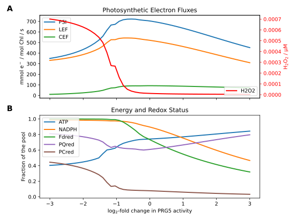
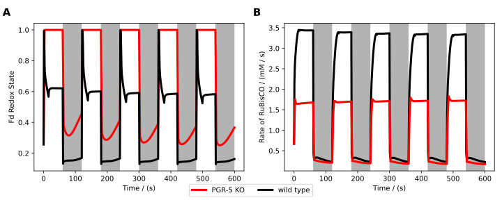
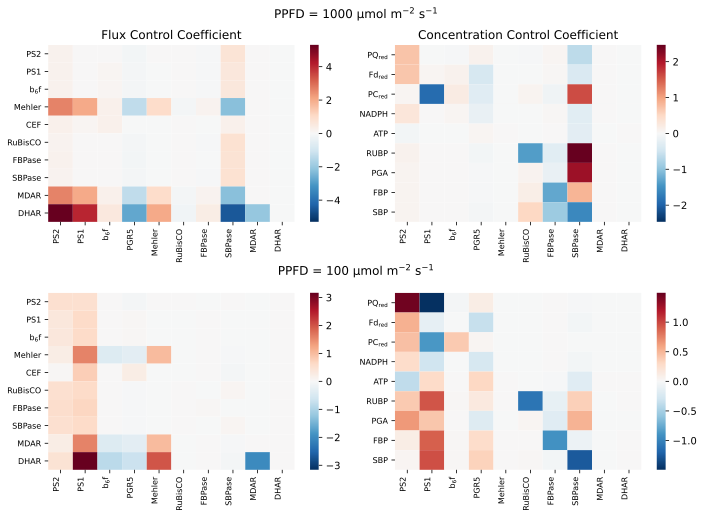
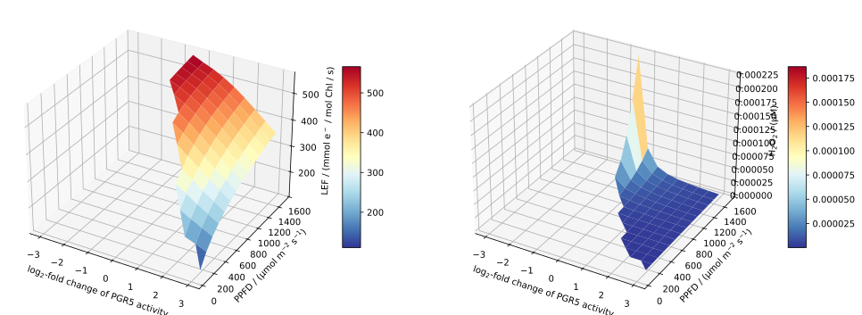

# Saadat2021


[Saadat2021](ENTER HERE)

                     
## Installation

## Summary

### Compounds

#### Part of ODE system

|Name|Common Abbr.|Paper Abbr.|KEGG ID|Python Var|
| :---: | :---: | :---: | :---: | :---: |
|3-phosphoglyceric acid|$\mathrm{PGA}$|$\mathrm{PGA}$|C00197|PGA|
|2,3-biphosphoglyceric acid|$\mathrm{BPGA}$|$\mathrm{BPGA}$|C01159|BPGA|
|Glyceraldehyde 3-phosphate|$\mathrm{GAP}$|$\mathrm{GAP}$|C00118|GAP|
|Dihydroxyacetone phosphate|$\mathrm{DHAP}$|$\mathrm{DHAP}$|C00111|DHAP|
|Fructose 1,6-bisphosphate|$\mathrm{FBP}$|$\mathrm{FBP}$|C00354|FBP|
|Fructose 6-phosphate|$\mathrm{F6P}$|$\mathrm{F6P}$|C00085|F6P|
|Glucose 6-phosphate|$\mathrm{G6P}$|$\mathrm{G6P}$|C00092|G6P|
|Glucose 1-phosphate|$\mathrm{G1P}$|$\mathrm{G1P}$|C00103|G1P|
|Sedoheptulose 1,7-bisphosphate|$\mathrm{SBP}$|$\mathrm{SBP}$|C00447|SBP|
|Sedoheptulose 7-phosphate|$\mathrm{S7P}$|$\mathrm{S7P}$|C05382|S7P|
|Erythrose 4-phosphate|$\mathrm{E4P}$|$\mathrm{E4P}$|C00279|E4P|
|Xylulose 5-phosphate|$\mathrm{X5P}$|$\mathrm{X5P}$|C00231|X5P|
|Ribose 5-phosphate|$\mathrm{R5P}$|$\mathrm{R5P}$|C00117|R5P|
|Ribulose 1,5-bisphosphate|$\mathrm{RUBP}$|$\mathrm{RUBP}$|C01182|RUBP|
|Ribulose 5-phosphate|$\mathrm{RU5P}$|$\mathrm{RU5P}$|C00199|RU5P|
|Stromal ATP concentration|$\mathrm{ATP_{st}}$|$\mathrm{ATP}$|C00002|ATP_st|
|Oxidized Ferrodoxin|$\mathrm{Fd}_\mathrm{ox}$|$\mathrm{Fd}_\mathrm{ox}$|C00139|Fd_ox|
|Lumenal Proton concentration|$\mathrm{H_{lu}}$|$\mathrm{H}^+$|C00080|H_lumen|
|Phosphorylated fraction of light harvesting complexes|$\mathrm{LHC}$|$\mathrm{LHC}$|map00196|LHC|
|Stromal NADPH concentration|$\mathrm{NADPH}_\mathrm{st}$|$\mathrm{NADPH}$|C00005|NADPH_st|
|Oxidized Plastocyanine|$\mathrm{PC}_\mathrm{ox}$|$\mathrm{PC}_\mathrm{ox}$|C03162|PC_ox|
|Plastoquinone|$\mathrm{PQ}$|$\mathrm{PQ}_\mathrm{ox}$|C02061|PQ|
|Concentration of psbS protein|$\mathrm{psbS}$|$\mathrm{Psbs}$|K03542 |psbS|
|Violaxanthin|$\mathrm{Vx}$|$\mathrm{Vx}$|C08614|Vx|
|Monodehydroascorbate radicals|$\mathrm{MDA}$|$\mathrm{MDA}$|C01041|MDA|
|Hydrogen Peroxide|$\mathrm{H_2O_2}$|$\mathrm{H_2O_2}$|C00027|H2O2|
|Dehydroacorbate|$\mathrm{DHA}$|$\mathrm{DHA}$|C05422|DHA|
|Glutathione disulfide|$\mathrm{GSSG}$|$\mathrm{GSSG}$|C00127|GSSG|
|Oxidised thioredoxin|$\mathrm{Trx_{ox}}$|$\mathrm{Trx_{ox}}$|C00343|TRX_ox|
|Inactive CBB proteins|$\mathrm{E}_\mathrm{CBB,\ inact}$|$\mathrm{E}_\mathrm{inactive}$|map00710|E_CBB_inactive|


<details>
<summary>ODE System</summary>

```math
\frac{\mathrm{d}\mathrm{PQ}}{\mathrm{d}t} = -1.0 \cdot v_{\mathrm{PSII}} + 1.0 \cdot v_{\mathrm{PQ}_{\mathrm{ox}}} - 1.0 \cdot v_{\mathrm{NDH}} + 1.0 \cdot v_{\mathrm{b6f}} - 1.0 \cdot v_{\mathrm{Cyc}}
```
```math
\frac{\mathrm{d}\mathrm{H_{lu}}}{\mathrm{d}t} = \frac{1}{b_\mathrm{H}} \cdot \left( 2 \cdot v_{\mathrm{PSII}} + 4 \cdot v_{\mathrm{b6f}} - \mathrm{HPR} \cdot v_{\mathrm{ATPsynthase}} - v_{\mathrm{Leak}} \right)
```
```math
\frac{\mathrm{d}\mathrm{PC}_\mathrm{ox}}{\mathrm{d}t} = -2.0 \cdot v_{\mathrm{b6f}} + 1.0 \cdot v_{\mathrm{PSI}}
```
```math
\frac{\mathrm{d}\mathrm{Fd}_\mathrm{ox}}{\mathrm{d}t} = 2.0 \cdot v_{\mathrm{Cyc}} + 2.0 \cdot v_{\mathrm{FNR}} + 1.0 \cdot v_{\mathrm{FdTrReductase}} - 1.0 \cdot v_{\mathrm{Fd}_{\mathrm{red}}}
```
```math
\frac{\mathrm{d}\mathrm{NADPH}_\mathrm{st}}{\mathrm{d}t} = \mathrm{convf} \cdot v_{\mathrm{FNR}} - 1.0 \cdot v_{\mathrm{BPGAdehynase}} - 1.0 \cdot v_{\mathrm{MDAreduct}} - 1.0 \cdot v_{\mathrm{GR}} - 1.0 \cdot v_{\mathrm{NADPH}_\mathrm{consumption}}
```
```math
\frac{\mathrm{d}\mathrm{LHC}}{\mathrm{d}t} = -1.0 \cdot v_{\mathrm{St21}} + 1.0 \cdot v_{\mathrm{St12}}
```
```math
\frac{\mathrm{d}\mathrm{ATP_{st}}}{\mathrm{d}t} = \mathrm{convf} \cdot v_{\mathrm{ATPsynthase}} - 1.0 \cdot v_{\mathrm{PGK1ase}} - 1.0 \cdot v_{\mathrm{PRKase}} - 1.0 \cdot v_{\mathrm{Starch}} - 1.0 \cdot v_{\mathrm{ATP}_{\mathrm{consumption}}}
```
```math
\frac{\mathrm{d}\mathrm{Vx}}{\mathrm{d}t} = -1.0 \cdot v_{\mathrm{Deepox}} + 1.0 \cdot v_{\mathrm{Epox}}
```
```math
\frac{\mathrm{d}\mathrm{psbS}}{\mathrm{d}t} = -1.0 \cdot v_{\mathrm{Psbs^P}} + 1.0 \cdot v_{\mathrm{Psbs^D}}
```
```math
\frac{\mathrm{d}\mathrm{PGA}}{\mathrm{d}t} = -1.0 \cdot v_{\mathrm{PGK1ase}} - 1.0 \cdot v_{\mathrm{PGA,\ ex}} + 2.0 \cdot v_{\mathrm{RuBisCO|Carboxylase}}
```
```math
\frac{\mathrm{d}\mathrm{BPGA}}{\mathrm{d}t} = -1.0 \cdot v_{\mathrm{BPGAdehynase}} + 1.0 \cdot v_{\mathrm{PGK1ase}}
```
```math
\frac{\mathrm{d}\mathrm{GAP}}{\mathrm{d}t} = 1.0 \cdot v_{\mathrm{BPGAdehynase}} - 1.0 \cdot v_{\mathrm{TPIase}} - 1.0 \cdot v_{\mathrm{Aldolase_{FBP}}} - 1.0 \cdot v_{\mathrm{TKase_{E4P}}} - 1.0 \cdot v_{\mathrm{TKase_{R5P}}} - 1.0 \cdot v_{\mathrm{GAP,\ ex}}
```
```math
\frac{\mathrm{d}\mathrm{DHAP}}{\mathrm{d}t} = 1.0 \cdot v_{\mathrm{TPIase}} - 1.0 \cdot v_{\mathrm{Aldolase_{FBP}}} - 1.0 \cdot v_{\mathrm{Aldolase_{SBP}}} - 1.0 \cdot v_{\mathrm{DHAP,\ ex}}
```
```math
\frac{\mathrm{d}\mathrm{FBP}}{\mathrm{d}t} = 1.0 \cdot v_{\mathrm{Aldolase_{FBP}}} - 1.0 \cdot v_{\mathrm{FBPase}}
```
```math
\frac{\mathrm{d}\mathrm{F6P}}{\mathrm{d}t} = -1.0 \cdot v_{\mathrm{TKase_{E4P}}} + 1.0 \cdot v_{\mathrm{FBPase}} - 1.0 \cdot v_{\mathrm{PGIase}}
```
```math
\frac{\mathrm{d}\mathrm{X5P}}{\mathrm{d}t} = 1.0 \cdot v_{\mathrm{TKase_{E4P}}} + 1.0 \cdot v_{\mathrm{TKase_{R5P}}} - 1.0 \cdot v_{\mathrm{RPEase}}
```
```math
\frac{\mathrm{d}\mathrm{E4P}}{\mathrm{d}t} = 1.0 \cdot v_{\mathrm{TKase_{E4P}}} - 1.0 \cdot v_{\mathrm{Aldolase_{SBP}}}
```
```math
\frac{\mathrm{d}\mathrm{SBP}}{\mathrm{d}t} = 1.0 \cdot v_{\mathrm{Aldolase_{SBP}}} - 1.0 \cdot v_{\mathrm{SBPase}}
```
```math
\frac{\mathrm{d}\mathrm{S7P}}{\mathrm{d}t} = -1.0 \cdot v_{\mathrm{TKase_{R5P}}} + 1.0 \cdot v_{\mathrm{SBPase}}
```
```math
\frac{\mathrm{d}\mathrm{R5P}}{\mathrm{d}t} = 1.0 \cdot v_{\mathrm{TKase_{R5P}}} - 1.0 \cdot v_{\mathrm{Rpiase}}
```
```math
\frac{\mathrm{d}\mathrm{RU5P}}{\mathrm{d}t} = -1.0 \cdot v_{\mathrm{PRKase}} + 1.0 \cdot v_{\mathrm{RPEase}} + 1.0 \cdot v_{\mathrm{Rpiase}}
```
```math
\frac{\mathrm{d}\mathrm{G6P}}{\mathrm{d}t} = 1.0 \cdot v_{\mathrm{PGIase}} - 1.0 \cdot v_{\mathrm{PGMase}}
```
```math
\frac{\mathrm{d}\mathrm{G1P}}{\mathrm{d}t} = -1.0 \cdot v_{\mathrm{Starch}} + 1.0 \cdot v_{\mathrm{PGMase}}
```
```math
\frac{\mathrm{d}\mathrm{RUBP}}{\mathrm{d}t} = 1.0 \cdot v_{\mathrm{PRKase}} - 1.0 \cdot v_{\mathrm{RuBisCO|Carboxylase}}
```
```math
\frac{\mathrm{d}\mathrm{Trx_{ox}}}{\mathrm{d}t} = -1.0 \cdot v_{\mathrm{FdTrReductase}} + 5.0 \cdot v_{\mathrm{Eact}}
```
```math
\frac{\mathrm{d}\mathrm{E}_\mathrm{CBB,\ inact}}{\mathrm{d}t} = -5.0 \cdot v_{\mathrm{Eact}} + 5.0 \cdot v_{\mathrm{Einact}}
```
```math
\frac{\mathrm{d}\mathrm{H_2O_2}}{\mathrm{d}t} = -1.0 \cdot v_{\mathrm{APXase}} + \mathrm{convf} \cdot v_{\mathrm{Mehler}}
```
```math
\frac{\mathrm{d}\mathrm{MDA}}{\mathrm{d}t} = -2.0 \cdot v_{\mathrm{MDAreduct}} + 2.0 \cdot v_{\mathrm{APXase}} - 2.0 \cdot v_{\mathrm{3ASC}}
```
```math
\frac{\mathrm{d}\mathrm{GSSG}}{\mathrm{d}t} = -1.0 \cdot v_{\mathrm{GR}} + 1.0 \cdot v_{\mathrm{DHAR}}
```
```math
\frac{\mathrm{d}\mathrm{DHA}}{\mathrm{d}t} = 1.0 \cdot v_{\mathrm{3ASC}} - 1.0 \cdot v_{\mathrm{DHAR}}
```

</details>
                     
#### Conserved quantities

|Name|Common Abbr.|Paper Abbr.|KEGG ID|Python Var|
| :---: | :---: | :---: | :---: | :---: |
|Lumen pH|$\mathrm{pH}_\mathrm{lu}$|$\mathrm{pH}_\mathrm{lumen}$|C00080|pH_lumen|
|Zeaxanthin concentration|$\mathrm{Zx}$|$\mathrm{Zx}$|C06098|Zx|
|Reduced Ferrodoxin|$\mathrm{Fd}_\mathrm{red}$|$\mathrm{Fd}^-$|C00138|Fd_red|
|Reduced Plastocyanine|$\mathrm{PC}_\mathrm{red}$|$\mathrm{PC}^-$|C03025|PC_red|
|Concentration of protonated psbS protein|$\mathrm{psbS^P}$|$\mathrm{PsbS^P}$|K03542|PsbSP|
|Phosphorylated fraction of light harvesting complexes|$\mathrm{LHCp}$|$\mathrm{LHCp}$|map00196|LHCp|
|Co-operative 4-state quenching mechanism|$\mathrm{Q}$|$\mathrm{Q}$||Q|
|Plastoquinol|$\mathrm{PQH}_2$|$\mathrm{PQH}_2$|C16693|PQH_2|
|Cross section of PSII|$\mathrm{PSII_{cross}}$|$\mathrm{PSII_{cross}}$|M00161|psIIcross|
|Reduced thioredoxin|$\mathrm{TRX_{red}}$|$\mathrm{Trx_{red}}$|C00342|TRX_red|
|Active CBB proteins|$\mathrm{E}_\mathrm{CBB,\ inact}$|$\mathrm{E}_\mathrm{cbb,\ inactive}$|map00710|E_CBB_active|
|Stromal NADP concentration|$\mathrm{NADP}_\mathrm{st}$|$\mathrm{NADP}^+$|C00006|NADP_st|
|Stromal ADP concentration|$\mathrm{ADP_{st}}$|$\mathrm{ADP}$|C00008|ADP_st|
|Stromal concentration of orthophosphate|$\mathrm{P}_\mathrm{i,\ st}$|$\mathrm{P}_\mathrm{i}$|C00009|Pi_st|
|Reduced ascorbate|$\mathrm{ASC}$|$\mathrm{ASC}$||ASC|
|Reduced glutathione|$\mathrm{GSH}$|$\mathrm{GSH}$|C00051|GSH|
|Inhibition factor of the triose phosphate translocators|$\mathrm{IF}_\mathrm{3P}$|$\mathrm{N}$|K01803|IF_3P|
|Initial state of PSII|$\mathrm{B_0}$|$\mathrm{B_0}$|M00161|B0|
|Excited state of PSII|$\mathrm{B_1}$|$\mathrm{B_1}$|M00161|B1|
|Charge seperation state of PSII|$\mathrm{B_2}$|$\mathrm{B_2}$|M00161|B2|
|Photoinhibited state of PSII|$\mathrm{B_3}$|$\mathrm{B_3}$|M00161|B3|
|Ground state of PSI (P700)|$\mathrm{Y_0}$|$\mathrm{Y_0}$|M00163|Y0|
|Activated state of PSI (P700*)|$\mathrm{Y_1}$|$\mathrm{Y_1}$|M00163|Y1|
|Oxidised state of PSI (P700+)|$\mathrm{Y_2}$|$\mathrm{Y_2}$|M00163|Y2|
|Flourescence|$\mathrm{Fluo}$|$\mathrm{Fluo}$||Fluo|


<details>
<summary> Calculations </summary>

```math
\mathrm{PQH}_2 = \mathrm{PQ}^{\mathrm{tot}} - \mathrm{PQ}
```
```math
\mathrm{PC}_\mathrm{red} = \mathrm{PC}^{\mathrm{tot}} - \mathrm{PC}_\mathrm{ox}
```
```math
\mathrm{Fd}_\mathrm{red} = \mathrm{Fd}^{\mathrm{tot}} - \mathrm{Fd}_\mathrm{ox}
```
```math
\mathrm{ADP_{st}} = \mathrm{AP}^{\mathrm{tot}} - \mathrm{ATP_{st}}
```
```math
\mathrm{NADP}_\mathrm{st} = \mathrm{NADP}^{\mathrm{tot}} - \mathrm{NADPH}_\mathrm{st}
```
```math
\mathrm{LHCp} =  1 - \mathrm{LHC}
```
```math
\mathrm{Zx} = \mathrm{X}^{\mathrm{tot}} - \mathrm{Vx}
```
```math
\mathrm{psbS^P} = \mathrm{PsbS}^{\mathrm{tot}} - \mathrm{psbS}
```
```math
\mathrm{PSII_{cross}} =  \sigma _\mathrm{II} ^0 + \left( 1 - \sigma _\mathrm{II} ^0 - \sigma _\mathrm{I} ^0 \right) \cdot \mathrm{LHC}
```
```math
\mathrm{Q} =  \gamma_0 \cdot \mathrm{Vx} \cdot \mathrm{psbS} + \gamma_1 \cdot \mathrm{Vx} \cdot \mathrm{psbS^P} + \gamma_2 \cdot \frac{\mathrm{Zx}}{\mathrm{Zx} + K_\mathrm{ZSat}}  \cdot \mathrm{psbS^P} + \gamma_3 \cdot \frac{\mathrm{Zx}}{\mathrm{Zx} + K_\mathrm{ZSat}}  \cdot \mathrm{psbS}
```
```math
Fluo =  \frac{\mathrm{PSII_{cross}} \cdot k_F \cdot \mathrm{B_0}}{k_F + k_2 + k_H \cdot \mathrm{Q}} + \frac{\mathrm{PSII_{cross}} \cdot k_F \cdot \mathrm{B_2}}{k_F + k_H \cdot \mathrm{Q}}
```
```math
\mathrm{pH}_\mathrm{lu} =  \frac{-\log \left( \mathrm{H_{lu}} \cdot 0.00025 \right)}{\log 10}
```
```math
\mathrm{P}_\mathrm{i,\ st} =  \mathrm{P}^{\mathrm{tot}} - \left( \mathrm{PGA} + 2 \cdot \mathrm{BPGA} + \mathrm{GAP} + \mathrm{DHAP} + 2 \cdot \mathrm{FBP} + \mathrm{F6P} + \mathrm{G6P} + \mathrm{G1P} + 2 \cdot \mathrm{SBP} + \mathrm{S7P} + \mathrm{E4P} + \mathrm{X5P} + \mathrm{R5P} + 2 \cdot \mathrm{RUBP} + \mathrm{RU5P} + \mathrm{ATP_{st}} \right)
```
```math
\mathrm{TRX_{red}} = \mathrm{Thioredoxin}^{\mathrm{tot}} - \mathrm{Trx_{ox}}
```
```math
\mathrm{E}_\mathrm{CBB,\ inact} = \mathrm{Enz}_{\mathrm{cbb}_\mathrm{tot}} - \mathrm{E}_\mathrm{CBB,\ inact}
```
```math
\mathrm{ASC} = \mathrm{Ascorbate}^{\mathrm{tot}} - \mathrm{MDA} - \mathrm{DHA}
```
```math
\mathrm{GSH} =  \mathrm{Gluthation}^{\mathrm{tot}} - 2 \cdot \mathrm{GSSG}
```

</details>

<details>
<summary> Quasi-steady state approximation used to calculate the rate of PSII </summary>

```math
\begin{align}
\left( - \left( \mathrm{PSII_{cross}} \cdot \mathrm{PFD}  \right) - \left(k_{\mathrm{PQ}_\mathrm{red}} \cdot \frac{\mathrm{PQH}_2}{K_\mathrm{QAPQ}} \right) \right) \cdot \mathrm{B_0} + \left( k_{H_0} + k_H \cdot \mathrm{Q} + k_F \right) \cdot \mathrm{B_1} + k_{\mathrm{PQ}_\mathrm{red}} \cdot \mathrm{PQ} \cdot \mathrm{B_2} &= 0 \\
\mathrm{PSII_{cross}} \cdot \mathrm{PFD} \cdot \mathrm{B_0} - \left( k_{H_0} + k_H \cdot \mathrm{Q} + k_F + k_2 \right) \cdot \mathrm{B_1} &= 0 \\
\mathrm{PSII_{cross}} \cdot \mathrm{PFD} \cdot \mathrm{B_2} - \left( k_{H_0} + k_H \cdot \mathrm{Q} + k_F \right) \cdot \mathrm{B_3} &= 0 \\
\mathrm{B_0} + \mathrm{B_1} + \mathrm{B_2} + \mathrm{B_3} &= \mathrm{PSII}^{\mathrm{tot}}
\end{align}
```

</details>

<details>
<summary> Quasi-steady state approximation used to calculate the rate of PSI </summary>

```math
\begin{align}
- \left( \left( 1 - \mathrm{PSII_{cross}} \right) \cdot \mathrm{PFD} + \left( \frac{k_\mathrm{PCox}}{K_\mathrm{PCP700}} \right) \cdot \mathrm{PC}_\mathrm{ox} \right) \cdot \mathrm{Y_0} + k_\mathrm{PCox} \cdot \mathrm{PC}_\mathrm{red} \cdot \mathrm{Y_2} &= 0 \\
\left( 1 - \mathrm{PSII_{cross}} \right) \cdot \mathrm{PFD} \cdot \mathrm{Y_0} - \left( k_{\mathrm{Fd}_\mathrm{red}} \cdot \mathrm{Fd}_\mathrm{ox} + \mathrm{O}_{2_\mathrm{ext}} \cdot k_{\mathrm{Mehler}} \right) \cdot \mathrm{Y_1} + \frac{k_{\mathrm{Fd}_\mathrm{red}}}{K_\mathrm{FAFd}} \cdot \mathrm{Fd}_\mathrm{red} \cdot \mathrm{Y_2}  &= 0 \\
\mathrm{Y_0} + \mathrm{Y_1} + \mathrm{Y_2} &= \mathrm{PSI}^{\mathrm{tot}}
\end{align}
```

</details>

                     
### Parameters

|Short Description|Common Abbr.|Paper Abbr.|Value|Unit|Python Var|Reference|
| :---: | :---: | :---: | :---: | :---: | :---: | :---: |
|Photon Flux Density|$\mathrm{PFD}$|$\mathrm{PFD}$|$100.0$|$\mathrm{\mu mol}\ \mathrm{m}^{-2}\ \mathrm{s}^{-1}$|PPFD||
||$\mathrm{CO}_2$|$\mathrm{CO}_2$|$0.2$|$\mathrm{mM}$|CO2|[[1]](https://doi.org/10.1111/j.1432-1033.1988.tb14242.x)|
|External oxygen pool, corresponds to 250μM.|$\mathrm{O}_{2_\mathrm{ext}}$|$\mathrm{O}_2^\mathrm{ex}$|$8.0$|$\mathrm{mmol} \left(\mathrm{mol\ Chl}\right)^{-1}$|O2_lumen|[[2]](https://doi.org/10.1098/rstb.2013.0223)|
|Stromal pH of a dark adapted state|$\mathrm{pH}_\mathrm{st}$|$\mathrm{pH}_\mathrm{stroma}$|$7.9$||pH_stroma|[[2]](https://doi.org/10.1098/rstb.2013.0223)|
|||$\mathrm{H}_\mathrm{stroma}$|||H_stroma||
|Buffering protons constant of lumen|$b_\mathrm{H}$|$b_\mathrm{H}$|$100.0$||bH|[[2]](https://doi.org/10.1098/rstb.2013.0223)|
|Faraday constant|$F$|$F$|$96.485$|$\mathrm{kJ}$|F||
||$E^0\mathrm{(PC/PC^-)}$|$E^0\mathrm{(PC/PC^-)}$|$0.380$|$\mathrm{V}$|E0_PC|[[2]](https://doi.org/10.1098/rstb.2013.0223)|
||$E^0\mathrm{(P_{700}^+/P_{700})}$|$E^0\mathrm{(P_{700}^+/P_{700})}$|$0.48$|$\mathrm{V}$|E0_P700|[[2]](https://doi.org/10.1098/rstb.2013.0223)|
||$E^0\mathrm{(FA/FA^-)}$|$E^0\mathrm{(FA/FA^-)}$|$-0.55$|$\mathrm{V}$|E0_FA|[[2]](https://doi.org/10.1098/rstb.2013.0223)|
||$E^0\mathrm{(Fd/Fd^-)}$|$E^0\mathrm{(Fd/Fd^-)}$|$-0.43$|$\mathrm{V}$|E0_Fd|[[2]](https://doi.org/10.1098/rstb.2013.0223)|
||$E^0\mathrm{(NADP^+/NADPH)}$|$E^0\mathrm{(NADP^+/NADPH)}$|$-0.113$|$\mathrm{V}$|E0_NADP|[[2]](https://doi.org/10.1098/rstb.2013.0223)|
|Conversion factor of ATP and NADPH|$\mathrm{convf}$|$\mathrm{convf}$|$3.2 \times 10^{-3}$||convf||
|Universal gas constant|$R$|$R$|$0.0083$|$\mathrm{J}\ \mathrm{K}^{-1}\ \mathrm{mol}^{-1}$|R||
|Temperature|$T$|$T$|$298.0$|$\mathrm{K}$|T||
|Relative pool of xanthophylls|$\mathrm{X}^{\mathrm{tot}}$|$\mathrm{X}^{\mathrm{tot}}$|$1.0$|$\mathrm{mmol} \left(\mathrm{mol\ Chl}\right)^{-1}$|Carotenoids_tot|[[3]](https://doi.org/10.1016/j.bbabio.2016.09.003)|
|Total ferrodoxin pool|$\mathrm{Fd}^{\mathrm{tot}}$|$\mathrm{Fd}^{\mathrm{tot}}$|$5.0$|$\mathrm{mmol} \left(\mathrm{mol\ Chl}\right)^{-1}$|Fd_tot||
|Total plastocyanine pool|$\mathrm{PC}^{\mathrm{tot}}$|$\mathrm{PC}^{\mathrm{tot}}$|$4.0$|$\mathrm{mmol} \left(\mathrm{mol\ Chl}\right)^{-1}$|PC_tot|[[2]](https://doi.org/10.1098/rstb.2013.0223)|
|Relative pool of PsbS|$\mathrm{PsbS}^{\mathrm{tot}}$|$\mathrm{PsbS}^{\mathrm{tot}}$|$1.0$|$\mathrm{mmol} \left(\mathrm{mol\ Chl}\right)^{-1}$|PSBS_tot|[[3]](https://doi.org/10.1016/j.bbabio.2016.09.003)|
||||||LHC_tot||
|Fitted quencher factor corresponding to base quenching not associated with protonation or zeaxanthin|$\gamma_0$|$\gamma_0$|$0.1$||gamma0|[[3]](https://doi.org/10.1016/j.bbabio.2016.09.003)|
|Fitted quencher factor corresponding to fast quenching due to protonation|$\gamma_1$|$\gamma_1$|$0.25$||gamma1|[[3]](https://doi.org/10.1016/j.bbabio.2016.09.003)|
|Fitted quencher factor corresponding to fastest possible quenching|$\gamma_2$|$\gamma_2$|$0.6$||gamma2|[[3]](https://doi.org/10.1016/j.bbabio.2016.09.003)|
|Fitted quencher factor corresponding to slow quenching of Zx present despite lack of protonation|$\gamma_3$|$\gamma_3$|$0.15$||gamma3|[[3]](https://doi.org/10.1016/j.bbabio.2016.09.003)|
|Half-saturation constant (relative conc. of Zx) for quenching|$K_\mathrm{ZSat}$|$K_\mathrm{ZSat}$|$0.12$||kZSat|[[3]](https://doi.org/10.1016/j.bbabio.2016.09.003)|
||$E^0\mathrm{(QA/QA^-)}$|$E^0\mathrm{(QA/QA^-)}$|$-0.140$|$\mathrm{V}$|E0_QA|[[2]](https://doi.org/10.1098/rstb.2013.0223)|
||$E^0\mathrm{(PQ/PQH_2)}$|$E^0\mathrm{(PQ/PQH_2)}$|$0.354$|$\mathrm{V}$|E0_PQ|[[2]](https://doi.org/10.1098/rstb.2013.0223)|
|Total plastoquinone pool|$\mathrm{PQ}^{\mathrm{tot}}$|$\mathrm{PQ}^{\mathrm{tot}}$|$17.5$|$\mathrm{mmol} \left(\mathrm{mol\ Chl}\right)^{-1}$|PQ_tot|[[2]](https://doi.org/10.1098/rstb.2013.0223)|
|Relative cross section of PSII|$\sigma _\mathrm{II} ^0$|$\sigma _\mathrm{II} ^0$|$0.1$||staticAntII|[[4]](https://doi.org/10.1073/pnas.1319164111)|
|Relative cross section of PSI-LHCl supercomplex|$\sigma _\mathrm{I} ^0$|$\sigma _\mathrm{I} ^0$|$0.37$||staticAntI|[[4]](https://doi.org/10.1073/pnas.1319164111)|
|Relative total concentration of thioredoxin|$\mathrm{Thioredoxin}^{\mathrm{tot}}$|$\mathrm{thioredoxin}_\mathrm{tot}$|$1$||Thioredoxin_tot||
|Estimated maximal concentration of CBB enzymes|$\mathrm{Enz}_{\mathrm{cbb}_\mathrm{tot}}$|$e_{\mathrm{cbb}_\mathrm{tot}}$|$6$|$\mathrm{mM}$|E_total||
|Total NADP pool|$\mathrm{NADP}^{\mathrm{tot}}$|$\mathrm{NADP}^{\mathrm{tot}}$|$0.8$|$\mathrm{mM}$|NADP_tot|[[1]](https://doi.org/10.1111/j.1432-1033.1988.tb14242.x)|
|Total adenosine phosphate pool|$\mathrm{AP}^{\mathrm{tot}}$|$\mathrm{AP}^{\mathrm{tot}}$|$2.55$|$\mathrm{mM}$|AP_tot|Increased from Bionumbers|
|Total Phosphate pool|$\mathrm{P}^{\mathrm{tot}}$|$\mathrm{P}^{\mathrm{tot}}$|$17.05$|$\mathrm{mmol} \left(\mathrm{mol\ Chl}\right)^{-1}$|Pi_tot||
|Rate constant of ferrodoxin thioredoxin reductase|$k_{\mathrm{fdtrredase}}$|$k_{\mathrm{fd}_{\mathrm{tr}_\mathrm{reductase}}}$|$1$|$\mathrm{s}^{-1}$|kf_v_FdTrReduc|Estimated|
|Rate constant of CBB activation|$k_{\mathrm{ecbb\|act}}$|$k_{\mathrm{e}_{\mathrm{cbb}_\mathrm{activation}}}$|$1$||kf_v_Eact|Estimated|
|Rate constant of CBB relaxation|$k_{\mathrm{ecbb\|rel}}$|$k_{\mathrm{e}_{\mathrm{cbb}_\mathrm{relaxation}}}$|$0.1$|$\mathrm{s}^{-1}$|kf_v_Einact|Estimated|
|Total concentration of reduced and oxidized ascorbate|$\mathrm{Ascorbate}^{\mathrm{tot}}$|$\mathrm{Ascorbate}_{\mathrm{total}}$|$10$|$\mathrm{mM}$|ASC_tot||
|Total concentration of reduced and oxidized glutathione|$\mathrm{Gluthation}^{\mathrm{tot}}$|$\mathrm{Gluthation}_{\mathrm{total}}$|$10$|$\mathrm{mM}$|Glutathion_tot||
|Rate constant of ATP synthase|$k_\mathrm{ATPsynth}$|$k_\mathrm{ATPsynthase}$|$20.0$|$\mathrm{s}^{-1}$|kf_v_ATPsynth|[[2]](https://doi.org/10.1098/rstb.2013.0223)|
|Ratio of protons to ATP in ATP synthase|$\mathrm{HPR}$|$\mathrm{HPR}$|$\frac{14}{3}$||HPR|[[2]](https://doi.org/10.1098/rstb.2013.0223)|
|Internal pool of phosphates, required to calculate ATP equilibrium|$\mathrm{Pi}_\mathrm{mol}$|$\mathrm{Pi}_\mathrm{mol}$|$0.01$|$\mathrm{mmol} \left(\mathrm{mol\ Chl}\right)^{-1}$|Pi_mol||
|Standard Gibbs free energy change of ATP formation|$\Delta _\mathrm{f} G^\circ_\mathrm{ATP}$|$\Delta G_{0_{ATP}}$|$30.6$|$\mathrm{kJ}\ \mathrm{mol}^{-1}$|DeltaG0_ATP|[[2]](https://doi.org/10.1098/rstb.2013.0223)|
||$k_\mathrm{Cytb6f}$|$k_\mathrm{Cytb6f}$|$2.5$|$\left(\mathrm{mol\ Chl}\right)^2 \ \mathrm{mmol}^{-2}\ \mathrm{s}^{-1}$ |kcat_v_b6f|[[2]](https://doi.org/10.1098/rstb.2013.0223)|
|Hill-coefficient for PsbS protonation|${\mathrm{nH}_\mathrm{PsbS}}$|$\mathrm{k}_{\mathrm{Hill}_\mathrm{L}}$|$3.0$||kh_v_PsbSP|[[3]](https://doi.org/10.1016/j.bbabio.2016.09.003)|
|Rate of PsbS protonation|$k_\mathrm{Protonation}$|$k_\mathrm{Protonation}$|$0.0096$|$\mathrm{s}^{-1}$|kf_v_PsbSP|[[3]](https://doi.org/10.1016/j.bbabio.2016.09.003)|
|pKa of PsbS activation, kept the same as for VDA|$K_\mathrm{pHSatLHC}$|$K_\mathrm{pHSatLHC}$|$5.8$||ksat_v_PsbSP|[[3]](https://doi.org/10.1016/j.bbabio.2016.09.003)|
|Rate of PsbS deprotonation|$k_\mathrm{Deprotonation}$|$k_\mathrm{Deprotonation}$|$0.0096$|$\mathrm{s}^{-1}$|kf_v_PsbSD|[[3]](https://doi.org/10.1016/j.bbabio.2016.09.003)|
|Reaction rate constant of cyclic electron flow|$k_\mathrm{cyc}$|$k_\mathrm{cyc}$|$1.0$|$\mathrm{s}^{-1}$|kf_v_Cyc||
|Rate constant of de-epoxidation of violaxanthin|$k_\mathrm{kDeepoxV}$|$k_\mathrm{DeepoxV}$|$0.0024$|$\mathrm{s}^{-1}$|kf_v_Deepox|[[3]](https://doi.org/10.1016/j.bbabio.2016.09.003)|
|Hill-coefficient for de-epoxidase acitivity|${\mathrm{nH}_\mathrm{X}}$|$\mathrm{k}_{\mathrm{Hill}_\mathrm{X}}$|$5$||kh_v_Deepox|[[3]](https://doi.org/10.1016/j.bbabio.2016.09.003)|
|Half-saturation pH for de-epoxidase activity, highest activity at pH 5.8|$K_\mathrm{pHSat}$|$K_\mathrm{pHSat}$|$5.8$||ksat_v_Deepox|[[3]](https://doi.org/10.1016/j.bbabio.2016.09.003)|
|Rate constant of epoxidation of violaxanthin|$k_\mathrm{kEpoxZ}$|$k_\mathrm{EpoxZ}$|$0.00024$|$\mathrm{s}^{-1}$|kf_v_Epox|[[3]](https://doi.org/10.1016/j.bbabio.2016.09.003)|
||$K_{\mathrm{M}_{\mathrm{FNR}_\mathrm{F}}}$|$K_{\mathrm{M}_{\mathrm{FNR}_\mathrm{F}}}$|$1.56$|$\mathrm{mmol} \left(\mathrm{mol\ Chl}\right)^{-1}$|km_v_FNR_Fd_red|[[2]](https://doi.org/10.1098/rstb.2013.0223)|
||$K_{\mathrm{M}_{\mathrm{FNR}_\mathrm{N}}}$|$K_{\mathrm{M}_{\mathrm{FNR}_\mathrm{N}}}$|$0.22$|$\mathrm{mmol} \left(\mathrm{mol\ Chl}\right)^{-1}$|km_v_FNR_NADP_st|[[2]](https://doi.org/10.1098/rstb.2013.0223)|
||$\mathrm{EFNR}$|$\mathrm{EFNR}$|$3.0$||Enz0_v_FNR||
|Catalytic constant of FNRase|$k_{\mathrm{cat}\|\mathrm{FNRase}}$|$k_{\mathrm{cat}_\mathrm{FNR}}$|$500.0$|$\mathrm{s}^{-1}$|kcat_v_FNR|[[5]](https://doi.org/10.1046/j.1432-1033.2003.03566.x)|
||$k_\mathrm{NDH}$|$k_\mathrm{NDH}$|$0.002$|$\mathrm{s}^{-1}$|kf_v_NDH|[[2]](https://doi.org/10.1098/rstb.2013.0223)|
|PSII reaction centres|$\mathrm{PSII}^{\mathrm{tot}}$|$\mathrm{PSII}^{\mathrm{tot}}$|$2.5$|$\mathrm{mmol} \left(\mathrm{mol\ Chl}\right)^{-1}$|PSII_total|[[2]](https://doi.org/10.1098/rstb.2013.0223)|
|PSI reaction centres|$\mathrm{PSI}^{\mathrm{tot}}$|$\mathrm{PSI}^{\mathrm{tot}}$|$2.5$|$\mathrm{mmol} \left(\mathrm{mol\ Chl}\right)^{-1}$|PSI_total|[[2]](https://doi.org/10.1098/rstb.2013.0223)|
|Base rate of non-radiative decay|$k_{H_0}$|$k_{H_0}$|$5 \times 10^8$|$\mathrm{s}^{-1}$|kH0||
||$k_{\mathrm{PQ}_\mathrm{red}}$|$k_{\mathrm{PQ}_\mathrm{red}}$|$250.0$|$\left(\mathrm{mol\ Chl}\right)\ \mathrm{mmol}^{-1}\ \mathrm{s}^{-1}$ |kPQred|[[2]](https://doi.org/10.1098/rstb.2013.0223)|
||$k_\mathrm{PCox}$|$k_\mathrm{PCox}$|$2500.0$|$\left(\mathrm{mol\ Chl}\right)\ \mathrm{mmol}^{-1}\ \mathrm{s}^{-1}$ |kPCox|[[2]](https://doi.org/10.1098/rstb.2013.0223)|
||$k_{\mathrm{Fd}_\mathrm{red}}$|$k_{\mathrm{Fd}_\mathrm{red}}$|$2.5 \times 10^5$|$\left(\mathrm{mol\ Chl}\right)\ \mathrm{mmol}^{-1}\ \mathrm{s}^{-1}$ |kFdred|[[2]](https://doi.org/10.1098/rstb.2013.0223)|
|Rate constant for photochemistry|$k_2$|$k_2$|$5 \times 10^9$|$\mathrm{s}^{-1}$|k2||
|Rate of non-radiative decay|$k_H$|$k_H$|$5 \times 10^9$|$\mathrm{s}^{-1}$|kH|[[2]](https://doi.org/10.1098/rstb.2013.0223)|
|Rate of fluorescence|$k_F$|$k_F$|$6.25 \times 10^8$|$\mathrm{s}^{-1}$|kF||
|Estimated rate constant for summarized hydrogen peroxide production|$k_{\mathrm{Mehler}}$|$k_{\mathrm{Mehler}}$|$1.0$|$\mathrm{mM}^{-1}\ \mathrm{s}^{-1}$|kMehler||
||||||Enz0_v_Fdred||
||||||kcat_v_Fdred||
|Rate constant of proton leak|$k_\mathrm{Leak}$|$k_\mathrm{leak}$|$10.0$|$\mathrm{s}^{-1}$|kf_v_Leak|[[2]](https://doi.org/10.1098/rstb.2013.0223)|
||$k_\mathrm{PTOX}$|$k_\mathrm{PTOX}$|$0.01$|$\left(\mathrm{mol\ Chl}\right)\ \mathrm{mmol}^{-1}\ \mathrm{s}^{-1}$ |kPTOX|[[2]](https://doi.org/10.1098/rstb.2013.0223)|
|Rate of phosphorylation of state transition from PSII to PSI|$k_\mathrm{Stt7}$|$k_\mathrm{Stt7}$|$0.0035$|$\mathrm{s}^{-1}$|kStt7|[[2]](https://doi.org/10.1098/rstb.2013.0223)|
|Switch point (half-activity of Stt7) for 20% PQ oxidised|$K_{\mathrm{M}_\mathrm{ST}}$|$K_{\mathrm{M}_\mathrm{ST}}$|$0.2$||km_v_St12|[[2]](https://doi.org/10.1098/rstb.2013.0223)|
|Hill coefficient of State transtion from PSII to PSI|$n_\mathrm{ST}$|$n_\mathrm{ST}$|$2.0$||n_ST|[[2]](https://doi.org/10.1098/rstb.2013.0223)|
|Rate of dephosphorylation of state transition from PSI to PSII|$k_\mathrm{Pph1}$|$k_\mathrm{Pph1}$|$0.0013$|$\mathrm{s}^{-1}$|kPph1|[[2]](https://doi.org/10.1098/rstb.2013.0223)|
||||||Enz0_rubisco||
|Base $V_\mathrm{max}$ of RuBisCO|$V_{\mathrm{max,\ base}_{\mathrm{RuBisCO}}}$|$V_{1_{\mathrm{base}}}$|$0.34 \cdot 8$|$\mathrm{mM}\ s^{-1}$|kcat_v_RuBisCO_c||
|Michaelis Menten constant of RuBisCO for RUBP|$K_{\mathrm{m}\|\mathrm{RuBisCO}\|\mathrm{RUBP}}$|$K_{\mathrm{m}1}$|$0.02$|$\mathrm{mM}$|km_v_RuBisCO_c_RUBP|[[1]](https://doi.org/10.1111/j.1432-1033.1988.tb14242.x)|
|Michaelis Menten constant of RuBisCO for CO2|$K_{\mathrm{m}\|\mathrm{RuBisCO}\|\mathrm{CO_2}}$|$K_{\mathrm{mCO2}}$|$0.0107$|$\mathrm{mM}$|km_v_RuBisCO_c_CO2|[[1]](https://doi.org/10.1111/j.1432-1033.1988.tb14242.x)|
|Inhibition constant of RuBisCO by PGA|$K_{i\|\mathrm{RuBisCO}\|\mathrm{PGA}}$|$K_{\mathrm{i}11}$|$0.04$|$\mathrm{mM}$|ki_v_RuBisCO_c_PGA|[[1]](https://doi.org/10.1111/j.1432-1033.1988.tb14242.x)|
|Inhibition constant of RuBisCO by FBP|$K_{i\|\mathrm{RuBisCO}\|\mathrm{FBP}}$|$K_{\mathrm{i}12}$|$0.04$|$\mathrm{mM}$|ki_v_RuBisCO_c_FBP|[[1]](https://doi.org/10.1111/j.1432-1033.1988.tb14242.x)|
|Inhibition constant of RuBisCO by SBP|$K_{i\|\mathrm{RuBisCO}\|\mathrm{SBP}}$|$K_{\mathrm{i}13}$|$0.075$|$\mathrm{mM}$|ki_v_RuBisCO_c_SBP|[[1]](https://doi.org/10.1111/j.1432-1033.1988.tb14242.x)|
|Inhibition constant of RuBisCO by Pi|$K_{i\|\mathrm{RuBisCO}\|\mathrm{Pi}}$|$K_{\mathrm{i}14}$|$0.9$|$\mathrm{mM}$|ki_v_RuBisCO_c_Pi_st|[[1]](https://doi.org/10.1111/j.1432-1033.1988.tb14242.x)|
|Inhibition constant of RuBisCO by NADPH|$K_{i\|\mathrm{RuBisCO}\|\mathrm{NADPH}}$|$K_{\mathrm{i}15}$|$0.07$|$\mathrm{mM}$|ki_v_RuBisCO_c_NADPH_st|[[1]](https://doi.org/10.1111/j.1432-1033.1988.tb14242.x)|
|Arbituary fast rate constant|$k_\mathrm{fast}$|$k$|$8 \times 10^8$|$\mathrm{mM}$|kre_v_PGK1ase|[[6]](https://doi.org/10.1093/jexbot/51.suppl_1.319)|
|Equilibrium constant of PGK1ase|$K_\mathrm{PGK1ase}$|$q_2$|$3.1 \times 10^{-4}$||keq_v_PGK1ase|[[1]](https://doi.org/10.1111/j.1432-1033.1988.tb14242.x)|
|Arbituary fast rate constant|$k_\mathrm{fast}$|$k$|$8 \times 10^8$|$\mathrm{mM}$|kre_v_BPGAdehynase|[[6]](https://doi.org/10.1093/jexbot/51.suppl_1.319)|
|Equilibrium constant of BPGA dehydrogenase|$K_\mathrm{BPGAdehynase}$|$q_3$|$1.6 \times 10^{7}$||keq_v_BPGAdehynase|[[1]](https://doi.org/10.1111/j.1432-1033.1988.tb14242.x)|
|Arbituary fast rate constant|$k_\mathrm{fast}$|$k$|$8 \times 10^8$|$\mathrm{mM}$|kre_v_TPIase|[[6]](https://doi.org/10.1093/jexbot/51.suppl_1.319)|
|Equilibrium constant of TPIase|$K_\mathrm{TPIase}$|$q_4$|$22.0$||keq_v_TPIase|[[1]](https://doi.org/10.1111/j.1432-1033.1988.tb14242.x)|
|Arbituary fast rate constant|$k_\mathrm{fast}$|$k$|$8 \times 10^8$|$\mathrm{mM}$|kre_v_Aldolase_FBP|[[6]](https://doi.org/10.1093/jexbot/51.suppl_1.319)|
|Equilibrium constant of Aldolase of GAP and DHAP to FBP|$K_\mathrm{Aldolase_{FBP}}$|$q_5$|$7.1$|$\mathrm{mM}^{-1}$|keq_v_Aldolase_FBP|[[1]](https://doi.org/10.1111/j.1432-1033.1988.tb14242.x)|
|Arbituary fast rate constant|$k_\mathrm{fast}$|$k$|$8 \times 10^8$|$\mathrm{mM}$|kre_v_Aldolase_SBP|[[6]](https://doi.org/10.1093/jexbot/51.suppl_1.319)|
|Equilibrium constant of Aldolase of E4P and DHAP to SBP|$K_\mathrm{Aldolase_{SBP}}$|$q_8$|$13.0$|$\mathrm{mM}^{-1}$|keq_v_Aldolase_SBP|[[1]](https://doi.org/10.1111/j.1432-1033.1988.tb14242.x)|
||||||Enz0_v_FBPase||
|Base $V_\mathrm{max}$ of FBPase|$V_{\mathrm{max,\ base}_{\mathrm{FBPase}}}$|$V_{6_{\mathrm{base}}}$|$1.6$|$\mathrm{mM}\ s^{-1}$|kcat_v_FBPase||
|Michaelis Menten constant of FBPase|$K_{\mathrm{m}\|\mathrm{FBPase}}$ |$K_{\mathrm{m}6}$|$0.03$|$\mathrm{mM}$|km_v_FBPase_s|[[1]](https://doi.org/10.1111/j.1432-1033.1988.tb14242.x)|
|Inhibition constant of FBPase by F6P|$K_{i\|\mathrm{FBPase}\|\mathrm{F6P}}$|$K_{\mathrm{i}61}$|$0.7$|$\mathrm{mM}$|ki_v_FBPase_F6P|[[1]](https://doi.org/10.1111/j.1432-1033.1988.tb14242.x)|
|Inhibition constant of FBPase by Pi|$K_{i\|\mathrm{FBPase}\|\mathrm{Pi}}$|$K_{\mathrm{i}62}$|$12.0$|$\mathrm{mM}$|ki_v_FBPase_Pi_st|[[1]](https://doi.org/10.1111/j.1432-1033.1988.tb14242.x)|
|Arbituary fast rate constant|$k_\mathrm{fast}$|$k$|$8 \times 10^8$|$\mathrm{mM}$|kre_v_TKase_E4P|[[6]](https://doi.org/10.1093/jexbot/51.suppl_1.319)|
|Equilibrium constant of TKase of GAP and F6P to X5P and E4P|$K_\mathrm{TKase_{E4P}}$|$q_7$|$0.084$||keq_v_TKase_E4P|[[1]](https://doi.org/10.1111/j.1432-1033.1988.tb14242.x)|
|Arbituary fast rate constant|$k_\mathrm{fast}$|$k$|$8 \times 10^8$|$\mathrm{mM}$|kre_v_TKase_R5P|[[6]](https://doi.org/10.1093/jexbot/51.suppl_1.319)|
|Equilibrium constant of TKase of GAP and S7P to X5P and R5P|$K_\mathrm{TKase_{R5P}}$|$q_{10}$|$0.85$||keq_v_TKase_R5P|[[1]](https://doi.org/10.1111/j.1432-1033.1988.tb14242.x)|
||||||Enz0_v_SBPase||
|Base $V_\mathrm{max}$ of SBPase|$V_{\mathrm{max,\ base}_{\mathrm{SBPase}}}$|$V_{9_{\mathrm{base}}}$|$0.32$|$\mathrm{mM}\ s^{-1}$|kcat_v_SBPase||
|Michaelis Menten constant of SBPase|$K_{\mathrm{m}\|\mathrm{SBPase}}$ |$K_{\mathrm{m}9}$|$0.013$|$\mathrm{mM}$|km_v_SBPase_s|[[1]](https://doi.org/10.1111/j.1432-1033.1988.tb14242.x)|
|Inhibition constant of SBPase by Pi|$K_{i\|\mathrm{SBPase}\|\mathrm{Pi}}$|$K_{\mathrm{i}9}$|$12.0$|$\mathrm{mM}$|ki_v_SBPase_Pi_st|[[1]](https://doi.org/10.1111/j.1432-1033.1988.tb14242.x)|
|Arbituary fast rate constant|$k_\mathrm{fast}$|$k$|$8 \times 10^8$|$\mathrm{mM}$|kre_v_Rpiase|[[6]](https://doi.org/10.1093/jexbot/51.suppl_1.319)|
|Equilibrium constant of Rpiase|$K_\mathrm{Rpiase}$|$q_{11}$|$0.4$||keq_v_Rpiase|[[1]](https://doi.org/10.1111/j.1432-1033.1988.tb14242.x)|
|Arbituary fast rate constant|$k_\mathrm{fast}$|$k$|$8 \times 10^8$|$\mathrm{mM}$|kre_v_RPEase|[[6]](https://doi.org/10.1093/jexbot/51.suppl_1.319)|
|Equilibrium constant of RPEase|$K_\mathrm{RPEase}$|$q_{12}$|$0.67$||keq_v_RPEase|[[1]](https://doi.org/10.1111/j.1432-1033.1988.tb14242.x)|
||||||Enz0_v_PRKase||
|Base $V_\mathrm{max}$ of PRKase|$V_{\mathrm{max,\ base}_{\mathrm{PRKase}}}$|$V_{13_{\mathrm{base}}}$|$7.9992$|$\mathrm{mM}\ s^{-1}$|kcat_v_PRKase||
|Michaelis Menten constant of PRKase for RU5P|$K_{\mathrm{m}\|\mathrm{PRKase}\|\mathrm{RU5P}}$|$K_{\mathrm{m}131}$|$0.05$|$\mathrm{mM}$|km_v_PRKase_RU5P|[[1]](https://doi.org/10.1111/j.1432-1033.1988.tb14242.x)|
|Michaelis Menten constant of PRKase for ATP|$K_{\mathrm{m}\|\mathrm{PRKase}\|\mathrm{ATP}}$|$K_{\mathrm{m}132}$|$0.05$|$\mathrm{mM}$|km_v_PRKase_ATP_st|[[1]](https://doi.org/10.1111/j.1432-1033.1988.tb14242.x)|
|Inhibition constant of Ru5P of PRKase by PGA|$K_{i\|\mathrm{PRKase}\|\mathrm{PGA}}$|$K_{\mathrm{i}131}$|$2.0$|$\mathrm{mM}$|ki_v_PRKase_PGA|[[1]](https://doi.org/10.1111/j.1432-1033.1988.tb14242.x)|
|Inhibition constant of Ru5P of PRKase by RuBP|$K_{i\|\mathrm{PRKase}\|\mathrm{RuBP}}$|$K_{\mathrm{i}132}$|$0.7$|$\mathrm{mM}$|ki_v_PRKase_RUBP|[[1]](https://doi.org/10.1111/j.1432-1033.1988.tb14242.x)|
|Inhibition constant of Ru5P of PRKase by Pi|$K_{i\|\mathrm{PRKase}\|\mathrm{Pi}}$|$K_{\mathrm{i}133}$|$4.0$|$\mathrm{mM}$|ki_v_PRKase_Pi_st|[[1]](https://doi.org/10.1111/j.1432-1033.1988.tb14242.x)|
|Uncompetitive inhibition constant of ATP of PRKase by ADP|$K_{i\|\mathrm{unc}\|\mathrm{PRKase}\|\mathrm{Pi}}$|$K_{\mathrm{i}134}$|$2.5$|$\mathrm{mM}$|ki_v_PRKase_4|[[1]](https://doi.org/10.1111/j.1432-1033.1988.tb14242.x)|
|Competitive inhibition constant of ATP of PRKase by ADP|$K_{i\|\mathrm{com}\|\mathrm{PRKase}\|\mathrm{Pi}}$|$K_{\mathrm{i}135}$|$0.4$|$\mathrm{mM}$|ki_v_PRKase_5|[[1]](https://doi.org/10.1111/j.1432-1033.1988.tb14242.x)|
|Arbituary fast rate constant|$k_\mathrm{fast}$|$k$|$8 \times 10^8$|$\mathrm{mM}$|kre_v_PGIase|[[6]](https://doi.org/10.1093/jexbot/51.suppl_1.319)|
|Equilibrium constant of PGIase|$K_\mathrm{PGIase}$|$q_{14}$|$2.3$||keq_v_PGIase|[[1]](https://doi.org/10.1111/j.1432-1033.1988.tb14242.x)|
|Arbituary fast rate constant|$k_\mathrm{fast}$|$k$|$8 \times 10^8$|$\mathrm{mM}$|kre_v_PGMase|[[6]](https://doi.org/10.1093/jexbot/51.suppl_1.319)|
|Equilibrium constant of PGMase|$K_\mathrm{PGMase}$|$q_{15}$|$0.058$||keq_v_PGMase|[[1]](https://doi.org/10.1111/j.1432-1033.1988.tb14242.x)|
|External phosphate|$\mathrm{P}_\mathrm{ext}$|$\mathrm{P}_\mathrm{ext}$|$0.5$|$\mathrm{mM}$|Pi_ext|[[1]](https://doi.org/10.1111/j.1432-1033.1988.tb14242.x)|
|Dissociation constant for the complex formed by phosphate translocator and PGA|$K_{\mathrm{diss}\|\mathrm{PGA}}$ |$K_{\mathrm{pga}}$|$0.25$|$\mathrm{mM}$|km_v_pga_ex|[[1]](https://doi.org/10.1111/j.1432-1033.1988.tb14242.x)|
|Dissociation constant for the complex formed by phosphate translocator and GAP|$K_{\mathrm{diss}\|\mathrm{GAP}}$ |$K_{\mathrm{gap}}$|$0.075$|$\mathrm{mM}$|km_v_gap_ex|[[1]](https://doi.org/10.1111/j.1432-1033.1988.tb14242.x)|
|Dissociation constant for the complex formed by phosphate translocator and DHAP|$K_{\mathrm{diss}\|\mathrm{DHAP}}$ |$K_{\mathrm{dhap}}$|$0.077$|$\mathrm{mM}$|km_v_dhap_ex|[[1]](https://doi.org/10.1111/j.1432-1033.1988.tb14242.x)|
|Dissociation constant for the complex formed by phosphate translocator and external orthophosphate|$K_{\mathrm{diss}\|\mathrm{P_{ext}}}$ |$K_{\mathrm{pxt}}$|$0.74$|$\mathrm{mM}$|km_N_translocator_Pi_ext|[[1]](https://doi.org/10.1111/j.1432-1033.1988.tb14242.x)|
|Dissociation constant for the complex formed by phosphate translocator and Pi|$K_{\mathrm{diss}\|\mathrm{Pi}}$ |$K_{\mathrm{pi}}$|$0.63$|$\mathrm{mM}$|km_N_translocator_Pi_st|[[1]](https://doi.org/10.1111/j.1432-1033.1988.tb14242.x)|
|$V_\mathrm{max}$ of Export|$V_{\mathrm{max}_{\mathrm{ex}}}$|$V_{\mathrm{ex}}$|$2.0$|$\mathrm{mM}\ s^{-1}$|kcat_N_translocator||
||||||Enz0_N_translocator||
||||||Enz0_v_starch||
|Michaelis Menten constant of Starch production for G1P|$K_{\mathrm{m}\|\mathrm{Starch}\|\mathrm{G1P}}$|$K_{\mathrm{mst}1}$|$0.08$|$\mathrm{mM}$|km_v_starch_G1P|[[1]](https://doi.org/10.1111/j.1432-1033.1988.tb14242.x)|
|Michaelis Menten constant of Starch production for ATP|$K_{\mathrm{m}\|\mathrm{Starch}\|\mathrm{ATP}}$|$K_{\mathrm{mst}2}$|$0.08$|$\mathrm{mM}$|km_v_starch_ATP_st|[[1]](https://doi.org/10.1111/j.1432-1033.1988.tb14242.x)|
|Inhibition constant of ATP of Starch production by ADP|$K_{i\|\mathrm{Starch}\|\mathrm{ADP}}$|$K_{\mathrm{ist}}$|$10.0$|$\mathrm{mM}$|ki_v_starch|[[1]](https://doi.org/10.1111/j.1432-1033.1988.tb14242.x)|
|Activation factor of Starch production by PGA|$K_{\mathrm{act}\|\mathrm{Starch}\|\mathrm{PGA}}$|$K_{\mathrm{ast1}}$|$0.1$||ki_v_starch_PGA|[[1]](https://doi.org/10.1111/j.1432-1033.1988.tb14242.x)|
|Activation factor of Starch production by F6P|$K_{\mathrm{act}\|\mathrm{Starch}\|\mathrm{F6P}}$|$K_{\mathrm{ast2}}$|$0.02$||ki_v_starch_F6P|[[1]](https://doi.org/10.1111/j.1432-1033.1988.tb14242.x)|
|Activation factor of Starch production by FBP|$K_{\mathrm{act}\|\mathrm{Starch}\|\mathrm{FBP}}$|$K_{\mathrm{ast3}}$|$0.02$||ki_v_starch_FBP|[[1]](https://doi.org/10.1111/j.1432-1033.1988.tb14242.x)|
|Base $V_\mathrm{max}$ of Starch Synthase|$V_{\mathrm{max,\ base}_{\mathrm{Starch}}}$|$V_{\mathrm{st}_{\mathrm{base}}}$|$0.32$|$\mathrm{mM}\ s^{-1}$|kcat_v_starch||
|Rate constant for the spontaneous disproportion of MDA|$k_3$|$k3$|$500.0$|$\mathrm{mM}^{-1}\ \mathrm{s}^{-1}$|kf_v_3ASC|[[7]](https://doi.org/10.1104/pp.108.133223)|
|Concentration of monodehydroascorbate reductase|$\mathrm{MDAR}_0$|$\mathrm{MDAR}_0$|$2 \times 10^{-3}$|$\mathrm{mM}$|Enz0_v_MDAreduct|[[8]](https://doi.org/10.1186/s12918-015-0239-y)|
|Turnover rate of monodehydroascorbate reductase|$k_{\mathrm{cat\|MDAR}}$|$k_{\mathrm{cat}_{\mathrm{MDAR}}}$|$300.0$|$\mathrm{s}^{-1}$|kcat_v_MDAreduct|[[8]](https://doi.org/10.1186/s12918-015-0239-y)|
|Michaelis-menten constant of monodehydroascorbate for the conversion to NADPH|$K_{\mathrm{m\|MDAR\|NADPH}}$|$K_{\mathrm{m}_{\mathrm{MDAR-NADPH}}}$|$23 \times 10^{-3}$|$\mathrm{mM}$|km_v_MDAreduct_NADPH_st|[[8]](https://doi.org/10.1186/s12918-015-0239-y)|
|Michaelis-menten constant of monodehydroascorbate for the conversion to MDA|$K_{\mathrm{m\|MDAR\|MDA}}$|$K_{\mathrm{m}_{\mathrm{MDAR-MDA}}}$|$1.4 \times 10^{-3}$|$\mathrm{mM}$|km_v_MDAreduct_MDA|[[8]](https://doi.org/10.1186/s12918-015-0239-y)|
||$kf_1$|$kf1$|$10000.0$||kf1|Estimated|
||$kr_1$|$kr1$|$220.0$||kr1|BRENDA database|
||$kf_2$|$kf2$|$10000.0$||kf2|Estimated|
||$kr_2$|$kr2$|$4000.0$||kr2|BRENDA database|
||$kf_3$|$kf3$|$2510.0$||kf3|BRENDA database|
||$kf_4$|$kf4$|$10000.0$||kf4|Estimated|
||$kr_4$|$kr4$|$4000.0$||kr4|BRENDA database|
||$kf_5$|$kf5$|$2510.0$||kf5|BRENDA database|
|Concentration of ascorbate peroxidase|$XT$|$XT$|$0.07$||XT|[[7]](https://doi.org/10.1104/pp.108.133223)|
|Concentration of gluthatione reductase|$\mathrm{GR}_0$|$\mathrm{GR}_0$|$1.4 \times 10^{-3}$|$\mathrm{mM}$|Enz0_v_GR|[[7]](https://doi.org/10.1104/pp.108.133223)|
|Turnover rate of gluthation reductase|$k_{\mathrm{cat\|GR}}$|$k_{\mathrm{cat}_{\mathrm{GR}}}$|$595$|$\mathrm{s}^{-1}$|kcat_v_GR|[[7]](https://doi.org/10.1104/pp.108.133223)|
|Michaelis Menten constant of NADPH|$K_{\mathrm{m\|NADPH}}$|$K_{\mathrm{m}_{\mathrm{NADPH}}}$|$3 \times 10^{-3}$|$\mathrm{mM}$|km_v_GR_NADPH_st|[[7]](https://doi.org/10.1104/pp.108.133223)|
|Michaelis Menten constant of oxidized gluthation|$K_{\mathrm{m\|GSSG}}$|$K_{\mathrm{m}_{\mathrm{GSSG}}}$|$0.2$|$\mathrm{mM}$|km_v_GR_GSSG|[[7]](https://doi.org/10.1104/pp.108.133223)|
|Michaelis Menten constant of dehydroascorbate|$K_{\mathrm{m\|DHA}}$|$K_{\mathrm{m}_{\mathrm{DHA}}}$|$70 \times 10^{-3}$|$\mathrm{mM}$|km_v_DHAR_DHA|[[7]](https://doi.org/10.1104/pp.108.133223)|
|Michaelis Menten constant of reduced gluthation|$K_{\mathrm{m\|GSH}}$|$K_{\mathrm{m}_{\mathrm{GSH}}}$|$2.5$|$\mathrm{mM}$|km_v_DHAR_GSH|[[7]](https://doi.org/10.1104/pp.108.133223)|
|Dissociation constant of dehydroascorbate reductase|$K_{\mathrm{diss\|DHAR}}$|$K$|$0.5$|$\mathrm{mM}^2$|K|[[7]](https://doi.org/10.1104/pp.108.133223)|
|Concentration of dehydroascorbate reductase|$\mathrm{DHAR}_0$|$\mathrm{DHAR}_0$|$1.7 \times 10^{-3}$|$\mathrm{mM}$|Enz0_v_DHAR|[[7]](https://doi.org/10.1104/pp.108.133223)|
|Turnover rate of dehydroascorbate reductase|$k_{\mathrm{cat\|DHAR}}$|$k_{\mathrm{cat}_{\mathrm{DHAR}}}$|$142$|$\mathrm{s}^{-1}$|kcat_v_DHAR|[[7]](https://doi.org/10.1104/pp.108.133223)|
|General consumption rate of ATP|$k_{\mathrm{ex}_{\mathrm{ATP}}}$|$k_{\mathrm{ex}_{\mathrm{atp}}}$|$0.2$|$\mathrm{s}^{-1}$|kf_v_ATPcons|Estimated|
|General consumption rate of NADPH|$k_{\mathrm{ex}_{\mathrm{NADPH}}}$|$k_{\mathrm{ex}_{\mathrm{nadph}}}$|$0.2$|$\mathrm{s}^{-1}$|kf_v_NADPHcons|Estimated|

#### Derived Parameters

|Short Description|Common Abbr.|Paper Abbr.|Python Var|
| :---: | :---: | :---: | :---: |
|Proportional combination of R and T|$RT$|$RT$|RT|
||||dG_pH|
|Equilibrium constant of |$K_\mathrm{QAPQ}$|$K_\mathrm{eq, QAPQ}$|keq_PQH_2|
|Equilibrium constant of|$K_\mathrm{FNR}$|$K_\mathrm{eq, FNR}$|keq_v_FNR|
||||vmax_v_FNR|
|Equilibrium constant of|$K_\mathrm{PCP700}$|$K_\mathrm{eq, PCP700}$|keq_PCP700|
|Equilibrium constant of |$K_\mathrm{FAFd}$|$K_\mathrm{eq, FAFd}$|keq_v_Fdred|
||||vmax_v_Fdred|
||||vmax_v_pga_ex|
||||vmax_v_MDAreduct|
||||vmax_v_GR|
||||vmax_v_DHAR|
|Equilibrium constant of ATPsynthase|$K_\mathrm{ATPsynthase}$|$K_\mathrm{eq, ATPsynthase}$|keq_v_ATPsynth|
|Equilibrium constant of Cytb6f|$K_\mathrm{cytb6f}$|$K_\mathrm{eq, cytb6f}$|keq_v_b6f|
|Amount of active Enzyme|||E0_rubisco_active|
|Vmax of RuBisCO|$V_{\mathrm{max}\|\mathrm{RuBisCO}}$ |$V_1$|vmax_v_RuBisCO_c|
|Amount of active Enzyme|||E0_v_FBPase_active|
|Vmax of FBPase|$V_{\mathrm{max}\|\mathrm{FBPase}}$ |$V_6$|vmax_v_FBPase|
|Amount of active Enzyme|||E0_v_SBPase_active|
|Vmax of SBPase|$V_{\mathrm{max}\|\mathrm{SBPase}}$ |$V_9$|vmax_v_SBPase|
|Amount of active Enzyme|||E0_v_PRKase_active|
|Vmax of PRKase|$V_{\mathrm{max}\|\mathrm{PRKase}}$ |$V_13$|vmax_v_PRKase|
|Amount of active Enzyme|||E0_v_starch_active|
|Vmax of Starch|$V_{\mathrm{max}\|\mathrm{Starch}}$ |$V_\mathrm{st}$|vmax_v_starch|


<details>
<summary>Equations of derived parameters</summary>

```math
K_\mathrm{QAPQ} =  \exp \left( \frac{-\left( -2 \cdot -E^0\mathrm{(QA/QA^-)} \cdot F + -2 \cdot E^0\mathrm{(PQ/PQH_2)} \cdot F + 2 \cdot \mathrm{pH}_\mathrm{st} \ln 10 \cdot R \cdot T \right)}{R \cdot T} \right)
```
```math
K_\mathrm{FAFd} =  \exp \left( \frac{-\left( -\left( -E^0\mathrm{(FA/FA^-)} \cdot F \right) + -E^0\mathrm{(Fd/Fd^-)} \cdot F \right)}{R \cdot T} \right)
```
```math
K_\mathrm{PCP700} =  \exp \left( \frac{-\left( -\left( -E^0\mathrm{(PC/PC^-)} \cdot F \right) + -E^0\mathrm{(P_{700}^+/P_{700})} \cdot F \right)}{R \cdot T} \right)
```
```math
K_\mathrm{FNR} =  \exp \left( \frac{-\left( -2 \cdot -E^0\mathrm{(Fd/Fd^-)} \cdot F + -2 \cdot E^0\mathrm{(NADP^+/NADPH)} \cdot F + \ln 10 \cdot R \cdot T \cdot \mathrm{pH}_\mathrm{st} \right)}{R \cdot T} \right)
```
```math
K_\mathrm{ATPsynthase} =  \mathrm{Pi}_\mathrm{mol} \cdot \exp \left( \frac{- \left( \Delta _\mathrm{f} G^\circ_\mathrm{ATP} - \left( \ln(10) \cdot R \cdot T \right) \cdot \mathrm{HPR} \cdot \left( \mathrm{pH}_\mathrm{st} - \mathrm{pH}_\mathrm{lu} \right) \right)}{R \cdot T} \right)
```
```math
K_\mathrm{cytb6f} =  \exp \left( \frac{-\left( -\left( -2 \cdot F \cdot E^0\mathrm{(PQ/PQH_2)} + 2 \cdot \ln 10 \cdot R T \cdot \mathrm{pH}_\mathrm{lu} \right) + 2 \cdot -F \cdot E^0\mathrm{(PC/PC^-)} + 2 \ln 10 \cdot R \cdot T \cdot \left( \mathrm{pH}_\mathrm{st} - \mathrm{pH}_\mathrm{lu} \right) \right)}{R \cdot T} \right)
```
```math
V_{\mathrm{max}|\mathrm{RuBisCO}}  = \mathrm{E}_\mathrm{CBB,\ inact} \cdot V_{\mathrm{max,\ base}_{\mathrm{RuBisCO}}}
```
```math
V_{\mathrm{max}|\mathrm{FBPase}}  = \mathrm{E}_\mathrm{CBB,\ inact} \cdot V_{\mathrm{max,\ base}_{\mathrm{FBPase}}}
```
```math
V_{\mathrm{max}|\mathrm{SBPase}}  = \mathrm{E}_\mathrm{CBB,\ inact} \cdot V_{\mathrm{max,\ base}_{\mathrm{SBPase}}}
```
```math
V_{\mathrm{max}|\mathrm{PRKase}}  = \mathrm{E}_\mathrm{CBB,\ inact} \cdot V_{\mathrm{max,\ base}_{\mathrm{PRKase}}}
```
```math
V_{\mathrm{max}|\mathrm{Starch}}  = \mathrm{E}_\mathrm{CBB,\ inact} \cdot V_{\mathrm{max,\ base}_{\mathrm{Starch}}}
```
</details>

                     
### Reaction Rates

|Short Description|Common Abbr.|Paper Abbr.|KEGG ID|Python Var|
| :---: | :---: | :---: | :---: | :---: |
|Enzyme inactivation|$v_{\mathrm{Einact}}$|$v_{\mathrm{Einact}}$||v_Einact|
|Enzyme Activation|$v_{\mathrm{Eact}}$|$v_{\mathrm{Eact}}$||v_Eact|
||$v_{\mathrm{3ASC}}$|$v_{\mathrm{3ASC}}$||v_3ASC|
||$v_{\mathrm{DHAR}}$|$v_{\mathrm{DHAR}}$||v_DHAR|
|Mehler reaction lumping the reduction of O2 instead of Fd|$v_{\mathrm{Mehler}}$|$v_{\mathrm{Mehler}}$||v_Mehler|
|Rate of APXase|$v_{\mathrm{APXase}}$|$v_{\mathrm{Ascorbate}}$|R09540|v_APXase|
||$v_{\mathrm{GR}}$|$v_{\mathrm{GR}}$|R00115|v_GR|
||$v_{\mathrm{MDAreduct}}$|$v_{\mathrm{MDAreduct}}$|R00095|v_MDAreduct|
||$v_{\mathrm{FdTrReductase}}$|$v_{\mathrm{FdTrReductase}}$|R09502|v_FdTrReduc|
|Rate of reduction of Fd by the activity of PSI|$v_{\mathrm{Fd}_{\mathrm{red}}}$|$v_{\mathrm{Fd,\ red}}$|R09542|v_Fdred|
|Consumption of NADPH|$v_{\mathrm{NADPH}_\mathrm{consumption}}$|$v_{\mathrm{EX\_ NADPH}}$||v_NADPHcons|
||$v_{\mathrm{PSI}}$|$v_{\mathrm{PSI}}$|R09542|v_PSI|
|Rate of PGMase|$v_{\mathrm{PGMase}}$|$v_{\mathrm{Phosphoglucomutase}}$|R08639|v_PGMase|
|Rate of PGIase|$v_{\mathrm{PGIase}}$|$v_{G6P\_ isomerase}$|R00771|v_PGIase|
|Rate of RPEase|$v_{\mathrm{RPEase}}$|$v_{12}$|R01529|v_RPEase|
|Rate of Rpiase|$v_{\mathrm{Rpiase}}$|$v_{11}$|R01056|v_Rpiase|
|Rate of TKase of GAP and S7P to X5P and R5P|$v_{\mathrm{TKase_{R5P}}}$|$v_{10}$|R01641|v_TKase_R5P|
|Rate of Aldolase of E4P and DHAP to SBP|$v_{\mathrm{Aldolase_{SBP}}}$|$v_{8}$|R01829|v_Aldolase_SBP|
|Rate of TKase of GAP and F6P to X5P and E4P|$v_{\mathrm{TKase_{E4P}}}$|$v_{\mathrm{F6P\_ Transketolase}}$|R01067|v_TKase_E4P|
|Rate of Aldolase of GAP and DHAP to FBP|$v_{\mathrm{Aldolase_{FBP}}}$|$v_{\mathrm{Aldolase}}$|R01068|v_Aldolase_FBP|
|Rate of TPIase|$v_{\mathrm{TPIase}}$|$v_{\mathrm{TPI}}$|R01015|v_TPIase|
|Rate of BPGA dehydrogenase|$v_{\mathrm{BPGAdehynase}}$|$v_{\mathrm{BPGA\_dehydrogenase}}$|R01063|v_BPGAdehynase|
|Rate of PGK1ase|$v_{\mathrm{PGK1ase}}$|$v_{\mathrm{PGA\_kinase}}$|R01512|v_PGK1ase|
|Starch production|$v_{\mathrm{Starch}}$|$v_{\mathrm{Starch}}$||v_starch|
|Export of GAP|$v_{\mathrm{GAP,\ ex}}$|$v_{gap}$||v_gap_ex|
|Export of DHAP|$v_{\mathrm{DHAP,\ ex}}$|$v_{DHAP}$||v_dhap_ex|
|Export of PGA|$v_{\mathrm{PGA,\ ex}}$|$v_{pga}$||v_pga_ex|
|Rate of PRKase|$v_{\mathrm{PRKase}}$|$v_{13}$|R01523|v_PRKase|
|Rate of SBPase|$v_{\mathrm{SBPase}}$|$v_9$|R01845|v_SBPase|
|Rate of FBPase|$v_{\mathrm{FBPase}}$|$v_{\mathrm{FBPase}}$|R00762|v_FBPase|
|Rate of RuBisCo Carboxylase|$v_{\mathrm{RuBisCO\|Carboxylase}}$|$v_{\mathrm{RuBisCo}}$|R00024|v_RuBisCO_c|
|Deprotonation of psbS protein|$v_{\mathrm{Psbs^D}}$|$v_{\mathrm{LHCdeprotonation}}$||v_PsbSD|
|Epoxidation of violaxanthin|$v_{\mathrm{Epox}}$|$v_{\mathrm{Epox}}$|R10070|v_Epox|
|De-epoxidation of violaxanthin|$v_{\mathrm{Deepox}}$|$v_{\mathrm{Deepox}}$|R10070|v_Deepox|
|State transitions from PSI to PSII|$v_{\mathrm{St12}}$|$v_{\mathrm{St21}}$||v_St12|
|State transitions from PSII to PSI|$v_{\mathrm{St21}}$|$v_{\mathrm{St12}}$||v_St21|
|Cyclic electron flow|$v_{\mathrm{Cyc}}$|$v_{\mathrm{Cyc}}$|EC 7.1.1.10|v_Cyc|
|Reduction of PQ pool by NADH reductase|$v_{\mathrm{NDH}}$|$v_{\mathrm{NDH}}$||v_NDH|
|Reaction mediated by FNR|$v_{\mathrm{FNR}}$|$v_{\mathrm{FNR}}$|R01195|v_FNR|
|Rate of the b6f complex|$v_{\mathrm{b6f}}$|$v_{\mathrm{b6f}}$|R03817|v_b6f|
|Protonation of psbS protein|$v_{\mathrm{Psbs^P}}$|$v_{\mathrm{LHCprotonation}}$||v_PsbSP|
|ATP consuming reaction|$v_{\mathrm{ATP}_{\mathrm{consumption}}}$|$v_{\mathrm{EX\_ ATP}}$||v_ATPcons|
|Transmembrane Proton Leak|$v_{\mathrm{Leak}}$|$v_{\mathrm{Leak}}$||v_Leak|
|Production of ATP by ATPsynthase|$v_{\mathrm{ATPsynthase}}$|$v_{\mathrm{ATPsynthase}}$|R00086|v_ATPsynth|
|Oxidation of the PQ pool through cytochrome and PTOX|$v_{\mathrm{PQ}_{\mathrm{ox}}}$|$v_{\mathrm{PTOX}}$||v_PQ|
|Reduction of PQ due to PSII|$v_{\mathrm{PSII}}$|$v_{\mathrm{PSII}}$|R09503|v_PSII|


<details>
<summary>Rate equations</summary>

```math
v_{\mathrm{PSII}} =  0.5 \cdot \mathrm{B_1} \cdot k_2
```
```math
v_{\mathrm{PQ}_{\mathrm{ox}}} =  \mathrm{PQH}_2 \cdot k_\mathrm{PTOX} \cdot \left\{ \begin{array}{cl}
\mathrm{O}_{2_\mathrm{ext}} & : \ ox\ \mathrm{is \ True\ \lor}\ time < Ton \lor time > Toff  \\
0 &
\end{array} \right.
```
```math
v_{\mathrm{NDH}} = \mathrm{PQ} \cdot  \left\{ \begin{array}{cl}
k_\mathrm{NDH} & : \ ox\ \mathrm{is \ True\ \lor}\ \left( time > Ton \land time < Toff \right)  \\
0 &
\end{array} \right.
```
```math
v_{\mathrm{b6f}} =  \mathrm{max} \left( k_\mathrm{Cytb6f} \cdot \left( \mathrm{PQH}_2 \cdot \mathrm{PC}_\mathrm{ox}^{2} - \frac{\mathrm{PQ} \cdot \mathrm{PC}_\mathrm{red}^{2}}{K_\mathrm{cytb6f}} \right), -k_\mathrm{Cytb6f} \right)
```
```math
v_{\mathrm{Cyc}} =  k_\mathrm{cyc} \cdot \mathrm{Fd}_\mathrm{red}^{2} \cdot \mathrm{PQ}
```
```math
v_{\mathrm{FNR}} =  \frac{\mathrm{EFNR} \cdot k_{\mathrm{cat}|\mathrm{FNRase}} \cdot \left( \left( \frac{\mathrm{Fd}_\mathrm{red}}{K_{\mathrm{M}_{\mathrm{FNR}_\mathrm{F}}}} \right)^{2} \cdot \frac{\mathrm{NADP}_\mathrm{st}}{\mathrm{convf} \cdot K_{\mathrm{M}_{\mathrm{FNR}_\mathrm{N}}}} - \frac{\left( \frac{\mathrm{Fd}_\mathrm{ox}}{K_{\mathrm{M}_{\mathrm{FNR}_\mathrm{F}}}} \right)^{2} \cdot \frac{\mathrm{NADPH}_\mathrm{st}}{\mathrm{convf} \cdot K_{\mathrm{M}_{\mathrm{FNR}_\mathrm{N}}}}}{K_\mathrm{FNR}} \right)}{\left( 1 + \frac{\mathrm{Fd}_\mathrm{red}}{K_{\mathrm{M}_{\mathrm{FNR}_\mathrm{F}}}} + \left( \frac{\mathrm{Fd}_\mathrm{red}}{K_{\mathrm{M}_{\mathrm{FNR}_\mathrm{F}}}} \right)^{2} \right) \left( 1 + \frac{\mathrm{NADP}_\mathrm{st}}{\mathrm{convf} \cdot K_{\mathrm{M}_{\mathrm{FNR}_\mathrm{N}}}} \right) + \left( 1 + \frac{\mathrm{Fd}_\mathrm{ox}}{K_{\mathrm{M}_{\mathrm{FNR}_\mathrm{F}}}} + \left( \frac{\mathrm{Fd}_\mathrm{ox}}{K_{\mathrm{M}_{\mathrm{FNR}_\mathrm{F}}}} \right)^{2} \right) \cdot \left( 1 + \frac{\mathrm{NADPH}_\mathrm{st}}{\mathrm{convf} \cdot K_{\mathrm{M}_{\mathrm{FNR}_\mathrm{N}}}} \right) - 1}
```
```math
v_{\mathrm{Leak}} =  k_\mathrm{Leak} \cdot \left( \mathrm{H_{lu}} - 4 \times 10^3 \cdot 10^{\mathrm{pH}_\mathrm{st}} \right)
```
```math
v_{\mathrm{St21}} =  k_\mathrm{Stt7} \cdot \frac{1}{1 + \left( \frac{\mathrm{PQ}}{\mathrm{PQ}^{\mathrm{tot}} \cdot K_{\mathrm{M}_\mathrm{ST}}} \right)^{n_\mathrm{ST}}} \cdot \mathrm{LHC}
```
```math
v_{\mathrm{St12}} = \mathrm{LHCp} \cdot k_\mathrm{Pph1}
```
```math
v_{\mathrm{ATPsynthase}} =  k_\mathrm{ATPsynth} \cdot \left( \frac{\mathrm{ADP_{st}}}{\mathrm{convf}} - \frac{\mathrm{ATP_{st}}}{\mathrm{convf} \cdot K_\mathrm{ATPsynthase}} \right)
```
```math
v_{\mathrm{Deepox}} =  k_\mathrm{kDeepoxV} \cdot \frac{\mathrm{H_{lu}} ^{\mathrm{nH}_\mathrm{X}}}{\left(4 \times 10^3 \cdot 10^{K_\mathrm{pHSat}}\right)^{\mathrm{nH}_\mathrm{X}} + \mathrm{H_{lu}} ^{\mathrm{nH}_\mathrm{X}}} \cdot \mathrm{Vx}
```
```math
v_{\mathrm{Epox}} = \mathrm{Zx} \cdot k_\mathrm{kEpoxZ}
```
```math
v_{\mathrm{Psbs^P}} =  k_\mathrm{Protonation} \cdot \frac{\mathrm{H_{lu}} ^{\mathrm{nH}_\mathrm{PsbS}}}{\left(4 \times 10^3 \cdot 10^{K_\mathrm{pHSatLHC}}\right)^{\mathrm{nH}_\mathrm{PsbS}} + \mathrm{H_{lu}} ^{\mathrm{nH}_\mathrm{PsbS}}} \cdot \mathrm{psbS}
```
```math
v_{\mathrm{Psbs^D}} = k_\mathrm{Deprotonation} \cdot \mathrm{psbS^P}
```
```math
v_{\mathrm{PGK1ase}} =  k_\mathrm{fast} \cdot \left( \mathrm{ATP_{st}} \cdot \mathrm{PGA} - \frac{\mathrm{BPGA} \cdot \mathrm{ADP_{st}}}{K_\mathrm{PGK1ase}} \right)
```
```math
v_{\mathrm{BPGAdehynase}} =  k_\mathrm{fast} \cdot \left( \mathrm{BPGA} \cdot \mathrm{NADPH}_\mathrm{st} \cdot  - \frac{\mathrm{GAP} \cdot \mathrm{NADP}_\mathrm{st} \cdot \mathrm{P}_\mathrm{i,\ st}}{K_\mathrm{BPGAdehynase}} \right)
```
```math
v_{\mathrm{TPIase}} =  k_\mathrm{fast} \cdot \left( \mathrm{GAP} - \frac{\mathrm{DHAP}}{K_\mathrm{TPIase}} \right)
```
```math
v_{\mathrm{Aldolase_{FBP}}} =  k_\mathrm{fast} \cdot \left( \mathrm{GAP} \cdot \mathrm{DHAP} - \frac{\mathrm{FBP}}{K_\mathrm{Aldolase_{FBP}}} \right)
```
```math
v_{\mathrm{TKase_{E4P}}} =  k_\mathrm{fast} \cdot \left( \mathrm{GAP} \cdot \mathrm{F6P} - \frac{\mathrm{X5P} \cdot \mathrm{E4P}}{K_\mathrm{TKase_{E4P}}} \right)
```
```math
v_{\mathrm{Aldolase_{SBP}}} =  k_\mathrm{fast} \cdot \left( \mathrm{DHAP} \cdot \mathrm{E4P} - \frac{\mathrm{SBP}}{K_\mathrm{Aldolase_{SBP}}} \right)
```
```math
v_{\mathrm{TKase_{R5P}}} =  k_\mathrm{fast} \cdot \left( \mathrm{GAP} \cdot \mathrm{S7P} - \frac{\mathrm{X5P} \cdot \mathrm{R5P}}{K_\mathrm{TKase_{R5P}}} \right)
```
```math
v_{\mathrm{Rpiase}} =  k_\mathrm{fast} \cdot \left( \mathrm{R5P} - \frac{\mathrm{RU5P}}{K_\mathrm{Rpiase}} \right)
```
```math
v_{\mathrm{RPEase}} =  k_\mathrm{fast} \cdot \left( \mathrm{X5P} - \frac{\mathrm{RU5P}}{K_\mathrm{RPEase}} \right)
```
```math
v_{\mathrm{PGIase}} =  k_\mathrm{fast} \cdot \left( \mathrm{F6P} - \frac{\mathrm{G6P}}{K_\mathrm{PGIase}} \right)
```
```math
v_{\mathrm{PGMase}} =  k_\mathrm{fast} \cdot \left( \mathrm{G6P} - \frac{\mathrm{G1P}}{K_\mathrm{PGMase}} \right)
```
```math
v_{\mathrm{PGA,\ ex}} =  \frac{V_{\mathrm{max}_{\mathrm{ex}}} \cdot \mathrm{PGA}}{\mathrm{IF}_\mathrm{3P} \cdot K_{\mathrm{diss}|\mathrm{PGA}} }
```
```math
v_{\mathrm{GAP,\ ex}} =  \frac{V_{\mathrm{max}_{\mathrm{ex}}} \cdot \mathrm{GAP}}{\mathrm{IF}_\mathrm{3P} \cdot K_{\mathrm{diss}|\mathrm{GAP}} }
```
```math
v_{\mathrm{DHAP,\ ex}} =  \frac{V_{\mathrm{max}_{\mathrm{ex}}} \cdot \mathrm{DHAP}}{\mathrm{IF}_\mathrm{3P} \cdot K_{\mathrm{diss}|\mathrm{DHAP}} }
```
```math
v_{\mathrm{RuBisCO|Carboxylase}} =  \frac{V_{\mathrm{max}|\mathrm{RuBisCO}}  \cdot \mathrm{RUBP} \cdot \mathrm{CO}_2}{\left( \mathrm{RUBP} + K_{\mathrm{m}|\mathrm{RuBisCO}|\mathrm{RUBP}} \cdot \left( 1 + \frac{\mathrm{PGA}}{K_{i|\mathrm{RuBisCO}|\mathrm{PGA}}} + \frac{\mathrm{FBP}}{K_{i|\mathrm{RuBisCO}|\mathrm{FBP}}} + \frac{\mathrm{SBP}}{K_{i|\mathrm{RuBisCO}|\mathrm{SBP}}} + \frac{\mathrm{P}_\mathrm{i,\ st}}{K_{i|\mathrm{RuBisCO}|\mathrm{Pi}}} + \frac{\mathrm{NADPH}_\mathrm{st}}{K_{i|\mathrm{RuBisCO}|\mathrm{NADPH}}} \right) \right) \left( \mathrm{CO}_2 + K_{\mathrm{m}|\mathrm{RuBisCO}|\mathrm{CO_2}} \right)}
```
```math
v_{\mathrm{FBPase}} =  \frac{V_{\mathrm{max}|\mathrm{FBPase}}  \cdot \mathrm{FBP}}{\mathrm{FBP} + K_{\mathrm{m}|\mathrm{FBPase}}  \cdot \left( 1 + \frac{\mathrm{F6P}}{K_{i|\mathrm{FBPase}|\mathrm{F6P}}} + \frac{\mathrm{P}_\mathrm{i,\ st}}{K_{i|\mathrm{FBPase}|\mathrm{Pi}}} \right)}
```
```math
v_{\mathrm{SBPase}} =  \frac{V_{\mathrm{max}|\mathrm{SBPase}}  \cdot \mathrm{SBP}}{\mathrm{SBP} + K_{\mathrm{m}|\mathrm{SBPase}}  \cdot \left( 1 + \frac{\mathrm{P}_\mathrm{i,\ st}}{K_{i|\mathrm{SBPase}|\mathrm{Pi}}} \right)}
```
```math
v_{\mathrm{PRKase}} =  \frac{V_{\mathrm{max}|\mathrm{PRKase}}  \cdot \mathrm{RU5P} \cdot \mathrm{ATP_{st}}}{\left( \mathrm{RU5P} + K_{\mathrm{m}|\mathrm{PRKase}|\mathrm{RU5P}} \cdot \left( 1 + \frac{\mathrm{PGA}}{K_{i|\mathrm{PRKase}|\mathrm{PGA}}} + \frac{\mathrm{RUBP}}{K_{i|\mathrm{PRKase}|\mathrm{RuBP}}} + \frac{\mathrm{P}_\mathrm{i,\ st}}{K_{i|\mathrm{PRKase}|\mathrm{Pi}}} \right) \right) \left( \mathrm{ATP_{st}} \cdot \left( 1 + \frac{\mathrm{ADP_{st}}}{K_{i|\mathrm{unc}|\mathrm{PRKase}|\mathrm{Pi}}} \right) + K_{\mathrm{m}|\mathrm{PRKase}|\mathrm{ATP}} \cdot \left( 1 + \frac{\mathrm{ADP_{st}}}{K_{i|\mathrm{com}|\mathrm{PRKase}|\mathrm{Pi}}} \right) \right)}
```
```math
v_{\mathrm{Starch}} =  \frac{V_{\mathrm{max}|\mathrm{Starch}}  \cdot \mathrm{G1P} \cdot \mathrm{ATP_{st}}}{\left( \mathrm{G1P} + K_{\mathrm{m}|\mathrm{Starch}|\mathrm{G1P}} \right) \left( \left( 1 + \frac{\mathrm{ADP_{st}}}{K_{i|\mathrm{Starch}|\mathrm{ADP}}} \right) \left( \mathrm{ATP_{st}} + K_{\mathrm{m}|\mathrm{Starch}|\mathrm{ATP}} \right) + \frac{K_{\mathrm{m}|\mathrm{Starch}|\mathrm{ATP}} \cdot \mathrm{P}_\mathrm{i,\ st}}{K_{\mathrm{act}|\mathrm{Starch}|\mathrm{PGA}} \cdot \mathrm{PGA} + K_{\mathrm{act}|\mathrm{Starch}|\mathrm{F6P}} \cdot \mathrm{F6P} + K_{\mathrm{act}|\mathrm{Starch}|\mathrm{FBP}} \cdot \mathrm{FBP}} \right)}
```
```math
v_{\mathrm{FdTrReductase}} = \mathrm{Trx_{ox}} \cdot \mathrm{Fd}_\mathrm{red} \cdot k_{\mathrm{fdtrredase}}
```
```math
v_{\mathrm{Eact}} = \mathrm{E}_\mathrm{CBB,\ inact} \cdot \mathrm{TRX_{red}} \cdot k_{\mathrm{ecbb|act}}
```
```math
v_{\mathrm{Einact}} = \mathrm{E}_\mathrm{CBB,\ inact} \cdot k_{\mathrm{ecbb|rel}}
```
```math
v_{\mathrm{PSI}} =  \left( 1 - \mathrm{PSII_{cross}} \right) \cdot \mathrm{PFD} \cdot \mathrm{Y_0}
```
```math
v_{\mathrm{Fd}_{\mathrm{red}}} =  k_{\mathrm{Fd}_\mathrm{red}} \cdot \mathrm{Fd}_\mathrm{ox} \cdot \mathrm{Y_1} - \frac{k_{\mathrm{Fd}_\mathrm{red}}}{K_\mathrm{FAFd}} \cdot \mathrm{Fd}_\mathrm{red} \cdot \mathrm{Y_2}
```
```math
v_{\mathrm{APXase}} =  \frac{\mathrm{ASC} \cdot \mathrm{H_2O_2} \cdot XT}{\mathrm{ASC} \cdot \mathrm{H_2O_2} \cdot \left( \frac{1}{kf_3} + \frac{1}{kf_5} \right) + \frac{\mathrm{ASC}}{kf_1} + \frac{\mathrm{H_2O_2}}{kf_4} + \frac{\mathrm{H_2O_2} \cdot kr_4}{kf_4 \cdot kf_5} + \frac{\mathrm{H_2O_2}}{kf_2} + \frac{\mathrm{H_2O_2} \cdot kr_2}{kf_2 \cdot kf_3} + \frac{kr_1}{kf_1 \cdot kf_2} + \frac{kr_1 \cdot kr_2}{kf_1 \cdot kf_2 \cdot kf_3}}
```
```math
v_{\mathrm{MDAreduct}} =  \frac{k_{\mathrm{cat|MDAR}} \cdot \mathrm{MDAR}_0 \cdot \mathrm{NADPH}_\mathrm{st} \cdot \mathrm{MDA}}{K_{\mathrm{m|MDAR|NADPH}} \cdot \mathrm{MDA} + K_{\mathrm{m|MDAR|MDA}} \cdot \mathrm{NADPH}_\mathrm{st} + \mathrm{NADPH}_\mathrm{st} \cdot \mathrm{MDA} + K_{\mathrm{m|MDAR|NADPH}} \cdot K_{\mathrm{m|MDAR|MDA}}}
```
```math
v_{\mathrm{Mehler}} = \mathrm{Y_1} \cdot \mathrm{O}_{2_\mathrm{ext}} \cdot k_{\mathrm{Mehler}}
```
```math
v_{\mathrm{GR}} =  \frac{k_{\mathrm{cat|GR}} \cdot \mathrm{GR}_0 \cdot \mathrm{NADPH}_\mathrm{st} \cdot \mathrm{GSSG}}{K_{\mathrm{m|NADPH}} \cdot \mathrm{GSSG} + K_{\mathrm{m|GSSG}} \cdot \mathrm{NADPH}_\mathrm{st} + \mathrm{NADPH}_\mathrm{st} \cdot \mathrm{GSSG} + K_{\mathrm{m|NADPH}} \cdot K_{\mathrm{m|GSSG}}}
```
```math
v_{\mathrm{DHAR}} =  \frac{k_{\mathrm{cat|DHAR}} \cdot \mathrm{DHAR}_0 \cdot \mathrm{DHA} \cdot \mathrm{GSH}}{K_{\mathrm{m|DHA}} + K_{\mathrm{m|DHA}} \cdot \mathrm{GSH} + K_{\mathrm{m|GSH}} \cdot \mathrm{DHA} + \mathrm{DHA} \cdot \mathrm{GSH}}
```
```math
v_{\mathrm{3ASC}} =  k_3 \cdot \mathrm{MDA}^{2}
```
```math
v_{\mathrm{ATP}_{\mathrm{consumption}}} = \mathrm{ATP_{st}} \cdot k_{\mathrm{ex}_{\mathrm{ATP}}}
```
```math
v_{\mathrm{NADPH}_\mathrm{consumption}} = \mathrm{NADPH}_\mathrm{st} \cdot k_{\mathrm{ex}_{\mathrm{NADPH}}}
```

</details>

                     
### Figures


                     
<details>
<summary>Figure 2</summary>
                     


</details>


                     
<details>
<summary>Figure 3</summary>
                     


</details>


                     
<details>
<summary>Figure 4</summary>
                     



</details>


                     
<details>
<summary>Figure 5</summary>
                     



</details>


                     
<details>
<summary>Figure 6</summary>
                     



</details>


                     
<details>
<summary>Figure 7</summary>
                     



</details>
